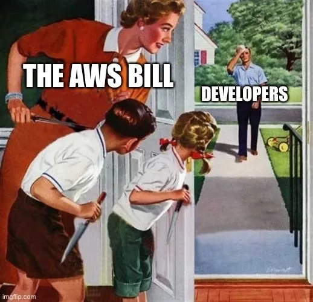
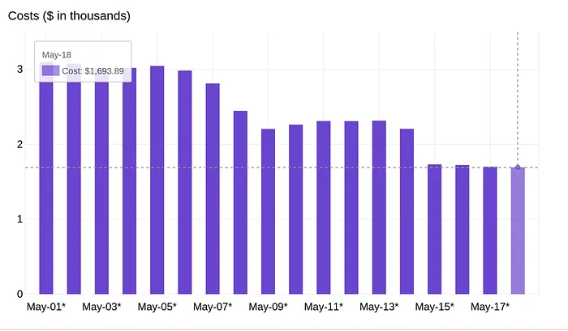
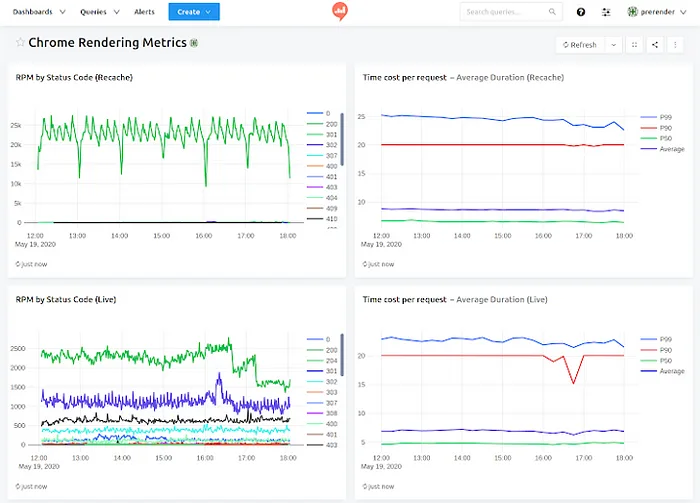
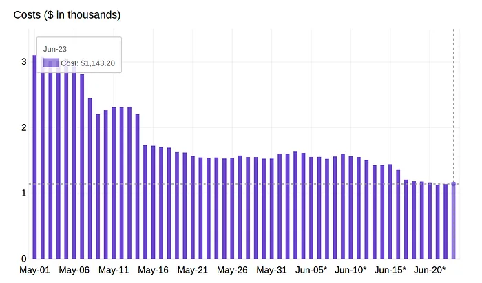

> 原作者：刘俊夏

## 引言

这周，我们采访了 Zsot Varga，Prerender.io 的管理者兼首席工程师。他分享了公司如何通过`摆脱 AWS 平台，节省了 80 万美元`，并构建了自己的基础设施来处理流量和缓存数据。`他们的目标是，在降低成本的同时，保持相同的渲染速度和服务质量`。

> 这种迁移需要仔细规划和执行，因为任何配置上的失误或执行不当，都可能影响客户网站页面的加载、社交媒体的点击量，甚至可能导致搜索引擎排名下降，从而增加客户流失的风险。

### 你能描述下 Prerender 和你解决过的最有趣的技术问题吗？

简而言之，`Prerender` 通过缓存和预渲染 `JavaScript` 页面，使得搜索引擎能够抓取和索引纯 HTML 文件。用户只需在网站上安装适当的中间件，就可以避免使用昂贵且缓慢的 JavaScript 渲染方式。

最初，所有的数据处理和进展都在 AWS 上完成。然而，随着业务的扩展，每分钟处理的页面数量超过了 `70000`，存储的数据量达到了 `5.6` 亿页面，每年支付的费用也超过了 `100` 万美元。如果一直停留在 AWS 上，成本只会继续上涨。于是，Zsot 和团队采用了创新的思维和明确的计划，成功地在短短 3 个月内将费用削减了`80%`。这一经验表明，其他公司也能效仿这一做法，从而降低成本。

## 开始

### 规划一个迁移：我们的逐步指南

直到最近，Prerender 依然使用托管在 `Amazon Web Services (AWS)` 上的服务器和服务，来存储为客户缓存和呈现的页面。AWS 是全球最大的云服务提供商之一，提供虚拟服务器和托管服务。Prerender 一直依赖 AWS 来存储其缓存的页面，直到这些页面准备好被 `Google`、`Facebook` 或其他`搜索引擎爬虫（蜘蛛程序）`抓取。这使得 Prerender 提供了其核心功能：为搜索引擎提供静态 HTML 页面，为用户提供动态交互式的 JavaScript 页面。

然而，这种做法存在显著的成本问题。在第三方服务器上存储数 TB 的预渲染网页内容，花费巨大。仅在维护和托管费用方面，这种缓存页面存储方式就让 Prerender 承担了天文数字的开销。

此外，还有许多初创公司没有考虑到的一个重要因素：`流量费用`。虽然将数据存储到 AWS 是免费的，但在传输这些数据时，Prerender 必须承担巨额费用，这成为其发展的瓶颈。

为了解决这些问题，Prerender 决定将缓存的页面和流量`迁移`到内部服务器，并尽可能快速地减少对 AWS 的依赖。通过进行成本估算后，我们发现可以减少 `40%` 的托管费用，因此决定实施服务器迁移。这样的迁移不仅能拯救 Prerender，还能为客户`节省成本`。

我们的目标是在`降低成本的同时，保持相同的渲染速度和服务质量`。这样的迁移需要细致的规划和执行，因为任何配置错误或执行不当，都可能导致`客户网站停机`、`社交媒体点击量下降`，甚至`影响搜索排名`，从而潜在地增加客户流失的风险。

为了减轻潜在的负面影响，我们规划了一个三阶段的步骤。每个阶段都设置了回退机制，以确保在发生任何问题时，可以轻松恢复到上一步。如果新服务器出现问题，我们能够撤销更改，确保客户体验不受影响，服务不中断。

> 需要特别注意的是，持续且系统化的测试是必不可少的。这一过程通常需要数周甚至数月的时间才能完成，确保一切顺利过渡。

### 远离 AWS：每周概述

#### 阶段 1 - 测试（4 到 6 周）

阶段 1 主要涉及搭建裸金属服务器，并在一个小规模、易于管理的环境中测试迁移方案。在这一阶段，软件适配的需求最小，因此我们决定在 Linux 环境中运行 `KVM` 虚拟化技术。

在五月初，第一批服务器开始投入运行，Prerender 的`1%` 流量被重定向到了新服务器上。两周后，迁移工作取得了显著进展，每天已经节省了 `800` 美元。到月末，我们成功将大量流量负载迁移出 AWS，减少了每日 `40%` 的 Chrome 渲染工作量的成本。

在这一阶段，我们的服务端费用每月为 `1.3` 万美元。与 AWS 原本的开支相比，我们已经成功将总体开支削减了 `22%`。

确保接下来的流程顺利进行，测试阶段至关重要。我们特别注重通过`增强监控和优化错误处理`来提升系统的韧性。在这一阶段，除了继续使用我们已有的服务监控面板，我们还专门`创建`了一个新的渲染监控面板。这个新面板使我们能够及时发现任何潜在的错误或性能问题，从而保证迁移过程中`系统的稳定性和可靠性`。

非常感谢我们`持续不断的监控和清晰的沟通`，正是这些因素确保了测试阶段的顺利进展。得益于这些努力，我们不仅达成了储蓄目标，还超额完成了`预算`。因此，我们现在可以顺利开始阶段 2 的迁移工作。

#### 阶段 2 - 技术设置 (4 周)

从 6 月到 7 月初的迁移阶段主要集中在`技术设置`，第一阶段的迁移主要是作为`概念验证`。而第二阶段的核心工作是`将缓存存储迁移到裸金属服务器上`。

到了 6 月中旬，我们已经成功运行了 `300` 台服务器，并缓存了价值 `2` 亿美元的页面内容。我们在每一台兼容 `AWS S3` 的服务器上使用了 `Apache Cassandra`节点来存储数据。

整个在线迁移过程被分为 `4` 个步骤，每个步骤间隔一到两周。在对 Prerender 页面进行 `S3` 和 `MinIO` 缓存测试后，我们逐步将流量从 AWS S3 转移到 MinIO。随着数据完全停止写入到 S3 后，我们在 `S3 API`上每天节省了 `200` 美元，这标志着我们已经准备好开始`删除`Cassandra 集群中缓存的数据。

在这个阶段的最后几周，我们取得了最大的进展，特别是在 6 月 24 日左右。经过最后四周的努力，我们成功将大部分缓存负载从 AWS S3 转移到了自有的 Cassandra 集群。此时，AWS 的每日费用已经降至 `1,100`美元，每月预算为 `35,000` 美元，而新服务器的每月经常性成本预计在 `14,000` 美元左右。

虽然此时 S3 上仍然残留了大约 `60` 美元的数据，但预计几周内这些数据会自然消失。虽然我们可以`立即将所有数据转移并将费用降至零`，但如果这么做，我们将面临一次性 `5,000` 美元的费用损失。

数据迁移成为了一个巨大的瓶颈。正如我们`新任 CTO` 所说：

> “对于 AWS 来说，真正隐藏的成本是`流量费用`。虽然他们提供价格合理的存储服务，甚至免费上传数据，但当你需要移出数据时，你将支付高昂的费用。”

#### “很多小型初创公司忽视了流量费用，尽管它可能占据账单的 90%。”

举个例子，如果你在`美国西部（俄勒冈州）`区域，流量费用为 `0.08 美元/GB`，而在`亚太地区（首尔）`，费用则提高到 `0.135 美元/GB`。

在我们的案例中，每月的流量成本轻松维持在 `30,000 到 50,000` 美元之间。到了第二阶段的最后，我们已经成功将每月的总服务器费用减少了 `41.2%`。

#### 步骤 3 — 实施和扩展 (4 到 6 周)

在这个阶段，迁移进展顺利，并且已经为 Prerender 节省了相当可观的费用。当前唯一需要完成的任务就是将剩余的`所有数据迁移到本地服务器`。

这一步骤主要涉及将所有 `Amazon RDS` 实例逐个分片地迁移。虽然这是整个迁移过程中最容易出错的部分，但由于大部分数据已经迁移完成，任何问题或瓶颈都不会导致整个迁移过程的崩溃。

以下是迁移过程最后一步的整体步骤：

- 将存储 `cached_urls` 表的 PostgreSQL 分片复制到 Cassandra 集群：这一过程确保了数据的完整性和高效访问。
- 将 `service.prerender.io` 切换到 `Cloudflare` 负载均衡：实现了动态流量分发，优化了网站性能和可靠性。
- 设置新的欧洲地区私人重缓存服务器：确保了全球范围内的高效数据访问。
- 持续进行压力测试：以便及时发现并解决任何可能出现的性能问题。

最终，这一阶段的迁移被证明是彻底的成功。当所有缓存页面都成功重定向后，我们的每月服务器费用比最初预估的减少了 `40%`，实际的节省幅度达到了 `80%`。

## 交流

### 我们从中学习到了什么

在服务器迁移的过程中，如果出现错误或进度滞后，可能带来巨大的风险。因此，我们在每个迁移步骤中都实施了失效安全机制，确保如果某个环节出现问题，我们可以快速回滚到先前的状态。这也是为什么在进行大规模迁移之前，我们会先进行小范围的测试。

为了避免潜在的风险，我们精心规划了每一步的迁移过程，并且在扩容之前进行了`充分的测试`。通过这种方式，我们能够在出现问题时及时修正，最大程度地减少风险，同时确保成功实现了节省服务器费用的目标。

#### 是什么促使你致力于解决 Prerender 所解决的问题？

我非常高兴能在一个推动互联网发展的平台上工作。

通过 Prerender，我们的客户能够推出以`用户体验为中心`的网站，他们不再仅仅关注`搜索引擎优化（SEO）`，而是致力于为用户提供`最佳的服务`。过去的几年里，每次我们建立一个新页面时，通常都会选择使用 `WordPress` 来优化 SEO，而将`单页应用程序（SPA）`的功能仅限于非索引页面，如管理部分。但现在，我在一家能够解决这些问题的公司工作，帮助我们摆脱了过去的困扰。

#### 你使用了什么技术栈？为什么选择这个技术栈？

我们在所有地方都使用 JavaScript，因为我们致力于解决由 JavaScript 渲染引起的问题，并希望在这个领域积累尽可能多的专业知识。对于其他方面，为了确保快速响应和全球可扩展性，我们充分利用了 Cloudflare 的分发系统。虽然我们的正常运行时间得到了 `DigitalOcean` 云平台的支持，但我们也使用了多个其他 `SaaS 供应商`，以最大化我们的效率。

#### 一旦你的公司达到了它的愿景，世界将会是什么样子？

当我们面对问题时，比如“我们能否为新网站使用 `React`？” 答案是肯定的！现在，营销部门已经禁止了可能影响 SEO 排名的技术。然而，对于我们的客户而言，即使仅损失`1%` 的效果，他们也可能需要投入数十万美元的广告预算。这就是我们为什么要不断推动技术进步，以便帮助客户在优化用户体验的同时，最大化他们的市场效益。

#### 你典型的一天看起来会是什么样子？

哈哈，通常是接一大堆客户电话。由于我们致力于保持一个小而高效的专业团队，我经常与客户进行入职电话会议。不过，这对我来说其实挺有趣的！我总是喜欢与客户交流，了解并讨论他们的需求。这让我的工作变得更加简单，因为我们不需要去猜测客户的需求，客户会直接告诉我们他们需要的一切。我相信，`客户导向的工作方式`是最有效的，我的关键绩效指标就是客户的满意度。

#### 描述下您的电脑硬件配置

哦，这真的是一个值得单独写一篇文章的话题。我有点像`极客`，在家里有 `8` 台专用服务器。虽然我大部分时间都用我的 `MacBook` 工作，但当我有更多时间进行编程时，我会迅速启动我的工作站，这台机器运行着 `Manjaro（一个基于 Arch Linux 的开源 Linux 发行版）`。不过，偶尔我也会打开我的 Windows PC 玩游戏，虽然这并不常见。在写作时，我的桌面上充满了笔记本电脑、树莓派和平板电脑。

构建机器并运行缩小规模的测试一直是我深夜的爱好。

#### 请描述你的电脑软件配置

对于我来说，`VSCode`是最直接的解决方案。我其实并不偏爱任何特定的编程语言，但 VSCode 允许我自由地安装扩展，并且能在几秒钟内为我提供`IDE`支持，让编程变得更加高效。最近，我们有幸加入了 `CoPilot` 的 `Beta`测试，显然，它将彻底改变游戏规则。

在源代码管理方面，`GitHub`是不可或缺的，但我也不会忽视其他的解决方案。近些年来，`GitLab` 逐渐成为了一个非常不错的工具，功能不断增强。

对于信息收发，我认为`Slack`仍然是最常用且极为称职的选择。既然它已经这么好用了，没理由去更换它。不过，最近我发现了一款非常有趣的软件，叫做 Spike。在过去的三个月里，我一直在使用它作为我的电子邮件客户端，因为它大大简化了邮件沟通。

至于必要的工具，`Docker`是无可替代的，它为行业提供了最好的解决方案。我依然记得那些日子，我们需要安装依赖并解决包冲突，真的是“黑暗岁月”…

不过，`Kubernetes` 也在逐步适应并成为类似的重要工具。

#### 对于刚开始的软件工程师，你有什么建议吗？

不要害怕与客户交流。在我的职业生涯中，我发现最优秀的软件工程师往往是那些能够`与客户紧密合作并帮助他们解决问题的人`。有时，一行代码就能解决客户的问题，这可以`节省几个月甚至半年的开发时间`。我认为，最好的工程师是那些能够为现实世界的问题提供有效解决方案的人。

#### 你正在招聘吗？什么岗位呢？

我们一直在招聘！我们始终致力于确保新加入的同事能够在团队中发挥重要作用，并做出明确的贡献。由于我们公司发展非常快速，几乎每个部门都需要扩充团队。因此，建议直接访问我们的招聘页面了解最新职位详情：`https://saas.group/career`。

#### 我们可以到哪里学到更多呢？

你可以访问我们的官网 `Prerender.io`。如果你对预渲染技术以及它如何改变 Web 有兴趣，欢迎通过电子邮件与我联系：`varga@prerender.io`。我很乐意与你交流，了解你的需求和使用案例。

—— Zsolt Varga，Prerender 总经理

> Prerender 是一款由 Google 推荐的软件工具，已被超过 12,000 家公司使用，致力于帮助搜索引擎更好地抓取和索引 JavaScript 网站。

## 结语

Level Up[1] 是一个拥有每月 300 万开发者的社区，在这里，你可以学习更多知识[2]、关注最新的技术趋势，或阅读更多关于初创公司和科技公司的访谈[3]。我们与一些最优秀的初创公司和最具创新性的科技公司合作，致力于共同推动技术发展🔥。

- 您是开发人员吗？让最优秀的公司来聘用您！ ➡️ 加入 Level Up Talent Collective[4]
- 聘请 FAANG 级别的工程师[5] ➡️ 面试申请表[6]，让您的公司接受面试 了解更多并加入：Level Up Talent Collective[7]

此外，我们还为开发者提供了免费的工具，帮助他们在职业生涯中取得更多成长，包括：编程面试课程[8]、自动简历生成器[9]和作品集 API[10]。

> 原文：<https://medium.com/gitconnected/how-we-reduced-our-annual-server-costs-by-80-from-1m-to-200k-by-moving-away-from-aws-2b98cbd21b46>

### 引用链接

- `[1]` Level Up: <https://levelup.gitconnected.com/>
- `[2]` 学习更多知识： <https://levelup.gitconnected.com/>
- `[3]` 阅读更多关于初创公司和科技公司的访谈： <https://levelup.gitconnected.com/interviews/home>
- `[4]` 加入 Level Up Talent Collective： <https://jobs.levelup.dev/talent/welcome?referral=true>
- `[5]` 聘请 FAANG 级别的工程师： <https://jobs.levelup.dev/talent/welcome>
- `[6]` 面试申请表： <https://forms.gle/oWT83qtGdydfi7yL8>
- `[7]` Level Up Talent Collective: <https://www.levelup.com/>
- `[8]` 编程面试课程： <https://skilled.dev/>
- `[9]` 自动简历生成器： <https://gitconnected.com/resume-builder>
- `[10]` 作品集 API： <https://gitconnected.com/portfolio-api>

---

发布版本：[微信公众号转载页](https://mp.weixin.qq.com/s/p5DTvpaubWXYnw1wx30K9g)
