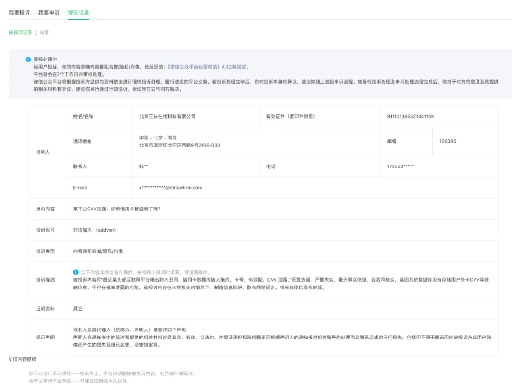
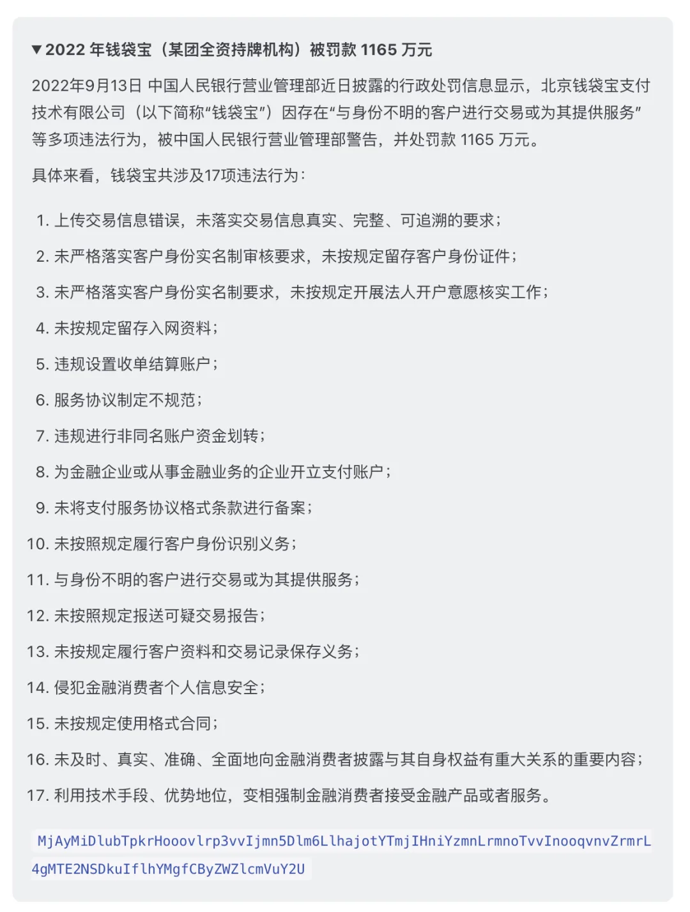
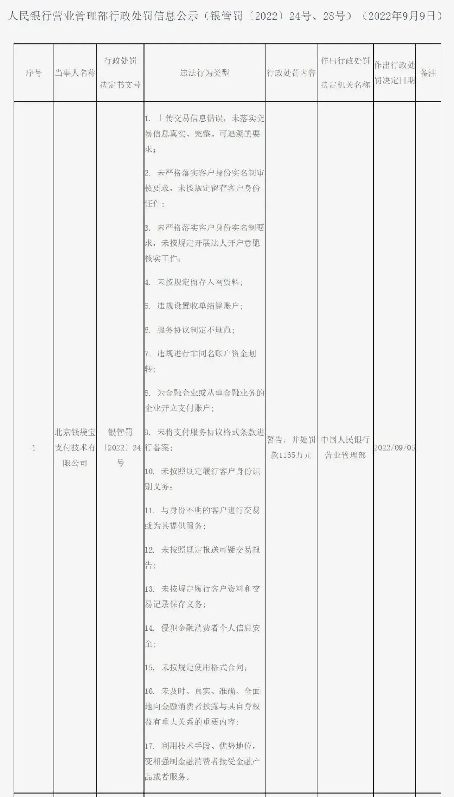

昨天本号发了一篇《[某平台 CVV 泄露：你的信用卡被盗刷了吗？](/cloud/cvv-leak/)》，随即收到了 **美团**的投诉，投诉内容如下所示：

*经我司核实，美团系统数据库没有存储用户外卡 CVV 等敏感信息，不存在撞库泄露的可能。被投诉内容在未经核实的情况下，制造信息陷阱，散布网络谣言。相关媒体已发布辟谣。*

先前这篇文章没有一处提到 “美团”，全是 “某互联网平台”。相关公司名称信息已经全部打码，读者无法从本文中推断出到底是哪一家互联网平台。

干这种事的大互联网平台有一些例子，比如十年前的携程就曾经这么干过《[烫手的数据：携程用户 CVV 码泄露始末](https://mp.weixin.qq.com/s?__biz=MTQ0NDM5MTA2MQ==&mid=200106565&idx=1&sn=48b2283752ba881e4849e66216999cca&scene=21#wechat_redirect)》。

而且，我也知道其他（非美团）的头部互联网平台有存储 CVV 的事例。所以问题就来了，**为什么美团会有这样此地无银三百两，主动对号入座，气急败坏，不打自招的行为呢？**

我稍微搜索了一下，发现了一些先例：**美团旗下全资控股的第三方支付公司钱袋宝就在 2022 年被中国人民银行营业管理部警告，并处罚款 1165 万元**。

当然，它们有没有从此次处罚中吸取教训呢？本人不对美团有是否存储外卡敏感三要素做评论，这种事还是有请**监管**来判定处理吧。

---

发布版本：[微信公众号](https://mp.weixin.qq.com/s/z-hQ57BaSNPC6GkvqNAafw)
