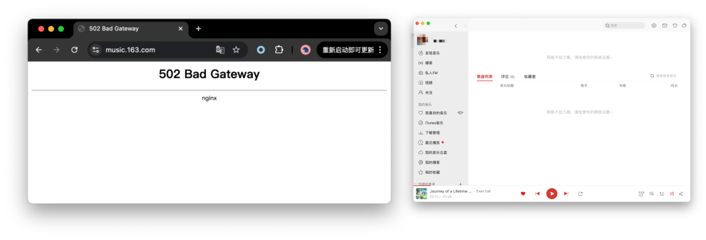
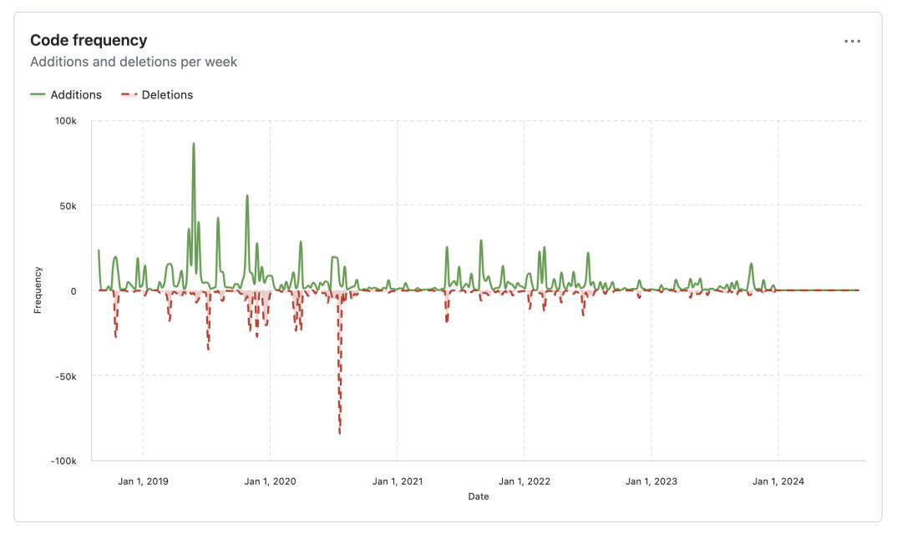

今天下午 14:44 左右，网易云音乐出现 [不可用故障](http://mp.weixin.qq.com/s?__biz=MzU5ODAyNTM5Ng==&mid=2247488162&idx=1&sn=5913eb51b437e365c685ed11917a3302&chksm=fe4b2779c93cae6ff254f4568f3e7895e005ce249ab4e0e3111bf3665a54fed35b381ff55aa9&scene=21#wechat_redirect)，至 17:11 分恢复。网传原因为 **基础设施/云盘存储** 相关问题。

---

## 故障经过

故障期间，网易云音乐客户端可以正常播放离线下载的音乐，但访问在线资源会直接提示报错，网页版则直接出现 502 服务器报错无法访问。

在此期间，网易 163 门户也出现 502 服务器报错，并在一段时间后 302 重定向到移动版主站。期间也有用户反馈 **网易新闻** 与其他服务也受到影响。

许多用户都反馈连不上网易云音乐后，以为是自己网断了，卸了 APP 重装，还有以为公司 IT 禁了听音乐站点的，各种评论很快将此次故障推上微博热搜：

期间截止到 17:11 分，网易云音乐已经恢复，163 主站门户也从移动版本切换回浏览器版本，整个故障时长约两个半小时，P0 事故。

17:16 分，网易云音乐知乎账号发布通知致歉，并表示明天搜“畅听音乐”可以领取 7 天黑胶 VIP 的 **朋友费**。

---

## 原因推断

在此期间，出现各种流言与小道消息。总部着火🔥 （老图），TiDB 翻车（网友瞎编），下载《黑神话悟空》打爆网络，以及程序员删库跑路等就属于一眼假的消息。

但也有先前网易云音乐公众号发布的一篇文章《[**云音乐贵州机房迁移总体方案回顾**](https://mp.weixin.qq.com/s?__biz=MzI1NTg3NzcwNQ==&mid=2247491821&idx=1&sn=573dcc464a690a5b9a0a991c6f3c74e2&scene=21#wechat_redirect)》，以及两份有板有眼的网传聊天记录，可以作为一个参考。

网传此次故障与云存储有关，聊天记录就不贴了。相关网传文章《网易云音乐宕机，原因曝光！7 月份刚迁移完机房，传和降本增效有关》已被删除；可参考权威媒体的引用报道《[独家｜网易云音乐故障真相：技术降本增效，人手不足排查了半天](https://mp.weixin.qq.com/s/nApqdf0ow6iY97TDZMEdsg)》。

我们可以找到一些关于网易云存储团队的公开信息，例如，网易自研的云存储方案 Curve 项目被枪毙了。

查阅 [Github Curve 项目主页](https://github.com/opencurve/curve)，发现项目在 2024 年初后就陷入停滞状态：

最后一个 Release 一直停留在 RC 没有发布正式版，项目已经基本无人维护，进入静默状态。

Curve 团队负责人还发表过一篇《curve：遗憾告别 未竟之旅》的公众号文章，并随即遭到删除。我对这件事有些印象，因为 Curve 是 PolarDB 推荐的两个开源共享存储方案之一，所以特意调研过这个项目，现在看来……

---

## 经验教训

关于裁员与降本增效的老生长谈已经说过很多了，我们又还能从这场事故中学习到什么教训呢？以下是我的观点：

第一个教训是，**不要用云盘跑严肃数据库**！在这件事上，我确实可以说一句 “ [**Told you so**](/db/db-in-k8s/)”。底层块存储基本都是提供给数据库用的。如果这里出现了故障，爆炸半径与 Debug 难度是远超出一般工程师的[**智力带宽**](/cloud/smile/)的。如此显著的故障时长（两个半小时），显然不是在无状态服务上的问题。

第二个教训是 —— **自研造轮子没有问题，但要留着人来兜底**。降本增效把存储团队一锅端了，遇到问题找不到人就只能干着急。

第三个教训是，**警惕大厂开源**。作为一个底层存储项目，一旦启用那就不是简单说换就能换掉的。而网易毙掉 Curve 这个项目，所有这些用 Curve 的基建就成了没人维护的危楼。Stonebraker 老爷子在他的名著论文《What Goes Around Comes Around》中就提到过这一点：

---

## 参考阅读

[网易云音乐崩了](http://mp.weixin.qq.com/s?__biz=MzU5ODAyNTM5Ng==&mid=2247488162&idx=1&sn=5913eb51b437e365c685ed11917a3302&chksm=fe4b2779c93cae6ff254f4568f3e7895e005ce249ab4e0e3111bf3665a54fed35b381ff55aa9&scene=21#wechat_redirect)

[GitHub 全站故障，又是数据库上翻的车？](/cloud/github-outage/)

[阿里云又挂了，这次是光缆被挖断了？](/cloud/aliyun-fiber-cut/)

[全球 Windows 蓝屏：甲乙双方都是草台班子](/cloud/bsod-friday/)

[删库：Google 云爆破了大基金的整个云账户](/cloud/gcp-unisuper/)

[云上黑暗森林：打爆 AWS 云账单，只需要 S3 桶名](/cloud/s3-scam/)

[互联网技术大师速成班](/misc/internet-tech-masterclass/)

[门内的国企如何看门外的云厂商](/cloud/state-owned-enterprise-cloud-view/)

[卡在政企客户门口的阿里云](/cloud/aliyun-enterprise-market/)

[互联网故障背后的草台班子们](/cloud/amateur-internet-outages/)

[云厂商眼中的客户：又穷又闲又缺爱](/cloud/cloud-customers-poor-bored-lonely/)

[taobao.com 证书过期](http://mp.weixin.qq.com/s?__biz=MzU5ODAyNTM5Ng==&mid=2247487367&idx=1&sn=d6e4abd2b2249d27bd8b8146b591b026&chksm=fe4b3a5cc93cb34a8e90e4b7f06803fa11ee8234014cd4f1aedff59e3bf3c846b3cb133090f2&scene=21#wechat_redirect)

[云 SLA 是安慰剂还是厕纸合同？](/cloud/sla/)

[罗永浩救不了牙膏云](/cloud/luo-live/)

“故障不是腾讯云草台的原因，傲慢才是”（原发布失败）

[【腾讯】云计算史诗级二翻车来了](/cloud/tencent-epic-fail-2/)

[Redis 不开源是“开源”之耻，更是公有云之耻](/db/redis-oss/)

[剖析云算力成本，阿里云真的降价了吗？](/cloud/ecs/)

[我们能从腾讯云故障复盘中学到什么？](/cloud/qcloud/)

[腾讯云：颜面尽失的草台班子](/cloud/tencent-disgrace/)

[从降本增笑到真的降本增效](/cloud/smile/)

[阿里云周爆：云数据库管控又挂了](/cloud/aliyun-weekly-crash/)

[我们能从阿里云史诗级故障中学到什么](/cloud/aliyun/)

[【阿里】云计算史诗级大翻车来了](/cloud/aliyun/)

---

发布版本：[微信公众号](https://mp.weixin.qq.com/s/tmlP1ol9qP2SIxB9VbvpEg)
