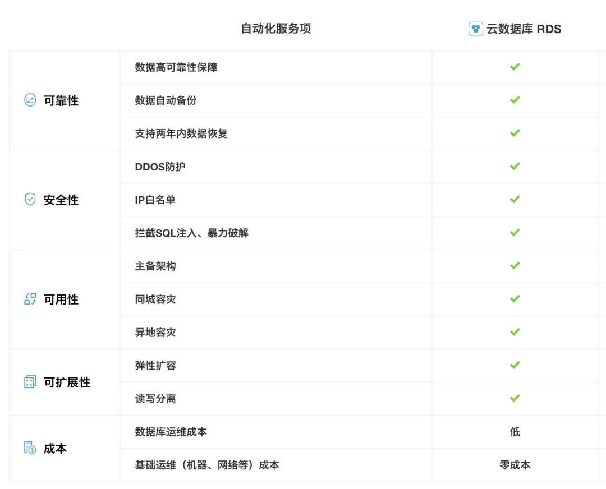
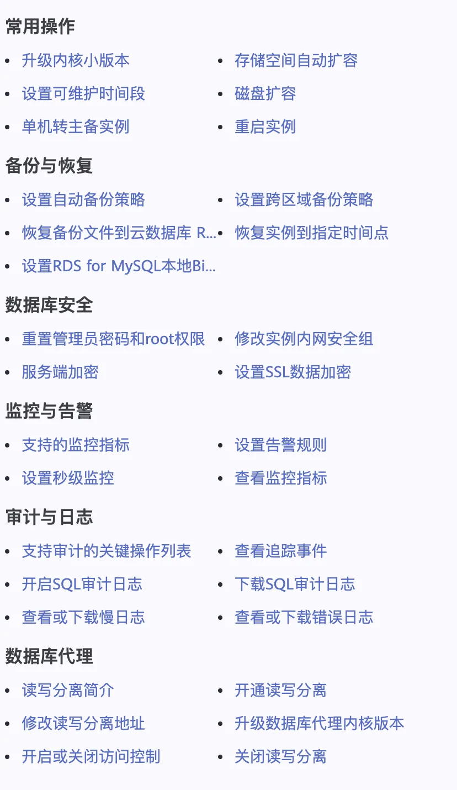

> 原作者：瑞典马工

## 开门见山\

如果你是 IT 负责人，是时候停止招聘 DBA 了。因为

1. DBA 能做的日常运维，普通开发者使用云平台都能做。

2. 开发者用云服务能把很多数据库管理工作做得更高效。

3. 你以为 DBA 能做的数据架构设计，其实他们从来都做不了。

## DBA 究竟在做些什么工作？

下面这个高级 DBA 工程师的岗位来自直聘网，其工作内容包括：

> 1. 负责数据库架构设计。方案制定。数据存放选型和落地（包括数据库读写分离。数据库备份。数据库容灾。集群扩展。分库分表策略）；2.负责支持研发在数据和缓存方面的方案探讨，并沟通引导使用合适的技术；3.负责优化运维。排障。监控数据库，提高服务质量，提升系统稳定性；4.负责挖掘及发现现有框架存在的问题和不足，提出改进的意见与方案，并推广；5.负责数据库自动化运维工具的开发与优化。

BOSS 直聘职位百科（原链接已失效）

下面这个数据库高级 DBA 的岗位来自猎聘网，其工作内容包括:

> 1、管理内部业务库，清楚应用的架构逻辑，保证数据库的安全与性能；2、负责数据库的线上稳定工作，确保达到业界领先的 SLA 水平；3、负责对数据库进行日常的建设部署、配置管理、监控报警及故障处理等工作；4、对数据库内部实现的深入探索

<https://www.liepin.com/job/1951625807.shtml>

总结下，DBA 不论高级低级或者黄金级，就是干几个事情:

1. 安装和部署 DB，让它跑起来(up and running)

2. 保证 DB 别挂了(Availability)

3. 保证 DB 数据别丢了(Durability)

4. 防止坏人访问 DB(Security).

5. 别让 Dev 搞砸数据库(DB Modelling and Performance tuning)

6. 领导交办的打杂事项

## 云服务把 DBA 的工作都给做了

那么一个程序员，用云厂家的数据库服务，能不能完成上述任务呢？

除了数据库建模以外，阿里云 RDS 基本覆盖了 DBA 的所有工作。

华为云的成长地图页面给出了更详细的列表:

当然，RDS 服务提供这些功能并不代表它们就自动启用了，你还需要一个员工去依据需求开启或者关闭这些特性。有的朋友就问了“那不就还是要一个 DBA 吗?”

实际上，一个普通程序员，在文档的帮助下，已经可以轻松启用这些功能了。在 Infra as Code 的帮助下，他/她还能把这些配置代码化，做到版本管理和可审计。

## 开发者+云服务比 DBA 高效十倍

开发者+云服务不仅能取代 DBA，他们还能把工作做得更高效。

就以 DBA 们最头疼的配置一致性为例，使用 terraform，你可以保证你单位 90% 的数据库实例都有一致的配置。github 上有大量的 example，比如这个<https://github.com/terraform-aws-modules/terraform-aws-rds/blob/v5.3.0/examples/complete-mysql/main.tf>

如果剩下 10% 的数据库实例不使用 terraform 来产生，而开发者又想确认这些实例开启了某一个功能，比如多 AZ 高可用。那也很简单，AWS Config 内置了一个检查规则，可以轻松的找到你组织里任意一个没有开启多 AZ 高可用的数据库实例。除此之外，还有**rds-logging-enabled，rds-in-backup-plan，ec2-security-group-attached-to-eni**等等规则，开发者需要做的只是指定这些规则，AWS Config 会自动检查每一个实例是否满足这些规则。

<https://docs.aws.amazon.com/config/latest/developerguide/rds-multi-az-support.html>

## 云厂家的专家服务比 DBA 专业二十倍

高级 DBA 相对初级 DBA 的差距之一就在对开发者的影响力，也就是上述招聘启事里提到的

> 2.负责支持研发在数据和缓存方面的方案探讨，并沟通引导使用合适的技术；

这一部分工作主要是利用专家知识，实际上也被云厂家做成了服务。比如阿里云的数据库自治服务 DAS

> 数据库自治服务（Database Autonomy Service，简称 DAS）是一种基于机器学习和专家经验实现数据库自感知、自修复、自优化、自运维及自安全的云服务，帮助用户消除数据库管理的复杂性及人工操作引发的服务故障，有效保障数据库服务的稳定、安全及高效。

## DBA 知识老化，只会滥用关系型数据库

DBA 虽然顶着数据库管理员的头衔，但是长久以来一直只专注于关系型数据库(Oracle，SQL Server，MysQL 和 PG), 缺乏管理非关系型数据库的能力，所以更贴切的名字应该是 RDBA.

这种错位在以前是无关紧要的，因为大多数系统只用关系型数据库。比如著名的 Zabbix 使用 MySQL 来存储时序数据。我还见过用 MySQL 存大量图片的案例。

但是现在 2022 年了，越来越多的团队意识到关系型数据库不能滥用。时序数据应该存到时序数据库里，文档数据库在很多情况下可以替代关系型数据库，Redis 在很多情况下可以当作数据库用，在延时要求不高的场景，对象存储也可以用作数据库。KafKa 作为一个消息队列，从应用层 offload 了状态，也是一种数据库。更不用说 Hadoop 那一系列套件。

而所有这些系统，都不在 DBA 的技能覆盖范围，甚至不被 DBA 视作自己的职责。

更进一步，即使关系型数据库中的分析型数据库，比如 Teradata，Greenplum 和 Redshift，也超出了绝大多数 DBA 的能力范围。

这就给 CTO 们带来了一个新问题：在 DBA 之外，你还要招聘 Kafka 管理员，Redis 管理员，TSDB 管理员，Hadoop 管理小组，对象文件管理员吗？

我的建议是，你不需要这么多专职管理员。80% 的程序员，认真阅读云厂家的文档，就能比 80% 的管理员做的更好。

## DBA 带来的损害已经高于其价值

数据库归根结底是一个软件产品，过去由于数据库厂商的技术缺陷，产品的可维护性非常差，以至于甲方不得不投入专职管理员。但是云时代，数据库从一个交付软件变成了一个服务，极大的降低了甲方的管理成本。甲方确实没有必要再投入专人去维护一个自己已经付费的产品了。

实际上，DBA 目前带来的价值有限，带来的损害却很大。和你的开发者谈谈，他们的部署流程如果碰到数据库更改，是不是要慢一个数量级？DBA 们往往缺乏基本软件工程训练，对可观测性，immutable infrastructure，infra as code，CICD 等现代概念不熟悉，沉迷于摆弄数据库的一些莫名其妙的陈旧配置。

当个别的 DBA 走出配置管理，试图开发产品的时候，我们就发现这个群体真的和现代软件技术隔离很远了。以 DBA 们开发的 [Redis Monitor](https://mp.weixin.qq.com/s?__biz=MzkwOTIxNDQ3OA==&mid=2247595560&idx=1&sn=d7fe1768cb7c42ea530c33b062b54578&scene=21#wechat_redirect) 为例，这个监控工具落后时代起码二十年。随便列举一下：

1. 不区分监控和告警，把两者混在一起。

2. 监控部分实际上完全没必要自己开发，开源的 prometheus/grafana 又好又便宜，实际上它这个项目做个采集器就够了。

3. 如果一定要自己开发，不应该把监控数据放在关系型数据库 MySQL 里，而应该选择一个时序数据库。

第三条尤其讽刺，一群 DBA 缺乏最基本的数据库选型知识。原因就是我上面说的 DBA 们对非关系型数据库一无所知，只会滥用关系型数据库。如果这个群体宣称自己能指导开发者做数据库架构选型，那基本是个谎言。

## DBA 们不要骂我

美国入侵伊拉克的时候，每个伊拉克官员都只给萨达姆好消息，没有人胆敢给他报坏消息，使得萨达姆严重高估了其军事实力，决定和英美联军打一场持久战。结果大家都知道，伊拉克军队抵抗了两个多礼拜就放弃了。这个故事告诉我们：如果有人告诉你坏消息，他不一定是坏人，你骂他不会让坏消息消失，只会让你和现实生活更隔离。祝大家好运！

---

发布版本：[微信公众号转载页](https://mp.weixin.qq.com/s/PqCD80H927s0yJrBr4QQqw)
