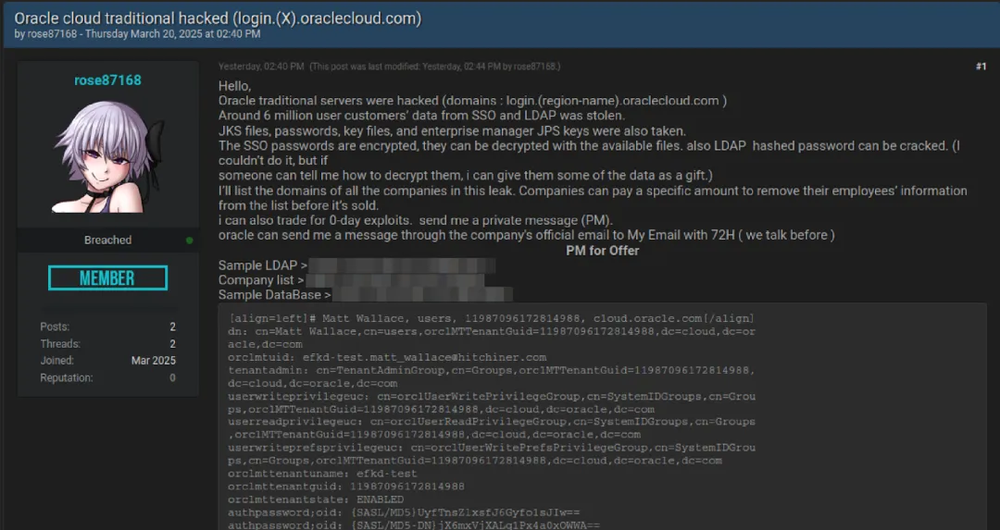
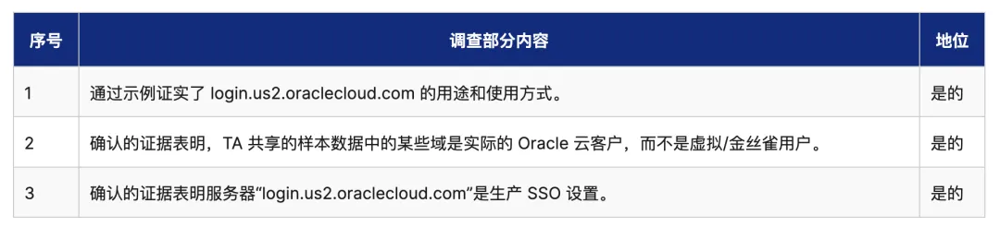

2025 年的最大供应链黑客攻击：媒体曝光 600 万条记录从 Oracle Cloud 泄露。Oracle 对此矢口否认，但已经有客户验证了公开样本的真实性。

黑客 Rose87168 在 BreachForm 上叫卖这份数据。包括 600 万用户的身份认证数据与加密密码，涉及到 14 万个域名。并且还在服务器上留下到此一游的文本文件。

距离数据发布在暗网论坛上已经过去一周了，根据欧盟 GDPR 的规定，数据泄漏的 72 小时如果没有及时披露与通知，可能面临年营收百分比的巨额罚款。

GPT 估算 Oracle 企业客户数量在数万量级，这让人怀疑这次是不是所有客户的身份认证数据库都被一锅端了。如果是，那又是云计算历史上的史无前例的惊天故障，考虑到他们还有很多政企客户，这下乐子大了。

据 CloudSEK 验证，login.us2.oraclecloud.com 是生产 SSO 服务器，还在跑 Oracle Fusion Middleware 11g —— 16 年前发布的软件版本，现在早就 EOL 了，而且有一个重大安全漏洞 CVE-2021-35587。（不是哥们这是你自家的软件啊，你自己还在跑过时漏洞版本也不给自己打补丁的吗？）

我的朋友瑞典马工一直主张深度上云，拥抱云厂商的身份认证基础设施 IAM / RAM。我相信这次事故会给他好好再上一课 —— 云厂商提供的认证基础设施并非是什么无条件可靠的信任根，它一样会挂会泄漏。

上次[阿里云 IAM/OSS 循环依赖导致的全球大故障](/cloud/aliyun/)已经体现了依赖云上的认证体系存在额外的可用性安全风险。这次 Oracle 史无前例的事故告诉我们，依赖云厂商的认证基础设施 —— 连机密性也保不住了。

在国内的数据库圈，很多老 DBA 喜欢把 Oracle 捧上天，这其实是一件相当滑稽的事情。引用昨天陆奇老师的一句评论：在硅谷，人们最看不起的公司是 Oracle，They are selling garbage。

世界是一个巨大的草台班子，有些东西看着光鲜亮丽，其实底下是一滩烂泥。

---

发布版本：[微信公众号](https://mp.weixin.qq.com/s/5z3jUV8CrKPinUYzOnlC6g)
