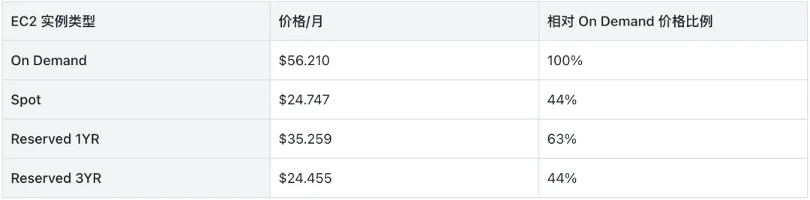
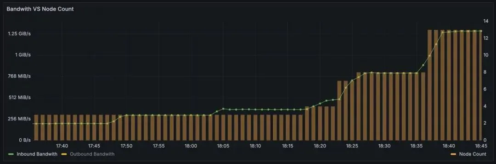

> 原作者：王小瑞

作者｜王小瑞  AutoMQ 联合创始人 & CEO\

云计算通过资源池化实现单位资源成本更优，使企业能够将 IDC 建设、基础软件研发和运维等工作外包给云厂商，从而更专注于业务创新。资源池不仅包括服务器，还包括人才。云厂商集聚了优秀工程师，通过云服务为众多企业提供专业服务，让专业的事交给最专业的人。

云计算发展这么多年，弹性是云计算从业者最关注的技术能力之一，但是真正落实到具体的案例上，很少有客户能把弹性用好，弹性反而成为了一种口号，一种理想的架构，本文尝试讨论为什么现实和理想差距这么大，以及有哪些低投入高回报的弹性方案。

## 01 · 云厂商通过包年包月打折来留住客户，与弹性场景相悖

下表是一份典型的包年包月 EC2 价格与按量付费价格对比，总结出来的游戏规则：

### 包年包月相比按量付费大约有 50% 的成本节省

这也是为什么大多数企业选择包年包月方式来使用 EC2 资源。从云厂商的角度这么设计非常合理，因为云厂商是通过预测全网客户的使用量来确定一个 Region 要预留多少空闲水位，假设 On-Demand 和 Reserved 实例价格一致，将导致云厂商难以预测一个 Region 的水位，甚至会出现白天和晚上有巨大的差异，会直接影响供应链的采购决策。云厂商是典型的类零售商业模式，每个 Region 的空闲机器数量类比为库存，库存比例越高，会导致利润率越低。

### Spot 实例恰好做到既便宜又是按小时付费

这也要求应用能处理好 Spot 实例被强制回收带来的影响，对于无状态应用相对简单，Spot 实例在回收之前会通知应用，大部分云厂商会给到分钟级别的回收窗口，应用只要做到优雅下线，就能做到对业务无影响。海外专业基于 Spot 实例来管理计算资源的创业公司[1]，有大量的产品化功能帮助用户用好 Spot 实例。AutoMQ 公司也积累了丰富的 Spot 实例使用经验[2]。但是对于有状态应用，Spot 实例使用起来的门槛变得非常高，实例被强制回收前，就需要做到将状态转移。比如 Kafka，Redis，MySQL 这类应用。针对这类数据型的基础软件通常不建议用户直接部署到 Spot 实例上。

这个游戏规则既有合理的地方也有值得优化的地方，笔者认为至少还可以在以下方面做的更好：

### Spot 回收机制提供 SLA

要能鼓励更多用户使用 Spot 实例，那么 Spot 的回收机制中的消息通知要能提供确定的 SLA，这样一些关键业务就能敢于大规模使用 Spot 实例。

### 创建新实例 API 提供 SLA

Spot 被回收后，应用的兜底方案是继续开通新的资源（如新的 Spot 实例，或新的 On-Demand 实例），这时开通新实例的 API 也要能有确定的 SLA，这个 SLA 会直接影响到应用的可用性。

### 卸载云盘提供 SLA

Detach EBS 也要能有确定的 SLA，因为一旦发生强制回收 Spot 实例，要能允许用户自动化处理好应用状态卸载。

AWS US EAST m6g.large

## 02 · 程序员很难做好资源回收这件事情

C/C++ 程序员大量的精力在和内存作斗争，但是仍然不能保证内存资源不泄露。原因是资源准确回收是一件极具挑战的事情，比如一个函数返回一个指针，那么这个对象是谁负责回收，C/C++ 是没有约定的，如果再涉及到多线程，则更加噩梦。为此 C++ 发明了智能指针，通过一个线程安全的引用计数来管理对象。Java 通过内置的 GC 机制，通过运行时来检测对象回收，彻底解决了对象回收问题，不过也带来了一定的运行时开销。最近特别火的 Rust 语言，本质上也是类 C++ 的智能指针回收方式，创新性的将内存回收检查机制做到了编译阶段，从而大幅提升了内存回收的效率，避免了 C/C++ 程序员常犯的内存问题，笔者认为 Rust 将是 C/C++ 的一个完美替代。

回到云操作系统这个领域，程序员可以通过一个 API 就能创建一台 ECS，一个 Kafka 实例，一个 S3 Object，这个 API 背后带来的是账单的变化。创建容易，回收则变得非常困难。创建时候通常会指定最大规格，比如创建一个 Kafka 实例，先来 20 台机器，因为未来扩容缩容都很困难，不如一次到位。

虽然云计算提供了弹性，但程序员难以有效地按需管理资源，导致资源回收困难。这促使企业在云上资源创建时设立繁琐的审批流程，类似于传统 IDC 的资源管理方式。最终导致的结果即程序员在云上使用资源的方式与 IDC 趋同，即需要通过 CMDB 进行资源管理，并依赖人工审批流程来避免资源浪费。

我们也看到了一些优秀的弹性实践案例。例如某大型企业在使用 EC2 时，每个 EC2 的 Instance ID 存活周期不超过 1 个月，一旦超过，就会被列为“爷爷辈的 EC2”，要上团队的黑榜单。这是一个非常棒的不可变基础设施实践方法，能有效避免工程师在服务器上保留状态，如配置，数据等，从而让应用走向弹性架构变得可行。

当前云计算的阶段还处在 C/C++ 阶段，还没有出现优秀的资源回收解决方案，所以企业还在大量使用流程审批机制，实质上导致了企业无法发挥云的最大优势：弹性。这也是导致企业云支出较高的主要原因之一。

相信只要有问题，一定会有更优秀的解法，解决云资源回收的类 Java/Rust 方案一定会在不久的将来问世。

## 03 · 从基础软件到应用层，还没有为弹性做好准备

笔者曾在 2018 年开始为淘宝天猫的数千个应用设计弹性方案[[3]](https://mp.weixin.qq.com/s?__biz=MzU4NzU0MDIzOQ==&mid=2247486631&idx=1&sn=c97fe7d44b584df093585095a85fe25b&scene=21#wechat_redirect)，当时淘宝天猫的应用已经做到了离线和在线混部来提升部署密度，但是在线应用仍然为预留模式，无法做到按需弹性。根本问题还是应用在扩缩时，可能会产生非预期的行为，即使运行在 Kubernetes 之上，仍然不能彻底解决，如应用会调用各种中间件的 SDK（数据库、缓存、MQ、业务缓存等），应用本身启动也消耗时间较长，看似无状态的应用，实则也包含了各种状态，如包括单元标签，灰度标签等，让整个应用需要大量的人工操作，人工观察才能有效扩缩容。

为了让 Java 应用从分钟级的冷启动提升到毫秒级，当时为 Docker 开发了 Snapshot 能力[[3]](https://mp.weixin.qq.com/s?__biz=MzU4NzU0MDIzOQ==&mid=2247486631&idx=1&sn=c97fe7d44b584df093585095a85fe25b&scene=21#wechat_redirect)，这项能力的生产应用足足比 AWS 领先了 4 年（AWS 于 2022 年 Re:invent 会议上发布了 Lambda SnapStart4，5 特性）。通过 Snapshot 方式启动应用可以数百毫秒就能增加一台可以立刻工作的计算节点，这项能力让应用不需要改造成 Lambda 函数方式就能做到像 Lambda 一样，根据流量来增减计算资源，也就是我们看到的 Lambda 提供的 pay-as-you-go 能力。

应用层做弹性已经如此复杂，到了基础软件做弹性挑战更大，如数据库、缓存、MQ、大数据等产品。分布式高可用高可靠的要求决定了这些产品都需要将数据存储多副本。一旦数据量大，弹性将变得非常困难，迁移数据会影响业务的可用性。为此，要在云环境解决这个问题，就要用云原生的方式，我们在设计 AutoMQ（赋能 Kafka 的云原生方案）时，将弹性作为最高优先级，核心挑战是要将存储卸载到云服务，例如按量付费的 S3，而不是自建存储系统。下图是 AutoMQ 线上的流量和节点变化图，会看到 AutoMQ 是根据流量全自动增减机器，如果这些机器采用 Spot 实例，将为企业节省大量的成本，真正做到 pay-as-you-go。

AWS US EAST m6g.large

## 04 · 企业如何使用好弹性能力来降本增效

Google 在 2018 年推出了 Cloud Run[6] 全托管式计算平台，基于 HTTP 通信的应用仅需提供监听端口和容器镜像给 Cloud Run，所有基础设施的管理将全自动由 Cloud Run 来执行。这种方式相比 AWS Lambda 方式最大优势是无需绑定到单个云厂商，未来可以更好的迁移到其他计算平台。很快 AWS 和 Azure 跟进推出了类似的产品，Azure Container Apps[7] 和 AWS App Runner[8]。

专业的事情交给专业的人做，弹性是一个非常有挑战的工作，推荐云上的应用可以尽可能依赖这些无代码绑定托管框架，如 Cloud Run，做到应用消耗的计算资源可以按照请求来付费。

基础软件如数据库、缓存、大数据、MQ 等，很难用一个统一的托管框架来解决，这类应用的演进趋势是每个品类都在向弹性架构演进，如 Amazon Aurora Serverless，Mongodb Serverless[9]，从云厂商到第三方开源软件商都有共识要能走到彻底的弹性架构。

企业在选择类似开源基础软件时，要尽可能选择具备弹性能力的产品，判断的标准是是否能运行在 Spot 实例上，是否能极具性价比。同时也要关注这类产品是否能更好的在多个云上运行，这决定了企业在未来走向多云架构，甚至混合云架构时，是否具备移植性。

## 05 · 关注 AutoMQ，探讨如何让 Kafka 利用云的弹性能力

4 月 20 日，AutoMQ 联合 StarRocks 和 KubeBlocks 将在北京举办《企业如何构建云原生现代化数据栈》Meetup。会议将探讨云原生现代化数据栈在不同场景下的实际应用案例。其中，京东 Kafka 云原生架构师钟厚会分享 AutoMQ 部署在 Kubernetes 上的经验，同时，AutoMQ 首席产品经理陈仲良为大家介绍 AutoMQ 的弹性能力和适用场景。

## 引用文章

[1] <https://spot.io/>

[2] <https://www.automq.com/zh/blog/how-automq-achieves-10x-cost-efficiency-spot-instance>

[3] [https://mp.weixin.qq.com/s/Gj_qPPTn6KN065qUu6e-mw](https://mp.weixin.qq.com/s?__biz=MzU4NzU0MDIzOQ==&mid=2247486631&idx=1&sn=c97fe7d44b584df093585095a85fe25b&scene=21#wechat_redirect)

[4] <https://docs.aws.amazon.com/lambda/latest/dg/snapstart.html>

[5] <https://aws.amazon.com/cn/blogs/aws/new-accelerate-your-lambda-functions-with-lambda-snapstart/>

[6] <https://cloud.google.com/run?hl=zh_cn>

[7] <https://azure.microsoft.com/en-us/products/container-apps>

[8] <https://aws.amazon.com/cn/apprunner/>

[9] <https://www.mongodb.com/products/capabilities/serverless>

### 往期推荐

活动预告｜如何构建云原生现代化数据栈？北京首场 Meetup 来啦！

2024-04-11

Kafka 迁移工具 MirrorMaker2 原理起底

2024-04-15

AutoMQ 登顶 Hacker News：开源项目流量的第一桶金以及经验分享

2024-04-12

连续公有云故障引发的思考：如何构建 AutoMQ 高质量的测试基础设施

2024-04-10

END

**关于我们**\

我们是来自 Apache RocketMQ 和 Linux LVS 项目的核心团队，曾经见证并应对过消息队列基础设施在大型互联网公司和云计算公司的挑战。现在我们基于对象存储优先、存算分离、多云原生等技术理念，重新设计并实现了 Apache Kafka 和 Apache RocketMQ，带来高达 10 倍的成本优势和百倍的弹性效率提升。

🌟 GitHub 地址：<https://github.com/AutoMQ/automq>

💻 官网：<https://www.automq.com>

👀 B 站：AutoMQ 官方账号

🔍 视频号：AutoMQ

👉🏻 **扫二维码**

#### 加入我们的社区群

关注我们，一起学习更多云原生技术干货！\

👇🏻点击下方阅读原文，报名参与 Meetup 活动！

---

发布版本：[微信公众号转载页](https://mp.weixin.qq.com/s/FKNavZROB4inrtBnAUxjJg)
