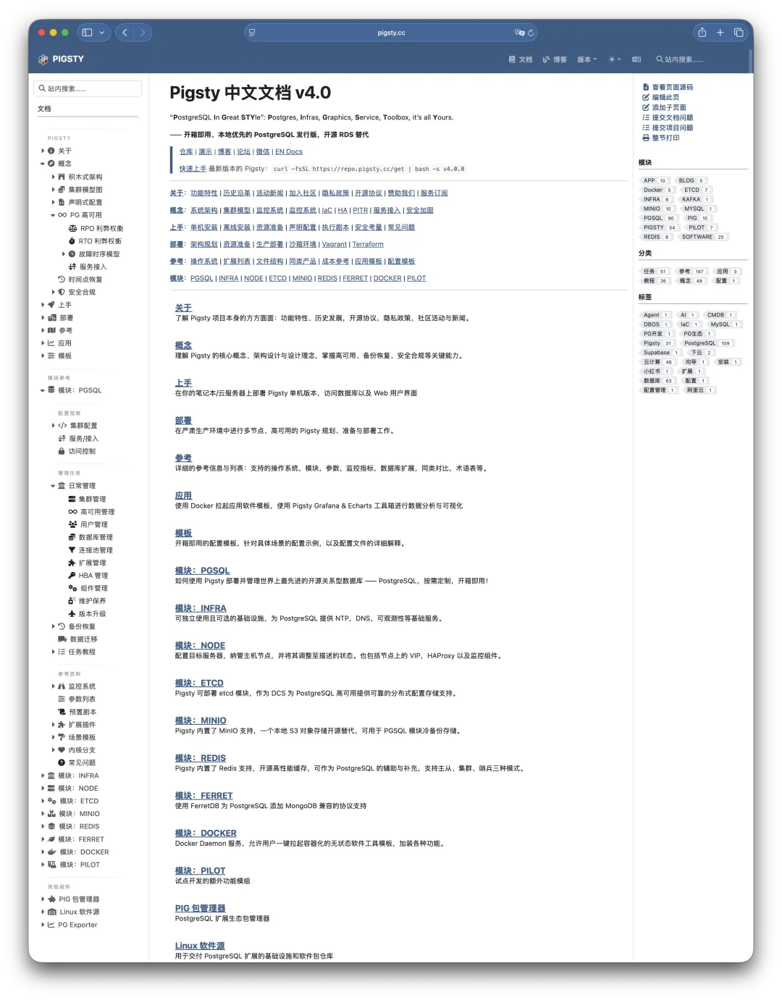

前几天和几个做 SaaS 的老板聊"下云"。账大家都算得清：云数据库太贵，规模一上来，直接吃掉两三成利润。但真要迈出"自建"这一步时，负责技术的合伙人李总说了一句大实话：

## "老冯，我不怕技术难，我怕的是 被绑架。"

一语道破天机。买云服务虽然是交"保护费"，但买到了标准化的东西，出了问题还能找别人接盘。而自建呢？找个大神搭一套只有他自己懂的系统，万一哪天他要涨薪、离职，或者单纯心情不好，公司的数据命脉就攥在他手里。

这种**组织风险**，远比云服务的账单更让老板寝食难安。

---

## 守着"祖传代码"的老师傅

李总担心的，是那种典型的"老师傅型"DBA。

他们像旧时代的织工，把数据库视作**私人领地**。技术或许不差，但满屏的祖传脚本、独门参数、稀奇古怪的配置，硬是把数据库捏成了外人勿进的泥人。业务方想做个改动，第一反应往往是抗拒："这不安全"，"那影响性能"。

此时，他不再是技术的推动者，而是**创新的绊脚石**。他苦心构筑的"技术壁垒"，防住了黑客，也顺带防住了公司对自己资产的掌控。一旦走上这种"土法自建"的道路，企业就是把命门交到了某个具体的人手上——对于不懂技术的老板，这无异于一场赌博。

**但问题是：不赌这一把，就只能继续给云厂商交税。**

---

## 印度织工 vs. 珍妮纺纱机

为了讲透这个逻辑，我给李总打了个比方。

**土法自建**，像雇一位纺织专家 —— 手艺绝伦，但生产全系于他一人的状态，走了就停摆。公有云，像买进口成品布——省心，但永远掌握不了织布机，规模越大，利润流失越快。两条路，一条绑人，一条绑钱。**有没有第三条？**

这就是 **Pigsty** 存在的意义。

**Pigsty 不教你培养手艺高超的织工，而是直接给你一台现代化的珍妮纺纱机。**

本质上，Pigsty 是一个开源的、本地版 RDS。原本需要老师傅耗费心血、写几千行脚本才能"手搓"出来的高可用、监控、备份体系，被封装成了**标准化的工业产品**。

引入 Pigsty，游戏规则就变了：

- **去神秘化**：没有祖传秘方，只有公开的说明书。
- **低门槛化**：不需要绝世高手，普通工程师培训后即可上岗。
- **可替代性**：DBA 离职？都是标准方案，照着文档接手就行了。

**能力从"人"剥离，固化到"工具"。这才是解决组织风险的根本。**

---

## 独立的技术监理

李总听完舒展了眉头，但随即又皱起来："机器是好，但我毕竟不懂行。万一内部的人还是忽悠我呢？说机器坏了要大修来骗预算，或者在我看不懂的地方动手脚？"

"所以你需要的不是一个'全职巫师'，而是一个**独立的技术监理**“。监理的价值在于**立场干净**：不卖云资源，所以不会忽悠你堆机器；不受雇于内部团队，所以能客观判断方案是真解决问题，还是在制造神秘。

这就是老冯提供的服务——不是来当大神，而是作为 **技术咨询顾问** 提供建议。

所以，下云自建，理想的架构应该是这样：

1.**底座（Pigsty）**：用开源软件搭建自己的"数据库工厂"，像买断织布机一样掌握生产资料，将底层成本降到最低。2.**运营（内部团队）**：用标准化工具武装你的团队，让普通工程师就能维护系统，避免被"大神"绑架。3.**保险（外部顾问）**：聘请独立专家作为守夜人，定期审计、关键时刻兜底，专治忽悠。

---

## 下云：一场工业化升级

李总端起茶杯，像是终于把一块石头放下："这么说，以前我不敢自建，是以为自建就等于'请个大神回来供着'。但你这套逻辑，是在教我们建一座现代化的数据库工厂。"

他顿了顿，又把那个最尖锐的问题抛了出来：

"不过老冯，你也是一个人。怎么保证你不会成为这套体系里那个不可替代的单点？"

"这个问题问得好。**答案就藏在'开源'和'标准化'里。**"

Pigsty 的本质不是"我提供服务"，而是把服务写进软件、写进代码、写进文档——**Service as Software**。系统能力不在我嘴里，也不在我电脑里，而在一套公开可复现的工程体系里：配置是代码、流程是手册、指标是仪表盘、演练是剧本、变更有回滚、审计有记录。

你请我，是为了加速决策、减少试错、帮你建立治理体系；但你不依赖我，照样能跑、能换人、能迭代。更重要的是：懂它的人绝不止我一个。开源意味着可验证、可替代、可迁移——你随时可以换团队、换顾问、换供应商，甚至自己培养人。**"不被任何人绑架"这件事，本身就是这套体系的设计目标。**

李总笑了："明白了。云厂商卖的是省心，老师傅卖的是手艺，而你们这种开源方式的卖点是 ——**标准、透明、可替代性**。"

我点点头： "下云不是倒退，也不是冒险。它是一次工业化升级：把不可控的手艺变成可控的工程，把依赖变成资产，把恐惧变成边界清晰的管理问题。"

下云自建，你真正买到的是四样东西：

**利润**——不再被云账单持续抽血；

**节奏**——不再被供应商和个人状态牵着走；

**风险**——从黑盒恐惧变成可量化、可演练、可审计的账本；

**控制权**——回到自己手里。

**这才是真正的自由。**

---

发布版本：[微信公众号](https://mp.weixin.qq.com/s/V6EKwqBfyZpqiv6qq1g0Rw)
