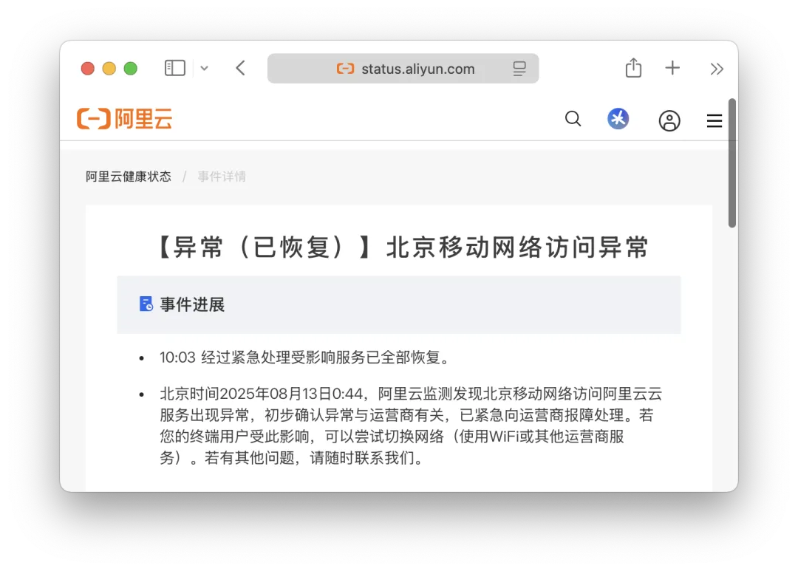
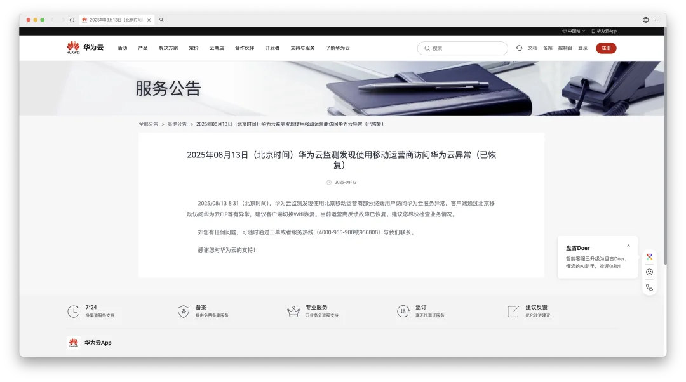
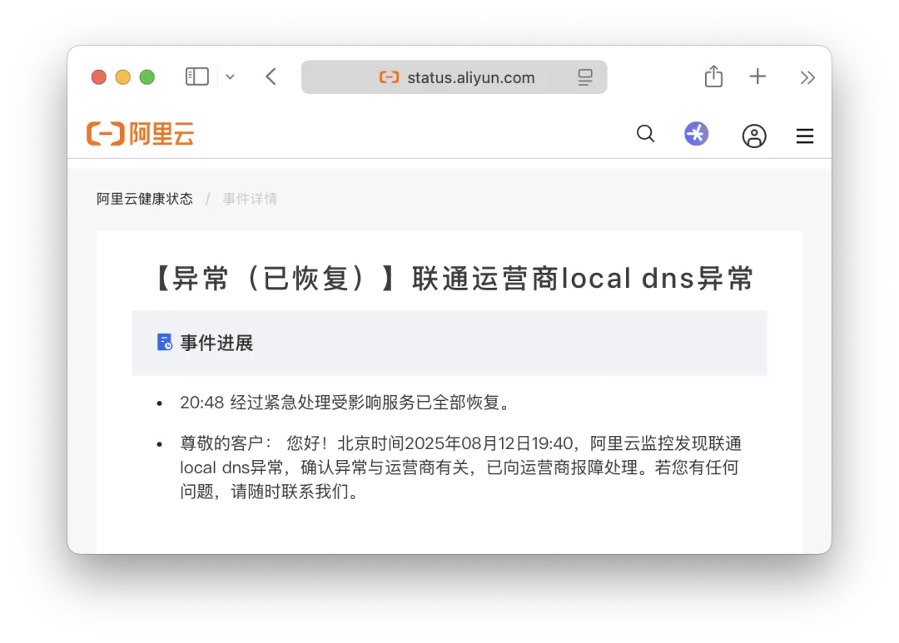

2025 年 08 月 13 日 0:44，阿里云监测发现北京移动网络访问阿里云云服务出现异常，初步确认异常与运营商有关，已紧急向运营商报障处理。

10:03 分通告：经过紧急处理受影响服务已全部恢复。

无独有偶，就在昨天，多地联通用户（以北京为主），也反馈联通网络出现崩溃，部分网站和 APP 无法访问。（网传联通 DNS 把许多网站的域名解析到 127.0.0.2 本地地址去了）。

这世上没有不崩的神话，联通崩完移动崩，这下压力给到电信了。

PS：友情提醒，阿里云[六月份两次大故障](/cloud/aliyun-cdn-sla/) SLA 赔付时效即将到期，再不申请赔付就没有机会了。

---

发布版本：[微信公众号](https://mp.weixin.qq.com/s/QpuQz4gLKwUwN63KwPZlkg)
