昨天，（卖正版软件的）数码荔枝老板在 X 上发了一个 Thread，说他们平台上有个软件开发者找他们下架软件，原因大致为：

他们把所有的代码 + 数据库都托管在腾讯云上。腾讯云欠费 2 元 后发通知，但开发者手机开了免干扰没注意。约 7 天后，腾讯云将他们的数据都删除，且无法恢复开发者没做数据备份，现在连用户是谁都不知道了。

**一个 10 万+用户的产品就此无了。**

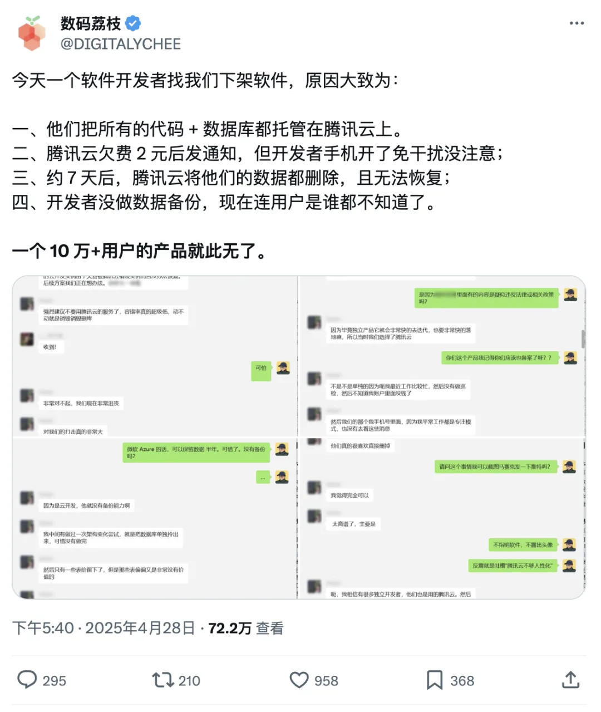

这条推引起了很大的反响，已经七十多万阅读了，同时下面还有许多的评论。各种群里有不少朋友 @我，问老冯怎么看。那么今天我们就来聊聊这件事中开发者与腾讯云的责任与问题，以及其他开发者应该从中吸取什么经验教训？

## 老冯评论

### 开发者的责任

作为一个有 10w+ 用户软件的开发者。没做数据备份，是一件非常离谱的事情。

更离谱的是，当服务被停服之后，这七天时间，难道就没有任何用户反馈报错吗？我能理解开发者收到腾讯云天天各种破事滥发短信，干脆屏蔽了之的心情，但屏蔽完开发者自己起码也要有基本的监控告警机制呀。在这一点上我其实是存疑的：你要是真有十万+用户，那停服一周用户的口水不应该把开发者淹没了吗？

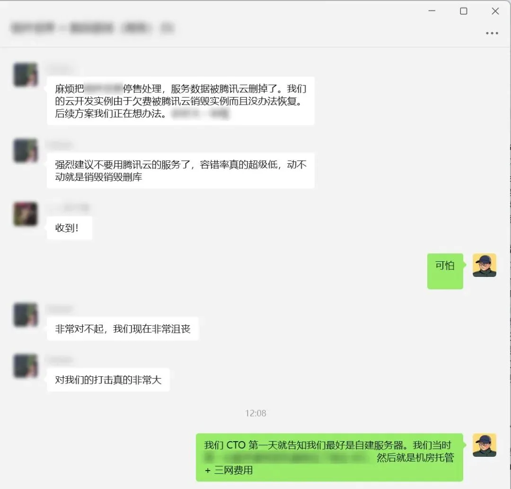

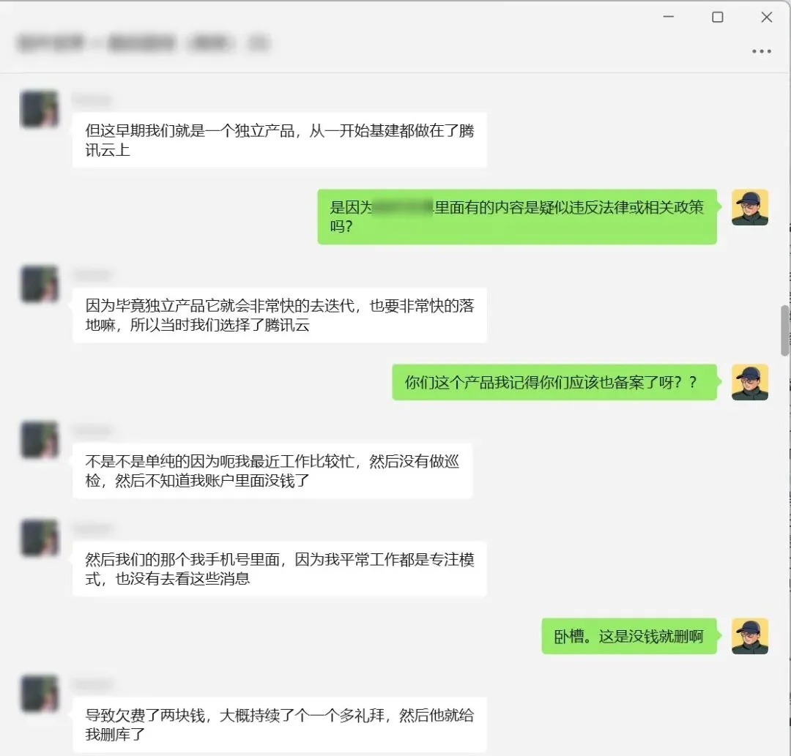

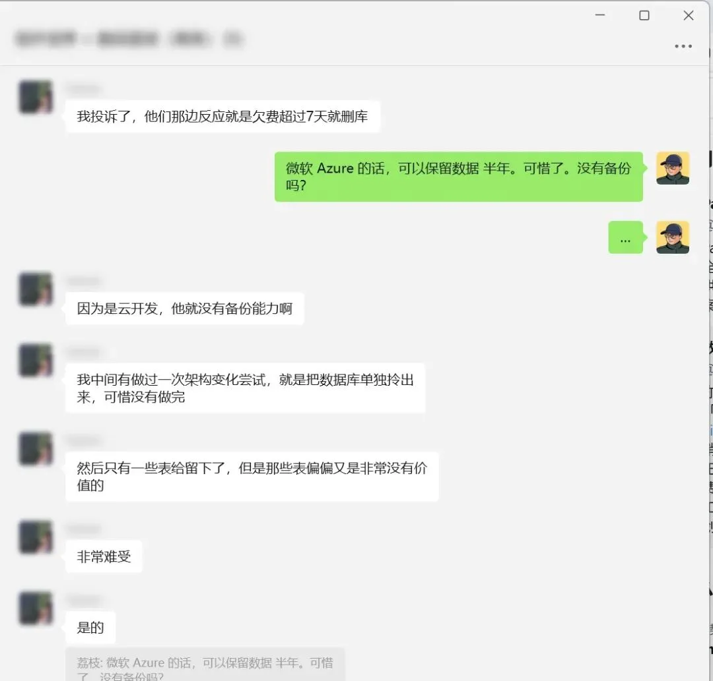

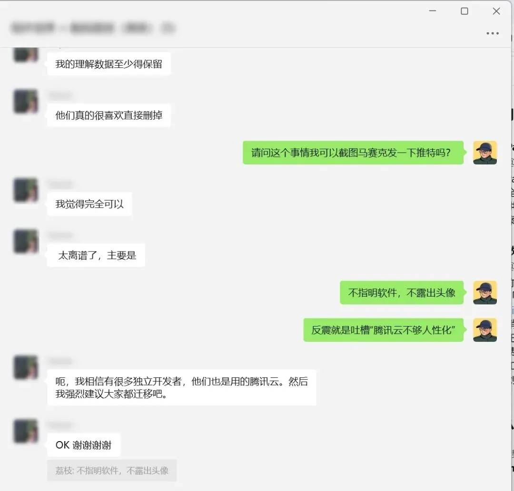

这位开发者给我的感觉就是：太过业余，也没把他自己的用户当回事，当负主要责任。也许他认为用了云服务就可以甩手不管了，但这种观念很可能跟云厂商的宣传营销有关系：好像上云就是什么运维外包魔法，企业数字化转型，包治 IT 百病的万灵药一样，开发者当个甩手掌柜就行。

实际上，在云上运营要操心的事情依然很多，如果你不做，你以为可以甩锅给云厂商，但云厂商也不会替你承担这些责任与后果。

腾讯云的问题

当然，在这件事中，腾讯云也有问题，比如：

- 欠几块钱就给人服务停了，过七天直接删库，合法但未必合情理
- 通知跟骚扰一样，怪不得别人给屏蔽了
- 最离谱可能是：从 “删了就没有办法恢复” 到舆情发酵后 “问题解决”

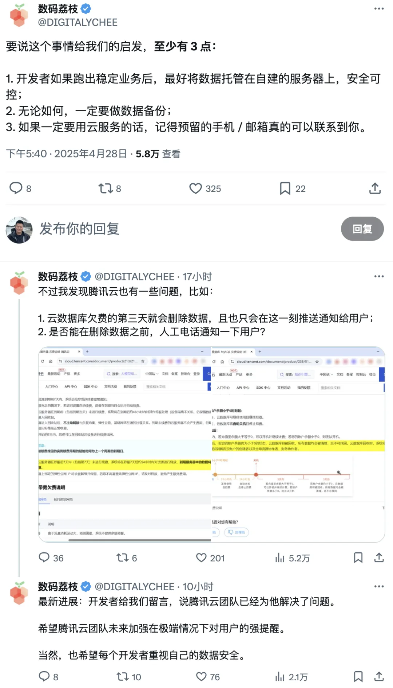

### 欠费直接停服

欠费两块钱就把人家服务停机删库这种事，就显得非常离谱。像 AWS 这样的云天价杀猪不杀猪先不说，但起码也都是先使用，后付费。月底看见天价账单是一回事，但“因为欠费”把用户服务直接停了又是另一回事。欠费固然不对，但房东因为欠费 2 元 7 天，把租客踢出去然后财产一把火烧掉，权责利不对等，也不是合情理的做法。

在腾讯云上，我也遇到过好几次这种事情。一封欠费通知过来说你欠了 1.7 ¥，两小时之后所有服务停止服务。

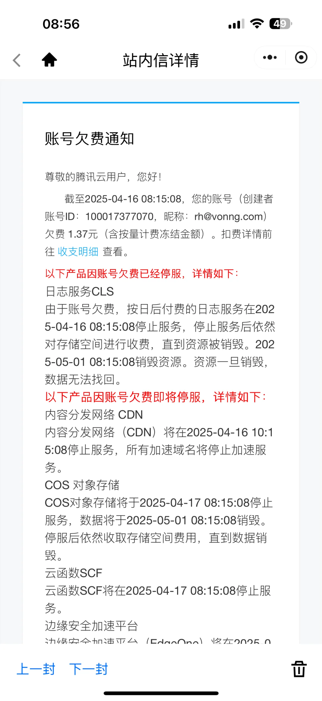

给人的感觉就是，云计算嘴上号称弹性敏捷，按量付费，但实际上干的还是预付费储值卡那摊子事，想要用各种资源包与欠费停服威胁尽可能多的把客户的现金先套进来。

在这一点上，阿里云倒是跟 AWS 学到点东西，它起码是有信控额度的。不至于因为你欠了两块钱，就把你一脚像赛博农奴一样踢出去。

### 通知如同骚扰

当然，最滑稽的是，其实腾讯云在通知这件事上是很“卖力”的，比如我一台破云服务器要到期了，腾讯云每天都要给我打个电话，不仅打电话，还要在打电话的同时给我发送一条 “0 级短信”（闪信），告诉我 “腾讯云来电，请放心接听”，生怕我不给这些服务续期。

但是唯独在欠费停服这件事上，通知就没那么热心了。不会有什么你的余额还剩多少，将耗尽之类的提前通知提醒，而是在你欠费的时候啪一下：两小时后我们将停服的消息糊在你脸上。

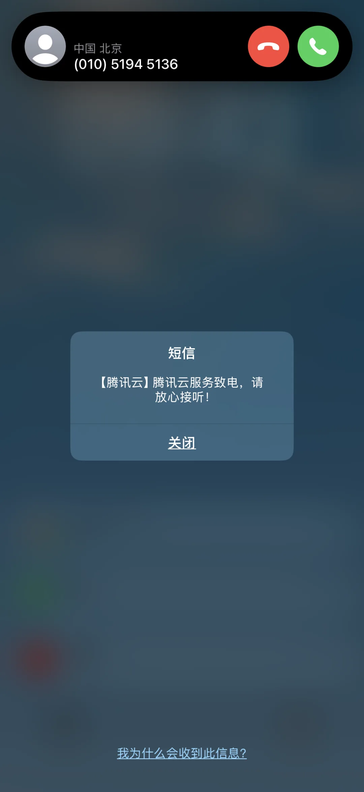

开发者开勿扰模式没看到这个通知，我认为也是情有可原的。因为他会收到的腾讯云通知真的就像骚扰一样，我也屏蔽。但我不得不说，在通知这件事上，虽然是以一种很让人讨厌的方式，但腾讯云确实是尽到自己的义务，也没啥好说的。

### 不可恢复的恢复了？

欠费停服，7 天删库，这些问题对腾讯云来说都是癣疥之疾，大家也就最多说说他条款苛刻而已。如果单纯就是这俩个问题，腾讯云也没啥，也是照章办事。而下面这个事件的最新进展，可能才是真正关键的问题。客服反馈以及文档声明承诺“不可恢复”的的东西“被恢复”了，那才是是给数据安全的一记大耳刮子。

> 最新进展：开发者给我们留言，说腾讯云团队已经为他解决了问题。希望腾讯云团队未来加强在极端情况下对用户的强提醒。当然，也希望每个开发者重视自己的数据安全。

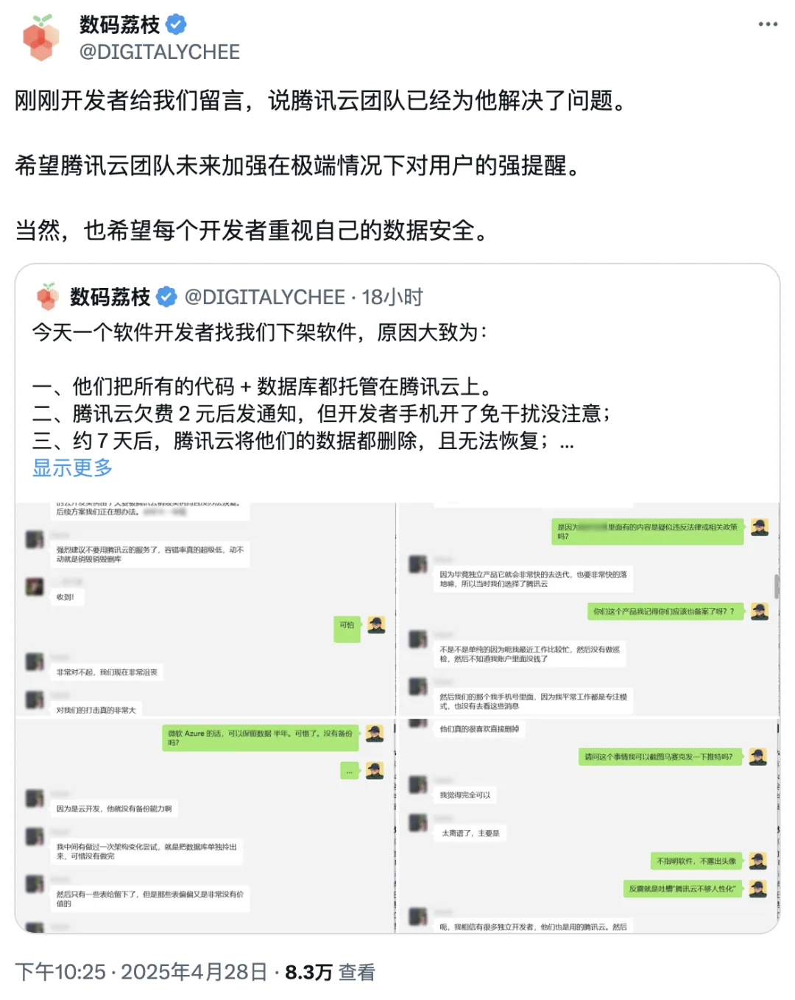

**这个 “解决了” 问题如果指的是恢复了数据，那么这才是最离谱的事情**。在腾讯云的文档上，说道 “若您的云服务器在停服后 7 天内（包括第 7 天）未进行续费，系统将在停服 7 天后约 24 小时内对资源进行释放，**到期服务器中的数据将被清除且不可恢复**。”

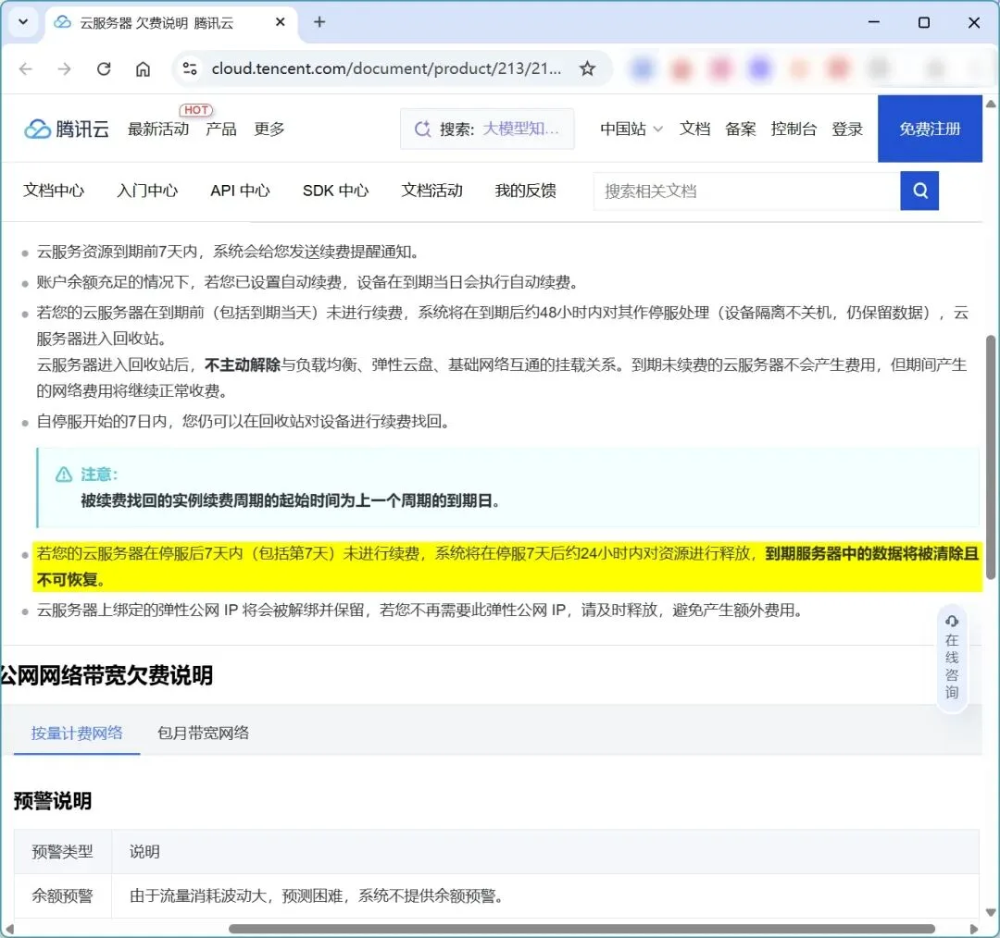

有些云厂商告诉客户 “我们删除了你的数据并且不可恢复”，但实际上，很可能只是标记删除，或者移动到归档冷存储中。

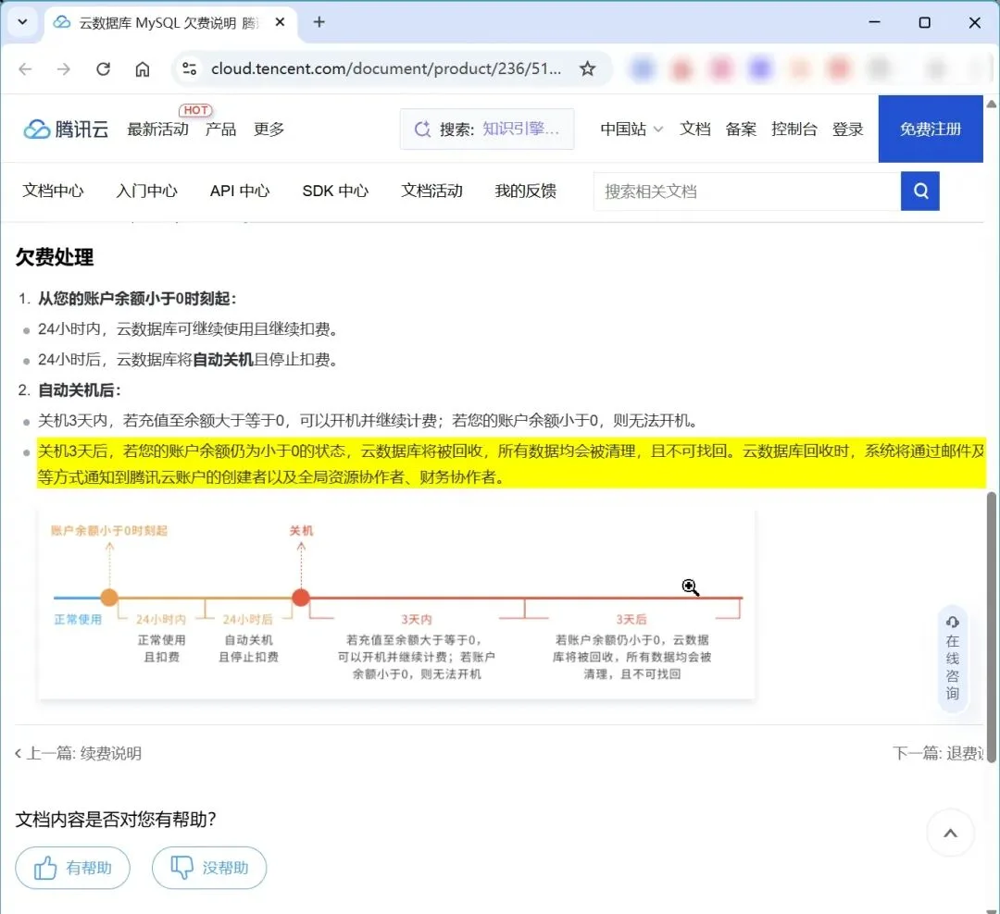

当然，我完全能理解这样做的动机，从最善意的角度来说，这样做可以在客户误删的情况下，像个 “英雄” 一样出现力挽狂澜。

但反过来说，对于那些想要行使类 “被遗忘权” 的客户来说，如果数据被人在未授权的情况下偷偷保留下来，本身就是一件很恐怖的事情。这意味着数据脱离了你的控制，你无法保证是否某个后台的云研发运维 DBA 就有权限把玩你的 Database，窥探你的业务数据 —— 特别是还是一个过往声名微妙，有极大概率存在潜在业务冲突的赛博领主。

### 老冯自己的体验

老冯也算是个独立开发者，有自己的数据库发行版 Pigsty，需要通过 CDN 进行全球分发，也有自己的网站。最开始用的也是腾讯云 CDN，对象存储 COS，还有一些云服务器，没啥原因，贪小便宜，活动价格便宜嘛。但是后来被坑了几次之后，就果断搬运到 Cloudflare 上了 —— 真正亲身验证了什么叫做 “贪小便宜吃大亏”

[腾讯云 CDN：从入门到放弃](/cloud/cdn/)

后来我发现推上也有不少人有类似的经历：

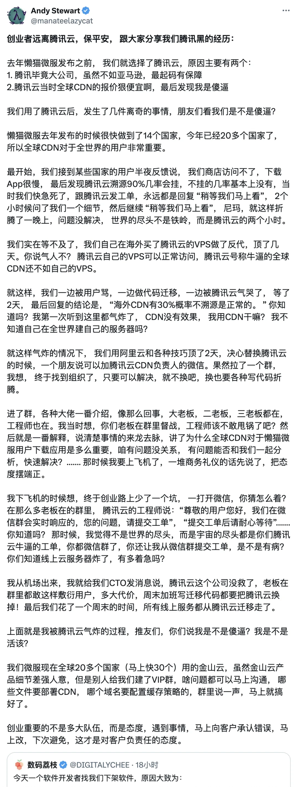

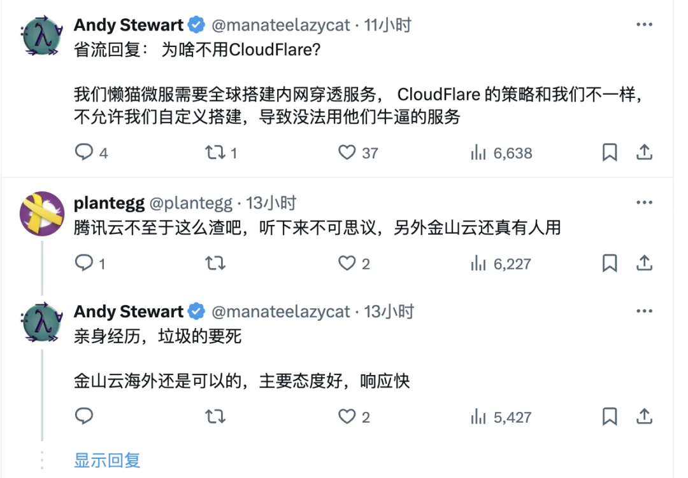

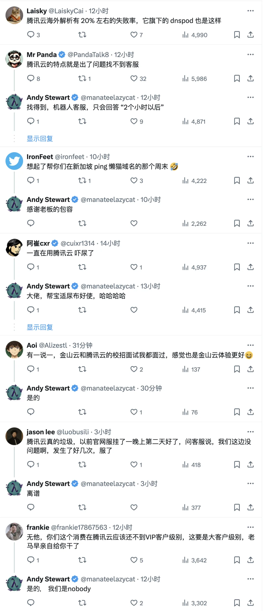

总的来说呢，使用 Cloudflare 给我的感觉就是如沐春风：我对 CF 闪电般的速度，还有分文不取的流量计费策略高度满意 —— 尽管不用钱也能用的挺好，但我很乐意买点什么，Shut up and take my money。而用腾讯云给我的感觉就是：这做的是什么 X 玩意。

[赛博菩萨 Cloudflare 圆桌访谈与问答录](/cloud/cf-interview/)

[吊打公有云的赛博佛祖 Cloudflare](/cloud/cloudflare/)

比如，在用腾讯云 CDN 的时候，我的用户经常会反馈用中国大陆镜像的时候会出现下载错误。我自己在测试的时候也发现 腾讯云 CDN 时不时的就会出现幺蛾子。然后 rclone 各家对象存储都用的好好的，就腾讯云 COS 有问题，必须得用他们自己的那个 coscmd 才能上传大文件。

抢钱一样的流量计费咱就不说了，国内厂商都是这个鸟样子，但更关键的是质量问题。CDN 我也试过他们照搬 Cloudflare 那个 EdgeOne，和 CF 比差的还是太远了。所以后来我就把大头全都搬到 Cloudflare 去了。现在腾讯云上还有点尾巴，等有空了我就全部下掉了。

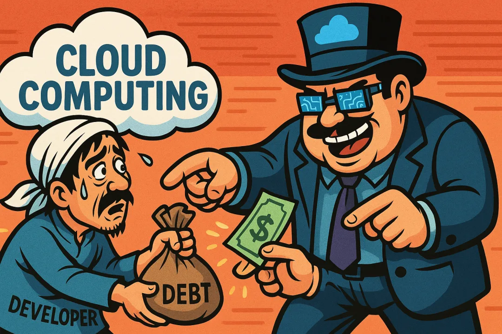

说起来，老冯最近基本上也把独立开发这套东西折腾了个遍，最近也有不少朋友问我独立开发的最佳实践与科学姿势，所以下一篇，我会来聊聊一些心得，不用这些阿巴阿巴云，什么才是最佳替代？

[腾讯云 CDN：从入门到放弃](/cloud/cdn/)

[腾讯真的走通云原生之路了吗？](/cloud/tencent-cloud-native/)\

[我们能从腾讯云故障复盘中学到什么？](/cloud/qcloud/)

[云 SLA 是安慰剂还是厕纸合同？](/cloud/sla/)

[腾讯云：颜面尽失的草台班子](/cloud/tencent-disgrace/)

[【腾讯】云计算史诗级二翻车来了](/cloud/tencent-epic-fail-2/)

[云计算泥石流](/cloud/exit/)点一个关注 ⭐️，精彩不迷路\

---

发布版本：[微信公众号](https://mp.weixin.qq.com/s/Gz_Y2qyByg1y17eWILJsLw)
