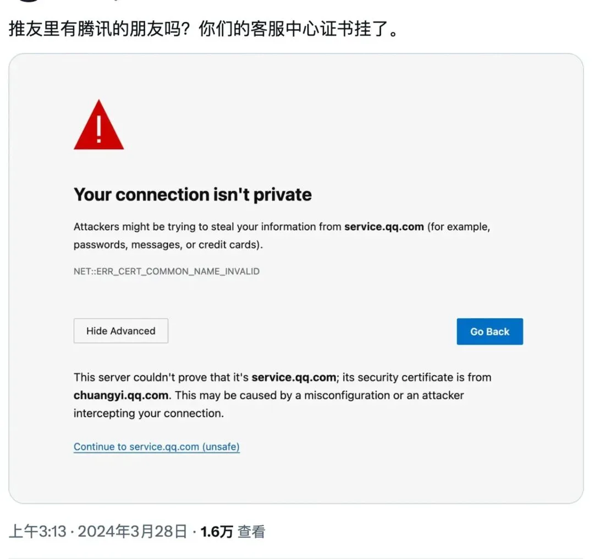
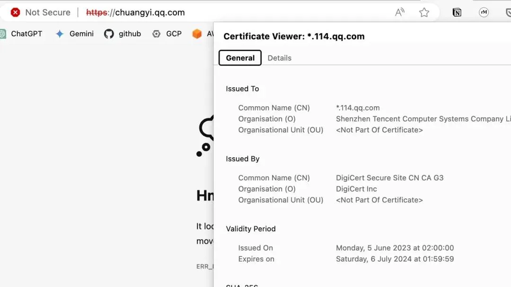
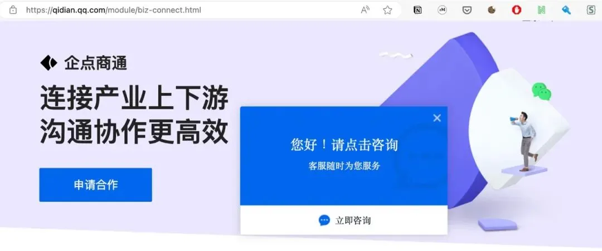
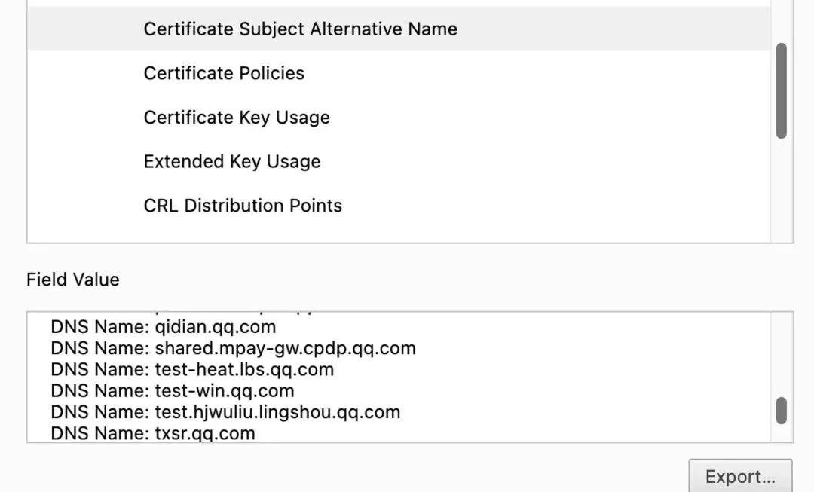
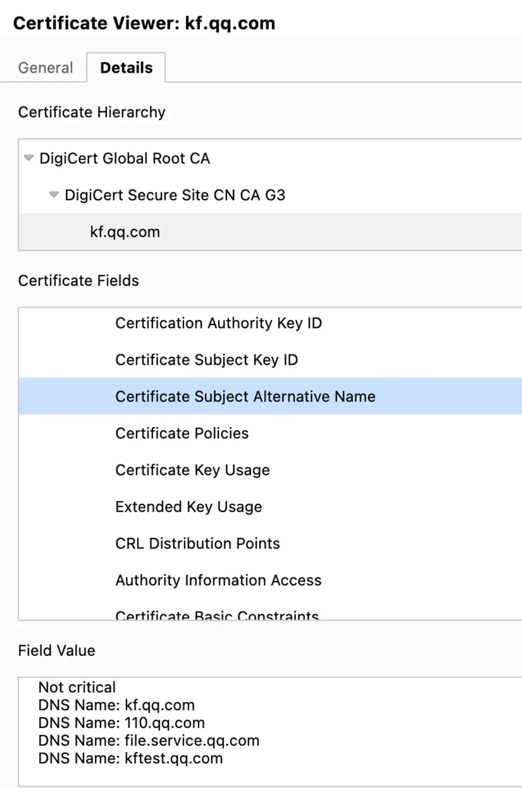
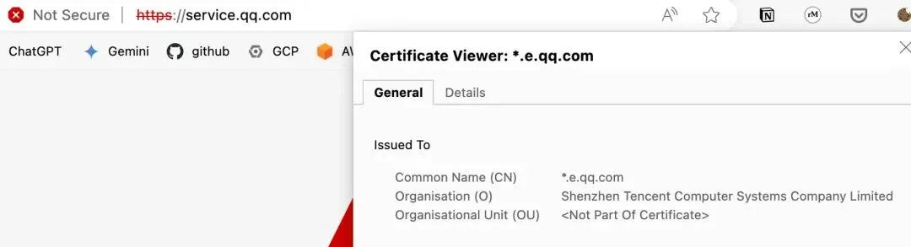
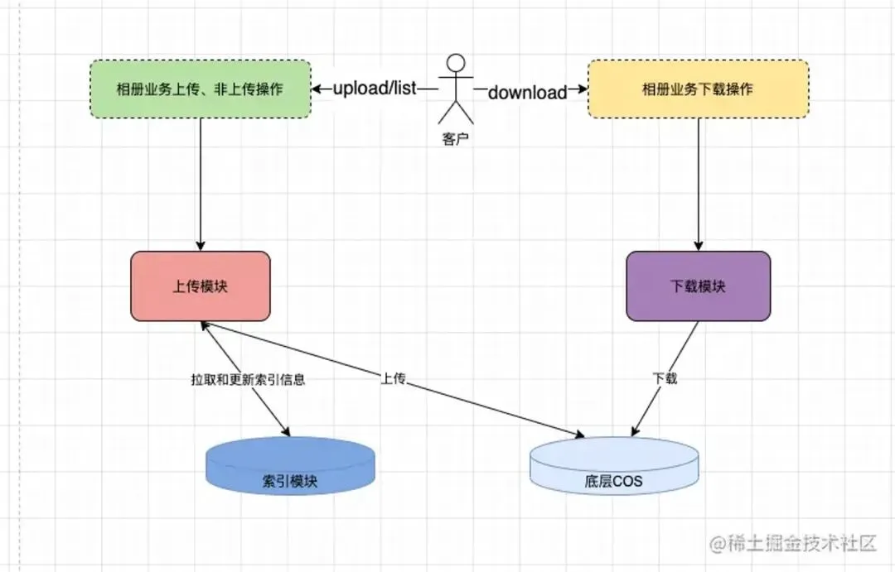

> 原作者：瑞典马工

## 摘要

腾讯云宣称腾讯集团各业务线基本完成了云原生的迁移。但是腾讯云把云原生简单理解成容器化，完全不涉及存储，审计，数据库，访问控制，可观测性，CI/CD，个人信息保护及其他服务。笔者用简单的工具查询公开信息，向读者展示腾讯各业务的域名/证书管理的混乱。以此作为一个例子说明：腾讯各个业务只会最简单的容器化，没能充分的利用腾讯云的服务，离业界最佳实践差很远，是远远不值得对外输出的。

## 腾讯宣布已经走通了云原生的路

腾讯云公众号上个月发布了一篇最佳实践[**《听说，整个鹅厂都在卷这张表》**](https://mp.weixin.qq.com/s?__biz=MjM5MDgwMzc4MA==&mid=2654897604&idx=1&sn=d4aa0b805f45556a79e9569ec80f4452&scene=21#wechat_redirect)。全文大意腾讯集团各个业务线都通过云原生改造，尝到了云原生的甜头，因此他们

> 用这条鹅厂走通了的路，帮助更多客户提升资源利用率、降本增效。

这是一个很大胆的宣言。它意味着腾讯集团把云原生的路走通了，成为腾讯云的标杆客户，提供了值得其他客户学习借鉴的最佳案例。在业界还对云原生没有一致意见的今天，宣布这个胜利是很有勇气的。

那么，腾讯集团真的把这条路走通了吗？我认为很难成立。

## 容器化只是云原生很小的一部分

腾讯云有 200 多个云服务，涉及软件开发的各方各面。但是在腾讯云的文章中，只提及了一个云服务：腾讯容器服务 TKE。不需要行业知识，依靠基本常识，任何一个人都会疑问：如果腾讯集团只使用 TKE 一个云服务就走通了云原生的路，那其余 200 多个云服务是干嘛的？都是为 TKE 服务鼓掌的啦啦队吗？

Kubernetes 只是一个有扩展性的容器调度平台，它简陋到都不原生支持对象存储。随便从腾讯云产品列表看一眼，就可以找出一大堆 Kubernetes 无法替代的云服务。

1. 云函数

2. 消息队列 CKAFKA

3. API 网管

4. 配置注册中心

5. 云监控

6. 日志服务

7. 云数据库 MySQL

8. 云数据库 Redis

9. 数据库备份服务

10. 操作/配置审计

腾讯云养那么多研发团队做 200 个服务显然不是为了好玩，除了那些莫名其妙的行业应用，大多数服务都有巨大的价值。对于不是很熟悉云的客户来说，最大的挑战是启动路径：先从系统那部分开始？哪些云服务启动成本低？怎么评估我的云原生成熟度？

对于做预研的朋友，建议参考 AWS，Azure 和 GCP 的云适配框架（Cloud Adoption Framework）。此处不展开。

对于喜欢动手的朋友，建议参考我的朋友王明松的**云原生王四条[1]**，他的主张不多：

> 基本上这四样做完，业务大致就接近一个云原生的最佳实践状态了:
>
> 1. 用对象存储静态文件
>
> 2\. 用 role 不能用 ak sk
>
> 3\. 尽量用托管服务
>
> 4\. 数据不要存在服务器上\

从原文看，腾讯集团各业务线并没有特意从块存储改成对象存储，可能根本不用 IAM，也没有提及任何一个托管服务，也没有强调应用的无状态，在云原生成熟度上，得分是很低的。

## 价值主张太小了

腾讯云认为腾讯集团上了 TKE，就走通了云原生的路，和业界流传较广的一个迷思很相近：云原生就等同于上 Kubernetes，甚至等同于容器化（Containerization）。毕竟业界最著名的云原生基金会 Cloud Native Computing Foundation 就是围绕 Kubernetes 建立的。

但是把 Cloud Native 等同于 Kubernetes，只是 GCP 早期的一个市场策略。那时候 GCP 相对于 AWS 非常弱势，只有 Kubernetes 这么一个大杀器。因此 GCP 想尽一切办法把 Cloud Native 混淆为 Kubernetes Native。同期的另外一个策略是，把 AWS 主张的 Serverless 的水也搅浑，宣称 Kubernetes 也是 Serverless 的。

腾讯云中了 GCP 的诡计，把云原生和 Kubernetes 划等号，就极大的缩小了云原生的价值。如原文所述：

> 答辩评审标准，也会偏向云原生落地成果，做得好的答辩还能加分。
>
> 这套机制也在持续迭代：
>
> - 半自动的弹性扩缩容，如何实现真正的自动化？
>
> <!-- -->
>
> - 负载均衡、稳定性能不能再提升？

扩缩容和 LB 都只是帮助系统可靠性的小工具，顶多再牵扯到基础设施成本。但是一个架构师的责任范围远远比这个大，他/她要控制系统的开发成本，要保证交付时间赶得上机会窗口，要扩展功能以应变市场变化，要卡住代码质量，要保障数据安全，要证明数据处理合规，要提供可观测性，要应付审计。

如果云原生只能在可靠性方面提供扩缩容这一个点，那云原生显然不值得他/她花那么多时间。我猜想腾讯集团内部有不少架构师在怀疑这个答辩评审标准。

## 腾讯是有云原生需求的

腾讯集团作为腾讯云的客户，实际上有不少技术问题可以用云服务解决。即使各位读者和我一样并非腾讯员工，我们也可以找到这么一个明显的问题：腾讯网站的 TLS 证书的管理很混乱，极其需要一个优秀的工具。

TLS 证书类似网站的身份证。假设你要访问 qq.com，你想确定对方确实是腾讯的 qq.com，而不是瑞典马工伪造的。你的浏览器就会要求对方网站出具一个证书，如果身份证和域名相符，你的浏览器就会如常工作；如果身份证上说对方其实是 qqq.com，那么你的浏览器就会拒绝展示网页，并且给你一个大红色警告。

如**一位推友在 3 月 28 日指出[3]**，腾讯客服中心的网页**service.qq.com** 用的 TLS 证书不正确，所以浏览器给了一个大红色警告。

可以看出，service.qq.com 用的证书是 **chuangyi.qq.com** 的，而**chuangyi.qq.com **自己用的 TLS 证书则是第三个业务**114.qq.com**的。

随着 **114.qq.com** 跳转到第四个业务**qidian.qq.com**，这是一个很严肃的企业服务企点商通，它的宗旨是：

> 结合腾讯通讯能力、AI 和开放平台
>
> 打造高效合作的生态联盟，助力产业智能升级
>
> 

这个企业服务这么高大上，应该维护得很正规吧？但是，这个子域名和一堆的 test\*.qq.com 共享一个 TLS 证书。看来腾讯根本就不区分测试环境和生产环境的证书。

更让人担心的是，和这群测试域名共享一个 TLS 证书的有一个似乎是支付网关的子域名**shared.mpay-gw.cpdp.qq.com**，

同样的问题存在于腾讯客服另外一个域名 **kf.qq.com**，它和自己的测试环境**kftest.qq.com** 共享同一个 TLS 证书。不用怀疑，这种安排最容易导致故障了。

不仅横向混乱，腾讯的证书还会随着时间轴混乱。到了 4 月 16 日，service.qq.com 的 TLS 证书又变成了 广点通的了。

最神奇的是，这个广点通的证书失效时间是 02/04/2022，04:15:26 CEST。也就是说，一个两年前就失效的证书，至今还在腾讯生产环境上服役，并且可以从互联网访问。

但是最致命的问题还不在于服务不可用，而是支付相关服务器 `shared.mpay-gw.cpdp.qq.com` 和测试服务器 `test-heat.lbs.qq.com` 共享同一个证书。这是一个很大的安全隐患，如果被严肃的审计团队发现，会让公司的业务资质都成问题，

## 证书问题可以用云服务解决

我很有信心的推断，腾讯这些业务的证书，应该是某个运维员工用 Excel 记录，然后手动更新的。当一个运维员工离职的时候，就会留下一些过期证书。当一个运维忙起来的时候，就会忘记续期证书。这就是最开始那位推友碰到的故障。

粗暴的管理者这时候就会制定一个规章制度

1. 交接工作不完整的，扣 500 块

2. 忘记更新证书的，扣 50 块

但实际上，腾讯云已经提供了一个很好的工具 **SSL 证书[13]**。

首先第一点，这个服务能监控你的证书，在它将要过期的时候就触发告警，这样至少你不会被先于你发现证书过期的用户公开羞辱了。

其次它支持自动更新证书，当你的证书更新后，SSL 证书服务能自动将新证书部署到旧证书关联的腾讯云云产品。可以看出，要利用这个特性，service.qq.com 应该使用腾讯云的负载均衡或者 WAF 服务。

然后，它还支持操作记录。谁什么时候把那个证书换了，都有记录。这样万一有内部员工把那个测试和支付网关共享的证书拿去做了不法勾当，腾讯是能快速审计出来的。

如果腾讯集团能把腾讯云的 API Gateway 和 SSL 证书两个服务用好，运维人员工作轻松了，故障少了，用户感到更安全了，皆大欢喜。这才算是走在正确的云原生道路上。

## 云原生的另外一个案例

腾讯云在 2022 年发布过一个云原生案例，**最佳案例 \| QQ 相册云原生容器化之路 - 掘金 (juejin.cn)[14]**。其架构图如下：

实际上，这里的下载模块是不必要的。腾讯云 COS 和 AWS S3 一样，都支持**预签名 URL[15]**。相册后台调用 COS API 生成一个预签名 URL 之后，客户端可以用这个 URL 直接去 COS 下载相片。这样可以节省巨大的下载模块和 COS 之间的流量费用，也可以节省巨大的下载模块服务器，而系统的可用性和安全性都会得到很大的提升。

但是很可惜，QQ 相册基本把 COS 当作传统存储使用，完全避免客户端和 COS 之间的交互，这是对云服务能力的浪费。

## 总结

腾讯云的服务还是比较全的，该有的不该有的都有了。但是腾讯集团业务线其实不太会用，甚至腾讯云自己也不太懂怎么用，所以双方合作推荐的云原生架构总是差那么点意思，搞来搞去就是容器化上 K8S。

对象存储的高级功能不会用，SSL 证书这种服务就没有进入过视野，更不用说把多个服务组合起来了。

这种低水平的上云实践对腾讯云本身的发展也有很大的危险：如果 K8S==云原生的话，那么在自建机房部署 K8S 也可以达到云原生，那用户为什么一定要用更贵的腾讯云呢？考虑到 K8S 是 Google 发起的开源软件，腾讯云连版本发布节奏都无法影响，那腾讯云和瑞典马工云又能拉开什么差距呢？

总体上来说，腾讯云把车造出来了，但是不太懂得怎么开车，推荐出来的几个车主幸福故事，基本上是菜鸟司机，车开的七扭八歪的。即使这个司机是大个子腾讯集团，建议还是谦虚一点，不要宣称自己走通了云原生之路。

### 参考资料

[1]

云原生王四条： *<https://github.com/lipingtababa/cloud-native-best-practices/blob/main/%E4%BA%91%E5%8E%9F%E7%94%9F%E7%8E%8B%E5%9B%9B%E6%9D%A1.md>*

- `[3]` 一位推友在 3 月 28 日指出： <https://twitter.com/LuoSays/status/1773171573769273461>

SSL 证书： *<https://console.cloud.tencent.com/ssl>*

[14]

最佳案例 \| QQ 相册云原生容器化之路 - 掘金 (juejin.cn): *<https://juejin.cn/post/7094434853810077710>*

[15]

预签名 URL： *<https://cloud.tencent.com/document/product/436/35560>*

---

发布版本：[微信公众号转载页](https://mp.weixin.qq.com/s/v0vbsy_OXIDNrbBvUUMV9Q)
