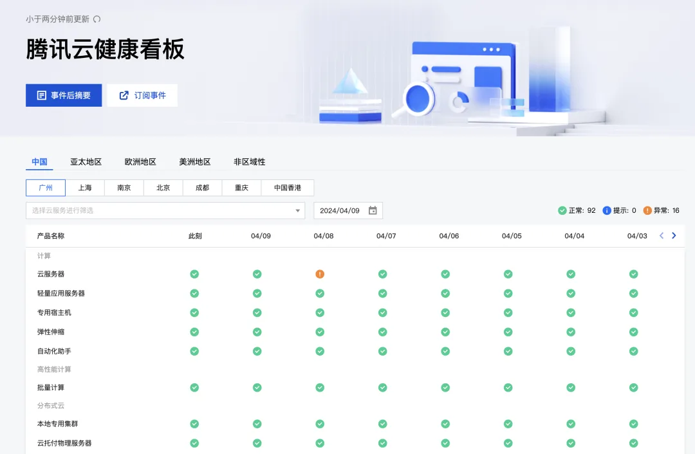
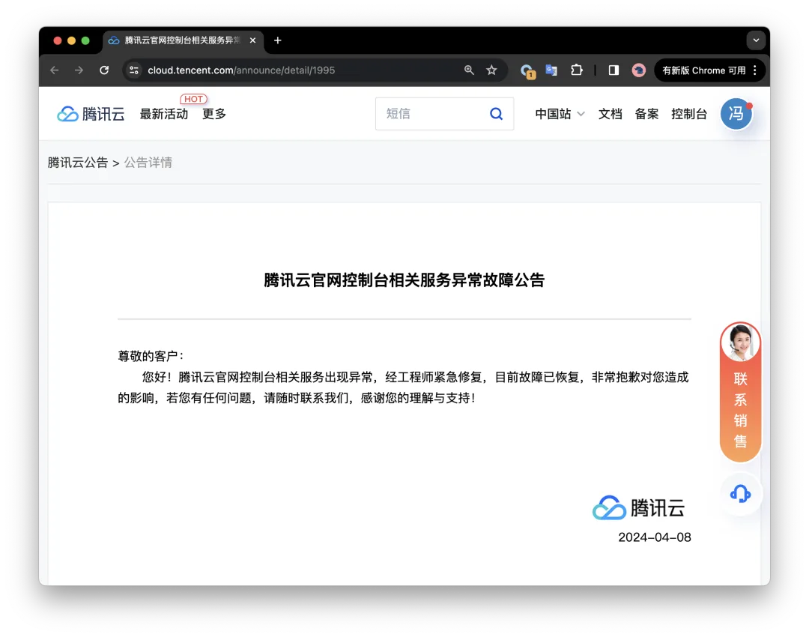
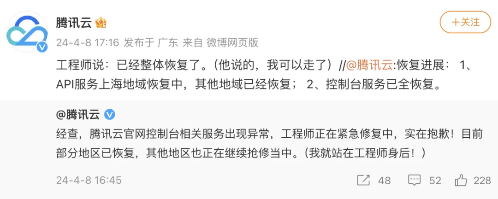
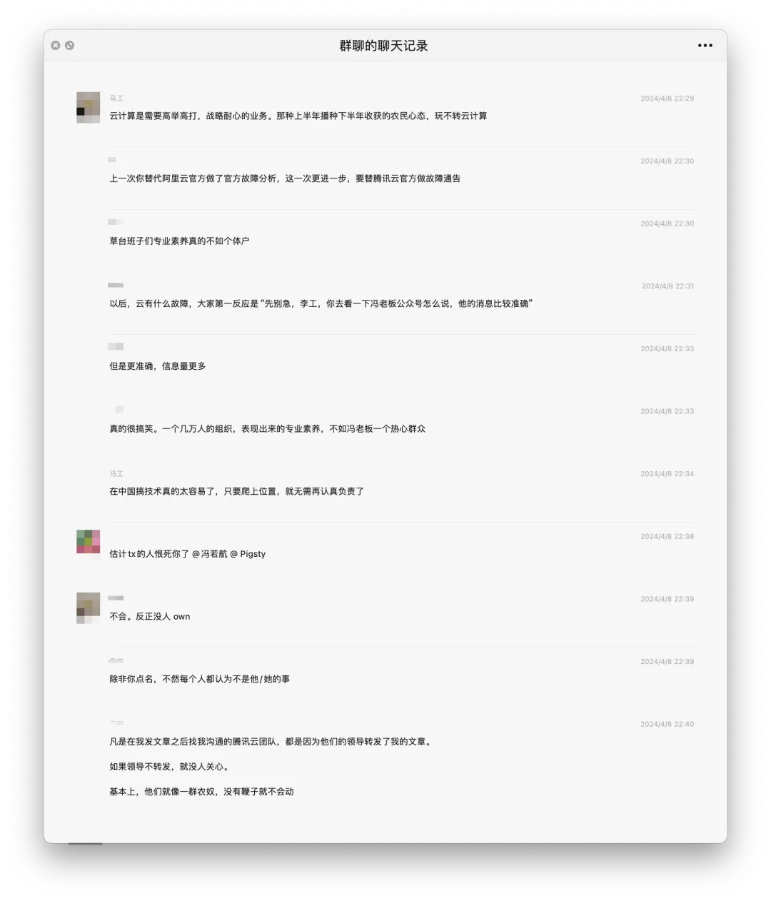

昨天下午，2024 年 04 月 08 日，腾讯云出现了一场全球性的大故障，用腾讯云官方的说法，崩了 74 分钟（15:31 - 16:45），波及全球 17 个区域与数十款服务。

## 事实影响是什么

**但这与我观察到的事实不符** —— 从故障范围上来说，这次的故障几乎是去年[阿里云双十一史诗级大故障](/cloud/aliyun/)的翻版 —— 小道消息是整个管控面 GG，云 API 挂了，所以现象与去年阿里云如出一辙：依赖云 API 的云产品控制台不能用了。

被管控的纯资源，如云服务器 CVM，云数据库 RDS，设置了公开读写访问对象存储 COS 不受影响可以继续使用。然而依赖认证与 API 的各种云 PaaS 服务，例如标准的私有读写的对象存储 COS，就抓瞎了。

因为阿里云至今没有做一个像样的事后故障复盘，因此在《[我们能从阿里云史诗级故障中学到什么](/cloud/aliyun/)》中，我为阿里云的这次故障做了非官方的技术复盘。同样的判断逻辑完全也适用于这次故障 —— 这样的爆炸半径，根因出在 Auth 上的概率很大。目前，腾讯云仍然没有给出官方的事后故障复盘报告，也可能不会有了。

---

## 忽悠人的状态页

我的朋友杨攀曾写过一篇《[中国云服务走向全球？先把 Status Page 搞定](https://mp.weixin.qq.com/s?__biz=MjM5NzY0NzAwMQ==&mid=2456881916&idx=1&sn=7d62bfe73053c1f0460d318b2b87203e&scene=21#wechat_redirect "中国云服务走向全球？先把 Status Page 搞定")》，讨论了 Status Page （服务健康状态页）对于公有云服务的重要性，各家本土云厂商也跟进了这一特性，包括腾讯云。—— 状态页能在服务宕机的情况下有效减少客户的焦虑，降低沟通成本，但它的核心价值在于 “**建立与客户的信任关系**”。

看上去，腾讯云与阿里云的 Status Page 反应都比较迟缓，在故障发生后三四十分钟才开始更新。而不是像 [**Cloudflare**](/cloud/cloudflare/) 等产品一样及时更新故障，或采用自动化方式监测到故障后立即推送。但不同于阿里云 —— 虽慢却诚实地标记了所有服务受到影响，腾讯云的 Status Page 连基本的真实性与准确性都堪称稀烂。

例如，受到影响的对象存储 COS 服务，在有用户上报问题的几个可用区中，我并没有看到 Status 标红。而这样的例子还有更多。事实上如果问题真出在管控 API 上，那么影响的范围应该和阿里云一样 —— 所有服务的控制面。因此，这样鸡贼的做法只会给客户留下：“**不透明、有猫腻**“ 的负面印象。

---

## 撒谎的三无公告

在故障出现 40 ～ 50 分钟后，腾讯云终于发出了第一份故障公告，也是截止到目前 Status Page 上唯一一份公告。但其内容就一句话 —— **三无公告**：无时间（故障时间），无地点（可用区/AZ），无范围（影响服务）。而且姗姗来迟，比我替它发的公告《[【腾讯】云计算史诗级二翻车来了](/cloud/tencent-epic-fail-2/)》还晚了十分钟。

但这份公告最致命的问题是真实性与准确性：首先，故障绝对不仅仅是“控制台”，而是整个控制面。作为一个专业的云计算服务供应商，一字之差天壤之别，混淆两者区别的原因，**要么是蠢**（缺乏专业素养，台面混为一谈）。**要么是坏**（避重就轻，推卸责任）。

请问，一个全身休克的人，说他 “面色异常”，这是一个真诚的回复吗？请问，一台被砸烂的笔记本电脑，说它“敲击键盘没有反应”是一个有意义的描述吗？同理，一个控制面爆炸的公有云，说自己“**控制台异常**”，是一个认真的回复吗？

其次，从事后官微的发布与用户群的反馈来看，在这个时间，**“目前故障已恢复”**  **是在撒谎**。至少相当一部分服务的可用性事件是在 16:45 标记恢复的，在 17 点前后，腾讯云产品吐槽群中也仍然有一些问题上报。

**我认为这份对腾讯云带来的伤害远比服务宕机要大的多** —— 首先，在及时性，准确性上体现出了极差的专业素养。其次，在真实性上有意做手脚，会伤及公有云，或者说一切生意的根本 —— **诚信**。**这对品牌形象是一个摧毁性打击。**

---

## 灾难级别的公关

按理说，出现了这么严重的故障，应当用诚恳认真的态度去处理，但腾讯云官方微博居然还在抖机灵 —— **堪称灾难级别的公关水平**。

这条微博也再次扇了腾讯云自己官网公告的大嘴巴子 —— 16:45 分发第一条帖子时，“***工程师仍在紧急修复中***”，17:16，距离第一次报告故障的 15:31 已经过去近两个小时，“***已经整体恢复***”。然而，根据腾讯云官网 16:21 发布的公告[1]声称：“***故障已恢复***”。从实际情况来看，**再次证明了官网公告在说谎**。

阿里云双十一大故障的时候，刚刚开完云栖大会，打脸了吹下的极致高可用的牛逼，但毕竟隔了一周了。而腾讯云这次大故障的**同时**还在开发布会吹牛逼，还找特大号发了一篇软文：《[太意外了！国内 80% 大模型都存在鹅厂！](https://mp.weixin.qq.com/s?__biz=MzI3MzAzNDAyMQ==&mid=2657846320&idx=1&sn=78ace56768acb5f2d8f914cc69687bd6&scene=21#wechat_redirect "太意外了！国内80%大模型都存在鹅厂！")》，发布时间 **16:19**，2 分钟后官网发出故障通告，堪称光速打脸二次方。

与之形成鲜明对照的是，[去年 11 月 Cloudflare 的故障](/cloud/aliyun/)，Cloudflare CEO Matthew 亲自出来对故障进行道歉与复盘，相比之下，国内云厂商的危机公关堪称灾难级别 —— 彻底做实了草台班子的称号。

## 实锤的草台班子

请允许我引用瑞典马工的一句名言：“[***阿里云是个工程质量差劲的正经云，但腾讯云是一群业余销售加业务码农玩游戏***](/cloud/cdn/)”。所谓光鲜亮丽的大厂，在里面也不过是一个又一个的草台班子。

## Reference

### **公告： *<https://cloud.tencent.com/announce/detail/1995>***

<https://www.oschina.net/news/286685>

<https://www.v2ex.com/t/1030638>

<https://www.v2ex.com/t/103061>

---

发布版本：[微信公众号](https://mp.weixin.qq.com/s/PgduTGIvWSUgHZhVfnb7Bg)
