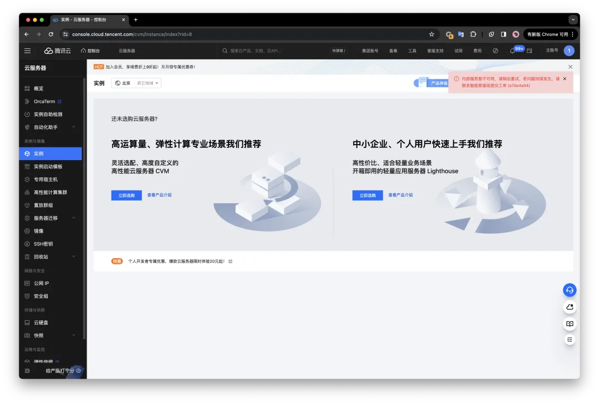
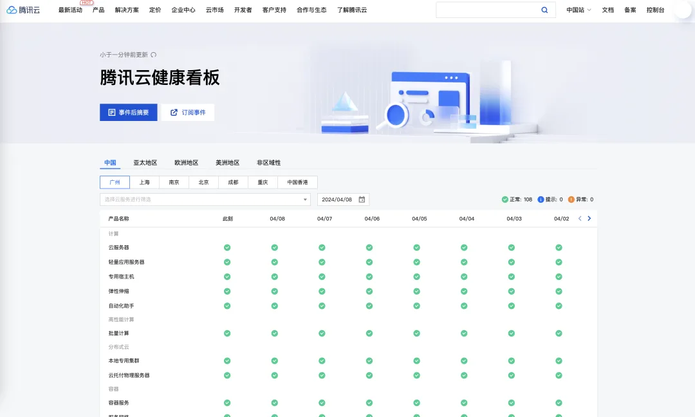

就在现在，腾讯云管控面挂了。症状几乎和 **[去年双十一阿里云史诗级大故障](/cloud/aliyun/) **一毛一样：CVM 虚拟机，RDS 数据库还可以正常运行，但是管控面，特别是和 Auth 有关的无一幸免。[**堪称阿里云故障翻版**](/cloud/aliyun/)**。**

这篇给阿里云做的的非官方复盘文章《**[我们能从阿里云史诗级故障中学到什么](/cloud/aliyun/)**》，把阿里云三个字改成腾讯云，读起来丝毫没有一点儿违和感。也许是**[降本增笑](/cloud/smile/)**太狠了，SRE 今年的年终奖又要泡汤了。

我自己还有几台 CVM 虚拟机跑 Demo，也用了[**腾讯云的 CDN**](/cloud/cdn/) 服务，登陆到控制台上，也访问不了了。看来确实要抓紧**[彻底迁移到 Cloudflare](/cloud/cloudflare/)** 上去了。

查看了一下[腾讯云健康状态页](https://status.cloud.tencent.com/)，发现服务还都是“正常的”，也没有公开通告。不过一些群里已经传出了消息，希望能够尽快恢复吧。

---

今天晚上八点，我在微信直播《[云数据库是不是杀猪盘](/cloud/rds/)》，嘲讽云服务的质量安全效率成本并不过关，没想到腾讯这么赶趟儿送个大人头。还好，看起来微信还可以正常直播，不知道是不是没有用自家的云哈哈……欢迎大家预约收看，吐槽云厂商。

[云计算泥石流](/cloud/debris/)曾几何时，“上云“近乎成为技术圈的政治正确，整整一代应用开发者的视野被云遮蔽。就让我们用实打实的数据分析与亲身经历，讲清楚公有云租赁模式的价值与陷阱 —— 在这个降本增效的时代中，供您借鉴与参考。

## [云数据库是不是智商税](/cloud/rds/)

## [牙膏云？您可别吹捧云厂商了](/cloud/toothpaste-cloud/)\

[罗永浩救不了牙膏云](/cloud/luo-live/) · [吊打公有云的赛博佛祖 Cloudflare](/cloud/cloudflare/)\
[云计算为啥还没挖沙子赚钱？](/cloud/profit/) · [FinOps 终点是下云](/cloud/finops/) · [卡在政企客户门口的阿里云](/cloud/aliyun-enterprise-market/) · [云厂商眼中的客户：又穷又闲又缺爱](/cloud/cloud-customers-poor-bored-lonely/) [阿里云降价背后折射出的绝望](/cloud/aliyun-price-cut-despair/)迷失在阿里云的年轻人[互联网故障背后的草台班子们](/cloud/amateur-internet-outages/) [门内的国企如何看门外的云厂商](/cloud/state-owned-enterprise-cloud-view/) · [剖析云算力成本，阿里云真的降价了吗？](/cloud/ecs/)\

---

发布版本：[微信公众号](https://mp.weixin.qq.com/s/5F2YgVtfpXoe7A1MoSoKLg)
