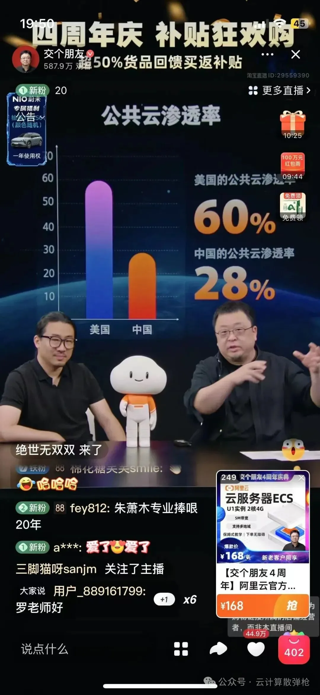
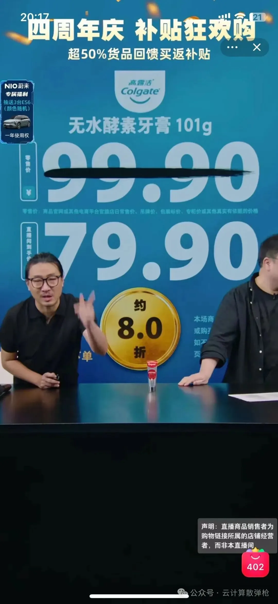
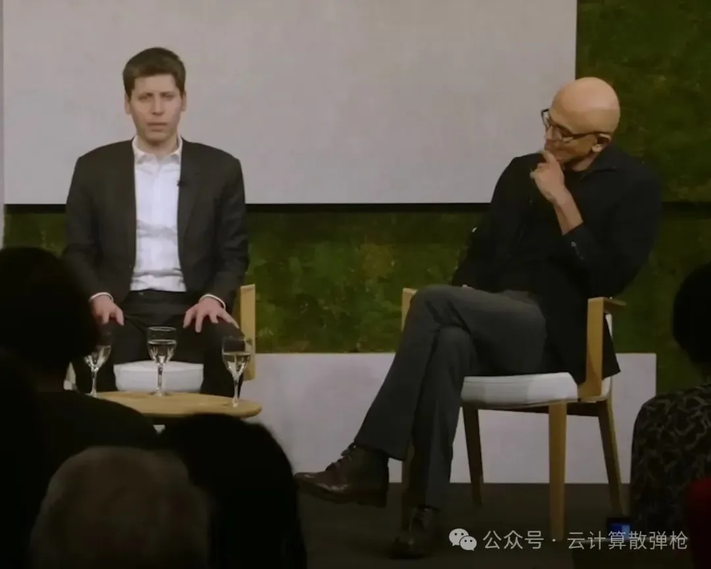
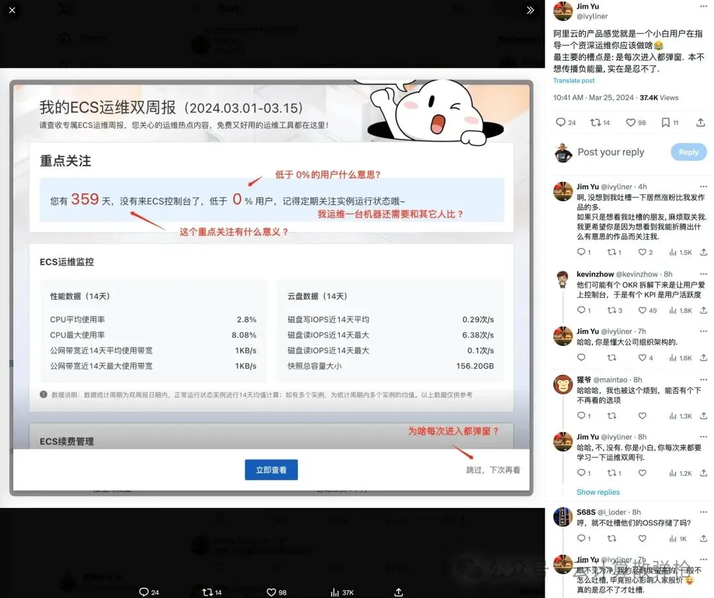
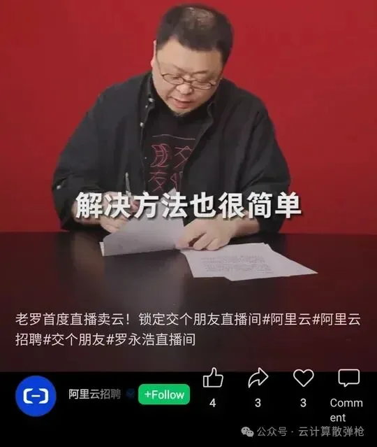
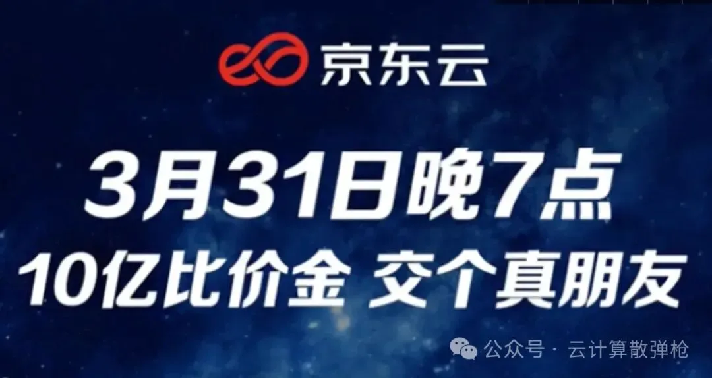
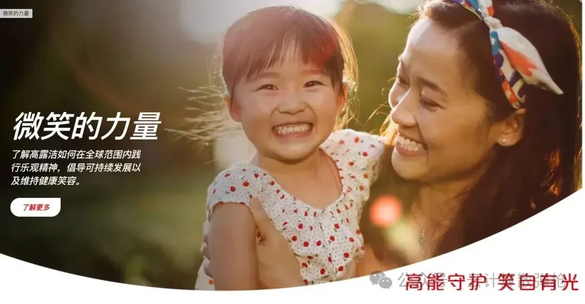
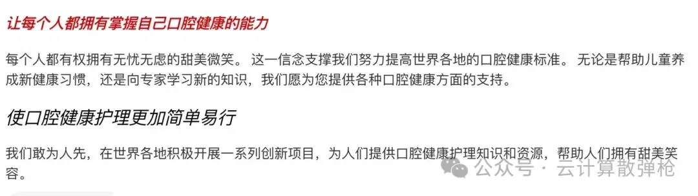
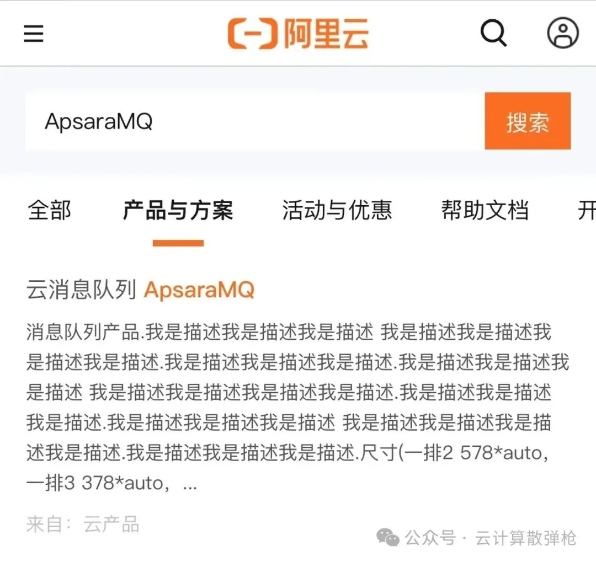
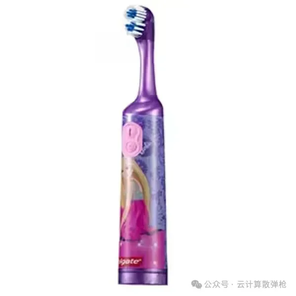

> 原作者：瑞典马工

昨天，阿里云声势浩大的邀请罗永浩直播卖云，结果老罗照本宣科之后，马上就接着卖高露洁牙膏，我的朋友冯老板哈哈大笑，[**嘲笑阿里云是个牙膏云**](/cloud/luo-live/)。\

ALT

ALT

从工程师习惯出发，我认真的研究了一些数据和事实，得出了不同的看法：任何一家云厂商都不配牙膏云这个称号。从利润率，到社会价值，到品牌管理，质量管理和市场教育，云厂商们都被牙膏厂全方面吊打。如果哪一天云厂商做到了牙膏厂的水准，那他们股东应该集体去南岳衡山烧香还愿，感谢菩萨保佑。

## 云厂有牙膏厂赚钱吗？

### （以下分析都是软件工程师的财务分析，不构成任何投资建议，也无意影响投资决策。）

在商言商，云厂和牙膏厂都是做生意的，都要赚钱。评估一家企业赚钱的能力，很重要的指标就是净利润率，也就是一年忙到头，做了一万块钱的大单子，年底究竟能剩下几块钱。

我们可以从最难赚钱的制造业开始谈起。小米是一家以低价著称的制造企业，他们 **CEO 雷军当年放出的口号[1]**是：

> 从现在起，小米正式向用户承诺，每年整体硬件业务，（包括手机及 IoT 和生活消费产品）的综合税后净利率不超过 5％。如超过，我们将把超过 5％的部分用合理的方式返还给小米用户。

实际上 2023 年小米的净利润率是 7.1%，雷总有点食言了。不过没关系，我们知道廉价小米一年卖 100 块钱，年底能剩 7 块 1 毛钱。雷劳模一年干到头，带着大伙儿挣点辛苦钱。

号称“掌握核心科技”的**格力空调，预计 2023 年营业收入 2050 亿元至 2100 亿元[2]**，扣非净利润将达 261 亿元-278 亿元，也就是格力每卖出 100 块钱的空调，能抽出 13 块 2 毛钱给股东。这是制造业的明星了，董明珠大姐确实有底气看不起雷劳模。

做 Azure 云的微软公司，其 2023 财年的营业利润是 885 亿美元，营业额是 2119 亿美元。这个利润率就比较高了，不考虑税和利息的话，每卖出 100 块钱的光盘，萨提亚能留下 41 块钱，难怪动不动就砸几百亿给 OpenAI 冲击人类科学进步。这是典型的高利润，高科技，高产出，大家一边羡慕嫉妒恨一边也不得不服气。

似乎没有技术含量的高露洁公司，在 2023 年营业额是 194.5 亿美元，营业利润是 39.8 亿美元。高露洁每卖出 100 块钱的牙膏，能收获 20 块钱的税息前利润。处于制造业的格力空调和高科技的微软的中间地带。

那么云厂商的利润率是什么情况呢？中国目前公布盈利的云厂商只有阿里云，其他的云要么亏损，要么没有独立披露数据，所以读者可以暂停一下，猜想想阿里云的利润率是什么段位。比微软低一点？和高露洁差不多？跟格力一样”掌握核心科技“？

实际上，以上答案都不对。**阿里云 2023 自然年全年营收约为 1053 亿元、经调整 EBITA 利润约 50 亿元[3]**。也就是阿里云每卖出 100 块钱虚拟机，只能赚 4 块 7 毛钱，这还还没分摊没交税没付息呢。一不小心，友情实现了雷军当年税后净利润不超过 5% 的承诺。

即使在最为耀眼的 2023 自然年最后一个季度，**阿里云的经调整 EBITA 也不过是营业额的 8.4%[4]**，仍然和低端品牌小米处于一个档次，和“掌握核心科技”的格力制造还差一个段位，更不用和牙膏厂高露洁比较了，当然更不能和真高科技企业微软相提并论。

至于其他云厂商，几乎都在明面亏损或者暗地亏损。有的干了十几年，整个生命周期都在赔钱赚吆喝。正能量的说法是，他们在努力为社会提供就业，难听的说法是，这帮厂商就是在忽悠股东往水里扔银子让他听个响。

就这种生存能力，云厂商跟人家牙膏厂怎么比？

## 云厂比牙膏厂更有社会价值吗？

除了利润，也可以用外部效益来衡量一个公司的价值。有的公司溢出正向的外部效益，比如微软不仅赚钱，还通过微软亚洲研究院为中国培养了很多 IT 人才。有的公司溢出负面的外部效益，比如买卖个人信息的那些公司，虽然赚钱，但是对社会造成危害。有的公司溢出零外部价值，比如云厂商，社会有他们不嫌多，没他们不嫌少。

按照道理，云厂商应该为业界提供专业 IT 技术。但是我们认真想一下，云厂商们干了这么多年，给中国 IT 业提供了什么新的技术呢？说来说去，本质就是从英特尔批发了一堆 CPU，找 OEM 厂商组装成服务器，找个有电的机房一摆，就开始零售了。各位云的 CFO，我们摸着良心说话，如果没有英特尔那些渠道返点，你是不是立马要卷铺盖走人了？这个活，我称之为 IDC 2.0，没有任何新意。没有云厂商之前，是这样玩的；有了云厂商之后，还是这样玩的。

作为对比，牙膏厂为中国人的口腔健康做出了巨大的贡献。很多上了年纪的长辈，几乎没有口腔健康意识，一口大黄牙加上三米的口臭覆盖半径，基本是行走的污染源。而年轻一代人不仅普遍养成了早刷牙的习惯，还有越来越多的年轻人一天刷牙两三次。在这个习惯的培养过程中，牙膏厂赚到了钱，消费者也收获了更健康的牙齿和更清洁的口腔，是典型的双赢，而且毫无疑问，消费者赢得更多。

## 云厂比牙膏厂更会做市场吗？

牙膏厂的社会价值创造，并不是一个简单的过程。我听过不止一次云厂员工抱怨：“甲方习惯太强大了，就是不也愿意改流程，必须改动我的产品去适应他们僵硬的流程。”有人甚至极端的声称：“中国 IT 市场的甲方不需要高技术，他们需要的就是我驻场小弟小妹提供的情绪价值。”

他们强调的挑战是真实的，但是他们的愚蠢在于没有意识到：巨大的挑战才需要高科技，也进而能产生巨大的利润，这才是高科技企业的本质。

云厂商申请政府补助的时候，会毫不犹豫的自称高科技企业；云计算从业者申请人才补贴的时候，会脸不红心不跳的自称高技能人才；但是真的做市场的时候，这帮人却想捡最简单最容易的小学生任务，千方百计绕过最困难的部分：发明和推广新的 IT 技术。

因为可以摸着 AWS 过河，云厂商基本不发明新的 IT 技术，只剩下推广这一项工作。但即使这一项工作，也无人认领。我看到的现象是：

1. 没有一家云厂商的 CEO/CTO 提出一套有条理的云计算价值主张。带头人自己没有认知，只会坐在自己温馨的办公室点评手下的瞎折腾，美其名曰“放手试错”。

2. 至今为止，关于云计算理论的书籍，只有**王坚博士的《在线》[5]**，但是这本书成书已经十年了。有阿里云员工拿着这本书跟我辩论，我只能哭笑不得；“大哥，你知道十年对于云计算行业意味着什么吗？整个云计算行业才十八年历史！” 至于其他云厂的员工，连一本这样的可以引用的书都没有。只有一些文抄公拼凑了一堆所谓云技术大全系列。

3. 没有一家云厂商有成体系的**云采用框架[6]**（Cloud Adoption Framework）。你看那些花样繁多的云迁移工具，云迁移伙伴，云迁移服务，云迁移路径，云迁移案例，都是脚踩西瓜皮滑倒哪里算哪里，互相之间甚至打架。

4. 没有一家云厂商的技术大会有业界影响力。云栖大会以前还有点干货，现在几乎沦为营销秀场，我们就不要提雇佣学生去填场子的尴尬事了。

5. 没有一家云厂商提供一个有说服力的客户成功案例。搞来搞去，只会请世界五百强客户出来站台念云经“恒源祥，云云云，恒源祥，云云云，恒源祥，云云云，恒源祥，云云云，恒源祥，云云云”。

6. 没有一家云厂商有专业的 SA 团队。要么跳到天上去指导客户“[**流量变现**](https://mp.weixin.qq.com/s?__biz=MzkwODMyMDE2NQ==&mid=2247484257&idx=2&sn=7eb2b7b77c7d3941622c44ca004ea744&scene=21#wechat_redirect)“，要么就卑微到尘埃里给[**客户外包业务代码**](https://mp.weixin.qq.com/s?__biz=MzI2NDU4OTExOQ==&mid=2247572437&idx=1&sn=36f22bacd82ae022d95f1236ead48001&scene=21#wechat_redirect)。

7. 没有一家云厂商有活跃的用户社区。不说线下的 meetup，就连成本低廉的线上社区都没有。不客气的说，我和朋友们构建的云计算微信群《云计算：爱撕，怕撕和傻撕》是中国最有信息量的云计算交流社区。

8. 没有一家云厂商的技能认证是正经做的，以至于他们自己招聘都不认自己的各种技能认证。还有云厂商把自己的 MVP 当作礼物到处送给大 V，已经失去了最基本的公信力。碰到把 X 云 MVP 印在自己名片上的从业者，你将其按 IT 表演家处理，基本错不了。

9. 没有一家云厂商能够协调好公共关系，市场营销和开发者关系之间的部门分工。让没写过工程代码的应届生去搞云最佳实践，写出来的东西狗屁不通，自己内部人都看不下去第二眼，还想强塞进客户嘴里。

我女儿前几天宣布她先吃早餐再刷牙。我对这种懒惰表示不同意，小朋友骄傲的告诉我：“爸爸，你不懂。牙医告诉我们，就应该先吃早饭再刷牙。” 我说：“你从哪里听到的歪理邪说？”小朋友告诉我牙医去了她们学校，现场演示了正确的刷牙方法，还解答了她们的疑问，还建议小朋友们刷牙之后不要漱口，要留一点牙膏在嘴里，这样才能最好的保护牙齿。对于我牙膏残留物可能被吞进去的疑惑，她说牙医建议她们吐出牙膏但不漱口，这样牙膏残留物就会保持在一个合适的水平。

我不知道牙膏厂是否赞助了牙医的这个科普，但是显然口腔卫生从业者的市场教育能力远胜于云厂商。我看到太多的云厂商大 V 不屑于这种小规模的用户面对面沟通。他们出场必然是高端论坛的直播，主持人问一些贴心好问题，经销商在那里节奏一致的点赞，嘉宾不停的捧哏，什么都很完美，就是 TMD 没效果，无非就是人为制造了一个虚拟回音室。

ALT

我建议高 P 政治家们走下神坛，走进人民群众，回复一些很简单很直接的问题：

1. 你天天说高可用，先证明一下你自己的控制台是多可用区部署的。

2. 你天天说微服务好，微服务妙，微服务呱呱叫，拿一个有技术细节的参考架构来给哥看看。

3. 云资源天然联网，而我的 DBA 不太懂云，怎么防止他对互联网开放端口被人拖库？

4. 我用 IAM 做精细化访问管理，但是工程量太大了，手都点断了，怎么办？

5. DevOps 挺好，怎么在你们云上创建一个完整的，可维护的 CI/CD 流水线？

答不出这些问题的人，建议云厂商不要让他们出来吹牛逼了，留着祸害你们自己人吧。

## 云厂商比牙膏厂更懂用户吗？

云厂商至今搞不清楚，云计算是服务专业软件开发者的，不是服务普通消费者的。传统的一些虚荣指标，比如新注册用户数，用户每日登录次数，在云计算这种 To Developer 行业，如果用作下属的 KPI，很容易导致动作变形。

**同行 Jim Yu 作为一个专业用户[7]**，就非常受不了阿里云那个登录排行榜，“您有 X 天没有来 ECS 控制台了，低于 Y% 的用户”。他的话问出了专业云用户的心声：“我运维一台机器还需要和其他人比？”

ALT

## 云厂商比牙膏厂更懂品牌管理吗？

十几年前，IBM 在中国搞 IT 的时候，他们有个 **DeveloperWorks[8]** 网站，长期，大量，免费的输出高质量技术文档。无数从业者受益良多。尽管这个网站不太可能给 IBM 带来直接的销售线索，但是巩固了“IT 从业者选择 IBM 总是不会错的”这个品牌形象，至今难以超越的。这个客户心理定位对 IBM 销售的帮助，是不需要进一步解释的。

十几年过去了，云厂商作为新一代 IT 领导者，品牌形象堕落到什么程度呢？他们需要一个不懂软件开发的老罗来代言。视频里，老罗被问到“ IT 支出昂贵。高并发难处理，技术人员参差”这几个专业技术管理问题，老罗看了一眼就说“解决方法很简单”，大笔一挥开出了阿里云的药方。云计算在代言人这里，成了一个包治百病的狗皮膏药。这个视频让专业用户只觉得荒谬，甚至感受到一定量的二手尴尬。

ALT

然后还不够，还有另外一朵云打擂台。

ALT

整个场景滑稽得有如观看马戏团杂耍比赛。

作为对比，我们可以看一下**高露洁的品牌形象[9]**，看看人家多么巧妙的把牙膏，牙齿和微笑联系在一起。

ALT

更重要的是，这并不是一个虚无缥缈的口号，“微笑的力量”接下来被很具体的阐释，可以直接用来指导产品研发和市场营销。

ALT

牙膏云？云厂商配得上这个名字吗？有这个专业能力吗？

## 云厂商比牙膏厂更懂质量管理吗？

这是个月经话题了。云厂商的质量管理有如高中男生的宿舍卫生，大家都知道是那个样子，也没法改变，只能从门口掩着鼻子赶紧走开，装作注意不到。

我的朋友徐老板作为阿里云用户，碰到了这样的界面：

ALT

我们能说什么呢？只能说牛逼。

作为对比，我用过无数管牙膏了，从来没见过一管牙膏上面印着“我是描述我是描述我是描述”，甚至没想过产品质量有可能差成这样。

## 总结

基本上，从社会价值，到经济价值，到专业能力，云厂商和牙膏厂差了三个档次。所以，请从业者不要用牙膏云这个词了。这是对人家牙膏厂的全方面侮辱，也是对云厂商过分的恭维。读者有什么好的名字建议，请在《云计算散弹枪》的评论区留言或者投票。得票最高的三个名字，我送作者三管价值观很正，有益于社会，有益于经济，质量靠谱的牙膏。

### 参考资料

[1]

CEO 雷军当年放出的口号： *<https://lmtw.com/mzw/content/detail/id/155337/keyword_id/-1>*

[2]

格力空调，预计 2023 年营业收入 2050 亿元至 2100 亿元： *<https://m.yicai.com/news/101933263.html#:~:text=%E6%8D%AE%E5%85%B6%E4%B8%9A%E7%BB%A9%E9%A2%84%E5%91%8A%EF%BC%8C%E6%A0%BC%E5%8A%9B,%E5%8E%BB%E5%B9%B4%E7%9A%844.43%E5%85%83%2F%E8%82%A1%E3%80%82>*

[3]

阿里云 2023 自然年全年营收约为 1053 亿元、经调整 EBITA 利润约 50 亿元： *<https://m.e-works.net.cn/news/news111622.htm>*

[4]

阿里云的经调整 EBITA 也不过是营业额的 8.4%: *<https://data.alibabagroup.com/ecms-files/1508664153/b74dd7aa-d498-49f4-a6a9-f59d86c9d071/December%20Quarter%202023%20Results.pdf>*

[5]

王坚博士的《在线》: *<https://book.douban.com/subject/26885117/>*

[6]

云采用框架： *<https://learn.microsoft.com/en-us/azure/cloud-adoption-framework/>*

[7]

同行 Jim Yu 作为一个专业用户： *<https://twitter.com/ivyliner/status/1772091282350891287>*

[8]

DeveloperWorks: *<https://en.wikipedia.org/wiki/IBM_Developer#:~:text=as%20alphaWorks%20and-,IBM%20developerWorks,-)%20hosts%20a%20wide>*

[9]

高露洁的品牌形象： *<https://www.colgate.com.cn/power-of-optimism>*

---

#### References

[罗永浩救不了牙膏云](/cloud/luo-live/) · [卡在政企客户门口的阿里云](/cloud/aliyun-enterprise-market/) · [云厂商眼中的客户：又穷又闲又缺爱](/cloud/cloud-customers-poor-bored-lonely/) [阿里云降价背后折射出的绝望](/cloud/aliyun-price-cut-despair/)迷失在阿里云的年轻人[互联网故障背后的草台班子们](/cloud/amateur-internet-outages/) [门内的国企如何看门外的云厂商](/cloud/state-owned-enterprise-cloud-view/) · [剖析云算力成本，阿里云真的降价了吗？](/cloud/ecs/)\

---

发布版本：[微信公众号转载页](https://mp.weixin.qq.com/s/XZqe4tbJ9lgf8a6PWj7vjw)
