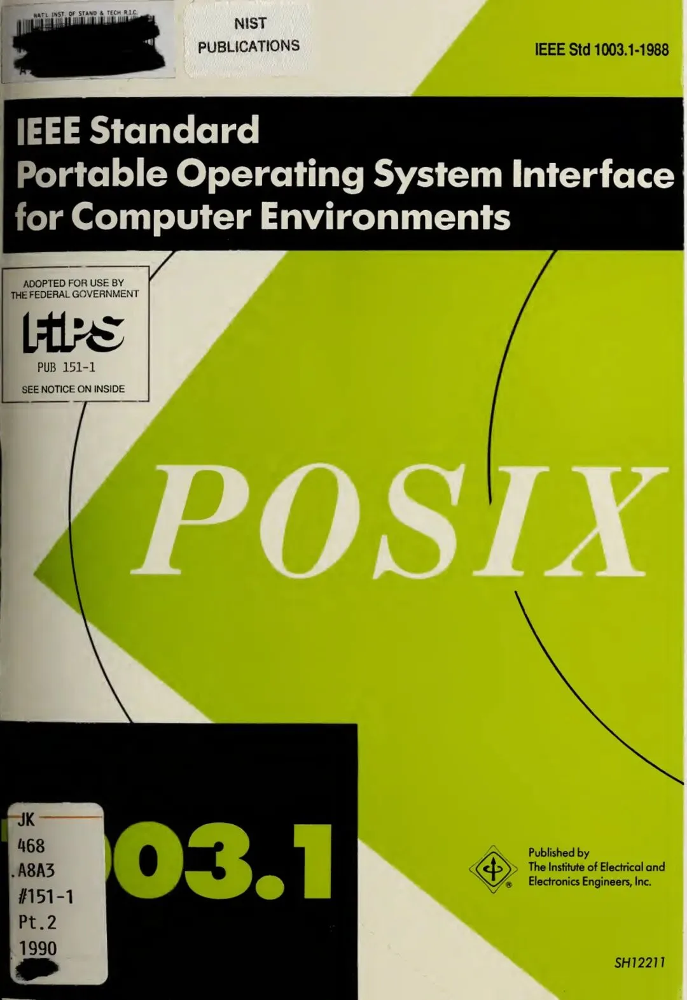

> 原作者：瑞典马工

## 什么是云？云是什么？

中国云计算是一个 5000 亿人民币的庞大产业，但是长久以来，厂家们一直没能说清楚一个问题：云计算究竟是什么，以及可能更重要的，云计算不是什么？

这个问题可以衍生出更多的问题，包括：

1. 云计算对企业究竟有什么价值？

2. 云计算的目标用户究竟是谁？

3. 云和 IDC 究竟有什么质的区别？

4. 上云和数字化转型究竟是什么关系？

5. 为什么上云这么难？

6. 云上计算，存储，网络的溢价这么高，但是为什么云厂家都不赚钱？

7. 云计算号称高科技行业，但是为什么中国有几十朵云？

8. 云计算号称高科技行业，但是为什么厂商都在打价格战？

9. 我的基础架构团队能支撑双十一/春晚红包，为什么做不出好的云服务？

10. 云计算规模这么大，为什么没有丰富的生态伙伴？

11. 几乎每家大企业都有多云管理的需求，但是为什么那些做多云管理平台的公司都挂了？

笔者特意搜索了汤道生，张平安和吴泳铭的公开演讲，试图找到这三家主要云厂家 CEO 对上述问题的回答，但从公开资料来看，CEO 们似乎并未对此类问题给予足够重视，也鲜有正面回应。在此，笔者从一个云计算用户的角度，试图自行寻找答案。抛砖引玉，欢迎各位读者严厉的批评或者热烈的表扬。

我的回答很直接：云主要是一个分布式计算机操作系统。

## 云是个操作系统？？？

长久以来，操作系统的定义被限定为单机操作系统，这也是大家在本专科学习的操作系统。但实际上操作系统的定义更宽广：

> An **operating system[1]** (OS) is system software that manages computer hardware and software resources，and provides common services for computer programs. 翻译：操作系统（OS）是管理计算机硬件和软件资源，并为计算机程序提供公共服务的系统软件

云作为一个系统软件，管理了所有的硬件（IaaS）和软件（PaaS），为用户的计算机程序提供公共服务，完全符合操作系统的定义。

实际上，大多数云平台的核心服务都可以对应于操作系统的概念：

|  |  |  |  |  |  |
|----|----|----|----|----|----|
| 功能 | Linux | AWS | 华为云 | 阿里云 | 腾讯云 |
| 可调度计算单元 | 进程 | 虚拟机，容器，FaaS 函数 | 虚拟机，容器，FaaS 函数 | 虚拟机，容器，FaaS 函数 | 虚拟机，容器，FaaS 函数 |
| 调度器 | CFS Scheduler，O(1) Scheduler | EC2，EKS，Lambda | 弹性云服务器 ECS，云容器引擎 CCE，函数工作流 | 云服务器 ECS，容器服务 ACK，函数计算 FC | 云服务器 CVM，容器服务 TKE，云函数 SCF |
| 外部存储 | 文件系统，Ext4 等 | S3，EBS，EFS | OBS，EVS，SFS | OSS，EBS，NAS | COS，EBS，CFS |
| 进程间通信 | Pipe/Shm | EventBridge/SQS，MSK | EventGrid，DMS，DMS for Kafka | EvenBridge，Kafka 以及其他一百种重复服务 | EventBridge，Ckafka |
| 系统监控 | top | CloudWatch | CES | 云监控，SLS，ARMS 以及其他一百个重复服务 | Cloud Monitor |
| 审计 | Auditd | CloudTrail | Cloud Trace | ActionTrail | CloudAudit |
| 访问控制 | User Management | IAM | IAM | RAM | CAM |
| Shell | Bash | AWS CLI | KooCLI + obsutil | Alibaba Cloud CLI | TCCLI |
| 数据库 | MySQL | RDS，DynamoDB | RDS | RDS | RDS |

只要把操作系统的定义从单机扩散到一整个数据中心，那么云=操作系统这个等式就非常自然了。单机应用程序通过 Linux 系统调用访问内核功能，分布式应用程序则通过云 API 调用云内核功能，两者使用方式基本一致。

细心的读者会指出“数据库并非操作系统一部分”，我的辩护理由是：云扩展了操作系统的边界，通过丰富的 DBaaS 把数据库纳入了操作系统的范畴。这方面最明显的例子是 AWS 的 Dynamodb。它没有自己的端口，依靠 AWS API endpoint 接收客户端的请求，也没有数据库用户和密码，依靠 AWS IAM 来做 authentication 和 authorisation。它已经无法脱离 AWS 这个 OS 独立部署。

## Okay，但这只是一个比喻吧？

这不是个比喻，一朵云就是一个操作系统。这样定位云，能够帮助我们回答上面列出的那些疑难问题。

## 问题：为什么上云这么难？

上云相当于 IT 团队从单机操作系统换到分布式操作系统，本来就很难。

在三十年前，大量的团队从 DOS 系统切换到 Windows 系统，同样困难重重。团队不仅需要重写大多数程序，还需要重新构建团队。DOS 是个单一用户（single-user）和单一任务（single-tasking）操作系统，软件开发者完全掌握整个软件栈，不需要系统管理员这个角色；只有在 Windows 和 Unix 多用户多任务操作系统流行后，才有了操作系统和应用程序的明确分离，产生了系统管理员这个岗位，后来再发展成运维岗位。这个过程中，重构软件或者新增岗位，都是引入风险的点，很容易导致一个结论：用好 Windows 太难了，还是 DOS 顺手。

同样，从传统的单机操作系统换成 AWS，阿里云，华为云或者腾讯云操作系统，也不仅需要重写大量程序，还需要重组 IT 团队。有些用户直接搬迁（Lift and Shift）应用，而不重构应用和团队。这个策略相当于买了个 1998 元的 Windows 却只用附带的价值 398 元的 DOS，也不是不行，就是有点跟钱过不去。

## 问题：云计算号称高科技行业，但是为什么中国有几十朵云？

大多数云厂商是不合格的。他们的技术储备根本不足以支撑操作系统的研发。有的云厂商工程师的数量还不如微软 Windows 部门做 Linux 子系统的工程师多。有的云厂商把研发外包给其他公司，自己只做轻松的品牌和运营。还有云厂商主要服务一两个大客户。大多数做的事一个玩具操作系统：看着像模像样全都有，但是质量和本科生毕业设计作品差不多，只能在纸面上看，不能真的用。

## 问题：云计算号称高科技行业，但是为什么厂商都在打价格战？

和上面问题的答案一样。一堆劣质操作系统，并没有在裸设备上提供太多附加值。厂商卖的还是无差别的黑大粗铁盒子，自然只能靠价格竞争。

## 问题：云上计算，存储，网络的溢价这么高，但是为什么云厂家都不赚钱？

因为玩具操作系统虽然没有给客户提供太多附加值，但是研发成本一点不打折。随便一个不打眼的产品就有几十人的研发团队，然后再养一堆交付工程师，养一个不知道自己在说什么的营销团队，以及若干年薪五百万但是只会画四纵三横架构图的架构师，云厂商从计算网络存储 RDS 上赚来的钱就照数花出去了。

## 问题：云计算规模这么大，为什么没有丰富的生态伙伴？

微软卖 Windows 操作系统，需要大量技术合作伙伴，比如 ISV，而 Dell 卖铁盒子则只需要渠道合作伙伴。云厂商如果只需要渠道合作伙伴，说明它就是个卖铁盒子的。

## 问题：云和 IDC 究竟有什么质的区别？

在分布式操作系统的架构下，云是操作系统，而 IDC 只提供了服务器和交换机等裸设备。以数据库审计为例，在 IDC 实现一个可信的数据库访问记录非常困难，大多数此类系统并不能保证完整性。而在云上实现同类系统只需要开启云厂商的审计服务，就可以在技术上满足大多数监管单位的要求。

## 问题：云平台的目标用户究竟是谁？

和操作系统一样，云平台的用户就是应用开发者。系统管理员从来不是 Windows 的用户，甚至可以反过来说，Windows 是系统管理员劳动的消费者。有了系统管理员的劳动，Windows 才是应用开发者可用的一个稳定操作系统。同理，运维团队也不应该是云的目标客户。应用开发者能够使用 X 云这个 OS 更高效的开发应用，才是 X 云的价值源泉。离开了这个源泉，谈互联网加成云，AI 开光云，算力底座云，都是自欺欺人而已。

## 问题：上云和数字化转型究竟是什么关系？

两者没有直接关系。企业数字化转型是企业战略，是 CEO 关注的，而云计算只是 IT 团队的一个很具体的操作系统选择，只需要 CIO/CTO 关注。大多数 CEO 并不知道自己公司的服务器用的是 Linux，还是 Unix，还是 Windows，没道理换成腾讯云他们就要突然关心起操作系统技术了。

## 问题：几乎每家大企业都有多云管理的需求，但是为什么那些做多云管理平台的公司都挂了？

因为多云管理平台实质上就是开发一个兼容多个操作系统的标准，困难到几乎不可能。

在单机操作系统时代，有很多客户宣称他们不愿意被 AIX/HP-UX/Solaris/Window 任何一家操作系统厂商绑定（Vendor Lock-in）。他们到处跟人说他们需要一个厂商中立的标准，并且愿意为此付费。这其中需求最强烈的是美国联邦政府，他们出钱赞助了 POSIX 这个操作系统标准族，又让 NIST 将其发布为联邦政府采购技术标准 **FIPS 151-1/2[2]**。

结果如何呢？POSIX 从来没有像 IEEE 预想的那样成为广泛标准，只是和 OSI 七层协议一样成为一个技术上的参考模型。实际上，被 POSIX 认证的 AIX，HP-UX，Solaris 基本都挂了，而没有被 POSIX 认证的 Linux 则在过去三十年吃下了大部分服务器市场。

ALT

过去几年，我见过好几个创业团队天真的迎合大客户的需求，试图建设一个“屏蔽腾讯云，阿里云，华为云和 AWS 差异，支持应用无感迁移的多云管理系统”。这实际上是给他们自己设立了一个不可能完成的任务：一个行业里的小萝卜头试图给行业巨头们制定标准，简直可笑。

这些小萝卜头噗呲噗呲瞎搞几年，都只能交付一个虚拟机管理系统，客户一看直呼狗屁，转身就走了，创业团队追在后面悲痛的大喊：“**你一百块钱都不给我，把我丢在这里，好坏的[3]**”。没有例外的，这些公司要么挂了，要么转型了。投资人和创业者为他们对云计算的肤浅认知付出了不小的代价。

有认真的朋友会说：“Kubernetes 不就是跨云的操作系统吗？这可是云原生计算基金会（CNCF）认可的。” 实际上，Kubernetes 功能相对有限，主要作用是容器调度，相当于操作系统中的 CPU 调度器。举例来说，Kubernetes 连对象存储都不支持，还停留在块存储时代。具体块存储有多落后，以及对象存储有什么优势，可以参考我的朋友王明松的《**云原生王四条[4]**》的 1.2 节和 4.2 节：

1. 用对象存储静态文件
2. 用 role 不能用 ak sk
3. 尽量用托管服务
4. 数据不要存在服务器上

## 问题：我的基础架构团队能支撑双十一/春晚红包，为什么做不出好的云服务？

既然云计算是操作系统，那么云厂商就是操作系统供应商。在技术能力上，云厂商必须能和发明 Windows 的微软，发明 Android 的谷歌，发明 Solaries 的甲骨文/Sun，发明 AIX/DOS 的 IBM，发明 iOS 的苹果相提并论。实际上，这几家操作系统发明者，除了看不上云计算业务的苹果，也确实是目前几家主流云平台的运营商。

在欧美，缺乏技术积累的电信运营商云服务大多已销声匿迹，例如德电云和法电云。而 Verizon 的 Verizon Cloud，英国电信的 BT Cloud 以及 AT&T 的 AT&T Personal Cloud 全都转型为消费者存储服务，和 iCloud 争抢你手机照片备份的月供款。

国内还有一个很特殊的现象：几乎每家大互联网公司都从自己的基础架构部抽人做云，口号是“本公司服务十亿用户，处理万亿流量，累计了很多开发运维经验，因此我们成立云公司，向社会输出我们的技术。” 这种口号显然轻视了云计算的技术难度。

实质上，互联网工程团队只是操作系统，数据库，文件系统这些专业 IT 产品的用户，并非其发明者。不论用户规模有多大，都不能证明他们有输出专业 IT 产品的能力。这种广告语的荒谬程度类似于“本出租车公司服务十亿用户，运营万亿车次，因此我们成立汽车制造厂输出我们的汽车。” 当初依赖这个路径的滴滴云和美团云已经关门大吉，在 2024 年，我们预计会有更多此类缺乏技术储备的互联网基础架构部附属云会关闭或者转型。

从团队人才来说，要打造最优秀的云服务产品，依靠的不应该是那些写短平快业务代码的 app 开发者，而应该是有研究能力技术专家团队。以阿里云为例，他们最优秀的产品云数据库和网络，都是技术能力非常强的团队。

## 问题：云平台对企业究竟有什么价值？

与 Windows 类似，云平台属于 IT 团队的工具，其价值在于提升 IT 团队的开发部署效率，除此之外的价值都是捏造的。

那些试图指导客户数字化转型的云 SA，类似一个餐桌公司派了一个餐桌 SA 到你公司指导食堂建设，非常荒谬。餐桌/云确实是你食堂/IT 团队需要的原料，但只是众多原料的一个。供应商的专家既没有能力指导整个方案，其屁股也不适合指导整个方案。

有些大集团，通过投资协议强迫甲方使用自家的云，或者用数据安全的借口强迫第三方卖家使用自家的云，实际上都涉嫌不正当竞争。而这种非现金扶持，其实对云部门的长期竞争优势并没有帮助。

## 马工你别胡说八道了，听我讲云！

总体上来说，云计算是庞然大物。盲人各自摸象，作为一个开发者，我看到的是它操作系统的一面。

1. 我的朋友倪海峰则看到云是一个商业模式。他甚至把云计算扩展到了电池领域，撰文《[**蔚来 BaaS 的这盘棋，属于下一个云巨头的时代即将到来！**](https://mp.weixin.qq.com/s?__biz=Mzg4MDA5NzM4Nw==&mid=2247486094&idx=1&sn=420e115f075569ba2f9f3fb7ac2cf782&scene=21#wechat_redirect)》分析蔚来的电池云，听起来很荒谬，但是读上去似乎很有道理。

2. 我的另外一个朋友蒋烁淼也认为云计算主要是通过互联网，面向企业，提供软件服务的一个商业模式。他写了文章《[**究竟什么是云计算**](https://mp.weixin.qq.com/s?__biz=Mzg3NjcyNDk3MQ==&mid=2247486992&idx=1&sn=2ff028a1b904804406e13433504da5f3&scene=21#wechat_redirect)》。

3. 实际上，我自己也写过文章主张《[**云计算正在成为新技术的主流推广渠道**](https://mp.weixin.qq.com/s?__biz=MzkwODMyMDE2NQ==&mid=2247483705&idx=1&sn=e8e526388822c011d1b4faeeb13b1c7a&scene=21#wechat_redirect)》。我们三个分别作为云厂商从业者，云合作伙伴和云用户，都希望腾云驾雾。

4. 我的另外一个朋友薛永杰则反对我们所有三个，他认为《[**云就是杀猪盘**](/cloud/debris/)》。他认为当前的主要矛盾在于“黑云压城城欲摧”，需要“拔云见日”。

欢迎亲爱的读者你，撰文讨论云计算在应然状态和实然状态是什么。如果您能同时热烈的表扬和严厉的批评我，则不胜感激！

### 参考资料

[1]

operating system: *<https://en.wikipedia.org/wiki/Operating_system>*

[2]

FIPS 151-1/2: *<https://nvlpubs.nist.gov/nistpubs/Legacy/FIPS/fipspub151-1.pdf>*

[3]

你一百块钱都不给我，把我丢在这里，好坏的： *<https://www.bilibili.com/video/BV1yT4y1B7JD/>*

[4]

云原生王四条： *<https://github.com/lipingtababa/cloud-native-best-practices/blob/main/%E4%BA%91%E5%8E%9F%E7%94%9F%E7%8E%8B%E5%9B%9B%E6%9D%A1.md#42-%E4%BD%9C%E7%94%A8>*

---

[云计算泥石流](/cloud/debris/)曾几何时，“上云“近乎成为技术圈的政治正确，整整一代应用开发者的视野被云遮蔽。就让我们用实打实的数据分析与亲身经历，讲清楚公有云租赁模式的价值与陷阱 —— 在这个降本增效的时代中，供您借鉴与参考。

---

发布版本：[微信公众号转载页](https://mp.weixin.qq.com/s/_ijL2OXAQJQrmWiE-KKzdw)
