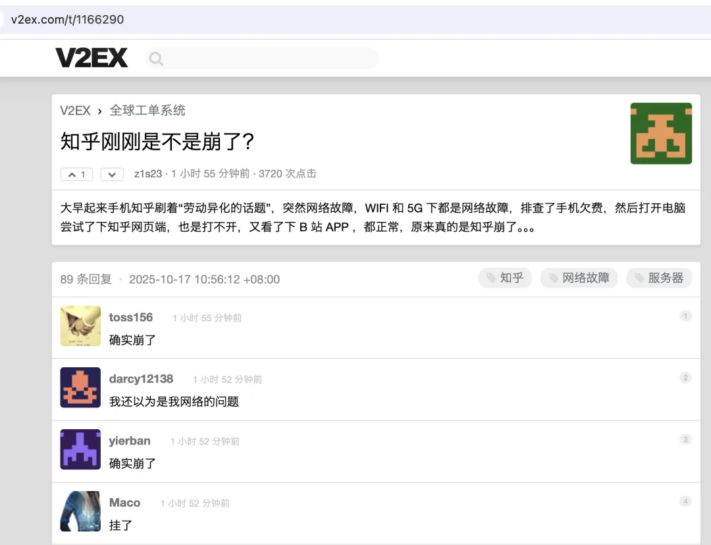
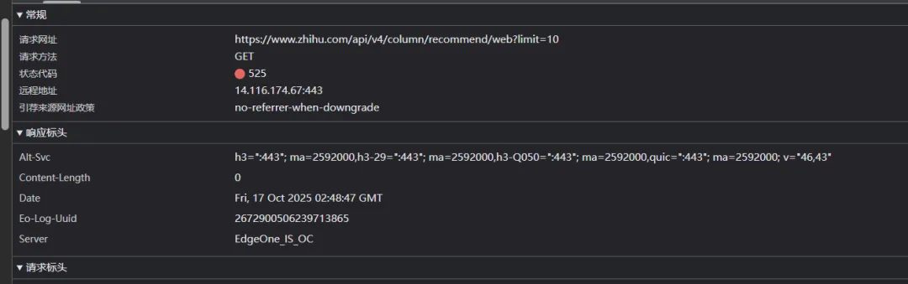
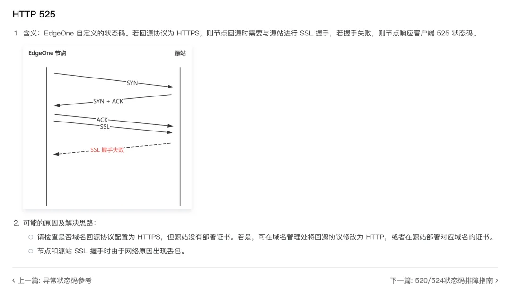
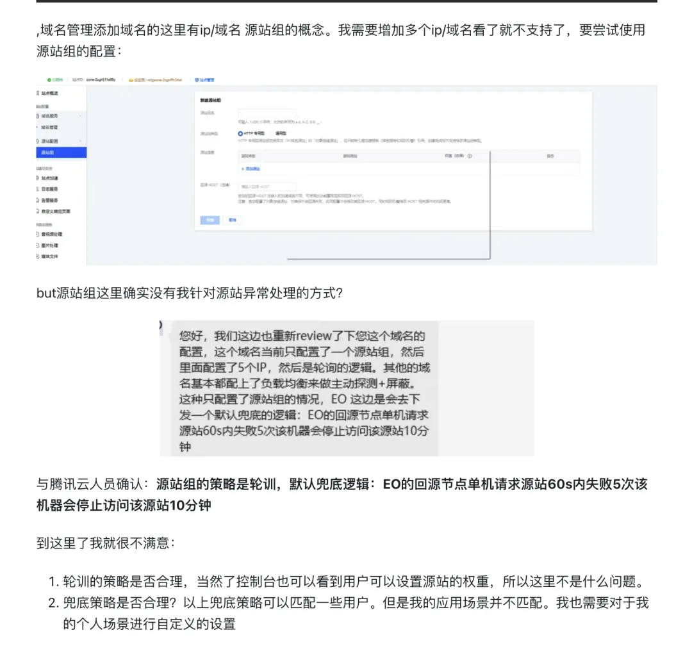
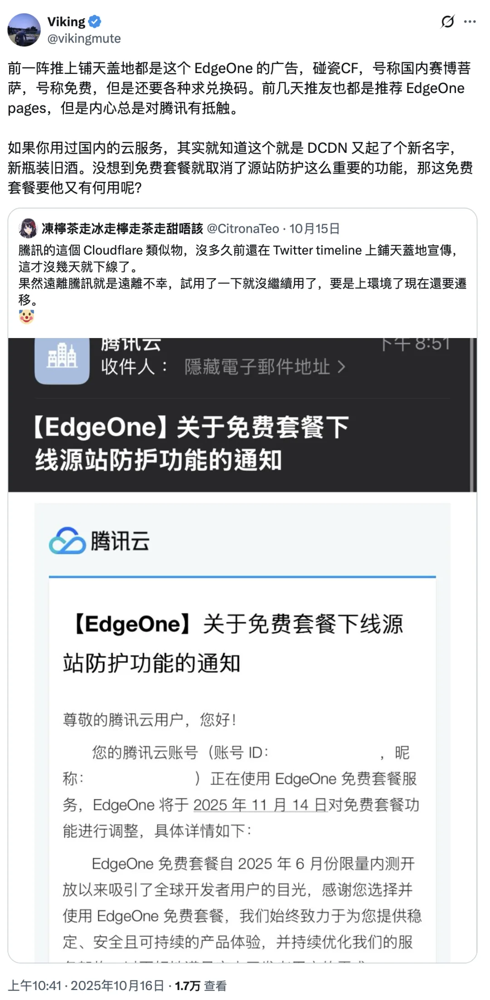

就在刚刚，知乎崩了，大量网友反馈打不开网页端。疑似因为 HTTPS 证书问题导致 CDN 回源失败。

报错信息显示，来知乎用的是腾讯 EdgeOne CDN，错误码 525。

EdgeOne 自定义 525 错误码的解释是：EdgeOne 自定义的状态码。若回源协议为 HTTPS，则节点回源时需要与源站进行 SSL 握手，若握手失败，则节点响应客户端 525 状态码。

参考来源：《EdgeOne 4XX/5XX 状态码排障指南》<https://cloud.tencent.com/document/faq/1552/112498>

如此看来，错误的原因有较大概率是知乎的源站 HTTPS 证书配置错误 / 过期，导致 CDN 回源请求失败。当然，在证书上翻车的大厂也不是一个两个了，[淘宝](https://mp.weixin.qq.com/s?__biz=MzU5ODAyNTM5Ng==&mid=2247487367&idx=1&sn=d6e4abd2b2249d27bd8b8146b591b026&scene=21#wechat_redirect)，[Apple Music](/cloud/apple-music-cert/)，[DeepSeek](/cloud/deepseek-cert-error/) 都在这上面翻过车。但我们可以预计，类似的事情还会更加频繁的继续发生。

[DeepSeek.com 网站证书错误](/cloud/deepseek-cert-error/)

[taobao.com 证书过期](https://mp.weixin.qq.com/s?__biz=MzU5ODAyNTM5Ng==&mid=2247487367&idx=1&sn=d6e4abd2b2249d27bd8b8146b591b026&scene=21#wechat_redirect)

[草台回旋镖：Apple Music 证书过期服务中断](/cloud/apple-music-cert/)

当然，另外一种可能的概率也不低，就是知乎没问题，而是腾讯云 EdgeOne 的问题。比如有用户在《2025 吐槽季第一弹——腾讯云 EO 边缘安全加速平台服务》<https://web.archive.org/web/2/https://segmentfault.com/a/1190000046137076> 中提到过，EO 有个很特别的策略：**回源节点单机请求源站 60 秒内失败 5 次，该机器会停止访问该源站 10 分钟。**

顺便一提，就在昨天 EdgeOne 下线了免费套餐 HTTP 防护套餐，被社区广泛吐槽。前一阵 EO 找了很多 KOL 鼓吹，碰瓷赛博佛祖 Cloudflare。结果现在没多久就 Rug-Pull 现原型了<https://www.lxs.net/read-blog/792874>

---

发布版本：[微信公众号](https://mp.weixin.qq.com/s/-nRq0HM56Uxn1Yc9RSdUbg)
