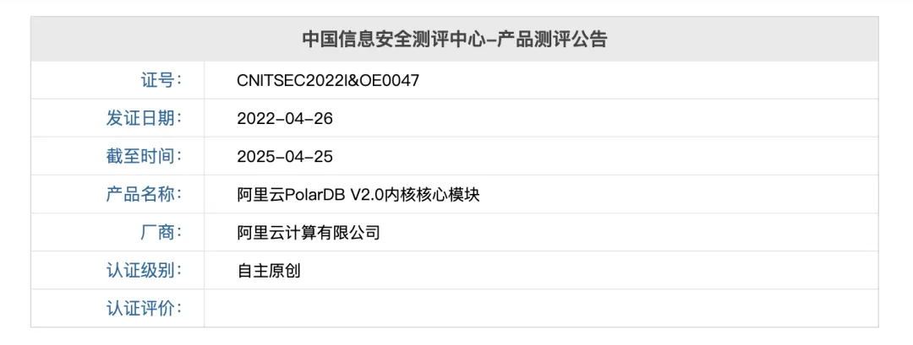

今天去机场路上，我妈妈说她上个月打车从机场回家，司机一路上都在抱怨，还偷偷绕路多收了她一倍钱。

我从机场高铁站出站，除非山穷水尽，**从来不会选择出租车**。即使这些地方通常都给网约车设置了重重障碍 —— 要比打的多绕一大圈，多折腾相当一阵儿。

我家离机场不算远，去机场打车三十块钱。早些年回宁波落地机场时，每次上出租车后跟司机说出目的地，都会有些忐忑 —— 所有的出租车司机，无一例外，轻则长吁短叹，重则破口大骂，还有直接让人下去拒载的。类似的地方还有杭州东站，首都机场。

出租车，特别是机场/车站的出租车给我留下了非常恶劣的印象。脏兮兮的车内环境，粗暴的驾驶风格。我不知道今天是不是还是这个样子 —— 但我已经不会再给它们任何机会了，我总是会选择网约车 —— 即使实际上要麻烦很多。

有一些出租车司机会在嘴臭被回怼去道歉并解释 —— “*我在机场排了两三个小时，就指望着接一个两百块大单回去，你这样的单子让我们难以接受*”。我能理解这种心情，但不能接受这种服务态度。实际上从整个出租车整体来看，这是一种自作自受：

因为出租车恶劣的服务态度与乘坐体验，大家宁可选择网约车而不是出租。这加剧了出租车的堆积：机场车站很多时候排着长长的出租队伍，要等两三个小时才能排到上客口，因为几个小时才能接到单，所以都指望接大单，接不到就态度恶劣，抱怨，嘴臭，绕路，让更多的人产生厌恶心理，最终成为一个完整的恶性循环。

---

但是为什么网约车不会这样呢？（或者说要轻微得多）我在机场/车站从来没有遇到过这样的网约车司机。更进一步讲，通过打车平台打到的出租车也不会出现这种情况。我认为关键点在于司机的**主动选择** —— 你可以根据自己的实际情况选择是不是要接单：也许你刚送客到站，只要有单不论远近都可以开心接上就走；你也可以说因为我停在这俩小时投入了沉没成本，不接到一个一百块向上的我就不动弹；甚至说你可以说我就是懒得等了，拍屁股空载回家也没人拦着你。

反而是出租车，当它们排进机场车站的队列中时，就进入了一个没有退路的状态 —— 拒载是不合法的。“根据《民法典》第八百一十条规定：*从事公共运输的承运人不得拒绝旅客、托运人通常、合理的运输要求。*”，而摇到什么样的乘客是随机看脸的 —— 出租车看似享受了机场专用快速通道的便利，但也被其束缚与限制，丧失了选择，失去了灵活性。

---

数据库行业，其实也有着与之类似的现象 —— **国产数据库**。想要造个“国产数据库”，说难也不难，拿开源的换皮套壳一下，大概百万左右就能把各种乱七八糟的 “资质”，“评测”，“证书”办下来（当然信创名录之类的东西会更麻烦） —— 这有点像出租车行业买运营牌照。

但是数据库毕竟是给人用的，而“国产数据库”作为一个整体，给开发者和用户留下的印象极其负面 —— 我接触过各行各业，非常非常多的数据库用户，目前还没有听着有几个用户用着觉得满意的。到处叫好的基本都是厂商水军，合作伙伴，软硬文号；用都没用过的云玩家；半瓶子晃荡容易被洗脑的小白。说白了，这些东西都是通过关系卖给计划市场里的苦逼用户。这里的用户体验，就和机场的出租车差不多 —— 或者说可能还要再烂一点儿。

许多在政企军工，科研院所，国央企部门的开发者与用户跟我抱怨吐苦水，说自己开源的 PostgreSQL，CentOS / Rocky 用的好好的。突然就空降来个“国产化”任务，要换成这些 “**真·关系型数据库**”。功能，性能，可靠性，包括售后服务与维保都拉垮无比。

当然，上有政策，下有对策。头铁的部门比如一些 BD 就不管这些关系户：办公 OA 弄一套“国产数据库”放着应付下检查，自己生产系统该用开源 PG 继续用。头铁而且技术还特别能打的，比如 PA 银行，就直接把自己用的 PG 包了个发行版，弄成 “国产数据库”，也不去卖，就自己用，满足这种的 “国产化合规” 需求；YC 银行，明面上好像是某 YY 领先的标杆案例，实际上该用啥用啥，底下也在包 PG 成“国产数据库”以备继续自用。这就跟机场打车一样 —— 尽管机场车站给你设了这么多弯弯绕，想让你坐出租而不是滴滴。但对用户来说， **出租车的体验太 TM 烂了，我宁可多折腾一点，也要打网约车。**

- [国产数据库到底能不能打？](/db/db-china/)
- [分布式数据库是伪需求吗？](/db/distributive-bullshit/)
- [数据库真被卡脖子了吗？](/db/db-choke/)
- [国产数据库是大炼钢铁吗？](/db/great-leap-db/)
- [基础软件到底需要什么样的自主可控？](/db/sovereign-dbos/)
- [中国对 PostgreSQL 的贡献约等于零吗？](/pg/china-pg-contribution/)
- [CentOS 7 过保了，换什么 OS 发行版更好？](/misc/centos7-eol/)
[EL 系操作系统发行版哪家强？](/db/rhel-compatibility/)

---

当然顺带一提，也不是没有其他的办法，比如 —— **PolarDB** for PostgreSQL。根据 【安全可靠测评结果公告（2023 年第 1 号）[2]】，附表三、集中式数据库：PolarDB 属于自主可控，安全可靠的国产信创数据库。（中国信息安全测评中心-产品测评公告，证书编号：CNITSEC2022I&OE0047[3]）\

最妙的是，PolarDB PG 是开源的。所以 Pigsty 提供了对 [**PolarDB PG 的完整监控支持**](/pigsty/monitor-existing-pg/)，以及使用 Docker 进行部署的能力，可以帮助客户快速拉起一个“国产数据库”稻草人，无论是应付检查，还是作为立项采购的名头，都非常好用！而且相对于其他那些过时落后魔改的亲妈都不认识的 PG 杂交水稻，PolarDB 的含 P 量很高，所以如果想用，真的是可以拿来当成一个 PG 11 用起来的。

最后透露个消息：A 云找我们对接合作，后续可能会推出一个使用 PG 15 的 PolarDB 内核版本，跑在 EL 系操作系统上，嵌入 Pigsty 中，在监控的基础上纳入原生管控，让用户可以堂堂正正名正言顺的用起来。

---

发布版本：[微信公众号](https://mp.weixin.qq.com/s/uccjOkAR1zgur6tftHkzMg)
