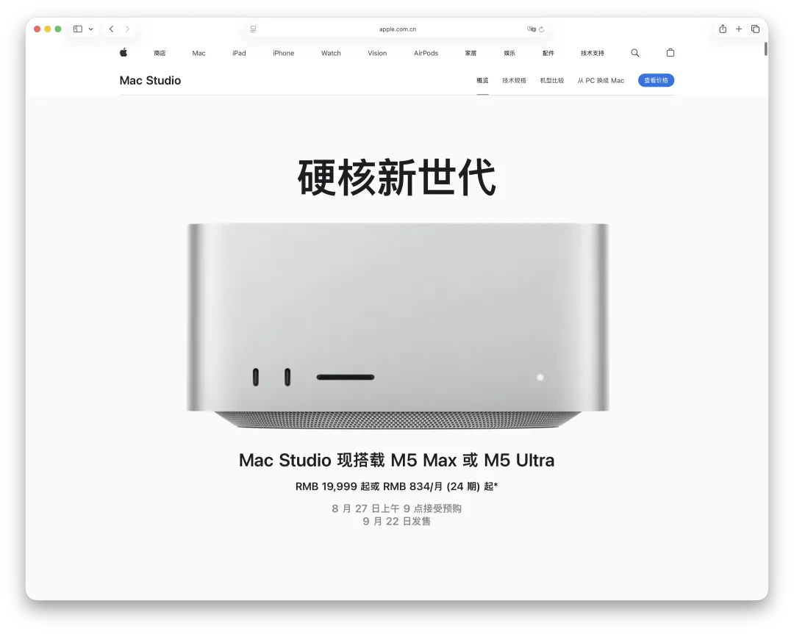
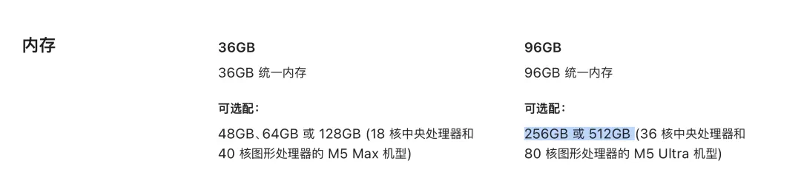
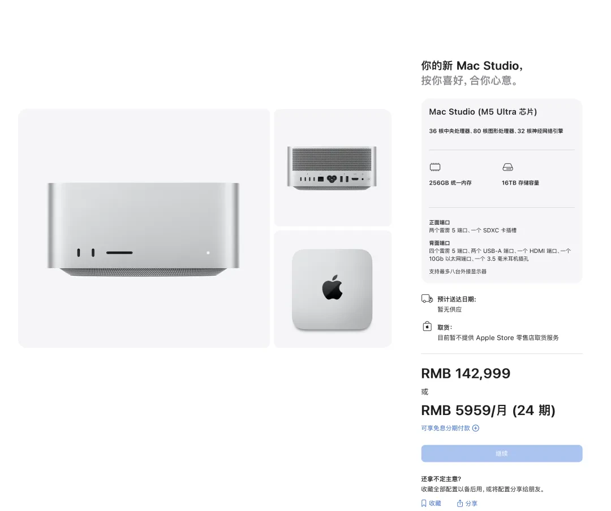
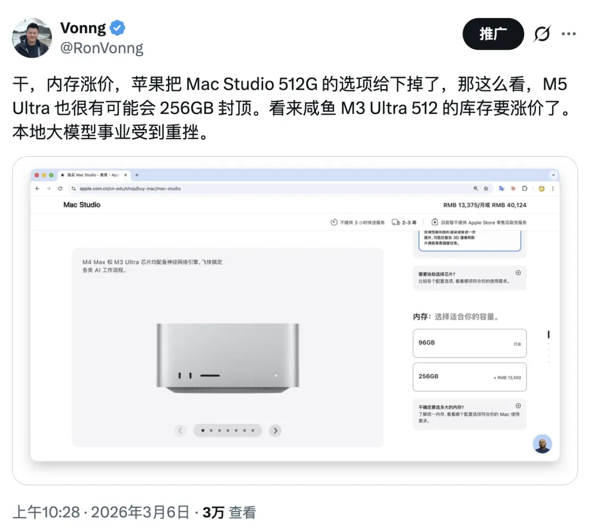
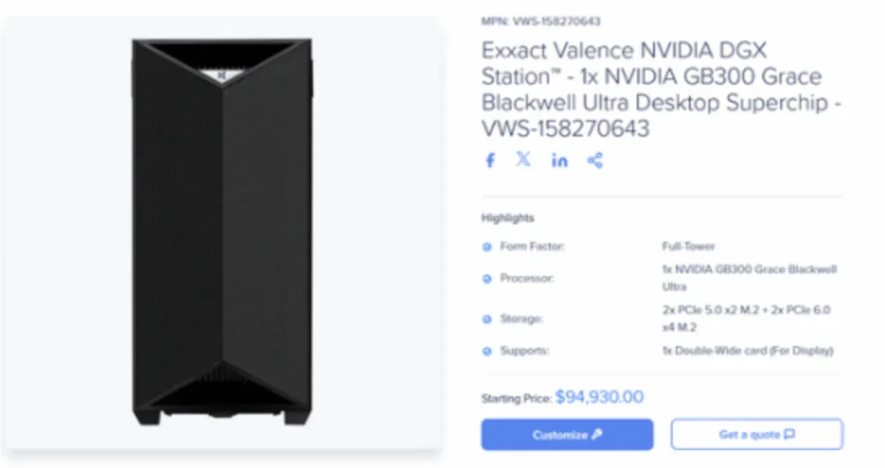
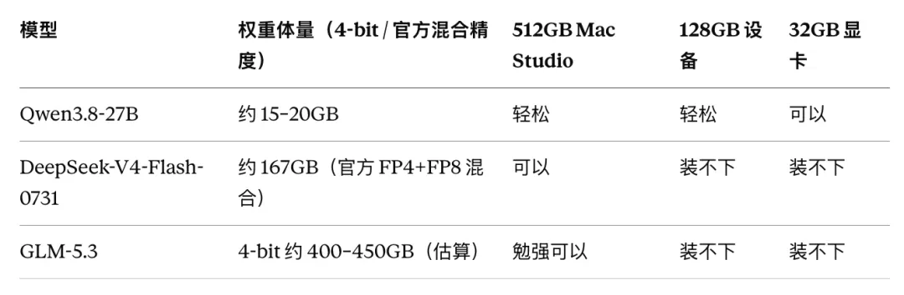
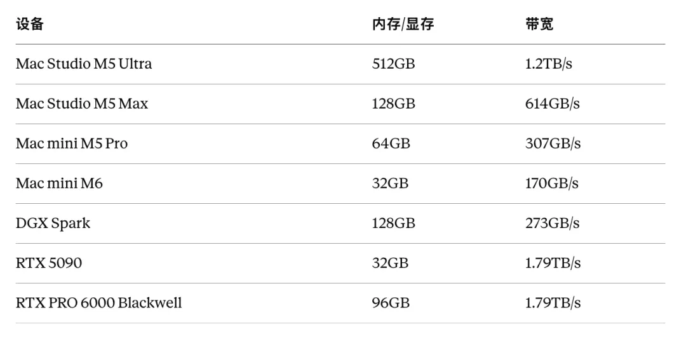
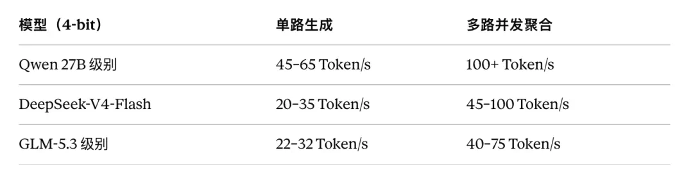
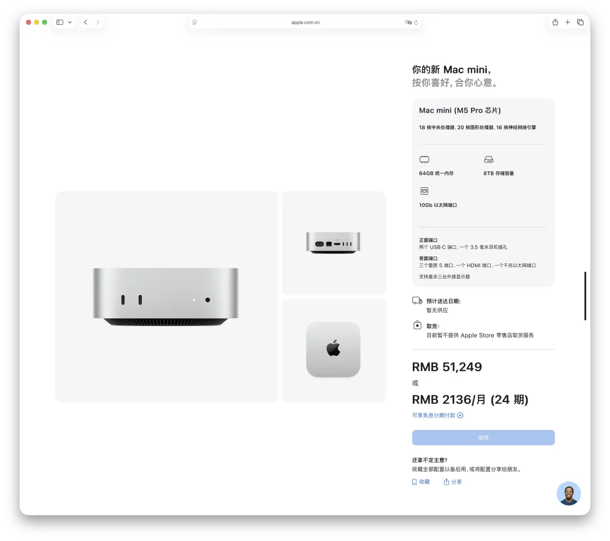

> [微信公众号原文](https://mp.weixin.qq.com/s/iIzW0B-FSO0Fi5eYQsyeCw)

今天没有发布会，没有提前预热，甚至连一点像样的传闻都没有。

苹果官网啪的一下，直接把新款 Mac mini 和 Mac Studio 上线了：Mac mini 更新到 M6 和 M5 Pro，Mac Studio 换上 M5 Max 和 M5 Ultra。

老冯一直非常关注本地自建 AI，尤其是 Mac Studio 这种大容量统一内存设备。我几乎从去年开始，每个星期都要搜一搜，看 M5 Ultra 到底什么时候出来。

结果一直没等到消息，今天它突然就来了。

而且最关键的是：**512 GB 统一内存版本回来了。看到这里，老冯年初花六万块买的[顶配 M5 Max MacBook Pro](https://mp.weixin.qq.com/s?__biz=MzU5ODAyNTM5Ng==&mid=2247491450&idx=1&sn=a2fd37dc58543aa1c333a7bd04066daf&scene=21#wechat_redirect)，顿时就不香了。**

当然，不香归不香，该买还是得买——MacBook Pro 毕竟是一台能随身带走的 128 GB 移动工作站，和桌上那个铝盒子不是一回事。但如果你真正想做的是在本地跑大模型，那么新款 Mac Studio 的 512 GB 版本，几乎就是这一代唯一值得认真考虑的机器。

目前能看到 256 GB / 16 TB 版本的价格是 14.3 万元。根据定价规律，512 GB / 16 TB 估计还要再加 5 万～6 万元，也就是顶配总价接近 20 万元；即使选磁盘小一些的 512 GB / 2 TB 版本，估计也要 14 万～15 万元。确实不便宜。

---

## 一、512 GB 为什么这么重要

上一代 M3 Ultra 的 512 GB 机型停售之后，市场上出现过一段非常离谱的行情。原本不到十万元的机器，渠道报价一路被抬到十五万、十八万，据说还有喊到二十万的。

有人愿意追，不是因为它叫 Mac，也不是因为苹果标好看，而是因为它卡住了一个非常特殊的空位：**它可能是普通人能够正常购买、正常开票的、最便宜的大容量本地 AI 一体机**。

贵和便宜是相对的。你要是跟 9.5 万美元（约 64 万元人民币）的 GB300 Station 比，那就太便宜了。

今天消费级显卡最大的问题，往往不是算力不够，而是显存不够。

RTX 5090 只有 32 GB，RTX PRO 6000 Blackwell 是 96 GB，DGX Spark 是 128 GB。它们跑一个 27B 模型毫无压力，但一遇到 DeepSeek-V4-Flash、GLM 这种数百 B 参数的 MoE，容量马上就撞墙。

Mac Studio 的 512 GB 统一内存，CPU 和 GPU 可以同时访问。它当然不等于 512 GB 的 HBM 显存，速度也远远比不上真正的高端 NVIDIA 系统，但它避免了把海量权重在显存和系统内存之间来回搬运。

**它先解决的不是“跑得多快”，而是“到底装不装得下”。**

### 几个模型的实际体量

最后这个数字是关键。

400～450 GB 的模型塞进 512 GB，余量确实不算宽裕，但**至少存在一条正常的单机运行路径**。换成消费级 NVIDIA 显卡，你就得开始考虑多卡、CPU 卸载、主机内存、NUMA、PCIe 拓扑、分布式框架——为了跑一个模型，专门去攒一台支持多卡、有足够 PCIe 通道和高带宽服务器内存的机器，这件事本身就相当麻烦。

显卡只是第一笔钱。机箱、电源、主板、服务器 CPU、散热、噪声、供电、系统调试，后面一个都跑不掉。Mac Studio 的价值，就是把这一整套麻烦塞进一个二十厘米见方、可以直接摆在办公桌上的铝盒子里。插上电就能用。

---

## 二、容量是一回事，速度是另一回事

512 GB 并不意味着它就比 RTX 5090 快。得把两个阶段分开看。

**第一个阶段是 prefill**，读取和理解整段提示词。这一阶段吃的是算力、矩阵运算效率和软件优化。

**第二个阶段是 decode**，一个 token 接一个 token 地往外吐。这一阶段主要受内存带宽限制——每生成一个 token，都要把相关权重重新读一遍。

新款 M5 Ultra 的统一内存带宽做到了 **1.2 TB/s**，比上一代提升 50%。这才是它除了容量之外，真正跟本地 AI 相关的核心升级。

### 几台候选设备的底牌

看这张表你就明白了：RTX 5090 的带宽比 M5 Ultra 还高一半，但它只有 32 GB。**带宽决定单 token 多快，容量决定能不能跑。**

### 保守估算

根据模型结构、权重大小、内存带宽，以及上一代设备的实测数据，做一个保守推算：

**这些数字不是实测。新机器还没交付，MLX、llama.cpp 这些框架也需要时间适配新的 GPU 和 Neural Accelerator。量化方法、上下文长度、提示词缓存、并发数、推理引擎，每一项都会让最终结果产生巨大差异。**

顺便说一句：苹果官网给的是“LM Studio 提示词处理速度提升 4 倍”这类**相对倍数**，但从数量级上讲，结论已经足够清楚：这台机器不只是能把大模型加载起来，而是有可能把它们跑到真正可用的程度。

每秒几十个 token，已经明显快过普通人的阅读速度。多路并发达到每秒 50～100 个 token，意味着它可以同时撑住几个编码 Agent、检索 Agent、文档分析任务和后台自动化流程。这才是本地 AI 具备生产力意义的门槛。

苹果这次还特意提到，多台 Mac Studio 可以通过 Thunderbolt 5 + RDMA 组成共享内存池，四台集群的分布式推理比单机快 3 倍。

---

## 三、一个容易被忽略的升级：PCIe 6.0 SSD

新款 Mac Studio 的内置 SSD 换成了基于 **PCIe Gen 6** 的新架构，苹果官方口径是“存储性能最高达到上一代的两倍”。**30 GB/s 是 PCIe 6.0 ×4 的链路理论带宽。**

不过实际怎么样，第三方实测出来之前，谁的数字都只是推测。

### 那这个升级到底有什么用

**模型加载完成之后，SSD 不参与稳定生成阶段。** decode 每一步读的是那 1.2 TB/s 的统一内存，13 GB/s 的盘速跟它差了近百倍，一点关系都没有。

SSD 真正影响的是：模型加载、模型切换、冷启动、缓存、数据预处理、大规模本地数据分析。

举个具体的例子：一个 400 GB 的模型冷加载，按 13 GB/s 算大约半分钟，按上代 6.5 GB/s 算要一分钟。频繁切换模型的人，对这个差别会有明显感知。

### 而且，你自己想配一套 PCIe 6.0 是真的麻烦

**2026 年了，消费级 PC 平台基本还停在 PCIe 5.0 甚至 4.0。** PCIe 6.0 主要在服务器和 AI 平台上刚刚起步。你想自己攒一台跑 Gen 6 的机器，得让 CPU 平台、主板、SSD 控制器全部对齐——先不说钱，光是选型、兼容性验证、固件折腾，就够你喝一壶。

苹果直接把这套东西焊进盒子里给你了。开箱插电，它就是这个速度。

**但也正因为焊死了**：Mac 的 SSD 不可更换、不可升级。而且 Apple Silicon 的存储在 I/O Registry 里一直显示为“Apple Fabric”而非标准 PCIe，所以“PCIe Gen 6”更像是一种**代际等效描述**，不是说你能插一块标准 Gen 6 NVMe 上去。

顶配可以配到 16 TB SSD，再加 512 GB 统一内存。如果实测真能到 12～14 GB/s，那么加载几百 GB 的模型、扫描大型 Parquet 数据集、构建向量索引，都会变得非常快。

说句半开玩笑的话——很多搞数据仓库的朋友看到这套配置，可能都要汗颜。

现实中，不少公司的核心分析数据确实可以直接装进这台机器的内存。配上 DuckDB、PostgreSQL、Parquet 和本地对象存储，大量原本要靠小集群跑的离线分析，一台盒子就能吃下。

当然，它替代不了真正的数据仓库：高可用、并发、权限治理、灾备、横向扩展，那是另一回事。但作为单机分析工作站，这个性能确实已经到了“禽兽”级别。

（老冯甚至冒出一个念头：要不要搞一个基于 macOS 的 Pigsty 一体机？把数据库、Agent、AI 全打包成开箱即用的发行版。）

---

## 四、但如果只是为了“Token 自由”，未必值得买

说句实话，如果你的目的只是省订阅费，我反而不太建议买顶配 Mac Studio。

老冯手头现在有十个每月 200 美元的 AI 订阅，加起来一个月 2,000 美元，一万多元人民币。按这个花法，一台十几万元的顶配 Mac Studio，差不多够我畅快用一年云端模型。

而且云端给你的是随时更新的头部闭源模型。新的推理模型、编程模型、多模态模型不断上线，接下来还有 Astra 这类新东西要继续卷。两天前刚重置完，结果就在刚刚又重置了。

本地开源模型在绝对智能水平、工具生态和多模态能力上，未必能一直追得上。你还要自己承担模型下载、量化、框架适配、故障处理、版本升级和硬件折旧。

所以，如果你的需求就是聊天、写代码、查资料，或者你想用最强的模型把活干完——**继续用 AI 订阅服务，通常更省心也更划算。**

买这台机器，你真正买到的并不是便宜 token。

你买到的是**一块完全属于自己的计算领地。**

---

## 五、真正的关键词是“数据主权”

如果你处理的是普通公开信息，扔给云端模型没什么大不了。

但如果你手上是律师案卷、医院病历、金融数据、未公开的源代码、芯片设计、商业机密、内部邮件，或者受 NDA 约束的客户资料——情况就完全不同了。

对这些场景来说，**数据能不能离开本地，往往比模型是不是排行榜第一更重要。**

512 GB Mac Studio 意味着，你可以把模型、向量数据库、业务数据库、文档和 Agent 工作流全部放在自己的设备里。整个推理过程断网也能跑，原始数据不需要交给任何第三方。

当然，本地运行不等于自动合规。磁盘加密、账户权限、审计日志、备份、模型许可证、数据生命周期，这些仍然要你自己处理。

但至少在技术上，你终于能真正控制数据去了哪里、被谁访问、保留多久。

这也是为什么我认为，这台机器对法律、医疗、科研、金融、制造和涉密开发团队的价值，远远高于普通个人用户。

---

## 六、它和 DGX Station 不是同一种产品

英伟达最新的 DGX Station 用的是 Blackwell Ultra（GB300），配 HBM3e，加上 Grace CPU 侧的 LPDDR5X，总计接近 800 GB 的分层一致性内存。单看 AI 算力和 HBM 带宽，它当然比 Mac Studio 强得多。

但它也是一台接近十万美元的专业设备——按现在的汇率，六十多万元人民币，够买五六台顶配 Mac Studio。

对国内用户来说，采购渠道、出口合规、发票、保修、售后，每一环都可能变得相当复杂。灰色渠道当然能买到硬件，但一家需要正规采购和长期运维的企业，未必敢用。

**Mac Studio 的优势不是在每项性能指标上赢过 DGX Station，而是你可以通过正常零售渠道买到，有正规发票、保修和售后，拿回去插上电就能用。**

它当然也不是数据中心服务器。没有冗余电源，没有远程管理，没有完整的企业级运维能力。如果你需要严格 SLA、大规模多租户服务或者机房集群，还是老老实实上正规 NVIDIA 服务器。

但作为一台放在办公室、实验室或者家里的个人 AI 工作站，它几乎没有直接对手。

---

## 七、顺带说说新 Mac mini

M6 Mac mini 最高只有 32 GB 统一内存、170 GB/s 带宽，它不是用来跑超大模型的。

但对 7B、14B，以及部分量化模型，它仍然是一台体积小、功耗低的本地 Agent 主机。

真正值得本地 AI 用户关注的，其实是 **M5 Pro 版本**：最高 64 GB 统一内存、307 GB/s 带宽，还带 Thunderbolt 5。

它跑不了完整的 DeepSeek-V4，更别说 GLM 这种数百 B 的模型，但跑 Qwen 27B 级别的量化模型已经相当实用。拿来做家庭 AI 服务、代码 Agent、知识库、语音处理，或者当一个常驻的自动化节点，很可能是这一代性价比最高的小机器。

---

## 最后

512 GB 顶配版本要到**十月底**才正式供应。

如果香港那边的价格和供货合适，老冯大概率会去买一台。当然，在付款之前，我还要看三样东西：**最终售价、MLX 等框架的适配情况、第三方的稳定推理实测。**

如果表现符合预期，我认为这会是一台能用很多年的机器。

它未必能给你最便宜的 token，也未必跑得赢真正的 NVIDIA AI 服务器。但它让个人和小团队第一次可以用一台**正常购买、正常开票、正常摆在桌面上**的设备，运行数百 GB 的前沿开源模型。

十几万元说贵当然贵，顶得上一辆小汽车了。

但换个角度看——一辆小汽车，并不能让你在办公室里拥有一个完全私有、可以 7×24 小时运行的本地 AI 集群。

至于它会不会卖断货、能不能一路撑到 2028 年，以及那时候苹果会不会真的端出 1.5 TB 统一内存的 M7 Ultra——

那就是另一个许愿池里的故事了。
