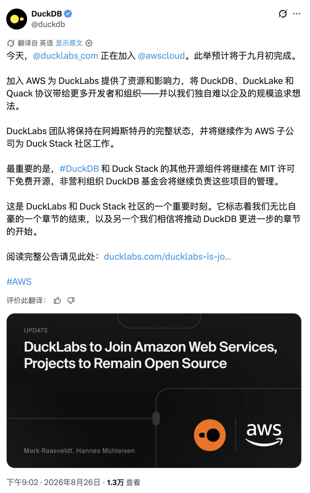
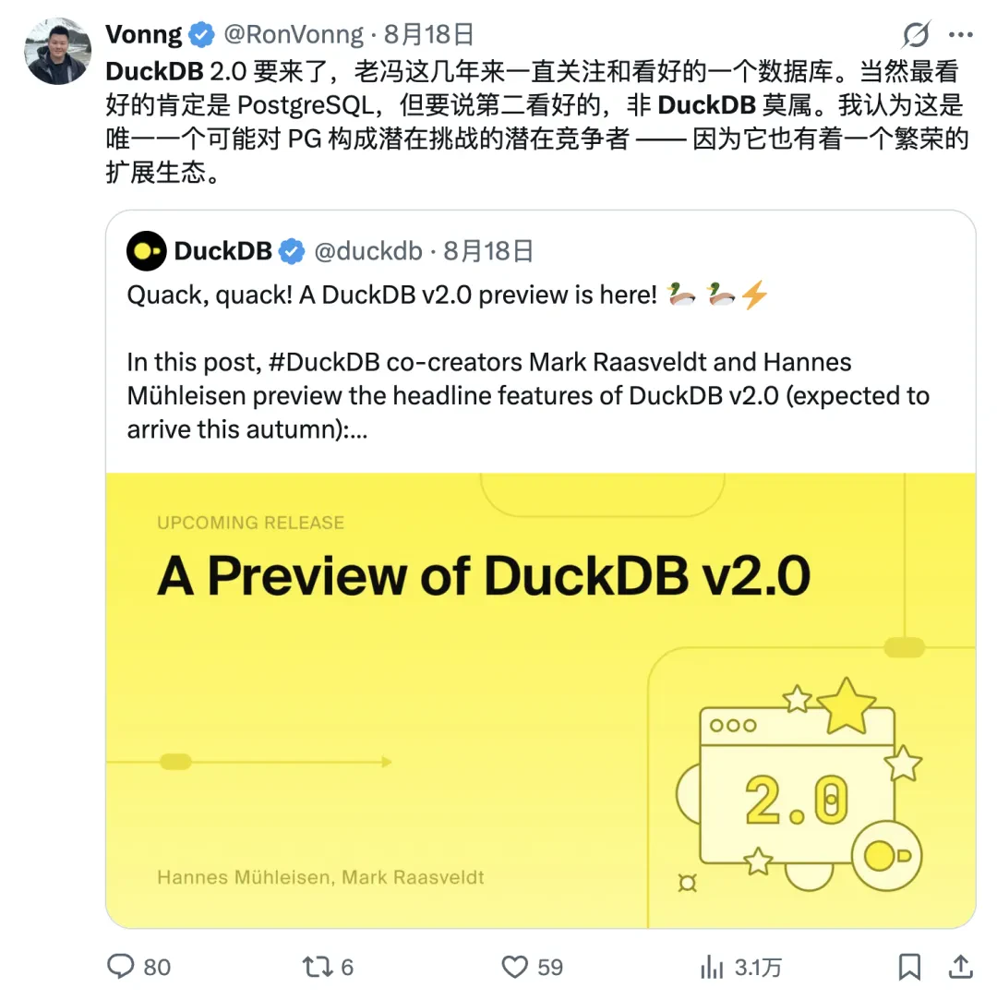
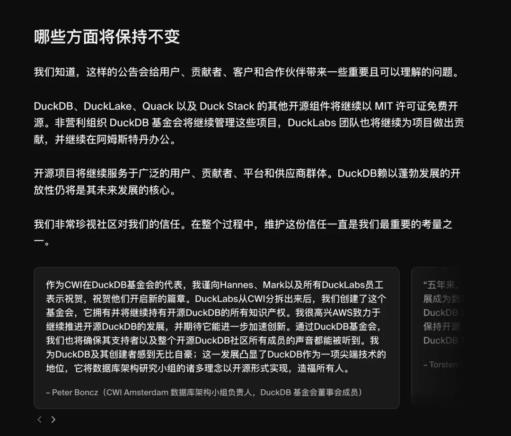
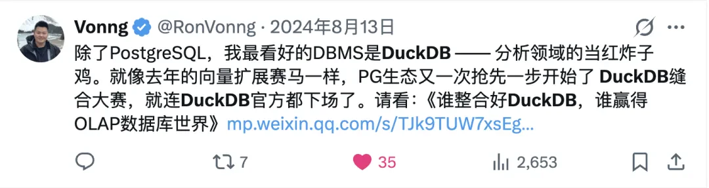
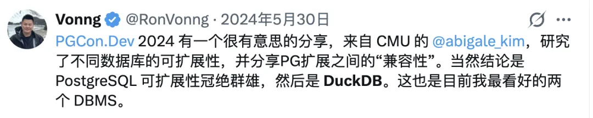
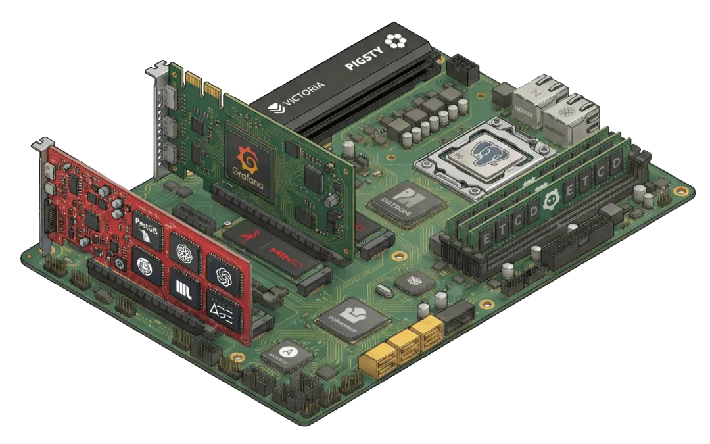

> [Original on WeChat](https://mp.weixin.qq.com/s/xaXQvJMFfZ1tpPMd6vFaxA) | August 26, 2026

On August 26, Amazon made it official: AWS has signed a definitive agreement to acquire DuckLabs, the company behind DuckDB. The deal is expected to close in early September; the price was not disclosed. The team will remain in Amsterdam, while DuckDB, DuckLake, and Quack will stay open source under the MIT license and be governed by the independent DuckDB Foundation.

One sentence in the announcement was particularly well crafted: “We are not acquiring the DuckDB open-source project.” That is true. It is also the entire trick behind the deal: **the project stays with the foundation; the people become ours.**

First, some background. DuckLabs is an academic spin-off from CWI, the Dutch national research institute for mathematics and computer science in Amsterdam. Hannes Mühleisen and Mark Raasveldt began building DuckDB at CWI in 2018, then founded the company around it.

DuckLabs has roughly 30 people, no VC funding, and no shareholders beyond its founders and employees. Support and development contracts paid the bills: a classic small European shop. Yet this tiny outfit built an analytical database now downloaded more than three million times a day and ran circles around competitors that had raised hundreds of millions of dollars. AWS has now bought the whole operation.

## The Timing

The most revealing part of this acquisition is its timeline. On August 17, DuckDB published a preview of version 2.0, introducing the new Quack client protocol and concurrent reads and writes across multiple processes. Nine days later, on August 26, AWS announced the acquisition.

Those nine days say more than the announcement itself. Until now, DuckDB has been an in-process embedded library: wonderfully useful, but not something you could directly package and sell. Add a client protocol and it is no longer just a library. It becomes a server that can be hosted, metered, and dropped into a cloud console.

Embedded DuckDB is a developer tool. DuckDB with a protocol is a money printer for cloud vendors. AWS chose to move just as the duck grew wings. You may call that a coincidence; I do not.

Hannes put his cards on the table as well: AWS brings the scale and reach to put this technology in front of more users, including people who ultimately depend on the Duck Stack but do not need to operate a database themselves.

That last clause is a product announcement in disguise. So here is a prediction that may age badly: at re:Invent this December, we will probably see a managed service built on DuckDB. It may take the form of a native query engine for S3, or it may simply be called Amazon DuckDB or Amazon Quack.

## This Is an S3 Deal, Not a Redshift Deal

Another easy-to-miss detail is who spoke for AWS: Andy Warfield, an AWS vice president and Distinguished Engineer who leads S3. He said the two sides had worked closely for two years, integrating DuckDB into S3 Tables and SageMaker Lakehouse, and described DuckDB as widely used and loved by S3 customers.

The buyer here is not the Redshift team. It is the S3 team, and that distinction matters. Amazon's own data warehouse products, Redshift and Athena, are frankly underwhelming. AWS's wording already points to the intended direction: acquiring DuckLabs will make AWS analytics “faster, simpler, and more cost-effective.” The implied comparison is obvious.

Cloud data infrastructure has spent the past few years migrating onto object storage. Every imaginable flavor of “XXX over S3” has appeared. I covered the long-running feud between filesystems and databases in [“DB vs. FS: 50 Years of Love and War”](https://mp.weixin.qq.com/s?__biz=MzU5ODAyNTM5Ng==&mid=2247492480&idx=1&sn=0206fb23192ae5f7aff0d24f0a1782b8&scene=21#wechat_redirect). S3 has not been idle either. First it embedded an Iceberg catalog directly into the storage service as S3 Tables. Now it has acquired the entire team behind the query engine that reads object storage better than anything else on the planet. Object storage is growing compute capabilities, while query engines are becoming storage accessories.

The competitive map makes the logic even clearer. Databricks has Delta and Unity Catalog. Snowflake has Polaris. AWS now has S3 Tables + DuckDB + DuckLake. All three sides are fully armed for the lakehouse war.

## Buy the People, Not the Project

Zoom out, and this deal is only the latest in a much larger sequence.

MySQL's people and project were sold together to Sun for $1 billion, then Oracle swallowed the lot. That was the old model, and the community remains wary because of it. Citus's 2019 sale to Microsoft was an intermediate form. Rockset sold to OpenAI the year before last; last year, Neon went to Databricks for $1 billion and Crunchy Data went to Snowflake. Add the recent sales of pg_mooncake and ElectricSQL, and the pattern is obvious: platform companies are absorbing database-engine talent wholesale.

AWS has chosen the most polished version of this maneuver. Remember when Elastic changed its license and accused AWS of “strip mining”? AWS was forced to fork OpenSearch and later donated it to the Linux Foundation. It took the criticism and learned its lesson. This time, the script is airtight: the project is untouched; it stays with the foundation; the charter guarantees the MIT license forever; AWS merely hires every core developer. That closes off accusations of swallowing an open-source project while still putting the roadmap firmly in AWS's hands. Last decade, cloud vendors strip-mined open source. This decade, they buy upstream and put it on the payroll.

To be fair, this is a respectable outcome for DuckLabs. As early as 2022, the company acknowledged that a business based on consulting and support contracts could not scale. The promises accompanying this announcement are meaningful improvements: a larger role for the foundation, an advisory council for commercial users, opening extension signing so third-party organizations can publish extensions, and—in DuckLabs' own words—the removal of commercial pressure to convert free users into paying support customers.

Put plainly, DuckLabs once had to sell support to survive. With Amazon paying the salaries, it can afford to open the ecosystem further. The arrangement resembles SQLite's consortium-backed model, with one critical difference: SQLite has a consortium of patrons, while DuckDB will now have only one. That single patron is the real problem.

## One Belongs to the World; One Belongs to Amazon

I have argued before that the data world is converging on a few default answers. The default database is PostgreSQL. The default object store is S3. And the default analytical engine will be DuckDB. By making this acquisition, AWS has validated my third claim with real money.

Unfortunately, DuckDB once looked like an example of a project that no single entity could dictate terms to. As of today, half of that symmetry is gone. The project still belongs to the foundation, and the MIT license is indeed permanent. But nearly every core developer now draws a salary from the same company—the world's largest cloud provider.

PostgreSQL's resilience comes precisely from the diversity of its core contributors' employers: EDB, Microsoft, AWS, Fujitsu, NTT, Crunchy Data, and many more. Nobody commands a majority. Nobody can dictate terms. If one company tries to smuggle in a private agenda, plenty of people in the community will bang the table. For now, DuckDB has lost that quality. The foundation remains, but everyone seated around its table wears a badge with the same logo.

The sky is not falling. The MIT license remains, and if things ever go wrong, the community still holds the ultimate weapon: a fork. Redis changed its license, and Valkey sprang up immediately afterward. We do not have to look far for precedent. But a structural risk that used to be zero is now nonzero, and DuckDB users should account for it.

The three defaults now stand like this: PostgreSQL belongs to the world; S3 belongs to Amazon; DuckDB hangs between them, but increasingly looks as though it will belong to Amazon too.

## MotherDuck Has the Most to Worry About

There is another duck in this deal, and its position suddenly looks awkward: MotherDuck.

For readers who do not know the company, MotherDuck is a VC-backed startup that has raised roughly $100 million. Its founder, Jordan Tigani, is a BigQuery veteran. Its business is essentially “DuckDB in the cloud,” running on AWS infrastructure. The official DuckDB FAQ spells out two connections: MotherDuck has a development-services agreement with DuckLabs, and DuckLabs owns equity in MotherDuck.

Once AWS acquires DuckLabs, AWS indirectly becomes a MotherDuck shareholder. The contractor that develops MotherDuck's core engine becomes a wholly owned AWS subsidiary. And the product MotherDuck sells is exactly what AWS is most likely to start selling itself. Client, vendor, shareholder, and landlord are now all members of the same family.

In an extra twist, just a day or two before the announcement, MotherDuck acquired Tower, a small infrastructure company that supports its data-pipeline features, to strengthen its own engineering team.

## The Duck Pattern: Metadata in PostgreSQL, Data in S3

Enough about capital. Back to the technology. What exactly did AWS want? I think the answer has two layers.

The first is an architectural pattern. DuckLake's design can be reduced to one sentence: metadata goes into PostgreSQL; data goes into object storage as Parquet on S3; compute runs in stateless, disposable DuckDB instances. This is not merely another table format. It is an attempt to replace the entire “Iceberg + vendor-specific catalog” stack. Metadata is relational by nature, so putting it in a relational database is the obvious choice. Why use a pile of JSON files in object storage to imitate a bad database?

Crunchy Data, recently acquired by Snowflake, is pursuing almost the same idea with pg_lake. The difference is that pg_lake does it inside PostgreSQL and inherits PostgreSQL's permission model, rather than leaving you to assemble one yourself as DuckLake does.

Data in object storage, metadata in PostgreSQL: this pattern is becoming the default architecture for a new generation of data systems. You do not have to look far. A friend of mine, Jiang, has recently built four database systems. Whether it is a graph database or a message queue, every one uses this architecture. This is no coincidence. It is a paradigm. Now that the people who originated it are joining AWS, the pattern will spread even faster as an industry standard.

The second is the era itself. DuckDB gets more than three million downloads a day. Do you really think there are three million data analysts behind them? A substantial share comes from AI agents. Zero configuration, one binary, in-process execution, and disposable by design: DuckDB is the instinctive choice when an agent needs to work with data. DeepSeek's smallpond, which pairs DuckDB with 3FS for distributed analytics, is a ready-made example. AWS is buying more than an OLAP engine. It is buying the default way agents process data.

## Epilogue

When I integrated DuckDB into Pigsty a few years ago, it was still a niche toy for database geeks. I argued early on that DuckDB was the most promising database after PostgreSQL. Before the words had left my mouth, AWS cast the same vote with its checkbook.

The next act is easy to predict. AWS will put a managed Duck Stack on the market. Hannes has already written the pitch: let users depend on the Duck Stack without having to operate a database themselves.

The mirror image of that product is a self-hosted Duck Stack: PostgreSQL for metadata, object storage such as MinIO, Silo, or RustFS for data, and DuckDB for compute. The entire stack is open source, and you need not pay Bezos a cent in subscription fees. As it happens, Pigsty already includes all three pieces.

With one command on your own Linux servers, you can deploy a production-grade, highly available PostgreSQL cluster; a production-grade Silo or MinIO object-storage cluster, with RustFS support coming in the next release; and the complete DuckDB and PG DuckDB extension stack, ready to use.

Amazon has already educated the market on everyone else's behalf. What remains is a choice: entrust your data assets to the rainforest, or keep them in your own hands.

It took 30 years for the data world to converge on three default answers. It takes only one signed agreement for one of them to change hands. May the duck fly high in the rainforest—and when it lands, may it still remember the way back to the foundation.

---

**References**

1. [AWS to acquire DuckLabs (official Amazon announcement)](https://www.aboutamazon.com/news/company-news/aws-ducklabs)
2. [Techzine: Developer DuckDB to be acquired by AWS](https://www.techzine.eu/news/analytics/143855/developer-duckdb-to-be-acquired-by-aws/)
3. [SiliconANGLE: AWS buys DuckLabs](https://siliconangle.com/2026/08/26/aws-buys-ducklabs-to-bring-duckdbs-embeddable-analytics-to-more-enterprises/)
4. [DuckDB FAQ (the relationship between DuckLabs and MotherDuck)](https://duckdb.org/faq)
5. [DuckLabs' 2022 announcement of its MotherDuck partnership](https://ducklabs.com/news/2022/11/15/motherduck-partnership)
6. [The New Stack: MotherDuck acquires Tower](https://thenewstack.io/motherduck-tower-acquisition-python/)
