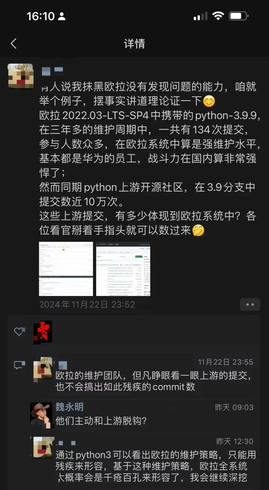
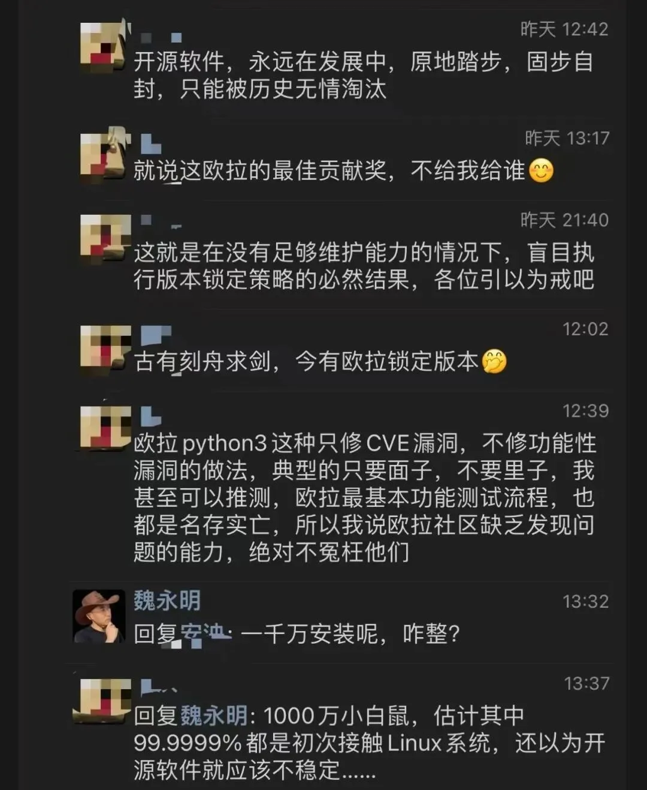

> 原作者：魏永明

[国产数据库到底能不能打？](/db/db-china/)

[国产数据库是大炼钢铁吗？](/db/great-leap-db/)

[中国对 PostgreSQL 的贡献约等于零吗？](/pg/china-pg-contribution/)

[机场出租车恶性循环与国产数据库怪圈](/db/airport-taxi-db/)

[EL 系操作系统发行版哪家强？](/db/rhel-compatibility/)

[基础软件到底需要什么样的自主可控？](/db/sovereign-dbos/)

[分布式数据库是伪需求吗？](/db/distributive-bullshit/)

近几日，几个国产操作系统厂商/社区发起了一个倡议《开源生态发展合作倡议》。倡议的内容不多，共三条，除了第一条之外，其他两条算是口号，不提也罢。但从第一条所述内容看来，笔者隐隐感觉到了一丝不安：

> 一是推动操作系统内核等关键共性技术链统一，同时尊重并维护各社区的原创性和独立发展，共同塑造核心统一、中立开放、个性独立的开源社区版本。
>
> 鸥栖 OpenCloudOS，公众号：OpenCloudOS[开源生态发展合作倡议](https://mp.weixin.qq.com/s/ncAJW544odIiujSAga9Hjw)

这里提到的操作系统内核等关键共性技术链，主要指的是 Linux 内核的版本。Linux 内核发展三十多年来，已经非常复杂，主线和其他分支并立。某个 Linux 发行版一般会选择一个稳定的 Linux 内核作为其长期支持版本的基础，并在一个支持周期内不会做大的内核升级。之后，在新一轮的长期支持版本中更新到较新的 Linux 内核版本。\

该倡议提出这一条的原因——尽管倡议书中并没有提及——但也很容易窥见：几大国产操作系统厂商/社区各家采纳的 Linux 内核版本相差甚远，这导致各自做了大量的国产芯片、国产设备驱动程序相关的修补工作，而这些修补工作，工作内容上大同小异，却又不能共享，从而导致了大量人力资源的浪费。\

作为局外人，我纳闷的是，为何现在才提出这个倡议？其实五年前我就听业内人士谈到过这个担忧，似乎也有人奔走呼号，但终究还是走到了亡羊补牢的这个境地。\

每每提到开源，大家强调最多的必然是协作。然而协作有一个重要的前提：一个公认的老大哥。否则，协作难成——没有老大哥，谁也不服谁。

就比如国内的这些国产操作系统也好，或者国产 Linux 发行版也罢，没一个具有可以比肩 Linus（个人）、Debian（社区）、RedHat（企业）的江湖地位。于是，号召协作背后的潜台词便成了：我的系统已经基本成熟，但还有些脏活累活没人干，咱协作起来，脏活累活你来干。其他人心里自然嘀咕：都一样是泥腿子出身，凭什么脏活累活我来干？为什么不是我叉着腰指手画脚你来干？

所以呢，五年前的奔走呼号并不能带来什么改变。现在联合起来又发倡议，自然是因为知道痛了，想亡羊补牢了，但协作的前提仍然不存在：没有老大哥，心底下谁也不服谁。

要解决这个问题，咱先来点发散思维：为什么国产操作系统自打某为被漂亮国打压以来，又发展了五年多了，不算前二十年的那些国产操作系统，前前后后又出了这么些个操作系统、发行版，但为啥老大哥并没有出现？这才是问题的根本。假如有了老大哥，压根就不用发什么倡议，其他厂商会乖乖来纳投名状。

那厢说了：还不是因为大家的水平差不多？

我问：那为啥不提高点水平？比如给内核里边塞点价值更高的 PR 之类的，树立自己的权威？

那厢又回复：兄弟，光适配国产芯片、国产外设就耗掉了主力部队大部分的时间，哪有精力搞别的。再说，搞高精尖的，咱也缺人才啊！

南边暗处有个声音传来：咳、咳，你不知道某为被拉黑了，你所说的高精尖的东西也就某为这样的大厂有，但人家不愿意分享，就算愿意，漂亮国那边也不要你的。这情形下，只好自己复制一份，自己维护，美其名曰分叉。\

我说：明白了，你们是想主动脱钩断链搞分叉，要建立一个基础软件的平行世界。似乎某为正在在这个道路上狂奔，河马连 Linux 内核也要换掉，显然就是为此做准备的。\

众人纷纷点头：然也然也。

笔者要说的是，主动脱钩分叉这条道对极个别企业而言也许是可行的。就如同美国的苹果公司并没有深度融合到开源社区当中，整体而言，用开源多，回馈开源少，但架不住人家的硬件产品卖得好啊，用开源技术自己用得好就行，许可证不要求那管什么回馈不回馈？！但对现阶段我们国家的操作系统企业来讲，在开源领域搞小圈子，甚至主动脱钩断链是肯定行不通的。

要点一：开源是人类跨地域、跨种族、跨民族沟通的关键纽带，是人类科技进步的阶梯

大家都知道这一名言：书籍是人类进步的阶梯。在互联网兴盛之后，开源成为书籍之外的另一个分享知识，促进科技传播的渠道和形态，甚至通过开源，可以让全世界的人，不分种族、肤色、民族、文化为同一个目标而协作，其中尤以 Linux 内核为代表。可以说，开源是人类在互联网时代跨地域、跨种族、跨民族进行沟通的关键纽带。因此，在开源领域奉行主动脱钩断链的政策，等同于科技领域的闭关锁国、固步自封，无异于和人类最优秀的人才绝缘。

但由于地缘政治的紧张态势，近几年的国际开源运动受到诸多影响。比如前段时间 Linus 从 Linux 内核的维护者清单中移除俄罗斯人的行为，就引起了轩然大波。国内的从业者非常惧怕 Linus 有一天会将矛头对准我们。在这种担忧下，主动分叉断链的情绪又一次被放大和渲染。但笔者强烈反对这一做法。

要点二：在开源领域主动分叉断链，等同于科技领域的闭关锁国、固步自封，终将走向死胡同

只要有人，就有屁股坐哪儿的问题。因此，开源受到此类影响再正常不过了。而 Linus 如此决绝，还不是因为那些俄罗斯背景的维护者对 Linux 内核来讲可有可无？如果有俄罗斯背景的开发者在当前 Linux 内核主线开发中有举足轻重的影响力，Linus 一定会三思而后行。当然，Linus 的祖国芬兰和俄罗斯有不共戴天的仇恨，是影响 Linus 决策的另一个重要因素。首先，我们和欧美之间自 20 世纪以来并无深仇大恨，二战之后确立的世界安全格局当中，祖国占有重要的一环。“斗而不破”是我们处理和欧美尤其是漂亮国关系的重要政治策略。也就是说，针对某些特定企业或者行业的打压是会出现的，但出现全面打压和封锁的可能性几乎为零。拿制造业类比，中国有全世界最全面的制造业和供应链体系，欧美打压我们的结果，必然也会受到反作用力的影响，脱钩断链谈何容易？\
其次，国内的基础软件水平离漂亮国还有很大的距离。这是我们必须要承认的事实。几乎所有的基础软件根技术以及相应的开源社区都在欧美那边。这些根技术有通用操作系统内核 Linux、C 系编程语言编译器如 GCC/LLVM、基础函数库如 Glibc、浏览器引擎如 Webkit/Chromium/Gecko、Java 生态相关软件、Web 相关标准及规范、Python 语言规范及解释器、GPU 相关软件组件（OpenGL/Valkan/CUDA）等等。这些根技术是半个世纪以来，无数全球顶尖的计算机科学家、软件工程师协同工作的成果，遗憾的是我国在这些根技术上的贡献几乎可以忽略。在这种情况下，试图从某个版本分叉然后自行维护和发展，将是固步自封，最终一定会走向死胡同。作为一项证据，请见下面的朋友圈截图：\

因此，如果害怕在未来某一天，自己被排除在关键的国际开源社区之外，则应该从现在开始就想办法深度融合到这些关键的国际开源根技术社区之中，借助开源这一连结全球最智慧科技人才的纽带，将自己的智慧贡献给开源社区，而不是通过克隆仓库、搞分叉来规避这种风险。你越是如此做，你在国际开源社区中的影响力就会越弱，人家在排除你时就更容易做决策。相反，你在关键的国际开源社区中的贡献越大，你的影响力就越大，就越不担心排挤的发生。分析到这里，将目光放长远一些就知道我们应该采取怎样的策略及行动。要点三：提升开源的政治定位，采纳全新的鼓励措施‍‍‍‍‍‍‍第一，提升对开源的政治定位。开源不仅仅是一种开放软件源代码的行为，也不仅仅是一种基于互联网的协作模式。开源是连结全人类科技人才的重要纽带，是人类科技进步的阶梯；开源是促进全人类科技进步的重要手段，关乎人类命运共同体的健康发展。有了这样的政治定位，对待开源的策略便很清晰：㊀我们应该融入已有的关键根技术开源社区，尊重社区规则和开源许可证，积极贡献自己的智慧；㊁在前述基础之上，我们还应积极参与到社区的管理当中，坚持正义的旗帜，防止开源社区被狭隘的“政治正确”利用；㊂在新的技术领域创建具有国际水平的开源技术和开源社区，成为这些开源社区事实上的领导人。‍‍‍‍‍‍‍‍‍‍‍‍‍‍‍‍‍‍‍‍‍‍‍‍‍‍‍‍‍‍‍‍‍‍‍‍‍‍‍‍‍‍‍‍‍‍‍‍‍‍‍‍‍‍‍‍‍‍‍‍‍‍‍‍‍‍‍‍‍‍‍‍‍‍‍‍‍‍‍‍第二，通过某些财税政策，奖励那些为关键开源根技术社区提交重大或关键性代码及提案的单位和个人。工信部应会同清华、北大、中科院等科研机构，组织各领域专家确定关键开源根技术及开源社区名录，评价已有提交的水平，确定奖励金额，并向全社会公布。逐步替代以往领导拍脑袋定方向、专家小范围分项目、裙带关系分资金的落后模式。‍‍‍‍‍‍‍‍‍第三，通过某些财税政策，奖励具有原创性或国际先进水平的开源项目发起单位或个人。要点四：开源大势前，要摒弃狭隘的民族主义，防止被某些企业带偏‍某些企业有实力围绕自己的核心产品或服务发展自己的基础软件体系，就如同苹果所做的那样（苹果基于开源的 BSD 内核发展自己的操作系统，基于开源的 LLVM 发展自己的编译器，基于开源的 WebKit 浏览器引擎发展浏览器）。但这种极个别企业的行为不应该成为我们国家信息技术行业的常态。原因很简单，这些企业的产品或者服务并不能涵盖各行各业所有的技术需求，而且由于保持技术领先性的需要，这些企业并不会将所有的关键技术回馈到开源社区。因此，要小心这些企业主动分叉、主动脱钩、自行维护的策略为我们国家的信息技术发展带来不可挽回的损失。‍‍‍‍‍‍‍‍‍‍‍‍‍‍‍‍‍‍‍‍‍‍‍‍‍‍‍‍‍‍‍‍‍另外，在基础软件的根技术领域，很难建立围绕这些开源根技术的良性商业模式。这些技术的发展已经无法离开开源模式。也就是说，基于开源技术的操作系统或许可以用来赚钱，但内核、编译器、基础库等根技术却很难直接产生收益。这种模式上的改变，需要我们站在更高的战略层面上思考相应的对策。比如中国唯一的全国性开源基金会在过去五年中的实践，连开头那个倡议提出的第一条都没有做到，难道这不值得深思吗？‍‍‍‍‍‍‍‍‍‍‍‍‍‍‍‍‍‍‍‍‍‍‍‍‍‍‍‍‍‍‍‍‍‍‍‍‍‍‍‍‍‍‍‍‍‍‍‍‍‍‍‍‍‍‍‍想就信创、开源等话题继续和老魏深度沟通的，欢迎来我老魏的直播间。每周五上午 10:30，不见不散。‍‍‍‍‍‍‍‍‍‍‍‍

---

发布版本：[微信公众号转载页](https://mp.weixin.qq.com/s/dieWF1KJpqIk5kBnDo_jrQ)
