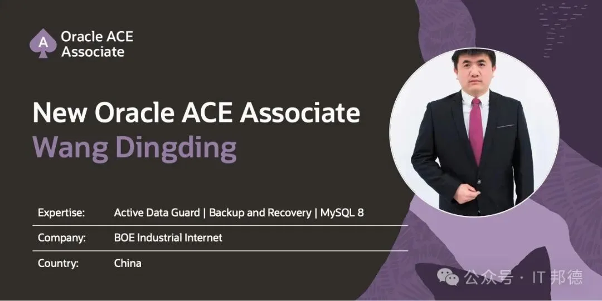
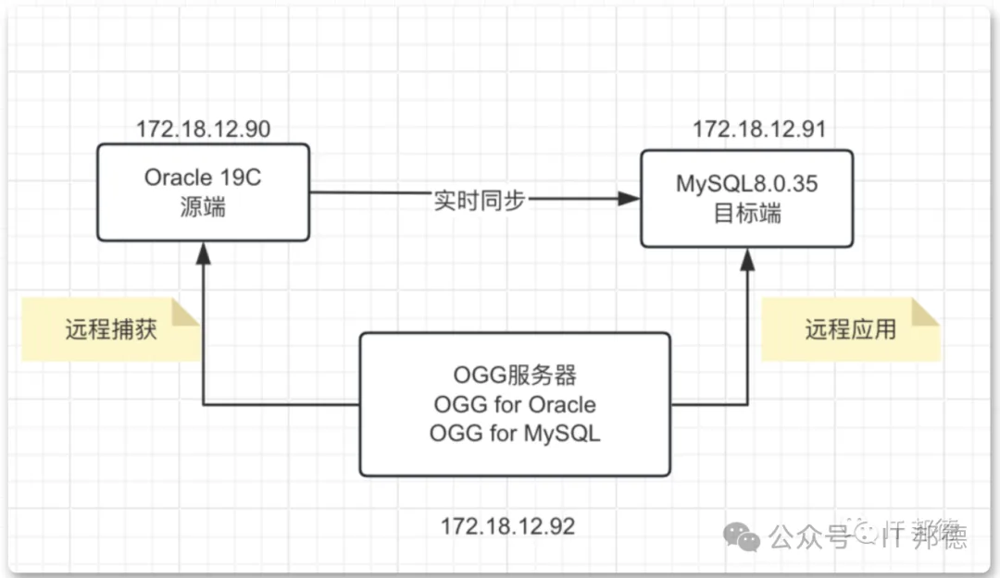
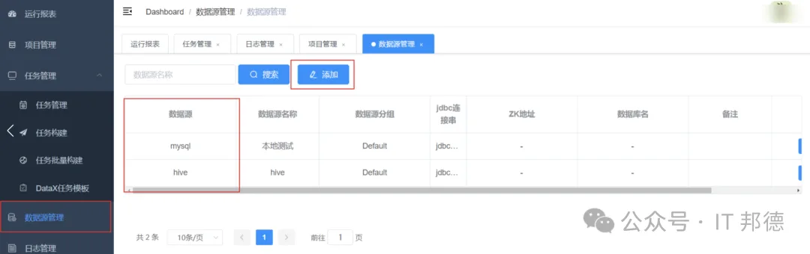
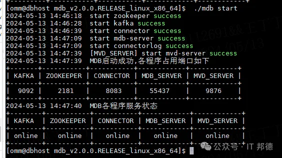
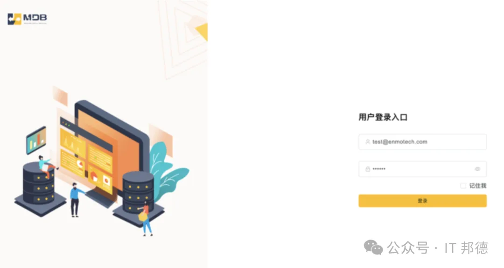
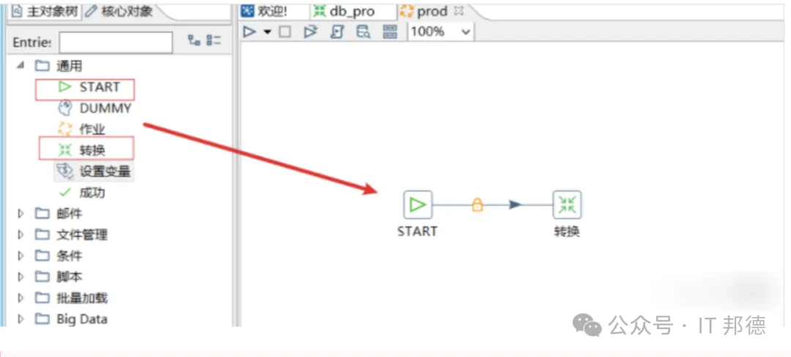
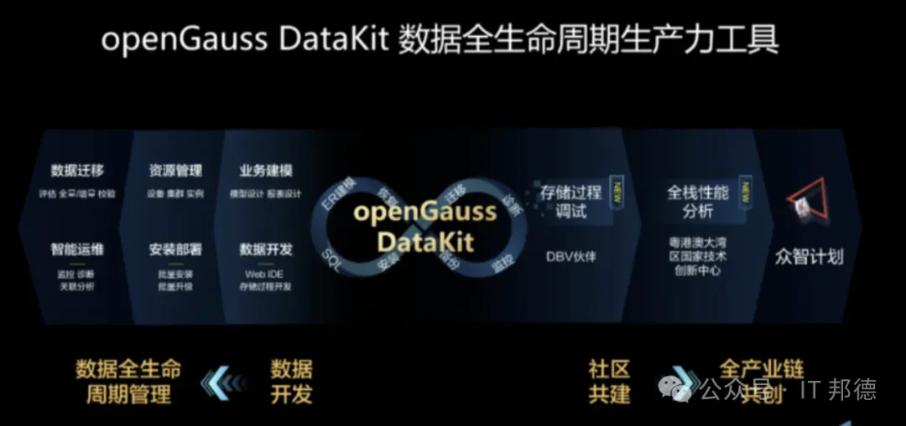
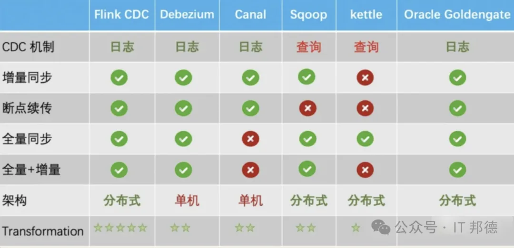

> 原作者：詹姆斯邦德 007

作者：IT 邦德
中国 DBA 联盟(ACDU)成员，10 余年 DBA 工作经验，
Oracle、PostgreSQL ACE
CSDN 博客专家及 B 站知名 UP 主，全网粉丝 10 万+
擅长主流 Oracle、MySQL、PG、高斯及 Greenplum 备份恢复，
安装迁移，性能优化、故障应急处理

微信:jem_db
QQ 交流群:587159446
公众号：IT 邦德

## 前言

> 本文介绍了 DBA 日常工作用到的数据迁移工具，能让你的运维工作效率翻倍

### 1. OGG 迁移

#### 号称零停机迁移，支持异构

OGG 是一种基于日志的结构化数据复制软件，
通过捕获源数据库 online redo log (在线重做日志)
或 archive log(归档日志)获得数据变化，
形成 tail（队列文件 ），再将这些 tail 通过网络协议，
传输到目标数据库，目标端通过解析，插入至目标端数据库，
从而实现源端与目标端数据同步

1. 对生产系统影响小：实时读取交易日志，以低资源占用实现大交易量数据实时复制；
2. 以交易为单位复制，保证交易一致性：只同步已提交的数据；
3. 高性能：智能重组交易和合并操作，使用数据库本地接口访问，采用并行处理体系与灵活的拓扑结构，支持一对一、一对多、多对一、多对多和双向复制等。

[OGG 实现 Oracle19C 到 postgreSQL14 的同步](http://mp.weixin.qq.com/s?__biz=MzI3OTE0NDIyNw==&mid=2247490428&idx=1&sn=07a77befc1e4722fb31c2d4a63eb561f&chksm=eb4d6930dc3ae0264634639816bdb721d48b597444a294760e6bcd95ec474d90ea3b527a8309&scene=21#wechat_redirect)\

[基于 OGG 实现 Oracle 实时同步 MySQL](http://mp.weixin.qq.com/s?__biz=MzI3OTE0NDIyNw==&mid=2247490356&idx=1&sn=cb5f657752b6739e23492c295f703f33&chksm=eb4d6978dc3ae06efade0eeaa84ab4f4ceac7cf01c0202eb2741f0c853799cbaa954b06f7b10&scene=21#wechat_redirect)\

[OGG 将 Oracle 全量同步到 kafka](http://mp.weixin.qq.com/s?__biz=MzI3OTE0NDIyNw==&mid=2247490155&idx=1&sn=a0d4e9cc3d14b1c3792ec1eb56d8043d&chksm=eb4d6827dc3ae1317b1de673833f5d412c4ea5f6df8bf588614c9bc9252123ddfaf87892dede&scene=21#wechat_redirect)\

### 2. DataX

#### 广泛使用的离线数据同步工具/平台

> DataX 是阿里巴巴开源的一个异构数据源离线同步工具，致力于实现包括关系型数据库(MySQL、Oracle 等)、HDFS、Hive、ODPS、HBase、FTP 等各种异构数据源之间稳定高效的数据同步功能。

[刷到一个比较骚的 DataX 迁移 MySQL 到 OB 的方法...](http://mp.weixin.qq.com/s?__biz=MzI3OTE0NDIyNw==&mid=2247492295&idx=1&sn=baedcc364c04aeb74a6bdd98dc7d0eba&chksm=eb4e908bdc39199d1ea6ac1b185ebfa004e9e60b4a88f07f4e27e2f80d19d9db85239887dfae&scene=21#wechat_redirect)\

### 3. MDB

#### 异构数据迁移国产数据库利器

> MDB 全称 MogDB Data Bridge，是一款异构数据库迁移同步工具。用于 MogDB/openGauss 以及同类基于 openGauss 的数据库与其他异构数据库（Oracle，DB2，MySQL，PostgreSQL 等）之间的数据迁移和同步

这款工具非常的强大，主流了关系型数据库 Oracle、MySQL、PG 等
迁移到国产数据库非常的方便，
MDB 启动成功后，可在客户端 Web 浏览器中操作
<https://docs.mogdb.io/zh/mdb/v2.0/install>

### 4. Kettle

> kettle 是纯 java 开发，开源的 ETL 工具，用于数据库间的数据迁移。可以在 Linux、windows、unix 中运行。有图形界面，通过图形化界面的配置，可以实现数据迁移，并不用开发代码。也有命令脚本还可以二次开发

[ETL 神器 kettle 的部署及应用](http://mp.weixin.qq.com/s?__biz=MzI3OTE0NDIyNw==&mid=2247488119&idx=1&sn=4c3938509d67516ca733072e216086bc&chksm=eb4d603bdc3ae92dc4d01279fc1fbf7291022fc13d0b21c5092cd1a8cc8948c10f36bdc92bdf&scene=21#wechat_redirect)\

### 5. DataKit

#### 运维，监控，迁移、建模综合平台

> DataKit 是 OpenGauss 推出的一个以资源（物理机，数据库）为底座的开发运维工具，将上层的开发运维工具插件化，各插件之间相互独立，方便用户按需引入。各插件围绕 DataKit 的资源中心进行扩展开，完成数据库的运维，监控，迁移，开发，建模等复杂的操作。

[迁移 MySQL 到 openGauss，DataKit 嘎嘎猛~](http://mp.weixin.qq.com/s?__biz=MzI3OTE0NDIyNw==&mid=2247491253&idx=1&sn=44dd1a65eee230be5561389a67409b94&chksm=eb4d6cf9dc3ae5ef18fb57d8e467c15db6914fd10f7aa34f44cf3b61e5c68adbc328729dfe24&scene=21#wechat_redirect)\

[openGaussDatakit 让运维如丝般顺滑！](http://mp.weixin.qq.com/s?__biz=MzI3OTE0NDIyNw==&mid=2247491253&idx=2&sn=bcca6102b89affdd2df691698b22eef9&chksm=eb4d6cf9dc3ae5efd93ef2f2f698c0241f3b2a7126b72c4330e64dee05c2b67bb0b3957c9e23&scene=21#wechat_redirect)\

### 6. 总结

> 在 DBA（数据库管理员）的日常工作中，数据库迁移和升级是一项重要任务。在这篇文章中，本文帮助 DBA 们在数据库迁移过程中做出明智的选择，并规划有效的实施策略。

---

发布版本：[微信公众号转载页](https://mp.weixin.qq.com/s/VbSAZ7wj_hzhi9KUFSBhoQ)
