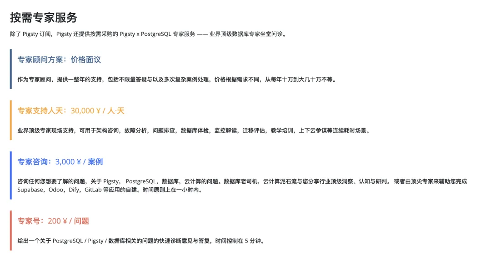

老冯前几天发了篇《[数据库爆炸了怎么摇人？](/db/db-emergency-help/)》，结果没过几天就一语成谶，遇上了一起真·数据库爆炸事故，但这次比较惨烈，摇人也没用了。

老冯今天出发去温哥华参加 PGCon.Dev 2025，今天下午北京飞蒙特利尔。昨天晚上提前从上海出发去北京，都过安检准备登机了，一位用户朋友夺命连环 Call 又把我摇了回来。一场删库故障折腾到凌晨，现在改成早上 7 点的飞机再次出发了，只好在飞机上赶 PPT 了。

这个案例用的是 XFS + NVMe SSD，单机，文件系统层面的删库，连着本地备份一起无了，用各种 xfs_xxx 都没找到什么值得恢复的东西。

如果只是 PostgreSQL 数据库层面的数据恢复，老冯还是有不少办法的。但是纯文件系统删除恢复，就超出我的专业领域了。最后只能 dd 出来块设备镜像去做 Page Carving，但数据恢复这活相当于碎纸机拼图，十几 T 的数据要想恢复，那成本确实不是一个小数目。

之前在《[如何用 pg_filedump 抢救 PG 数据](/pg/pg-filedump/)》我介绍过一个案例，BCACHE 断电 + pg_resetwal 烤糊数据库集群，但是最后从剩下的文件系统数据里硬解还原出来了。这次的案例是整个数据库与备份一起被删除，文件系统上渣也不剩了。老实说，老冯看到这种情况也是脑壳痛。

最后好在大部分数据在其他地方还有副本，可以重新录入，所以用户在利弊权衡之下，干脆就重装上新了。俺给配置了一台独立备份服务器跑 MinIO 作为冷备份仓库，并优化了其他一些架构上的问题。亡羊补牢，为时未晚。

这次这位用户朋友确实及时摇到人了，但这种情况如果没有事前的预防措施，摇到人了也没用。DBA 算是数据库的医生，而医生都会告诉病人一个简单朴素的道理：**预防远胜于治疗**。

<https://pigsty.cc/docs/about/service/>

其实如果在搭建之初买个三千块钱的 “专家架构咨询”，甚至挂个两百块的“专家号”，完全可以提前预防避免这些极端问题，而不是在事后使用几万块的专家人天或者几十万的数据恢复服务。毕竟，光俺这临时退改签一次的成本都三千了… 备份吧，人教人不行，事教人就会，但我还是希望读者用户朋友们不要在这种事情上再翻车了，提前从别人的经历中学到经验教训。\

---

发布版本：[微信公众号](https://mp.weixin.qq.com/s/2wkE-Jumnlu83eK-VSNoMA)
