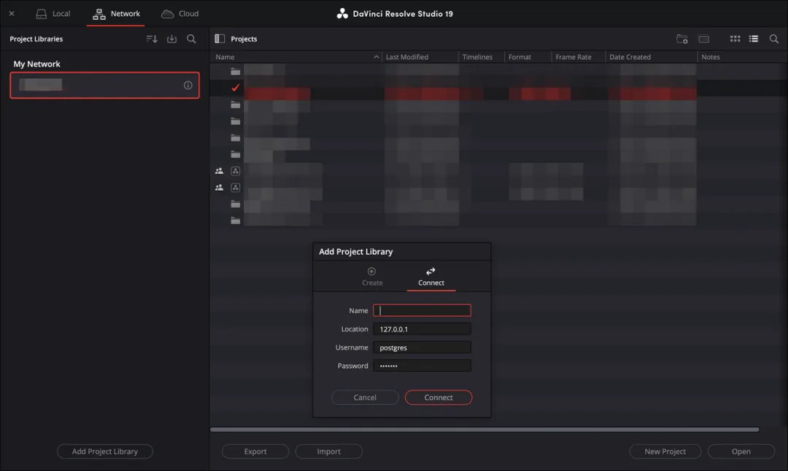
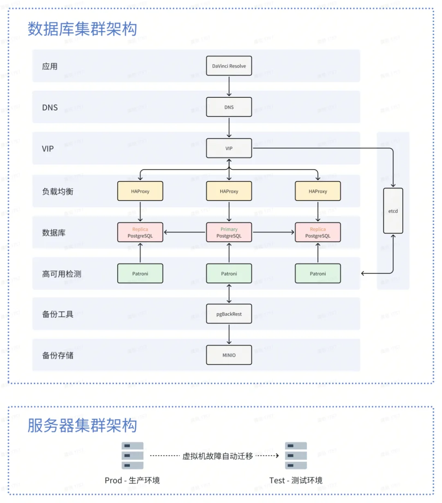
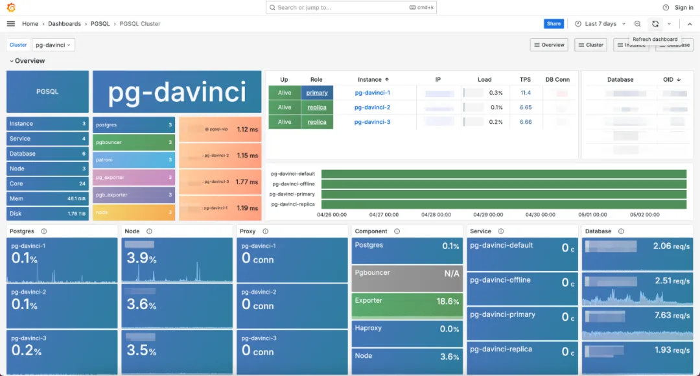
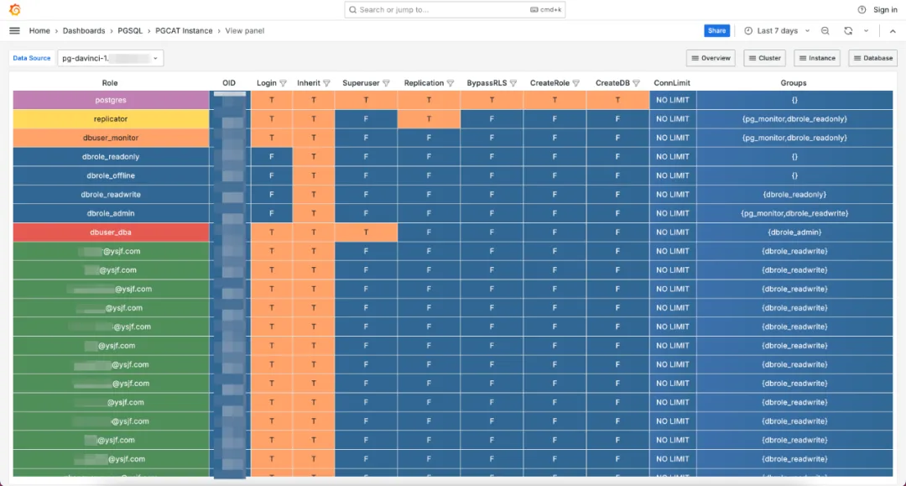
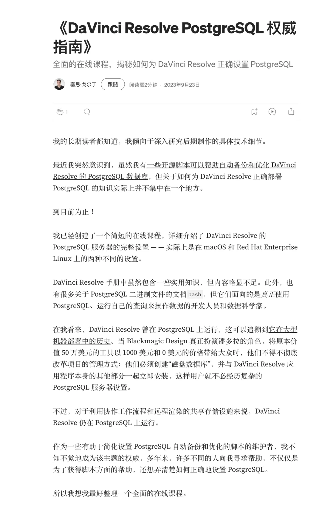

> 原作者：龚锐

老冯喜欢摄影，很早就关注了影视飓风。但俺也没有想到有一天还会出现这种交集：开源 PostgreSQL RDS 软件 Pigsty 有一天会被影视飓风用在影视行业里，用于支持达芬奇这种行业软件。

在 [影视飓风达芬奇千万级数据库演化及实践](https://mp.weixin.qq.com/s?__biz=MzkwNDY2NTE4MQ==&mid=2247484913&idx=1&sn=618c4300a73a6d113bcf5861e8d80151&scene=21#wechat_redirect) 一文中，影视飓风的专家们分享了他们是如何使用 Pigsty 来解决达芬奇的各种问题。比如高可用，高级权限管控，误删回滚，读写分离，以及简化维护。

---

本文将介绍影视飓风达芬奇项目数据库建设的过程中遇到的问题和解决方案

## 01 · OVERVIEW：达芬奇概述

达芬奇（DaVinci Resolve）是由 Blackmagic Design 开发的一款专业的视频编辑、调色、特效和音频处理软件，被电影、影视、广告等各类视频制作场景下广泛应用。\

达芬奇的项目库（Project Libraries）用于协作工作流程中，它允许多个用户在同一个网络中同时访问和操作项目，支持团队的实时协作。这对制作复杂的影视项目时尤为有用，在后期制作中，剪辑、调色、音频等各类工种可以同时处理不同部分的工作。可以通过官方应用得出该功能就是**依赖 PostgreSQL 数据库实现**的。

## 02 · EVOLUTION PATH：数据库演进路径

## 2019 年 - 达芬奇官方应用（DaVinci Resolve Project Server）

随着业务体量的不断增加，达芬奇官方应用的单体架构渐渐暴露出诸多不足，如容易造成单点故障、无官方实现的自动备份、权限管控难度大、维护不便等问题。

## 2023 年 4 月 - Docker 容器化

Docker 带来的弊端也立马显现出来，具体可以阅读这篇文章。我们在使用 Docker 方案半年后，迅速评估转舵更换方案，迭代为目前的高可用集群。\

## 2024 年 1 月 - 高可用集群

经过对比选型后，采用了开源的 Pigsty 方案。集群配置为一主两从，当主节点故障时，其中一个从节点将成为主节点，并将故障节点降级隔离。底层虚拟机采用双服务器集群避免硬件或网络造成的中断，当有故障时可在毫秒级内完成自动迁移，用户体感仅为闪断。

高可用集群架构图

集群监控 Dashboard

## 03 · DIFFICULTY：技术难点

对于达芬奇这种“黑盒应用”来说，我们无法改变软件自身逻辑，仅能从数据库方面进行优化。或许达芬奇在设计之初为了避免数据库架构的复杂性和潜在的同步问题，它舍弃了很多高级的数据库功能，比如无法在协作模式使用连接池、不能仅开放只读权限等。这对我们的优化及管理带来了很大挑战。

## 04 · PITR：时间点恢复

针对误操作、误删等场景，目前实现了恢复至过去一周内的任意时间点的能力。剪辑师仅需告知操作时间点，BDA 同学可在几分钟内将数据库滚回至恢复专用数据库中将该项目提取出来。

## 05 · PERMISSION：权限治理

通过 LDAP 组件对接影视飓风 SSO 统一登录平台的账户体系及角色身份，虽然由于软件限制无法做到一键单点登录，但与 SSO 账号密码一致，避免了用户维护多套账号。

除 DBA 账户外，常规角色为最小化权限，仅可连接数据库、新建数据、修改数据、删除数据等必要功能。

用户操作均有安全审计记录，这也是企业安全场景下必不可少的一环，可留存用户对数据库的访问、操作记录，异常操作后可追溯，保护了数据安全。

用户列表 &权限

## 06 · EXPERIENCE：踩坑经验

**现象：**在 2024 年 5 月 8 日 11:35 分开始有多位后期同学反馈达芬奇数据库连接中断情况。**\****定位 &处理：**

- [11:36] 查看节点状态，发现全部离线，LDAP 等相关依赖组件一切正常

- [11:43]查看日志后发现抛出大量 etcd 容量满及停止服务相关告警

- [11:46]为了在最短时间内恢复业务使用，我们先尝试使用手动清理碎片的形式释放空间

- [11:50]重启 etcd 和 HAProxy

- [11:52]节点上线，业务恢复

**由于 etcd 基础服务集群容量配额写满导致集群管控平面失效，但未对数据平面造成影响**。

> etcd 是一个分布式的、可靠的键-值存储，用于存放系统中最为关键的数据，Pigsty 使用 etcd 作为 Patroni 的 DCS（分布式配置存储）服务，用于存储 PostgreSQL 集群的高可用状态信息。

**\****根因：**未开启 etcd 自动压实功能，且默认仅为 2GB 容量。

## 07 · LAUNCH：上线收益

- 数据零丢失

- 99.99% 服务可用性

- 通过时间点恢复回滚近十次误操作

\- End -

## 老冯评论

老冯喜欢摄影，很早就关注了影视飓风。但俺也没有想到有一天还会出现这种交集：开源 PostgreSQL RDS 软件 Pigsty 有一天会被影视飓风用在影视行业里，用于支持达芬奇这种行业软件。

在 [影视飓风达芬奇千万级数据库演化及实践](https://mp.weixin.qq.com/s?__biz=MzkwNDY2NTE4MQ==&mid=2247484913&idx=1&sn=618c4300a73a6d113bcf5861e8d80151&scene=21#wechat_redirect) 一文中，影视飓风的专家们分享了他们是如何使用 Pigsty 来解决达芬奇的各种问题。比如高可用，高级权限管控，误删回滚，读写分离，以及简化维护。

达芬奇官方单体应用内置了一个 **PostgreSQL 数据库**，用于本地存储项目和数据库信息。这个数据库通常是在单机模式下运行，并且是自动配置好的，不需要用户手动设置或配置。但如果要团队协作，那么还是要专门拉起一个共享的 PostgreSQL 数据库实例来使用。

当我看到影视行业的专家们竟然还会专门开一门课来介绍 “达芬奇的 PostgreSQL 权威配置指南” 时，我确实是吃了一惊：<https://medium.com/@sethgoldin/the-definitive-guide-to-postgresql-for-davinci-resolve-c3fcb36a1561>。

但这确实是一个需要自建本地 RDS 的有趣场景。因为用一个远程的云厂商 PG RDS，响应时间对影视编辑团队协同的场景来说实在是太高了，而 Pigsty 这样的本地 PG RDS 自建方案可以恰到好处的解决这些问题 —— 即使没有专业 DBA，也可以自建高水准的本地 PG 数据库服务，从搞了近十次 PITR 误删回滚恢复来看，他们玩的还是很溜的。

正如微软 CEO 纳德拉所说，*你喜欢的软件应用在本质上都是数据库套壳* （[SaaS 已死？AI 时代，软件从数据库开始](/ai/ai-agent-era/)）。对于达芬奇这种“黑盒应用”来说，用户确实没有办法改变软件本身的逻辑。但可以通过使用更好的 PostgreSQL RDS，来为现有软件添加这些强大的能力 —— 更好的业务连续性与数据持久性，回滚到过去一周任意时间点的魔法，以及精细化的权限管理。

---

发布版本：[微信公众号转载页](https://mp.weixin.qq.com/s/7zJe6_HJU7Q2_Uf9-lS2vQ)
