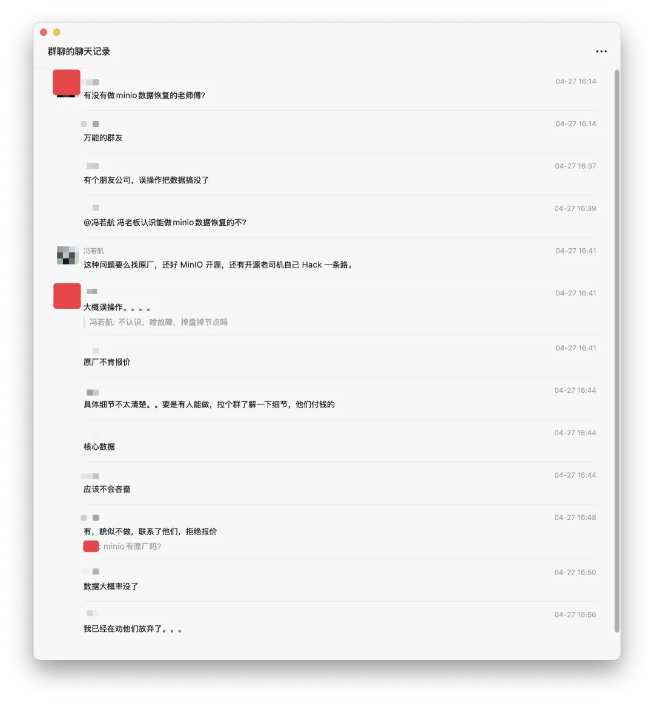
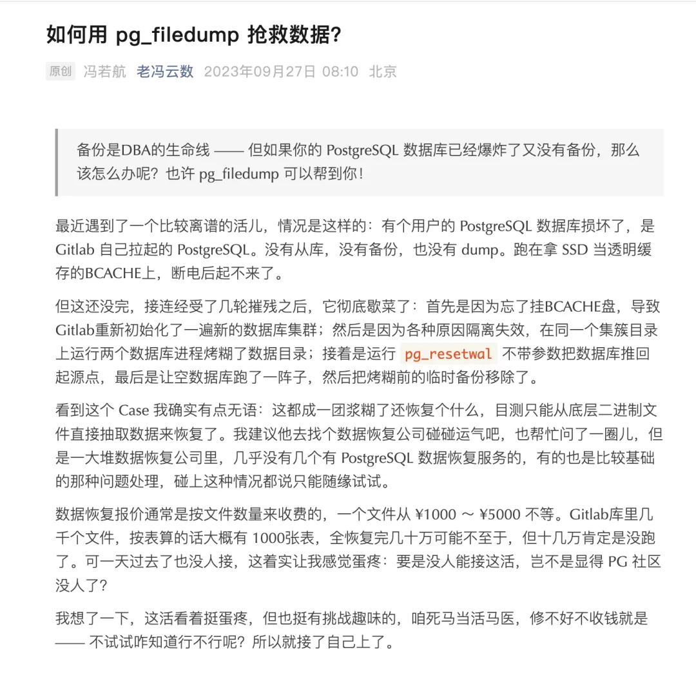

今天群里有条消息，有朋友问我认识做 MinIO 数据恢复的人不，他们的 MinIO 集群误操作，核心数据数据丢没了。他们联系了 MinIO 原厂，不过 MinIO 原厂也不接这个活儿，甚至都拒绝报价。于是进入了叫天不灵，叫地不应的状态。

虽然 Pigsty 也提供 MinIO 的部署作为添头：用作 PG 备份仓库，以及供 Supabase 之类的自建服务使用。但这种问题，我也只能在客户部署前进行事前预防：例如开启垃圾回收站保留时长，以及多版本特性，或者配置跨 AZ 复制。如果真的是裸奔误操作删光了，我也没有什么好办法。

> 顺带一提，有人能做欢迎留言，苦主重金求救

如果是 PostgreSQL 数据库爆炸了，即时只剩个文件系统残骸，我还有不少办法能解决。但如果是 MinIO 误操作，备份/多版本/垃圾回收都没开，老冯也只能很遗憾的表示爱莫能助。比较理想的情况，如果这些数据真的非常非常重要，那么就只能自己找开源老司机来慢慢拼图了。

---

这让我想起了两年前的一个案例：《[如何用 pg_filedump 抢救数据？](/pg/pg-filedump/)》，有位客户（当时还不是）自己拉了一套 Gitlab，单机版。跑在 BCACHE 缓存盘上，断电后起不来了，科技企业，大量 CI/CD，PR，项目管理都放在在 Gitlab 上，这要是丢了可真是要老命了。更要命的是，故障之后没有保留好现场，一番操作把里面的 PG 数据库彻底给烤糊了，还把备份给误删了，打电话求助。

接到电话的时候正好是俺 30 岁生日，正在曲水兰亭洗大澡。老实说看到这种没备份，没从库，还原地 pg_resetwal + 多实例烤糊的灾难现场，真是不想碰这种活儿。这种鸟活，你找 Gitlab 原厂人家都不带接的，还是找个数据恢复的公司去碰碰运气吧。

结果第二天他们找到我说找了一圈数据恢复公司，几乎没有几个有 PostgreSQL 数据恢复服务的，有的也是比较基础的那种问题处理，碰上这种情况都说只能随缘试试，不抱什么希望。而最后我看在都是奇绩校友的份上，死马当活马医试试吧，用蛮力硬办法给它恢复出来了。

所以对于数据库的用户/客户来说，真正有价值的核心服务其实就是：大翻车的时候，能不能摇来真正的专家兜底。

---

不幸地是在这一点上，很多厂商都缺乏这种能力。即使是国内公有云一哥阿里云，年消费百万+的客户能在 RDS 故障上期待的“兜底”服务，也不过是 《[草台班子唱大戏，阿里云 RDS 翻车记](/cloud/rds-failure/)》中描述的那种 —— 客服为您提供 20% 月消费代金券，不解决实际问题。

实际上当阿里云 RDS PG 出现故障的时候[，直接去找 @德哥 Digoal 要比跟小白客服扯皮管用多了](/cloud/drop-rds/)。因为德哥是货真价实的专家，又在社区用爱发电。专家很容易就能看出问题核心，最不济至少也有能量能直接把问题 Escalte 到真正的工程师那里去。当然现在德哥已经不管 RDS 了，所以俺也不建议读者朋友们去薅德哥，毕竟这种用爱发电的事儿干多了太累了。

当然，比起事后擦屁股，更好的办法永远是事前就做好设计：比如用高可用架构为硬件故障兜底，用 PITR 为人为误删兜底，用监控系统缩短定位故障的时间，用 IaC 减少误操作的可能。

以及，事前花两千块事前找个专家做个架构咨询，也比翻车后花几万几十万急诊抢救手术要划算多太多了。

> 魏文王问扁鹊曰：“子昆弟三人其孰最善为医？”
>
> 扁鹊曰：“长兄最善，中兄次之，扁鹊最为下。”
>
> 魏文王曰：“可得闻邪？”
>
> 扁鹊曰：“长兄於病视神，未有形而除之，故名不出于家。中兄治病，其在毫毛，故名不出於闾。若扁鹊者，鑱血脉，投毒药，副肌肤，闲而名出闻于诸侯。”

*\

- [如何用 pg_filedump 抢救数据？](/pg/pg-filedump/)
- [SaaS 已死？AI 时代，软件从数据库开始](/ai/ai-agent-era/)
- [分布式数据库是伪需求吗？](/db/distributive-bullshit/)
- [2025 年：MySQL vs PostgreSQL](/db/mysql-vs-pgsql/)
- [Claude Code 泄密：MCP 爆火的隐藏真相](/ai/mcp-hidden-truth/)
- [草台班子唱大戏，阿里云 RDS 翻车记](/cloud/rds-failure/)
- [云 RDS：从删库到跑路](/cloud/drop-rds/)

---

发布版本：[微信公众号](https://mp.weixin.qq.com/s/Hs-lus_rf9Lhcqw1Az1LUQ)
