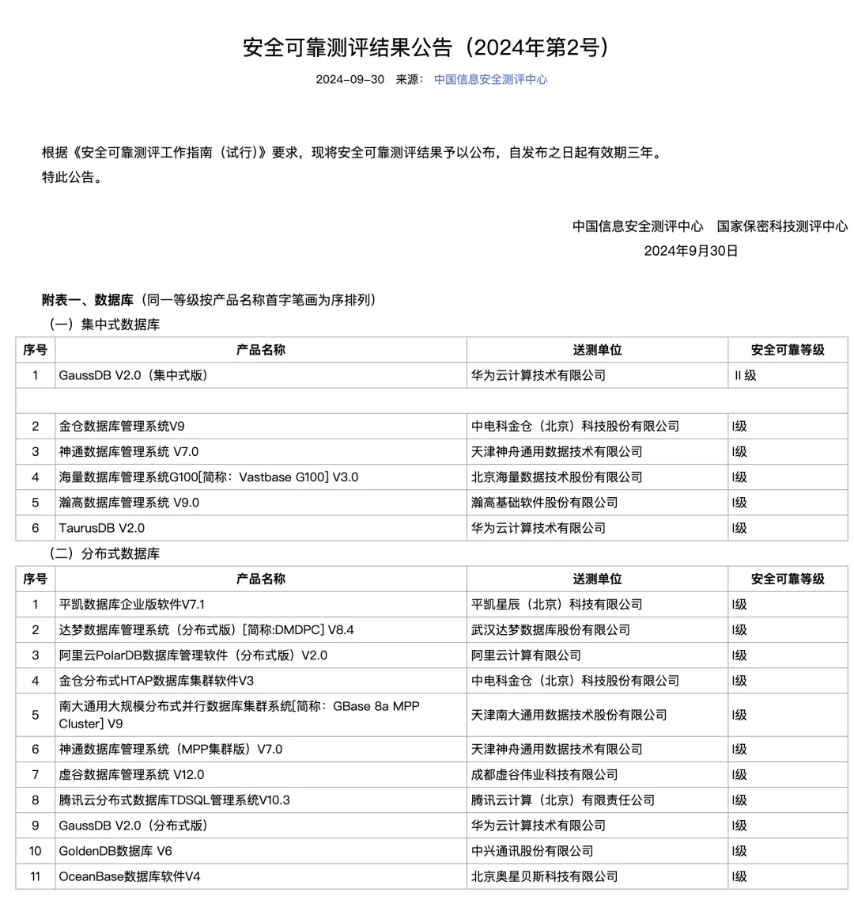
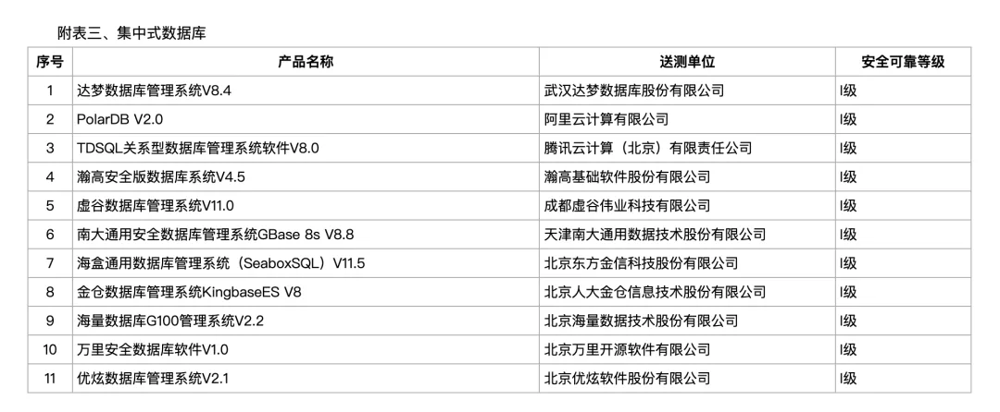
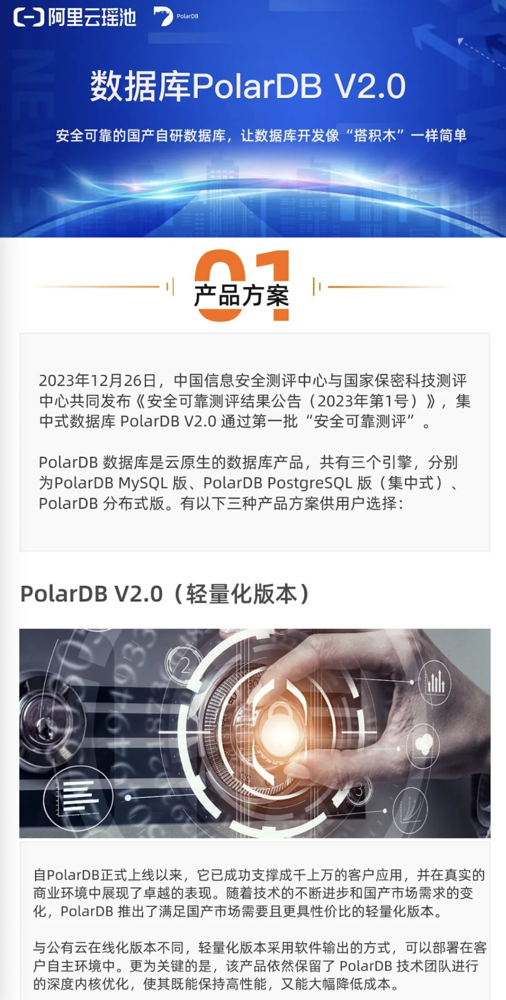

## 昨天第二号安可评测结果公告发布了。关于“国产数据库”，我的观点已经在以下文章中充分表达过了 —— 真·关系型数据库榜单。当然比起观点与看法，更重要的是国产化的大任务来了，单位到底应该如何应对解决，这里我给大伙出一招。

### 国产信创篇

[**数据库真被卡脖子了吗？**](/db/db-choke/)

[国产数据库到底能不能打？](/db/db-china/)

[国产数据库是大炼钢铁吗？](/db/great-leap-db/)

[中国对 PostgreSQL 的贡献约等于零吗？](/pg/china-pg-contribution/)

[机场出租车恶性循环与国产数据库怪圈](/db/airport-taxi-db/)

[EL 系操作系统发行版哪家强？](/db/rhel-compatibility/)

[基础软件到底需要什么样的自主可控？](/db/sovereign-dbos/)

[分布式数据库是伪需求吗？](/db/distributive-bullshit/)

<http://www.itsec.gov.cn/aqkkcp/cpgg/202409/t20240930_194299.html>

加上第 1 号评测公共（有效期 3 年）

<http://www.itsec.gov.cn/aqkkcp/cpgg/202312/t20231226_162074.html>

这两份公告，基本上给出了 “国产数据库” 的范围。在名单里的，都是够硬的**关系型数据库。不在名单里的，我觉得也不用去凑这个热闹了。**[《老白带你解读最新国测结果》](https://mp.weixin.qq.com/s?__biz=MzA5MzQxNjk1NQ==&mid=2647853402&idx=1&sn=a145eff106327a1a61da6832f1536954&scene=21#wechat_redirect)

## 国产化要求怎么办？

我做数据库发行版 Pigsty，从开始就是面向全球市场，瞄着数据库市场一哥 AWS RDS 去打的。核心目标就是助力 [PostgreSQL 成为数据库世界的 Linux](/pg/pg-eat-db-world/)，一统数据库江湖。老实说，不怎么关注“国产数据库”市场。

但也免不了许多用户总是问我，我们想用原生的 PostgreSQL，不想弄那些花里胡哨的国产魔改。但现在上面有国产化要求，怎么才能解决这个问题呢？

说来其实挺滑稽的，在上面名单列出的国产数据库中，有小一半都是 PostgreSQL 的徒子徒孙，套壳魔改换皮。但直接使用开源的 PostgreSQL 本身却是不满足 “国产化” 的要求。那怎么办呢？其实也是有办法的。

首先，Pigsty 虽然是 PostgreSQL 发行版，但 Pigsty 本身说到底并不是数据库，也不是国产数据库。而是数据库[管控软件](/cloud/dba-vs-rds/) —— 本地优先的数据库平台，属于 RDS 云管控赛道。它是用来管理数据库的，即 DBMS 的 MS —— 提供开箱即用的安装部署，监控管控，扩展安装，高可用，PITR，IaC，SOP，故障自愈，负载均衡能力。

**这个管理能力并不仅仅适用于 PostgreSQL，也适用 PostgreSQL 的衍生内核**。例如提供 Oracle 兼容性的瀚高的 IvorySQL 内核，提供 SQL Server 兼容性的 AWS [Babelfish 内核](/pg/pg-replace-mssql/)。也可以使用阿里云 PolarDB （PG / Oracle） 内核。

在我看来，这个表单里的国产数据库，PolarDB 算是含 P 量最高的一档了。PolarDB PG 是开源的，等效于 PostgreSQL 15，PolarDB for Oracle 是正儿八经的国测名单内的 “国产数据库” 内核，使用上基本等效于 PostgreSQL 14。

PolarDB PG/O 在添加新特性的基础上，对 PG 本身的魔改并不大，所以 PG 生态的管理工具和流程都可以继续适用。所以说白了，PolarDB O 内核私有化部署列表价十万块一个节点/年，搭配一套 Pigsty 专业版，然后你爱用多少 PolarDB Oracle / PolarDB PG / 甚至原生 PostgreSQL 集群都随你便了 —— 几十万解决问题，面子里子都有了。

---

最后，祝大家国庆节快乐。隔壁老冯从新加坡发来贺电。

## [**数据库老司机**](/db/guru/)

### （这个小助手很懒，请使劲拍打他）

---

发布版本：[微信公众号](https://mp.weixin.qq.com/s/IeYwrKHfgxLkZBBPS3Ai8A)
