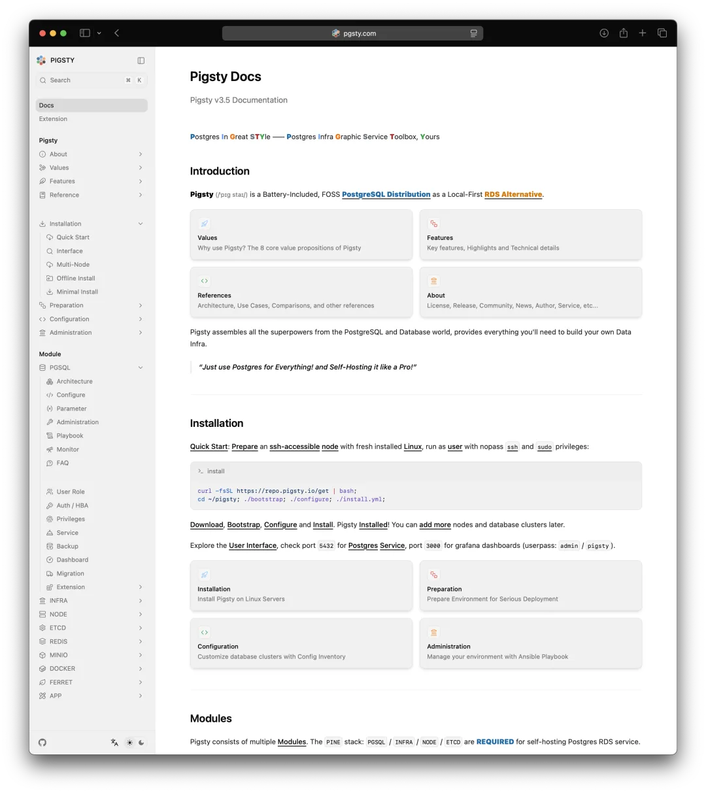
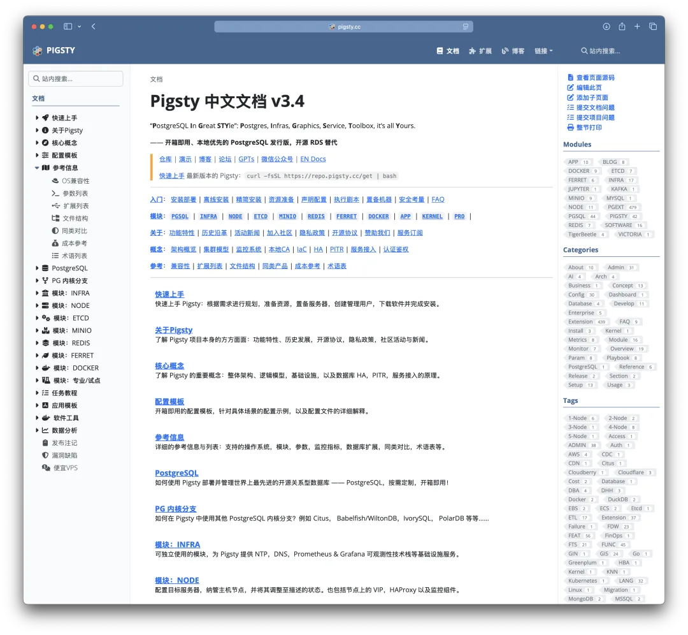
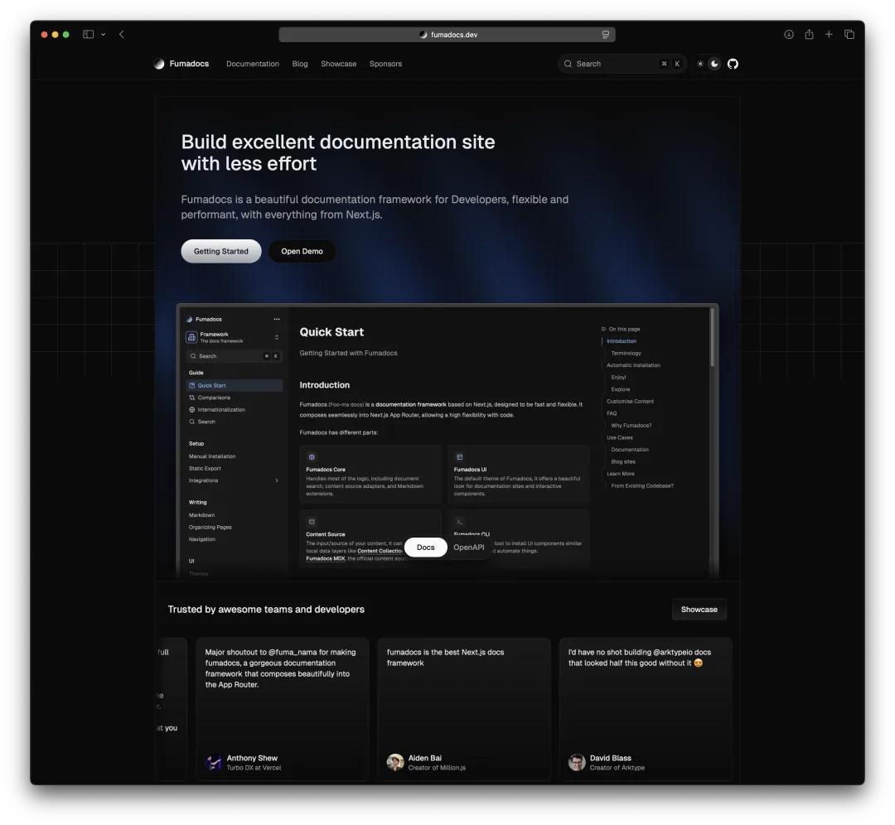
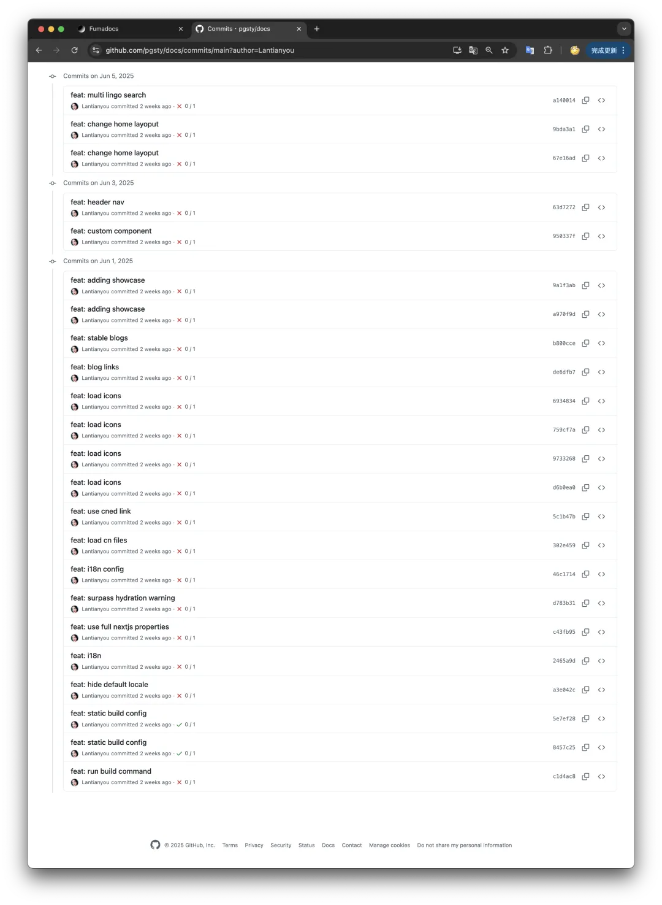
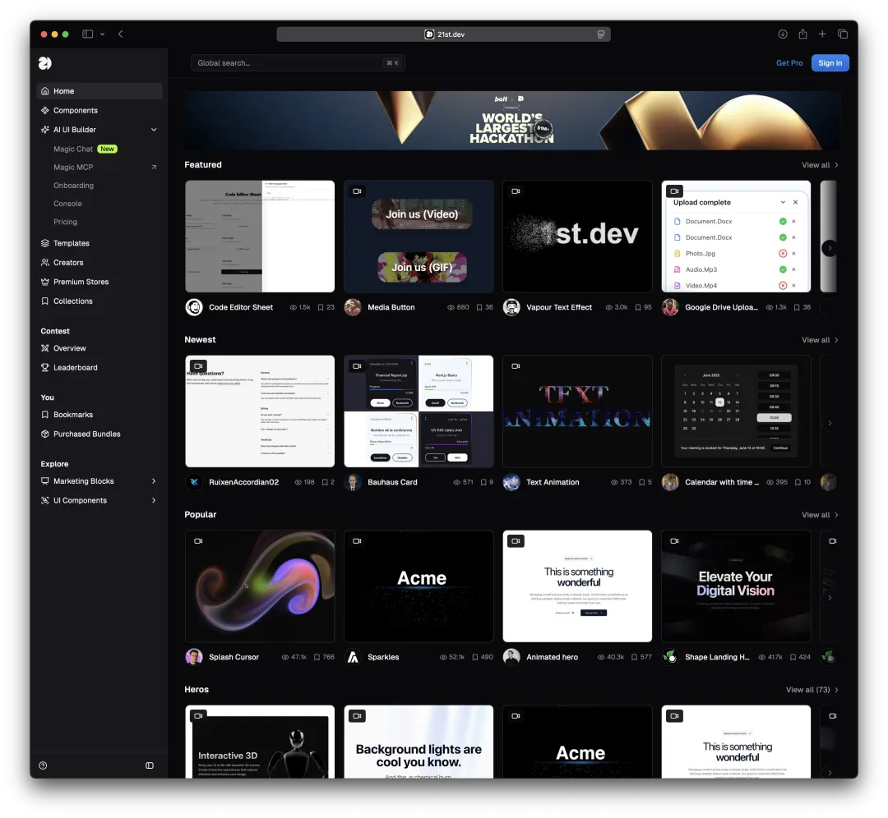
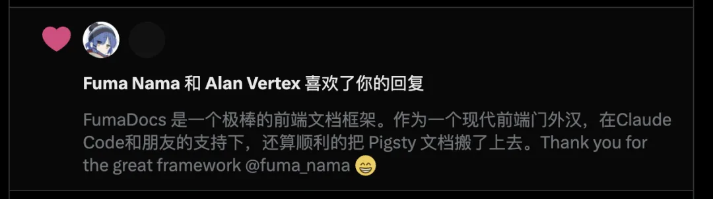
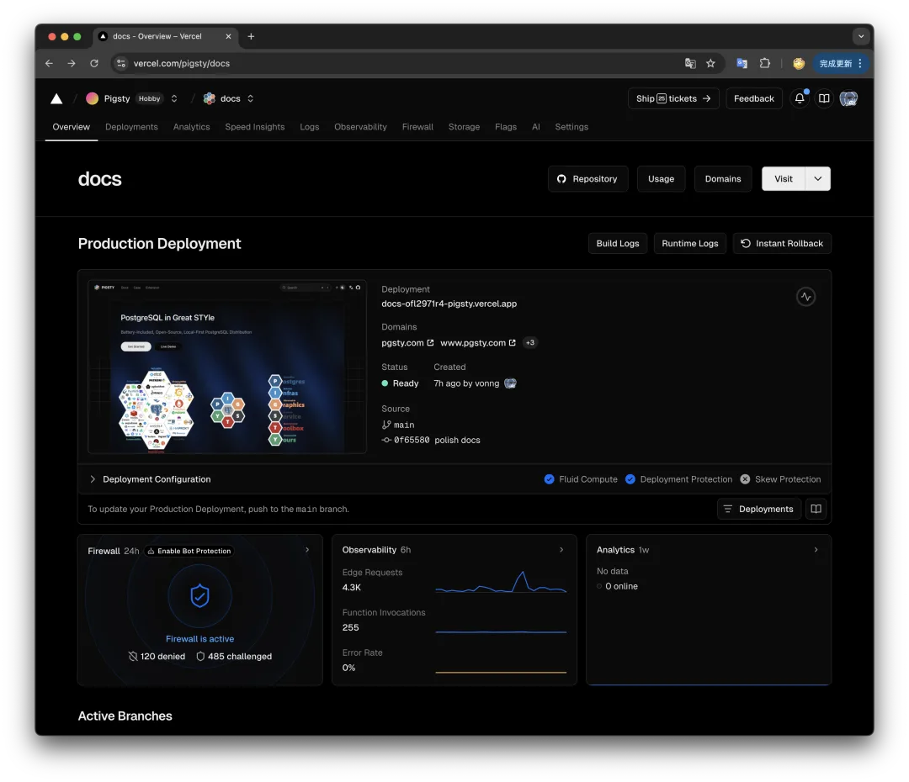
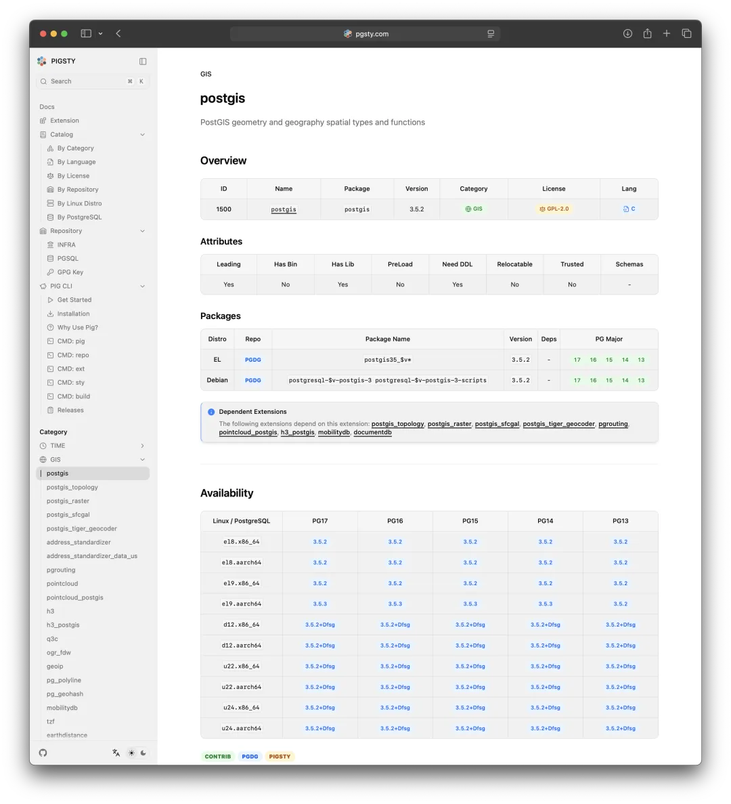
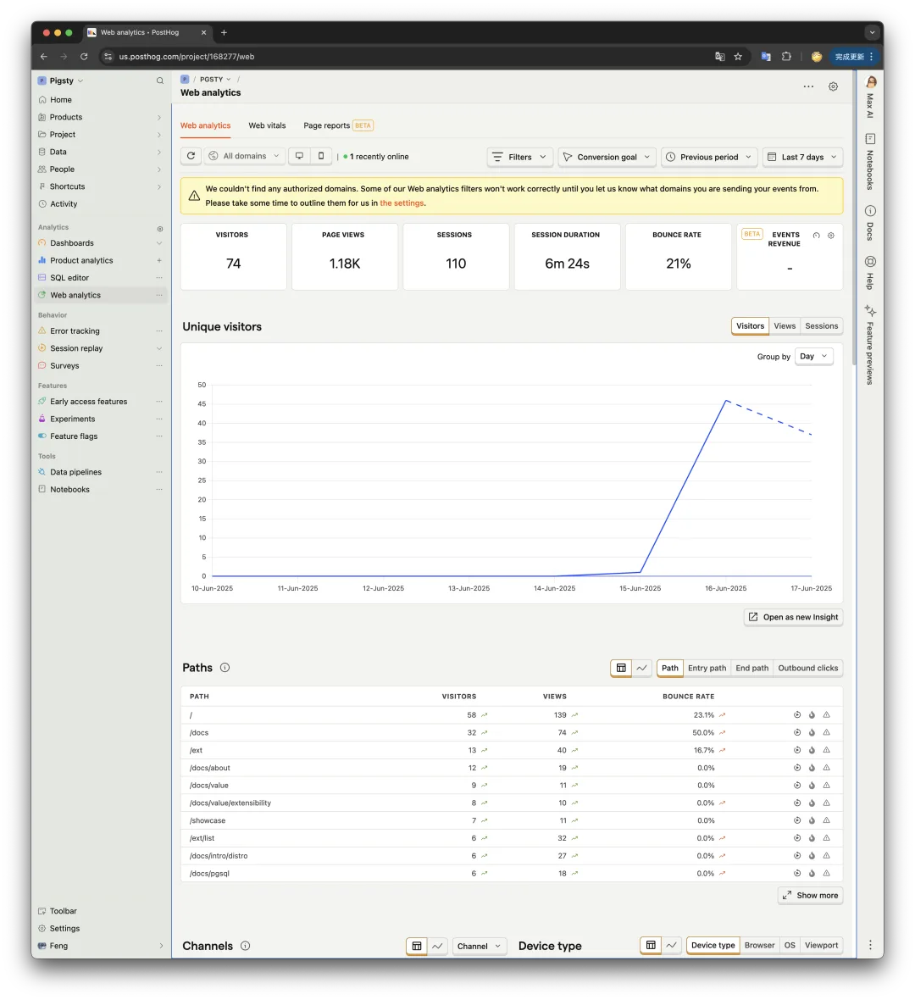

老冯已经很久没有折腾过前端了，上一次密集和前端打交道已经是十年前了，还是 JQuery 的古典前端时代。这次在一位前端大师，Claude Code，Cursor 以及 GPT 的帮助下，重新用 Next.js 把整个 Pigsty 的网站糊了一遍，跑步进入现代化。

干这件事的契机是两周前在去杭州出差的路上，[俺的笔记本电脑被邻座老太太淋了酱油](/misc/laptop-soy-sauce/)。笔记本里 8T 数据都有备份，唯独丢失了上个月 Vibe Coding 糊出来的 Pigsty 新网站首页源代码。我想这东西丢了也就丢了吧，正好我也想整个重构一遍。

Pigsty 之前的网站使用的是 Hugo + Docsy 静态生成的，用了快五年了。这个也是 Kubernetes 和 Etcd 用的框架，Google 出品，老实说我觉得还是挺不错的。不过我也想学习了解一下现代前端究竟发展到什么程度了，所以就找了一位前端大佬，以前奇绩的校友，风变科技的兰天游兰老板帮帮忙。

兰老板以前用 Pigsty 自建 Supabase 的时候找过我，所以这也算是互通有无 —— 我帮你搞搞数据库，你帮我搞搞前端。糊代码这件事现在各种 code agent 干的都不赖，什么东西比较稀缺呢？—— 技术品味。有前端大手子带路的好处就是，我就根本不用浪费时间去琢磨什么前端技术选型，直接挑业界前沿成熟最佳实践就行了。

在兰老板的强烈推荐下，我选择了 FumaDocs 这个文档框架（基于 Next.js），托管在 Vercel 上，使用 PostHog 替代 Google Analtics 做分析。全程一分钱没花，但是事儿办的还是相当漂亮的。

关键还是有老司机引路，兰老板花了一个上午，手把手帮我搞定了整个前端 HelloWorld 流程。然后其他的东西我就用 Claude Code 去糊，自己慢慢填充内容就好了。遇到实在难搞的问题，就再找兰老板求助一下 ——

比如说，去哪里找炫酷的前端控件，怎么导入 MDX 文档，Vercel Build OOM 了怎么解决，PostHog 监控如何接入。有时候老司机一句话，就能省掉我和 Claude 来会掰扯半小时的时间。

老司机不啰嗦，GitHub 一把梭

在这里前端现代化之旅中，我又有了一个深刻感受与体验 —— Claude Code 这种代码 Agent 确实很强力，只要你能清楚表达自己的问题与需求，它就可以相当好的完成你交代的工作。但真正的问题在于，领域新手根本不知道正确的问题应该是什么，而真正的问题可能需要在来来回回的沟通交流中才会被认知到，而这对于领域内的老司机来说就完全不是个事儿。

所以，同样的一件事儿，让我去用 LLM 糊一个现代前端网站，我可能要花一周的时间，但是如果让前端大手子用 VibeCoding 去糊，一个上午就能做到差不多的效果。—— AI 通过显著放大了专家的能力，高手用 AI 带来的杠杆倍率要比新手高的多。

这个过程中，我基本上也顺便把市面上的主要 Code agent IDE 都试过了一遍。最后我把 200 刀的 ChatGPT Pro 给退订了，留了个 20 刀每月的 Plus，一个 20 刀的 Cursor 用来做 Tab 补全，一个 20 刀的 Claude Code 用来日常干活儿。

总体来说，Claude Code 的使用体验是最好的，特别是最近 20 刀的套餐就能用了，绝对超值。总的来说，当兰老板不在线的时候，俺遇到的各种前端疑难杂症其实也是可以花几倍的时间让 Claude Code 慢慢折腾出来的。

顺带一提，最近 Code Agent 爆火的核心原因其实老冯两个月前就提过了 ——  整个浪潮都是 Claude Code 带起来的《 [Claude Code 泄密：MCP 爆火的隐藏真相](/ai/mcp-hidden-truth/)》，所以不要犹豫，赶紧试试吧。

这次搞文档用的是 Next.js + Fumadocs。Next.js 基本上已经成为现在前端的事实标准了，各种 AI SaaS 基本都是 Next.js 糊的，丢到 Vercel 或者 Cloudflare 上托管。Fuma Docs 则是一个基于 Next.js 的文档框架，允许你用 MDX 来编写文档。MDX 是一种扩展 Markdown 语法，好处就是有许多非常不错的 UI 组件可以使用，表现力要比纯 Markdown 强太多了。

有趣的是 FumaDocs 是一个个人开源开发者用爱发电搞的，但质量相当之高。有不少知名的软件 / SaaS / 开源项目都是用的这个文档框架。从整体视觉表现上我觉得它比之前我用的 Google 出品的 Docsy 要好得多 —— 在 Fumadocs 的文档里我能感受到作者对这个框架的用心。在大多数开发者都是 Pay to Work 的世界里，对自己作品的热爱才是真正的天才与核心竞争力。

用 Next.js 糊网站其实没啥好说的，后面我准备专门写几个教程聊一下技术细节，所以今天就不聊这些干巴巴的东西了。本来我用惯了简简单单的静态网页生成，对于这种还要托管的框架是心存顾虑的 —— 我会不会被 Vercel 给锁定了？虽然 [Vercel 号称可以跟赛博佛祖 Cloudflare 掰手腕的赛博菩萨](/misc/cyber-buddha-fight/)，但我也不想被菩萨给套牢了。

好在兰老板解答了我的疑惑，像 Next.js 这种框架可以很方便的在本地托管。一个 Node.js 的 Docker 镜像就解决了。而且也可以服务端渲染静态页面，对 SEO 非常友好。Vercel 的话免费 Plan 其实还是蛮慷慨的，我试了一下访问速度很快，而且在中国的访问速度似乎比 Cloudflare 还快不少（ <https://pgsty.com> ）

托管完了之后就是填充内容了，这是最花时间的部分 —— 基本上相当于整个重新写了一遍英文文档，花了我整整两周的时间。但还是值得的，毕竟作为 PostgreSQL 生态中最能打的中国开源项目，用中文文档 + GPT 机翻的英文文档实在是太不像样了。以后我准备反过来，优先维护英文文档作为权威版本，然后 GPT / Claude 机翻生成中文以及各国语言的其他版本。

最后，我还了解到了现在前端创业者都是怎么做统计分析的，本来我准备继续用 Google Analytics，不过兰老板推荐了一个开源项目/云服务 —— PostHog。让我感觉非常不错，而且这个项目也是使用 PostgreSQL 作为主要数据存储的 —— 从这个名字也大概能猜出来。我先试了一把免费的云服务，感觉体验还是相当不错的。最主要是这个是开源的，可以进行私有化本地部署，我准备等文档的事情整完了就去在 Pigsty 里搞一个 PostHog 的自建托管模板。

刚刚找了个新域名测试了一下

总的来说，我觉得这次网站翻新的过程是一次很有趣的体验。我作为一个还算熟悉古典前端 HTML/CSS/JS 的现代前端门外汉，在前端大手子和 AI 的帮助下，糊出了一个观感不错，符合现代前端最佳实践的网站。

接下来我准备把这个网站接入 Supabase 和 AI 大模型，提供认证与文档问答的功能。然后把这次学到的东西全都沉淀成软件，集成到 Pigsty 里，做成傻瓜式的一键自托管建站方案 —— 前端最佳实践 as Software.

Pigsty 已经有了一键拉起的 Supabase，Postgres，Nginx，Docker，证书，一条龙建站全家桶，只要糊个 Docker Compose 模板和 GitHub 模版，任何人都可以轻松在世界各地拉起一套这样功能完备，质量上乘，美观的文档与网站，还自带本地的 DataDog 与 Google Analytics，岂不美哉？

---

发布版本：[微信公众号](https://mp.weixin.qq.com/s/51dKs7wR6WCNiNWX5j_gWg)
