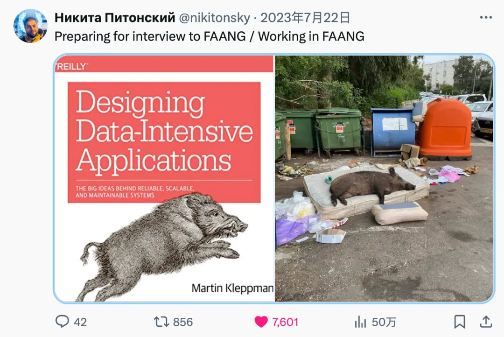
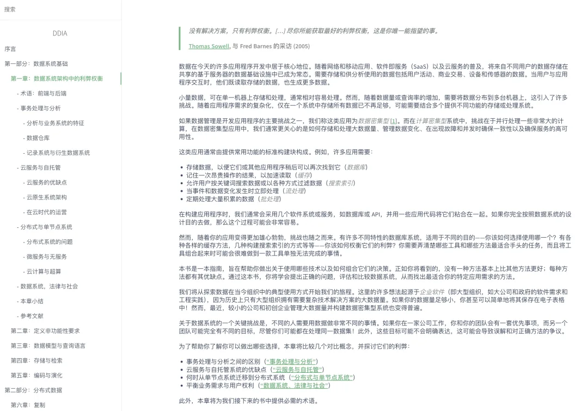
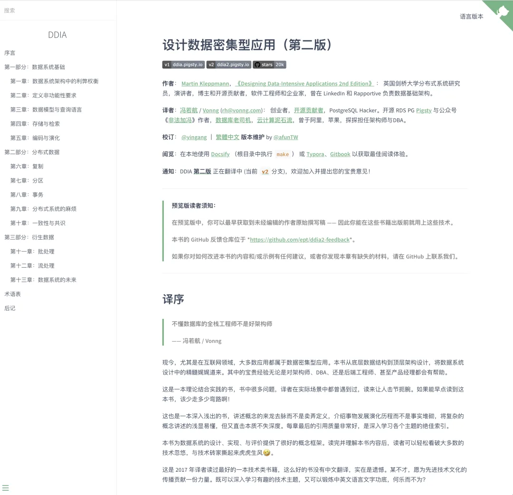
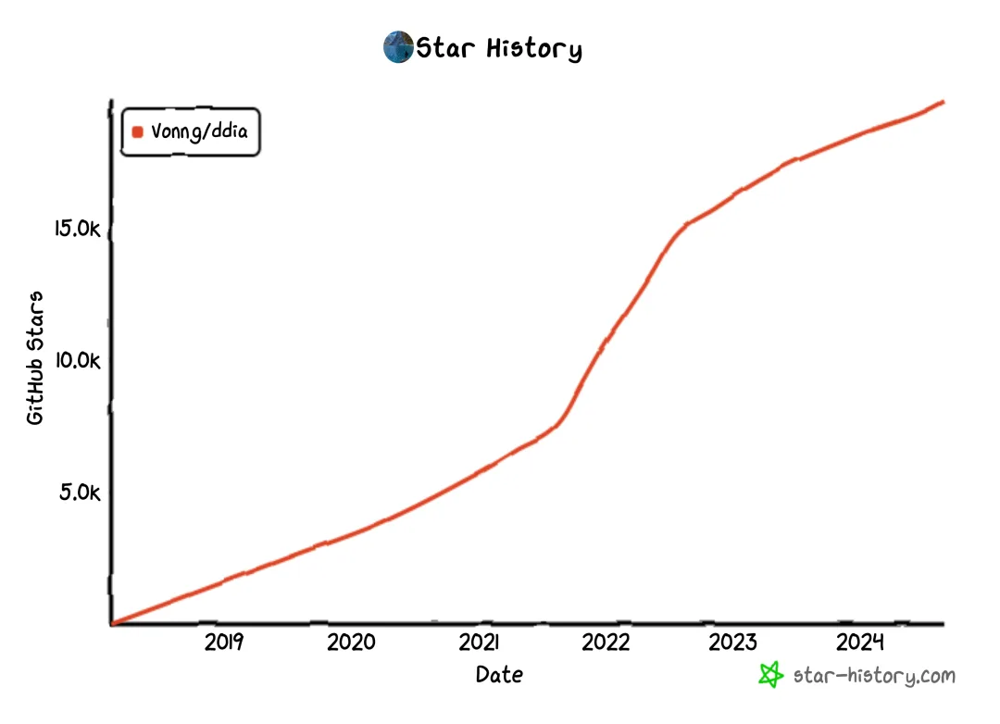
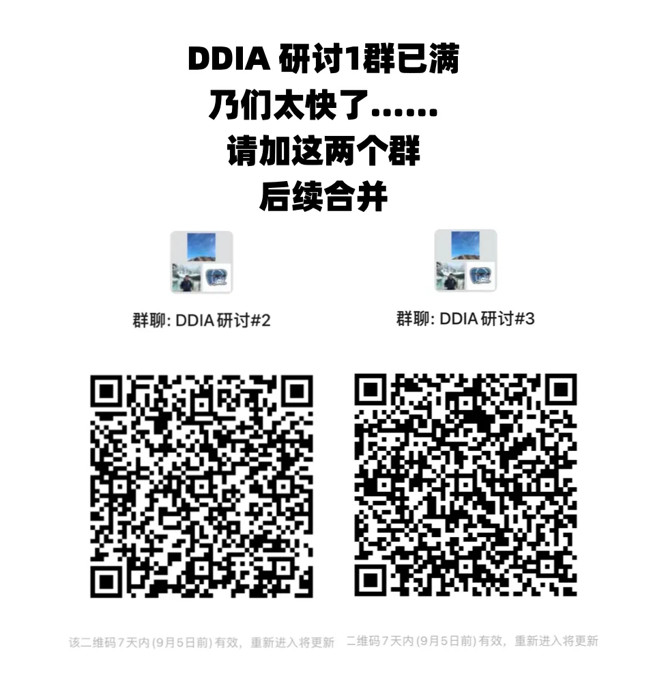

## 《**设计数据密集型应用**》（DDIA）作为一本公认的计算机/互联网名著，终于在在时隔七年后再版，现在处于前瞻预览阶段。目前已经放出了前三章的预览。

## 作为 FAANG 面试必备敲门砖，大厂入职必修课的 DDIA，我相信野猪书的大名已经在程序员中如雷贯耳，无需多言。

## 今天一个上午把这三章一口气读完，确实新增了许多内容，反应了这几年的新趋势，值得一看，强烈推荐。例如，第二版的第一章就完全是全新内容，提出了许多极富洞见的问题：

## DDIA 第一版出来时，我在 GitHub 上拉起了一个开源项目，提供了一个**学习版本**的中文翻译，有许多朋友都参与了进来，已经有 90 位贡献者与近 2 万 Star，打磨出了一个相当完善的中文翻译版本。这种群策群力共享共建的模式，展现出了开源社区的强大力量。

## **<https://github.com/Vonng/ddia>**

## 当然，第二版既然出来了，我也会第一时间跟进并将其翻译成中文。也欢迎感兴趣的朋友参与到这个项目中来。我们有一个关于 DDIA 的交流群：（搜 pigsty-cc 备注 DDIA 拉群）

---

## 数据库老司机

**欢迎微信搜索** **pigsty-cc 加入 PGSQL 交流群**

---

发布版本：[微信公众号](https://mp.weixin.qq.com/s/COhWhb71FXjpDCyV9fqXMQ)
