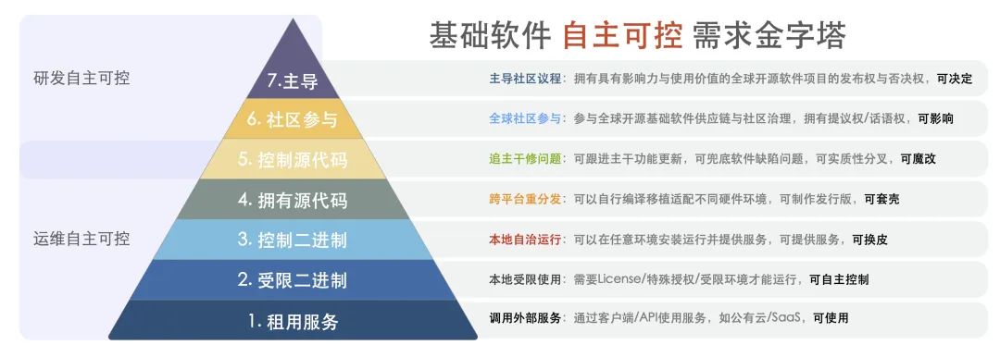
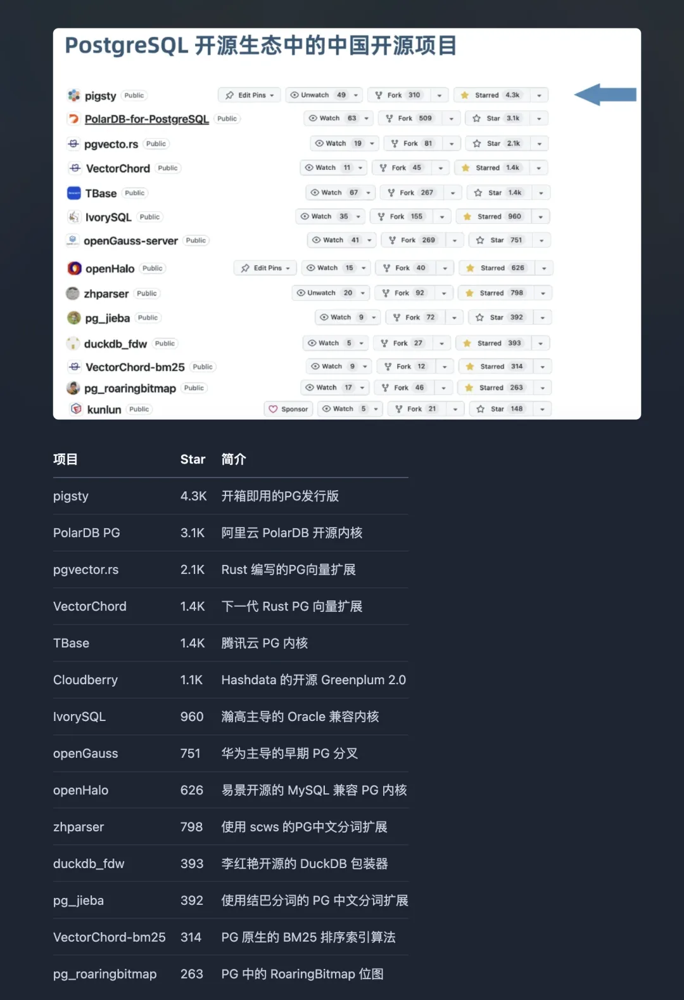

2026 年元旦清晨，当大多数人还沉浸在新年的喜悦中时，中国银行 APP 崩了。

[深入解析：元旦当天华为高斯数据库 BUG，搞摊中国银行 APP](/db/gaussdb-bank-of-china-outage/)

官方说法是技术问题已修复。但在技术圈的私下讨论里，关于数据库连接池被打满无法释放的传闻不胫而走。这不是第一次——半年前的七月，类似的剧本也曾上演过。

放在几年前，看到这种新闻，我会愤怒，也许还会痛心疾首地写篇文章恨铁不成钢。

但今天，看着各种「系统故障」的消息，我内心毫无波澜，甚至有点想笑。

愤怒是留给还有期待的人的。

---

## 一、用「考古学」做创新

让我们先剥去那些「自主研发」、「遥遥领先」的宏大叙事，看一眼赤裸的技术现实。

中国厂商主导的 OLTP 数据库内核，距离世界顶尖水平的差距，保守估计是**十年**。

这听起来刺耳，但代码不会撒谎。以 openGauss 为例，其内核底座是 2012 年发布的 PostgreSQL 9.2。这意味着什么？意味着当我们在 2026 年谈论「国产创新」时，底层流淌的血液属于十四年前的技术。

我们在一个早已被开源社区迭代过无数次的古早版本上，堆砌了大量为了通过信创验收而存在的「特色功能」。

这不叫弯道超车。这叫在老式桑塔纳上焊了个火箭发动机，然后惊讶地发现它跑起来会散架。

---

## 二、代码无罪，罪在「PPT 驱动开发」

但我绝不怪那些写代码的兄弟。

中国从不缺顶尖的数据库工程师。在 PostgreSQL 的全球贡献者名单里，来自 Pivotal 系、阿里云、瀚高、WWIT 等公司的中国数据库开发者们也做出过自己的贡献。他们懂内核，懂架构，也懂什么是好的代码。

悲剧在于，他们的才华被消耗在了一场盛大的「表演赛」中。

在这场比赛里，甲方的核心诉求不是 TPS（每秒事务处理量），而是 PPT。领导需要的不是一个能扛住业务洪峰的数据库，而是一个能写进汇报材料、能通过信创资质审查、能拿到项目的「自主可控」标签。

于是，工程师们被迫放下手中的屠龙刀，开始雕刻萝卜花。

为了证明「自主」，他们不得不修改开源协议允许修改的接口，把通用的变成私有的，把兼容的变成不兼容的。为了证明「可控」，他们把原本繁荣的生态切割得七零八落。

最后交付的产品，往往连开发者自己都捏着鼻子不想用。

但没关系——只要验收会上红章盖下去，这就是一次「伟大的胜利」。

---

## 三、真正的自主可控，不是闭门造车

我们对「自主可控」的理解，似乎从一开始就跑偏了。

2022 年，俄罗斯被西方全面制裁，Oracle 撤了，微软跑了。俄罗斯的金融系统崩了吗？

没有。

因为他们有 Postgres Pro——一个深度定制 PostgreSQL 并持续回馈社区的企业级发行版；有 ClickHouse——一个真正走向世界的实时分析数据库。这些产品不靠政策保护，靠的是硬实力。即便被切断了所有外部商业支持，凭借对开源代码的深刻理解和持续跟进社区主干的能力，系统依然能转。

而我们追求的是什么？

是**研发层面的伪自主**——把开源代码拉个分支，改个名字，宣称「100% 自研」，然后以此为由卖出高价，同时切断与上游社区的联系。

这种做法极其危险。

开源社区是活水。你把水引进来，筑起高墙，搞个封闭的「国产池塘」。几年后，外面的大河奔流不息，你的池塘里只剩一潭死水。当真正需要应对安全漏洞、性能问题时，你会发现——你所谓的「自主代码」，连跟进上游补丁的能力都没有。

2023 年，瑞士政府通过立法，强制要求公共部门优先使用开源软件。这才是想明白了的做法：真正的自主可控，根基在于拥抱开源社区，而不是与之割裂。

用各种资质筑起高墙，最后孵化出来的都是不堪一击的巨婴。

[基础软件到底需要什么样的自主可控？](/db/sovereign-dbos/)

---

## 四、套壳不是原罪，负价值才是

经常有人批评国产数据库是「套壳」。

实话说，套壳本身不是问题。

Linux 发行版是内核的壳，Chrome 是 Chromium 的壳，商业软件的本质往往就是给硬核技术加上一层又一层好用的壳。Red Hat 靠给 Linux 内核套壳，2019 年被 IBM 以 340 亿美元收购；Supabase 给 PostgreSQL 加壳，估值已超过 50 亿美元。你可以说 Cursor 给 VSCODE 套壳，Manus 给大模型套壳，但也丝毫不妨碍它去大杀四方。

问题的关键在于：**你这层壳，到底是增加了价值，还是毁灭了价值？**

好的壳，应该让底层技术更易用、更稳定、更强大——提供开箱即用的高可用方案，集成企业级的监控告警，简化复杂的运维操作，丰富而不是阉割生态。

而相当一部分国产数据库呢？

基于十几年前的内核分叉，把原本好用的连接池中间件搞得连不上了，把标准的监控接口改废了，把社区几百个成熟的扩展插件挡在门外。为了卖自己的配套组件，把开源版本里免费提供的功能阉割掉，或者用十倍指令实现相同的功能。

这不叫增量价值，这叫**价值毁灭**。

这就像把一套免费的精装修的房子拆成毛坯，然后按别墅的价格卖给用户，理由是「这堵墙是我们自己砌的」。

[‍国产数据库是大炼钢铁吗？](/db/db-china/)

[数据库真被卡脖子了吗？](/db/db-choke/)

---

## 五、开发者用脚投票

Y Combinator 有一句格言：「Make Something People Want」——做人们想要的东西。

数据库，也许是企业在采购，但归根结底是给开发者用的。

开发者想要什么样的数据库？

要求其实很朴素：**文档清晰**，而不是语焉不详的 PDF；**生态丰富**，而不是孤岛般的私有协议；**社区活跃**，遇到问题能在 Stack Overflow 上搜到答案，而不是只能提工单等原厂响应；**技能可迁移**，学到的东西换个地方依然有用，而不是被锁死在一个封闭的小圈子里。

去看看 GitHub 吧。

国内这些声势浩大的「国产数据库」，影响力可能还比不上几个纯社区项目。老冯自己一个数据库个人开发者的 [PG 发行版 Pigsty](/pg/forge-a-pg-distro/)的 Star 数量，比阿里，腾讯，华为这些头部大厂重金投入搞出来的开源 PG Fork 内核还要高 —— 这其实是很荒诞的一件事。

开发者在用脚投票，只是这个信号被刻意忽略了。

这不是因为开发者不爱国。

而是因为在代码的世界里，好用就是好用，难用就是难用。**政治正确修不好 OOM，民族情怀也解不开死锁。**

如果不尊重客观规律，客观规律就会用大故障来上课。

[国产数据库到底能不能打？](/db/db-china/)

---

## 六、做好自己的事

几年前，我还会为这些事情感到愤怒。写文章批评，参加讨论，试图推动一些改变。

现在不了。

**我已经过了痛心疾首的阶段，进入了冷眼旁观的状态。**

不是因为不在乎了，而是因为想明白了一件事：这个行业的症结不是技术问题，是利益结构问题。

那些靠信创吃饭的公司，那些靠政府采购活着的产品，那些在发布会上大谈「遥遥领先」的市场话术——它们构成了一个自洽的利益共同体。在这个共同体里，产品好不好用不重要，PPT 好不好看才重要；技术先不先进不重要，故事讲不讲得圆才重要。

你批评它们，它们不会改进产品，只会质疑你的立场。你用数据说话，它们会说你的数据有偏见。你指出技术问题，它们会说这是「发展中的阵痛」。

这套话术我听得太多了，实在没兴趣再辩论。所以我选择：**专注做好自己的事，让时间去检验其他人的**。

当一个行业里的噪音太多时，时间是最好的过滤器。

那些靠政策红利苟活、靠 PPT 画饼充饥、靠信息不对称收割用户的产品，早晚会被淘汰。

而我相信那些真正解决问题、真正创造价值、真正让用户受益的东西，会活下来，继承世界。

二十年后回头看，今天这些喧嚣，大概率只是历史的一个注脚，成为一场滑稽戏。

真正被记住的，永远是那些拿得出手的作品，而不是那些光鲜亮丽的 PPT。

---

发布版本：[微信公众号](https://mp.weixin.qq.com/s/KpR2PYkiwsxkG2N1dPTkEg)
