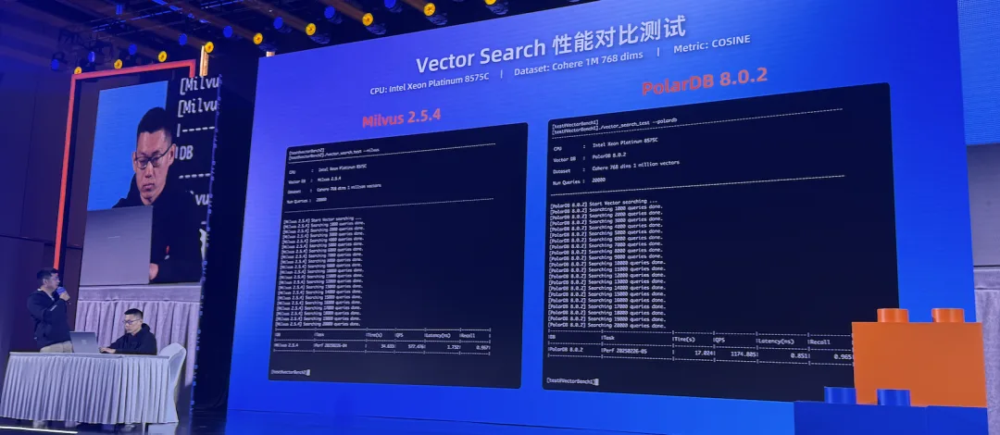
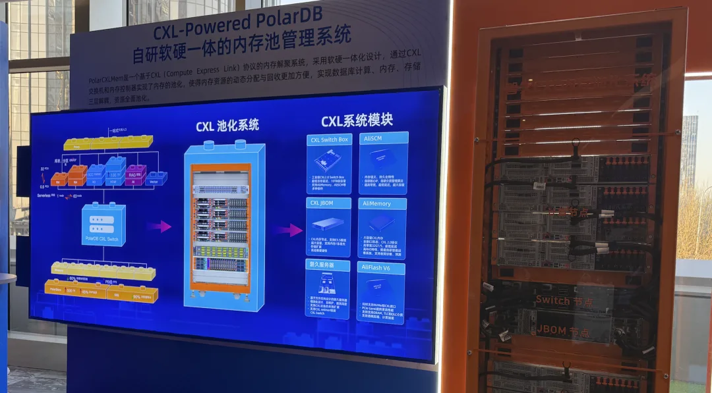
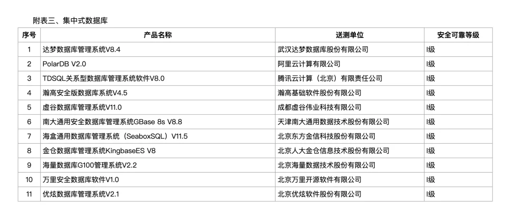
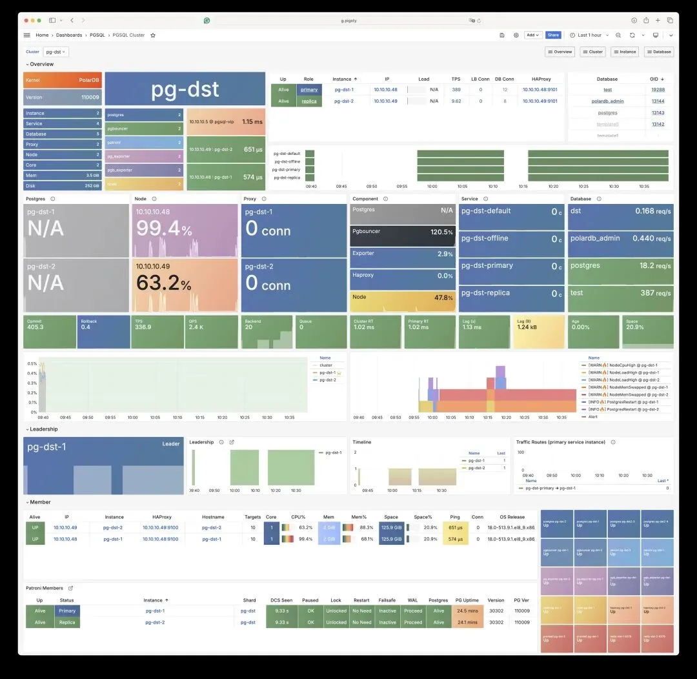

作为[数据库老司机](/db/guru/)、[云计算泥石流](/cloud/exit/)，云与数据库届的双料搅屎王，各种公有云和许多数据库我基本上都批评了个遍，更是没少揶揄过烂泥糊不上墙的 “国产数据库”。

不过有一个例外，虽然我经常揶揄[阿里云](/cloud/aliyun/)和 [RDS](/cloud/rds-failure/)，但我确实一直都没喷过阿里云数据库团队的亲儿子 PolarDB，因为它确实是“国产数据库”里罕见的干实事的团队。

前天 PolarDB 开了个开发者大会，我也去听了听。今天就和大家聊聊，为什么我在国产数据库中看好 PolarDB。总的来说我认为是两个核心原因：走对了深度利用新硬件的路，以可以承受的成本提供了“足够好”的国产化数据库资质。

## 路走对了：集中式+利用硬件

有句话说得好，路选错了，越努力越落后；路选对了，躺着都能赢。

在数据库这条路上，能走得对的就是大胆拥抱新硬件。说实话，在 OLTP 数据库内核上，已经很难再做出什么惊天动地的突破了，开源的 PostgreSQL 已经做的足够好了，PolarDB 能做的说破天也就是锦上添花了。

那么能做出亮眼成绩的地方是哪里呢？我认为向上是做发行版，扩展，服务，向下就是深度结合新硬件。那么，PolarDB 哪儿做得好呢？我认为它做得最亮眼的地方，除了扩展服务和发行版，就是在硬件上的深度融合。

这次 PolarDB 发布会上有一个有趣的 Demo。现场跑了一个 1M 768 维 cos 向量检索的性能评测，PolarDB 碾压专用向量数据库领域扛把子 Milvus，同样的批量检索快了一倍，现场骑脸输出吊打 Milvus —— 一个扩展在性能上吊打专用库，这让人家怎么活？\

虽然没有公布评测的细节，但我想以阿里云的操守应该不至于搞出 尊借 那种评测烂活。更主要的是随后揭晓了这里背后的原理 —— 用了 Intel 处理器 AMX 指令集 —— 也就是处理器直接提供了矩阵运算的指令，那不快才怪了。

除了这个，PolarDB 还在其他硬件上做了不少前沿探索。发布会上展示了一台 CXL 机柜，里面的服务器通过 CXL 技术组建了一个 16 TB 的内存池，所有节点都能访问。旁边还介绍了他们已经开始玩起了 Gen6 的 SmartSSD。

《[面向未来数据库的现代硬件](/db/future-hardware/)》一文中提到过，阿里云在 CXL、RDMA、SmartSSD 上的前瞻布局，确实算是行业前沿的探索。这这比那些天天整些 “分布式/云原生” 烂活的东西高到不知道哪里去了。

我之前也在《[分布式数据库是不是伪需求](/db/distributive-bullshit/)》中提到过，分布式数据库在现代硬件的支持下，基本已经成了伪需求。因为单机，或者更夸张的说，单个机柜池化出来的存储计算能力，已经远远超出了大多数业务需求几个数量级了。

而许多国产数据库由于某些“弯道超车”的想法，一味鼓吹“[分布式数据库](/db/distributive-bullshit/)”，看起来好像和“集中式数据库”分庭抗礼，[但在国际上其实不过是个小众市场](/db/db-china/)，像时序数据库、图数据库和向量数据库一样。而 OceanBase 和 TiDB 这种产品走的路就有些偏了——它们还得搞什么“分布式一体化”，HTAP 来找补。

PolarDB 选择把精力花在拥抱新硬件上，走上了现代硬件高速发展的康庄大道。与此同时，PolarDB PG 选择 100% 兼容 PG 生态，包括信创国产也押注 PostgreSQL 生态，可以比较充分的利用 [PostgreSQL 生态的进步](/pg/pg-eat-db-world/)。

这算是新太子的拨乱反正（PGSQL + 新硬件），对 OB 路线的否定（MySQL + 分布式）。这两条核心战略对了（PG+新硬件），未来发展就不会有大的问题。

## 低成本解决国产化的问题

PolarDB 的第二个优势，就是可以用低成本解决国产化的问题。

这里插一句题外话，Deepseek 为什么成功？是因为 DS R1 比 o1-pro 更强吗？那到未必。重要的是 Deepseek 在“**足够好**” 的前提下开源！开源意味着可控，打破了商业公司对顶级 AI 的垄断！更重要的是这个是中国团队主导开源的，这意味着 “自主”。所以 Deepseek 能火，第一因为 “足够好”，第二因为 “自主可控”。

当然数据库领域其实早就已经经历过 DeepSeek 时刻了，所谓卡脖子的 “Oracle” 早就被 PostgreSQL 给替代了。现在的 PostgreSQL 不论是性能，功能，正确性，都可以理直气壮的[指着 Oracle 的鼻子揶揄](/db/oracle-pg-xact/)。Deepseek 出来之后，百模大战的其他玩家基本都成为了笑话。那么 PostgreSQL 为什么没有这么快淘汰掉百库大战（300+国产数据库）的国产数据库呢？我看主要还是因为 PostgreSQL 的核心开发团队没啥中国人导致的。PostgreSQL 足够好，也开源可控，但是没有中国人的团队来发挥影响力或者进行深度整合，导致 “不自主”。（[基础软件到底需要什么样的自主可控？](/db/sovereign-dbos/)）

[国产数据库到底能不能打？](/db/db-china/)

[**‍国产数据库是大炼钢铁吗？**](/db/great-leap-db/)

[中国对 PostgreSQL 的贡献约等于零吗？](/pg/china-pg-contribution/)

[机场出租车恶性循环与国产数据库怪圈](/db/airport-taxi-db/)

[EL 系操作系统发行版哪家强？](/db/rhel-compatibility/)

[基础软件到底需要什么样的自主可控？](/db/sovereign-dbos/)

[分布式数据库是伪需求吗？](/db/distributive-bullshit/)

就像 Deepseek 站在 Google / Meta 前人的肩膀上大获成功一样，遵循同样的逻辑，完全可以有中国人的团队，站在国际开源运动的基础上，在数据库领域对 PostgreSQL 做出突破性的创新与整合。比如，通过将成本降低一个数量级来实现掀桌子的玩法，来实现 Deepseek 式的胜利 —— 这是俺的开源项目 [Pigsty](/pigsty/v3.0/) 正在做的事！ —— 通过云下自建 RDS PG，将企业级 RDS 的成本低一个数量级。

但是 PolarDB 有没有可能通过更底层的深度硬件融合，从另一个维度实现这一点呢？我觉得存在这种可能性，而这种可能性是我在其他“国产数据库”上看不到的。

---

当然话又说回来了，我们都知道，这几年信创政策引发了不少乱象。很多国产数据库厂商拿开源的 PG 和 MySQL 套上个皮，魔改一番就卖了，就跟之前的百模大战差不多。结果用户们都苦不堪言——本来 PostgreSQL 和 CentOS 用得好好的，突然要花钱给自己找罪受。

作为一个 PostgreSQL 大法师，看着信创名录里那些数据库，我的真实想法是—— 这都是什么****。PolarDB 2.0 起码看上去比较顺眼——完全兼容 PostgreSQL 14（据说下一版会支持 PG 18），还提供了 Oracle 兼容性，完全可以当成 PG 14 来用。

而 PolarDB 的定价也是有点意思——按照节点收费，一个节点五万每年。如果你被迫“国产化”，买个节点把合同和版本截图给审计过了事，剩下的你用不用都随意，无论是继续用 PostgreSQL，或者用 PolarDB 的 PG 模式/Oracle 模式都行。

顺带一提，Pigsty 和 PolarDB 其实有合作，我们能提供把数据库内核打包成 RDS 服务的能力。我们可以直接在 Linux 裸机上运行，不需要那些繁琐的 K8S 云底座和什么 DBStack / Docker 全家桶，而且完全免费开源支持 PolarDB for PostgreSQL，当然，你也可以继续免费运行原汁原味的 PostgreSQL RDS！

之所以选择 PolarDB，当然是因为我们有许多用户都有 “国产化”的烦恼，现在有这样一个花点小钱就能同时解决面子与里子的方法，当然是皆大欢喜。

所以，如果你都付费买 PolarDB for Oracle 的内核包了，我也很乐意一起卖给你一套专门针对信创环境定制的付费版 Pigsty 企业版，收费当然是因为 —— 请用真金白银打钱支持国产系统和芯片（如果你用开源的 PG，Linux 就免费！）。

找我买 PolarDB 同捆包有折扣！当然你也可以找阿里云销售去买 Pigsty 企业版。总之重点是：用户可以用相当公道的价格，获得一个真正能用/好用的“国产化数据库”解决方案。

PolarDB PG 选择开源并 100% 兼容 PostgreSQL 是非常重要的，如果它不开源，那么我确实不会多看哪怕一眼。而且，支持 PolarDB 并不违背俺推广 PG 的初心。说到底，如果是像 虎王德国大数学家数据库 这样的玩意，倒找给我多少钱我都不会去看哪怕一眼的。

### pigsty-cc 小助手

[国产数据库到底能不能打？](/db/db-china/)

[‍国产数据库是大炼钢铁吗？](/db/db-china/)

[中国对 PostgreSQL 的贡献约等于零吗？](/pg/china-pg-contribution/)

[机场出租车恶性循环与国产数据库怪圈](/db/airport-taxi-db/)

[EL 系操作系统发行版哪家强？](/db/rhel-compatibility/)

[基础软件到底需要什么样的自主可控？](/db/sovereign-dbos/)

[分布式数据库是伪需求吗？](/db/distributive-bullshit/)

[第二批数据库国测名单：国产化来了怎么办？](/db/db-national-test-2/)

---

发布版本：[微信公众号](https://mp.weixin.qq.com/s/iVgV_sT5V6AE1v4thJD8ow)
