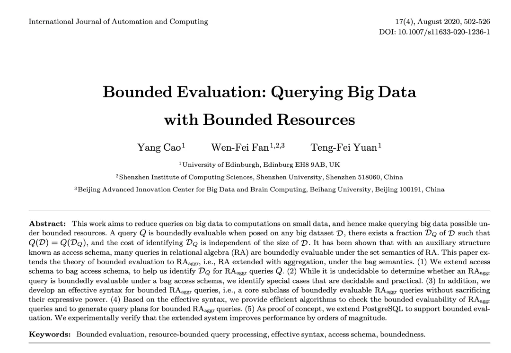
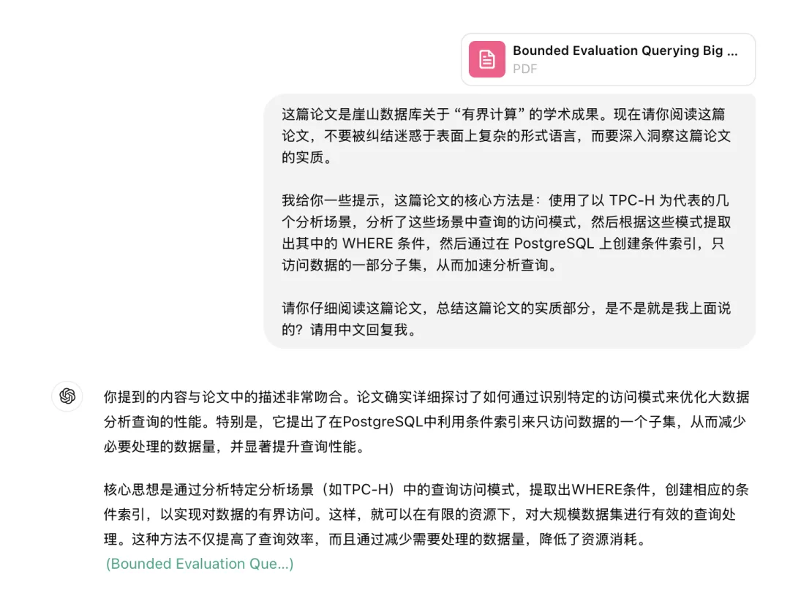

最近有个国产数据库开了个发布会，看到圈子里几位数据库博主在推。老实说，看得人尴尬癌都犯了。

这个数据库名字一看就是打爱国牌的玩家。还找了个院士背书。当然，你懂的。

总之，专业人士是懒得看这些营销胡话的，我想看看有什么实质的东西。官网上，说自己有个什么 “有界计算” 核心科技，非常牛逼之类的。

翻了半天，总算搜到了这篇深圳计算院 “有界计算” 的论文。论起制造学术 XX，俺还是颇有心得，一看这满屏的代数 —— 呵，熟悉的味道。

简单看了一下关键部分，用 PostgreSQL 做实验，用 TPC-H 和其他俩分析场景做案例。TPC-H 仓数也很小，16GB，太迷你了 —— 有请 GPT 帮我确认下内容：

核心科技 “有界计算”：给 PG 加个条件索引。

数据库加索引，所以会快。

---

发布版本：[微信公众号](https://mp.weixin.qq.com/s/MrRsK5lqZsCZwCUnnO1VMQ)
