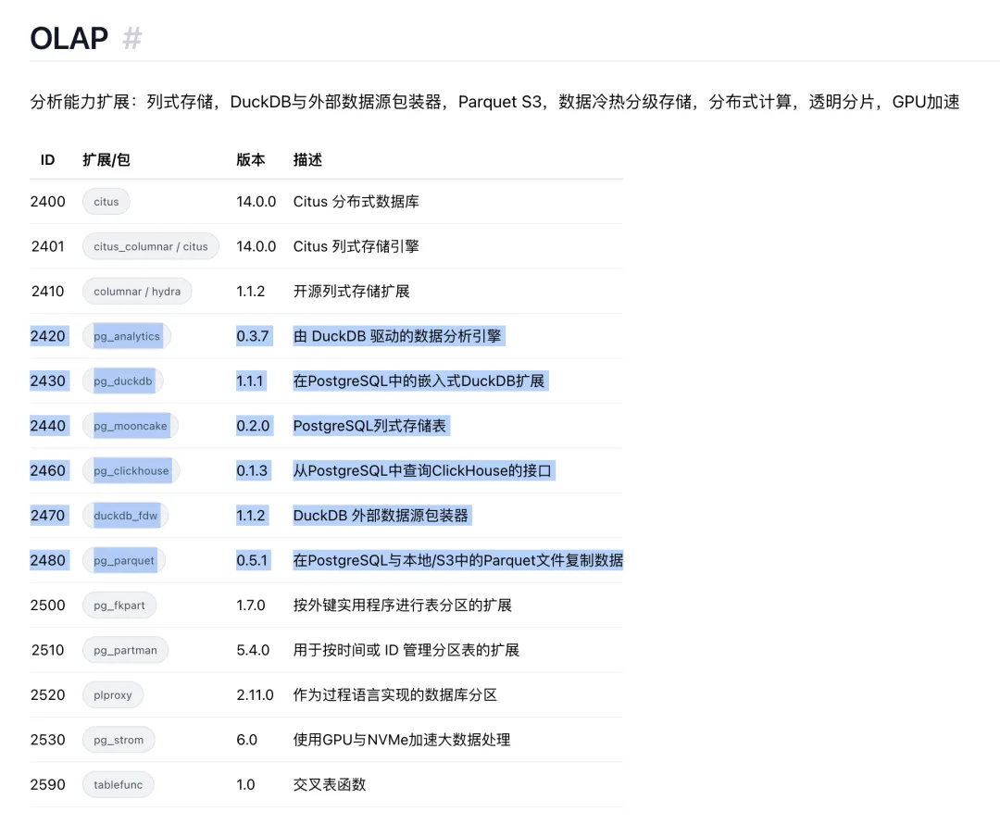

DuckDB 最近举办了首届 DuckDB 开发者大会，里面有四个有趣的议题，老冯这里从视频中提取了文字稿，然后请 Claude / GPT 整理成完整的文章，在这里与大家分享，看看 DuckDB 生态的最新进展。以及最后附上老冯对 DuckDB 生态的点评

四篇演讲分别是：

DuckDB 扩展：过去、现在、与未来

DuckDB 中的存储与加密

DuckPL：DuckDB 中的一种存储过程语音（PL/PGSQL）

GizmoEdge：用于物联网的分布式 DuckDB 引擎

---

## DuckDB 扩展：过去、现在与未来

## 引言

大家好，我是 Sam Ansmink。今天我将为大家介绍 DuckDB 扩展。今天上午 Rusty 已经深入讲解了扩展开发的细节，而我会从更高层次来审视 DuckDB 扩展的全貌——回顾它的发展历程，了解当前状态，并展望未来方向。

今天的内容分为三个部分：首先是简介，让大家对 DuckDB 扩展有基本了解；然后我们会回顾过去，看看整个扩展框架和生态系统是如何一步步发展起来的；接着是现在，了解当前的最佳实践和现有功能；最后我会分享一些未来的规划和发展方向。

## 自我介绍

我是 Sam Ansmink，在 DuckDB Labs 工作已经超过四年了。在加入 DuckDB Labs 之前，我在阿姆斯特丹的 CWI（荷兰国家数学与计算机科学研究中心）完成了硕士论文——那里正是 DuckDB 的诞生地。CWI 有一个数据库架构研究组，我的硕士论文课题是在 DuckDB 中实现加密查询执行。

毕业后我加入了当时还是一家小型创业公司的 DuckDB Labs，参与开发了多个扩展，同时也深度参与了扩展框架本身的建设，包括扩展模板、各种 API 以及用于部署和测试的 CI/CD 流水线。

## 什么是 DuckDB 扩展？

DuckDB 扩展本质上是一种为 DuckDB 核心功能添加或修改功能的方式。它可以实现很多东西：表函数、数据类型、文件系统、目录、加密模块等等。

举几个例子：JSON 扩展可以帮你读取 JSON 文件；PostgreSQL 扩展可以与 PostgreSQL 数据库集成；还有一些更有趣的社区扩展，比如 Google Sheets 扩展，可以直接从 Google 表格读写数据。当然也有一些比较小众的扩展，这也是科学研究的常态。

## 为什么需要扩展？

这个问题很关键，我认为主要有以下几个原因：

**二进制文件大小**：DuckDB 是一个嵌入式数据库，我们希望它能在任何地方运行。如果二进制文件达到 3GB，那就成问题了，因为我们也需要在存储和内存受限的环境中运行。通过扩展机制，用户可以自行决定功能集和二进制大小之间的平衡。

**零依赖**：你可能听说过 DuckDB 是零依赖系统。这是真的，但我们确实想利用很多优秀的外部库。解决方案就是把这些依赖推到扩展里。DuckDB 核心保持零依赖，而扩展则可以使用这些依赖来实现特定功能。只有当你需要某个功能时，才会引入相应的外部依赖。

**功能不兼容**：有些功能之间存在互斥性。比如不同的 SQL 方言可能相互不兼容，扩展是处理这种情况的好机制。

**不同的维护者**：不同的人可以维护不同部分的代码，这也是扩展机制带来的灵活性。

## 如何使用扩展？

即使你认为自己没有使用 DuckDB 扩展，实际上你可能已经在用了。DuckDB 会自动安装和加载扩展。

举个例子，当你执行一条简单的查询，从网络上的 JSON 文件中 `SELECT *` 时，DuckDB 会在后台自动为你安装和加载两个必需的扩展（HTTP 文件系统扩展和 JSON 扩展）。这个过程完全透明，你甚至不会注意到。当然，你也可以选择手动安装和加载扩展。

## 扩展从哪里获取？

我们有一个叫做"扩展仓库"的概念，目前有两个仓库：**Core（核心）**和 **Community（社区）**。核心仓库包含所有由 DuckDB 官方维护的扩展，社区仓库则由社区成员维护。

使用起来非常简单，直接用 SQL 就可以安装。默认从核心仓库安装，如果想安装社区扩展，只需指定 `FROM community` 即可。

## 发展历程回顾

让我们来看看 DuckDB 扩展的发展历程：

- **2018 年**：DuckDB 在 CWI 的第一次代码提交
- **2020 年**：扩展机制诞生——这是 DuckDB 能够将代码放入扩展并加载的核心能力，至今仍是 DuckDB 加载扩展的基础方式
- **2021 年**：核心仓库建立——用户可以通过 `INSTALL` 语法自动安装扩展
- **2023 年**：C++ 扩展模板发布——这是一个关键节点，我们不仅自己能构建扩展，还告诉社区"你们也可以这样做"。这个模板现在被大多数核心扩展和社区扩展使用
- **2024 年**：社区仓库建立——让社区开发者能够轻松部署扩展，用户安装社区扩展和核心扩展一样方便
- **之后**：Rust 扩展模板和 C 扩展模板相继发布

在扩展方面，第一个重要扩展是 **ICU**（国际组件库），它是一个相当大的库，正是因为它太大了无法放入核心，才催生了扩展机制。之后陆续出现了 Parquet、HTTP 文件系统、PostgreSQL、Delta Lake 等扩展，最近还有去年发布的 **DuckLake** 扩展，实现了我们自己的开放湖仓格式。

## 现状

DuckDB 扩展现在非常普及。看一些数据：

- **32 个**核心扩展
- **145 个**社区扩展
- 核心扩展每周下载超过 **2700 万次**
- 社区扩展每周下载超过 **50 万次**

与 DuckDB Python 客户端的下载量相比，这些数字也相当可观。这说明 DuckDB 扩展已经成为使用 DuckDB 不可或缺的一部分，这当然也与我们的自动加载机制有关，很多人确实依赖 Parquet、HTTPS 等功能。

## 当前的扩展构建方式

目前我们有三种扩展模板：

1.**C++ 扩展模板**（推荐）：使用 DuckDB 的不稳定 API2.**Rust 扩展模板**（实验性）：理论上很好但有一些局限，目前也基于不稳定 API3.**C 扩展模板**：支持 C 和 C++，是第一个使用稳定 API 的模板

关于维护者，核心仓库中的扩展分为三类：

- **主要核心扩展**：获得 DuckDB Labs 最高级别支持
- **次要核心扩展**：可能更实验性，支持力度稍小
- **第三方核心扩展**：由 DuckDB Labs 的合作伙伴维护

社区仓库的扩展则由社区成员维护。

## 当前面临的挑战

我们的主要推荐方式是使用不稳定的 C++ API，这带来一些问题：

- **每个版本都需要重新构建所有扩展**：这是一个负担
- **扩展维护成本高**：每当 DuckDB 核心工程师修改了被很多扩展使用的 API，就会破坏这些扩展，维护者需要花时间修复
- **难以编写文档**：API 是一个不断变化的目标，要么投入大量精力更新文档，要么文档就会过时

## 未来方向

解决方案是使用**稳定的 C API**。稳定 API 带来的好处显而易见：

- **稳定性**：编译一次的扩展可以在多个版本上持续工作
- **良好的互操作性**：作为 C API，可以更好地与 Rust 等其他语言集成
- 扩展维护者可以构建扩展后"放心忘记"，它会持续工作

我们的目标是：

1.**扩展 C 扩展 API 的功能**：目前正在努力添加更多特性，以便更多扩展能够迁移过来 2.**稳定化 Rust 和 C 扩展模板**：利用日益强大的稳定 API3.**尽可能多地迁移现有扩展**：评估哪些适合用 Rust，哪些适合用 C/C++

时间表方面，虽然我们不倾向于公开承诺日期，但内部目标是在 **v1.6** 实现这些主要改进（v1.5 将在几周后发布，v1.6 预计在几个月后，大约今年夏天）。

## 问答环节要点

**关于私有扩展仓库**：DuckDB 已经支持这个功能。你可以将 DuckDB 设置为无签名模式，从任意位置安装和加载扩展；或者编译你自己的 DuckDB 版本，把闭源扩展静态链接进去。

**关于 Iceberg 扩展的分区写入支持**：这是高优先级的功能，预计在 V2 支持完成后就会着手，可能在 v1.5 的某个 bug 修复版本中就能实现。

**关于安全性**：默认模式下 DuckDB 会自动加载扩展，这是为了最佳的开箱体验。但如果你构建的是安全关键系统，可以参考我们的"Securing DuckDB"文档，比如编译自己的版本并静态加载扩展、禁用扩展安装等。

**关于社区扩展的安全审计**：首先，**自动加载只对 DuckDB 核心团队控制的扩展有效**，我们永远不会自动加载社区扩展。社区扩展的安全管理方式与其他包管理器类似——用户需要自己评估是否信任某个扩展。所有社区扩展都必须开源，你不能直接上传二进制文件到社区仓库。这需要社区的共同检查，我们也会主动排查恶意扩展。

## 总结

- DuckDB 拥有相当完善的扩展生态系统
- 扩展下载量巨大，维护者社区不断壮大，提供了各种我们从未想到过的功能
- 目前推荐的 C++ API 能深入 DuckDB 内部，但代价是不稳定
- 我们正在构建新的稳定 C API，将大大改善扩展的维护体验

## DuckDB 中的存储与加密

## 引言：存储与加密

大家好，欢迎来到我的演讲。今天我将为大家介绍 DuckDB 中的存储与加密。你可能会好奇为什么要把存储和加密放在一起讲——这是因为要真正理解加密是如何实现的，你至少需要从高层次上了解 DuckDB 的存储机制是如何工作的。

## 自我介绍：存储与加密

先介绍一下我自己。我在阿姆斯特丹大学完成了硕士学位，硕士论文是在微软的一个数据库团队（Citus Data）完成的，主题是分布式 PostgreSQL。那是我第一次接触数据库内核和计算机科学基础知识，因为我本科其实并不是计算机科学专业。

但在那之后，我发现自己非常喜欢这个领域。于是我获得了去 CWI 的机会，在那里从事数据库与安全交叉领域的研究。最终，这段经历把我带到了 DuckDB Labs。目前我是 DuckDB Labs 的软件工程师，过去一年我为 DuckDB 的加密功能做出了相当多的贡献。

---

## DuckDB 如何保护你的数据？

首先我想强调的是，DuckDB 保护的是**静态数据**（data at rest）。这意味着数据只在写入磁盘的那一刻才会被加密。

DuckDB 有两种加密方式：

### 1. Parquet 加密

Parquet 加密已经存在一段时间了，大约两年前在 0.10 版本中就已发布。DuckLake 在加密模式下也使用 Parquet 加密，本质上就是写入加密的 Parquet 文件。

使用方法很简单：通过 `PRAGMA` 添加加密密钥，然后就可以将明文 Parquet 文件复制为加密的 Parquet 文件。

### 2. 数据库文件加密

数据库文件加密不仅加密主数据库文件，还会加密**预写日志**（Write-Ahead Log，WAL）和**临时文件**。在本次演讲中，我会按照这个顺序介绍这三种不同类型的文件。

加密数据库文件也很简单：只需在附加数据库时指定加密密钥，还可以选择指定加密算法（如 GCM）。

## 加密算法

DuckDB 使用**高级加密标准 AES**。这个加密标准有多种加密模式，DuckDB 目前支持两种：**GCM** 和 **CTR**。

今天我不会深入讲解这些加密模式的工作原理，但有一点很重要：这两种都是**随机化加密算法**。这意味着即使你使用相同的密钥，对两个完全相同的明文进行加密，也会产生不同的密文（前提是实现正确）。这一点很重要——攻击者查看你的加密数据时，永远无法推断出底层数据是否相同。

### 关于 GCM 模式

GCM 是一种行业标准加密算法，被广泛应用于各种系统。有几个要点需要了解：

- **Nonce（一次性数字）/ 初始化向量（IV）**：这是一个唯一的字节序列，DuckDB 在加密每个数据块之前自行生成。它确保所有数据以随机化方式加密。
- **Tag（标签）**：GCM 在加密数据块后会计算一个标签，本质上类似于校验和，但具有更强的安全保证。

## 密钥管理

当你输入加密密钥时，DuckDB 并不会直接使用这个密钥来加密数据。相反，它会将你的密钥输入一个**密钥派生函数**（Key Derivation Function）。这个函数还会接收一个随机的数据库标识符作为输入，最终生成一个安全的 32 字节加密密钥，这个密钥才是实际用于加密数据的密钥。

这种设计的好处是：即使你使用相同的密钥加密多个不同的数据库文件，实际使用的加密密钥也是不同的，这是一层额外的安全措施。

**重要提示**：请永远不要使用同一个密钥加密多个不同的文件，这通常被认为是不安全的。

### 密钥验证机制

当你加密数据库文件时，我们会使用一个小技巧来验证解密时使用的密钥是否正确。我们会加密一段已知的明文——在 DuckDB 中这段文本叫做"ducky"——并将其作为元数据存储在数据库头部。当你尝试读取加密文件时，我们首先会查找这段元数据并尝试解密。如果成功，说明密钥正确；如果失败，我们会提前终止并报错。

### 安全的密钥缓存

如果密钥验证通过，我们会将密钥存储在一个**安全的加密密钥缓存**中。这个缓存与普通缓存不同：我们精确跟踪密钥存储的位置，并**锁定密钥所在的内存区域**，防止密钥被意外交换到磁盘。此外，当你不再使用密钥时，我们会确保密钥从内存中被完全清除。

## DuckDB 存储结构

要理解加密机制，需要先了解 DuckDB 的存储结构。

### 文件头部

当 DuckDB 写入文件时，首先会写入数据库头部：一个主头部和两个数据库头部。

**主头部**包含：

- 校验和（检查头部是否损坏）
- 魔数（Magic bytes）
- 存储版本
- 标志位（例如指示文件是否已加密）
- 数据库标识符
- 加密元数据

**数据库头部**包含：

- 迭代计数
- 文件中的块数量
- 块大小
- 向量大小
- 序列化兼容性版本

### 数据存储

在头部和元数据之后，DuckDB 以**行组**（Row Groups）的形式存储实际数据。这与 Parquet 类似，DuckDB 中一个行组大约包含 12 万行。行组被分割成**列段**（Column Segments，内部称为 Column Data），列段又进一步划分为**块**（Blocks）。

块的结构很简单：

- 固定大小为 **256 KB**
- 包含一个 8 字节的块头部（存储检查点信息）
- 其余空间用于存储数据

值得注意的是，DuckDB 在存储数据到块之前会先尝试压缩数据，256 KB 的块大小对我们使用的压缩算法来说效率很高。

## 主数据库加密

**注意**：1.4 版本和 1.5 版本的加密结构略有不同，我这里介绍的是即将在大约两周后发布的 DuckDB 1.5 版本的结构。

### 头部加密

DuckDB **不加密主数据库头部**，原因有二：

1.主头部不包含敏感数据，攻击者读取也无妨 2.我们需要读取其中的加密元数据来确定使用的加密算法、密钥大小等信息

但是，**后续的数据库头部以及之后的所有数据都会被加密**。

### 块级加密

我们选择在**块级别**进行加密，主要有三个原因：

1.**压缩优先**：我们可以先压缩数据再加密，减少需要加密的数据量 2.**大小合适**：块的大小刚好可以容纳初始加密开销 3.**按需解密**：执行查询时，你很可能不需要读取整个数据库文件，这样可以只解密计算查询结果所需的那些块

对于加密的块，块头部从 8 字节变为 **40 字节**：

- 前 12 字节：Nonce
- 接下来 16 字节：Tag
- 4 字节空白（用于对齐）
- 8 字节：加密后的校验和

我们也会加密校验和，这是一个额外的安全措施，防止攻击者提前读取。

## 预写日志（WAL）加密

预写日志是一个**追加式文件**。当你对数据库做出更改时，更改会先写入 WAL，然后才会传播到主数据库文件。WAL 主要用于**崩溃恢复**，也对 ACID 事务（原子性、一致性、隔离性、持久性）很重要，某些数据库系统还用它来提升性能。

### WAL 结构

WAL 的结构如下：

- 首先是元数据（WAL 版本）
- 然后是数据库标识符（用于确认 WAL 是否属于当前数据库文件）
- 之后按条目存储每个更改

每个 WAL 条目包含：

- 长度前缀（指示需要读取多少字节）
- 校验和（检查条目是否损坏）
- 条目内容

### WAL 刷新时机

大多数时候你可能不会注意到 WAL 的写入，因为 WAL 会在特定时间点被刷新：

1.手动触发检查点时 2.DuckDB 执行自动检查点时（当 WAL 超过一定大小时）3.正常关闭数据库时（如果崩溃，WAL 会被保留用于恢复）

### WAL 加密方式

对于 WAL 加密：

- **元数据保持明文**：我们需要确定 WAL 是否已加密
- **按条目加密**：每个条目单独加密

加密后的条目结构：

- 长度（明文，因为需要知道要解密多少字节）
- Nonce
- 加密后的校验和和条目内容
- Tag

## 临时文件加密

临时文件在数据**溢出到磁盘**时产生，这可能发生在执行需要大型聚合或大型连接的复杂查询时。

通常 DuckDB 会在查询执行后自动清理这些文件，但在崩溃情况下它们可能会被遗留。因此我们也需要加密这些文件。临时文件的结构与块和 WAL 条目类似，加密方式也相同。

我们在去年 11 月发布了一篇博客文章，如果你想了解更多关于 WAL 加密或临时文件加密的内容，可以参考那篇文章。

## 加密 API

正如刚才 Sam 在扩展演讲中提到的，DuckDB 不希望有任何外部依赖，但我们确实需要一个 proper 加密 API。OpenSSL 是理想选择，但我们不能直接将它链接到 DuckDB 核心中。

### 从 mbedTLS 到 OpenSSL

最初的 Parquet 加密实现使用了一个叫 **mbedTLS** 的库，我们精简后放入了 DuckDB 核心。但问题是 mbedTLS 只依赖纯计算，不利用任何**硬件指令**，导致速度相当慢。

我们需要 OpenSSL。

### 巧妙的解决方案

我们注意到，使用 DuckDB 的人通常也会使用 **HTTPS 扩展**，而这个扩展需要 OpenSSL。所以我们做了一个技巧：当你加载 HTTPS 扩展时，我们会用 OpenSSL 的加密 API **覆盖** mbedTLS 的加密 API。这样，只要加载了 HTTPS 扩展，你的加密就会获得硬件加速。

实际上，现在我们在大多数情况下会**自动加载 HTTPS 扩展**。这是因为写入加密数据库需要使用安全的随机数生成器，而安全的随机数生成器需要专用的硬件指令支持。因此，我们禁用了 mbedTLS 写入加密数据库文件的功能。

好消息是，使用 OpenSSL 时，读取加密数据几乎不会有明显的性能下降，因为它非常快。

## 总结：存储与加密

本次演讲的主要要点：

- DuckDB 能够通过 **Parquet 加密**和**数据库文件加密**来加密静态数据
- 加密范围包括数据库文件、预写日志和临时文件
- 加密密钥得到**安全管理**
- 加密带来的**性能开销可以忽略不计**

感谢大家！

## 问答环节要点：存储与加密

**Q：加密块是如何被扫描的？元数据和统计信息存储在哪里？**

A：DuckDB 在存储实际数据之前会存储大量元数据，包括指向特定行组统计信息的指针等。基于这些信息，DuckDB 可以跳过大量数据，并且知道需要解密哪些块。元数据不在块本身中，而是单独存储的。

**Q：如果只需要检索块中的一行数据，是否需要解密整个块？**

A：理论上如果使用 CTR 模式可以实现随机访问，但 DuckDB 目前的实现需要解密整个块。不过实际上，即使你只需要读取一行数据，DuckDB 也需要读取整个块。

**Q：用于验证密钥的"ducky"这个词很短，是否存在碰撞风险？**

A：确实存在一定风险，但我们不想占用太多空间，这是一个权衡。未来可能会调整这个设计。

**Q：块头部中的空白部分是什么用途？**

A：有两个原因。首先，Nonce 的大小理论上可以改变（虽然我们现在固定为 12 字节）。其次，块头部设为 40 字节是因为我们需要计算整个块数据的校验和，校验和需要 8 字节对齐，所以用 4 字节的空白来实现正确的对齐。

**Q：Nonce 是如何生成的？是随机生成一次然后递增吗？**

A：Nonce 由随机数生成器生成 12 字节的随机数据。根据加密模式不同，加密 API 会在这 12 字节末尾添加计数器，所以实际的 Nonce 是 16 字节。每加密 16 字节数据，计数器就会递增。这由加密 API 内部处理。

**Q：既然有认证标签，校验和还有必要吗？**

A：严格来说不是必需的，不做校验和可以作为一个优化。但我们选择保留它，宁可安全一些。

**Q：数据库大小会增加多少？**

A：对于常规数据库加密，大小开销基本可以忽略。WAL 的大小会增加得更多，因为每个条目都需要存储 Nonce 和 Tag。如果你进行大量快速更新，WAL 可能会显著增长，但这种情况比较少见。

**Q：密钥管理有什么最佳实践？比如是否可以使用外部密钥保管库？**

A：我的建议是：你输入的密钥越安全，加密就越安全。我们确实允许使用很短的用户密钥，但显然这会影响最终加密的安全性。大多数用户会使用 **KMS**（密钥管理服务）来管理密钥。

---

## DuckPL：在 DuckDB 中实现 PL/pgSQL 用户自定义函数

## 演讲者介绍

大家好，我先简单介绍一下自己。我从 2020 年初就开始成为 DuckDB 的长期贡献者，这要感谢 Hannes——因为他当时不想实现递归 CTE。而我今天要讲的用户自定义函数项目，恰恰需要用到递归 CTE，所以我最终自己动手实现了它。

在 DuckDB 项目中，当查询去相关化或优化器的某些地方出现问题时，我通常也会参与修复。在日常工作中，我来自学术界，主要研究方向是查询优化、执行引擎设计，以及用户自定义函数——更具体地说，是如何消除它们。今天来介绍这个项目确实有点讽刺。我对编译器和编程语言也很感兴趣，这一点待会儿会变得很重要。

## DuckDB 用户自定义函数的现状

目前 DuckDB 支持宏（Macro），这是一种简单的文本替换机制，可以用于简单的表达式。它们确实很好用，也有很多用户在使用。但问题是，你无法在其中使用 if 语句——比如当条件为真时执行某些操作，条件为假时执行其他操作。你也无法在里面放入 `CREATE TABLE` 语句然后返回结果。

我知道你们中的大多数人可能会用 Python 或 R 来定义 UDF，这当然没问题。但我认为这在某种程度上打破了 DuckDB"单文件、零依赖"的承诺。这正是我想要解决的问题——DuckPL 项目的核心理念就是在 DuckDB 内部提供 PL/SQL 接口。

## DuckPL 是什么

我想提供的是让用户能够直接在数据库系统内部使用用户自定义函数的能力。举个简单的例子，这个函数计算 Collatz 猜想需要多少步才能达到终点。有趣的是，我可以使用 while 循环、if 语句、在代码中定义变量，当然也可以返回值并调用这个函数。

如果你问我大学里的德国同事，他们会说："你不需要 UDF，用纯 SQL 就行。"对于这个简单的例子来说确实可以，但当 UDF 变得复杂时，纯 SQL 方案就不那么容易实现了。而且如果能在系统内部直接执行这些函数，就不需要任何外部依赖。

让我演示一下。我这里运行着一个内存数据库，直接把刚才幻灯片上的 Collatz 函数粘贴进去，函数就注册到数据库系统中了。现在我们可以直接调用它——它能工作，计算出了结果。就这么简单。我可以使用循环、条件判断，想做什么都可以，而且一切都在系统内部完成。

## 系统架构

要让这个演示正常工作，需要几个关键组件。

**解析器**：我们使用 PostgreSQL 方言，因为 DuckDB 本身就依赖 PostgreSQL 解析器。但 Mark 在 2018 年左右把 PL/pgSQL 相关的解析代码从系统中移除了，所以我们需要两个解析器——一个解析 `CREATE FUNCTION` 语句，另一个解析 PL/pgSQL 函数体。函数体实际上就是两个美元符号之间的字符串。目前我们依赖 libpg_query 的解析基础设施，但 DuckDB 正在迁移到 PEG 解析器，我们也会跟进。

**转换器**：我们需要把 PostgreSQL 的抽象语法树转换成我们自己的内部表示。如果你看过 PostgreSQL 的代码（请不要这样做），你会发现它有五种不同的节点类型来表示循环——整数循环和查询结果循环用的是不同的结构。我们不这样做。我们的内部表示是语法无关的，因为我们希望能够替换前端。目前我们追求 PostgreSQL 兼容性，但将来按照 DuckDB"友好 SQL"的理念，我们会设计自己的语言。

我们的内部语言非常精简但足够强大。比如 while 循环，我们不直接表示为 while 循环，而是转换成一个"永远循环"加上 break 语句——本质上就是基于 goto 的程序。这样做简化了很多工作，也方便未来引入新的前端，比如 PL/Python 或 DuckDB 专用语言。

**持久化存储**：我们希望 UDF 是持久化的。但目前扩展 catalog 的钩子不多，所以我们借鉴了 DuckLake 处理宏的方式——直接把 UDF 定义存在表里。这样做很简单，还能享受加密等好处。我们不只存储用户提供的 PL/SQL 代码，还会把函数体序列化成 DuckDB 格式的 blob 存储，避免每次调用都重新解析。

## 执行引擎设计

执行方面有一个关键点我想详细说明。目前我们实现的是简单的树遍历解释器，但我们使用了一个技巧。普通的树遍历解释器会使用 C++ 调用栈来存储状态，但这在 DuckDB 中是个问题，因为你无法暂停和恢复执行。特别是对于表值函数，这会在不使用 DuckDB 执行器基础设施的情况下填满内存。

所以我们使用显式栈，在堆上而不是调用栈上管理。这让我们可以根据执行情况推入新的栈帧。比如执行循环时，我们把循环压栈，然后继续执行循环内部；检查条件时再压入一个新帧；根据条件结果决定是跳转到 break 还是继续执行。

这种设计让我们能够实现流式返回。我再演示一个例子：这个 `infinite` 函数返回一个大整数集合，内部是一个永不终止的循环，不断递增并返回值。如果在 PostgreSQL 上运行这个函数，它会永远执行下去，无法返回任何结果，也无法用 LIMIT 中断。

但在 DuckPL 中，我们模仿 DuckDB 物理算子的行为：填满一个数据块后就把控制权交还给 DuckDB，告诉它"我还有更多输出"。系统可以决定是否需要更多输出。这样我们就能实现提前终止。

<!-- -->

    SELECT * FROM infinite() LIMIT 10 * 2048;

这条查询在 DuckDB 的术语中就是读取 10 个数据块，执行完全正常，而不是无限循环。我们还可以组合使用这些函数——比如把 `infinite` 和 `collatz` 结合使用。

## 表达式求值优化

在 PL 解释系统中，表达式求值是性能的关键。代码中那些黑框部分都是 SQL 表达式——我们添加了 while 循环等控制流，但表达式仍然是纯 SQL。

如果用慢方法，每个表达式都包装成 SELECT 语句执行。想象一下，如果循环执行一千次迭代，那就是一千个查询，非常慢。

我们的做法是直接使用表达式执行器。虽然系统并不直接支持这样做，但我们还是这么做了。简单来说，我们准备一个查询如 `SELECT x > 1`，从语句中提取 `x > 1` 这个表达式，然后直接用表达式执行器对数据块执行，而不是跑完整的查询执行器。

结果相当不错——对于这类函数，我们快了大约 30 倍。

## 当前支持的功能

DuckPL 目前还没有开源，你们还用不了。但我们已经支持了相当多的功能：

- 标量函数和表值函数
- 变量和赋值
- 所有数据类型，包括用户自定义类型
- 复合类型，如表类型（比如 TPC-H 的 lineitem）
- 控制流方面已经功能完整：if、所有类型的循环、break、continue、return 和 return next
- 支持带简单操作的游标（fetch into 变量），但还不支持高级游标操作如滚动、跳转
- 支持 printf 风格的调试（使用 RAISE）

**不支持或暂不支持的功能**：

- 动态 SQL：DuckDB 已经有 `query()` 函数可以输入字符串得到结果，所以我们不需要重复实现
- 高级游标功能：暂未规划，看社区反馈
- 触发器：因为 DuckDB 本身不支持触发器

**未来规划**：

- 支持注册为聚合函数和窗口函数
- 异常处理（try-catch 语义）
- 事务支持（目前会产生嵌套连接问题）
- UDF 优化器
- 编译到纯 SQL：很多 UDF 其实可以用 `WITH RECURSIVE` 等纯 SQL 表达，这样就能充分利用 DuckDB 执行引擎的性能

## 未来愿景

PostgreSQL 只允许你定义函数并在查询中调用。我认为在 DuckDB CLI 中提供类似 REPL 的体验会是很好的补充。比如用 `LET` 语句定义变量，直接在 CLI 中写循环、打印输出，用 DuckDB CLI 替代 Python CLI。

我们还会迁移到 PEG 解析器基础设施，利用我们在 UDF 编译方面的研究成果，逐步把这个想法产品化。

## 总结：DuckDB UDF

我们的路线图是：

1.**PostgreSQL 兼容性优先**：大量现有代码库可以几乎无缝从 PostgreSQL 迁移到 DuckDB，没有学习曲线，而且 LLM 也能生成这些代码 2.**智能执行**：在兼容性基础上追求速度 3.**混合执行和 CLI 功能**：最终目标

## 问答环节

**问：执行引擎是否应用了向量化？**

目前还没有，现在是逐行执行。我们当然想改进，但这还是第一个版本，连 alpha 都算不上。

**问：能否从内部表示反编译回源代码？**

我们不需要，因为我们存储了用户的原始输入。

**问：有没有考虑用 V8 或 JIT 编译来解决解释器的性能瓶颈？**

我对这个做过大量研究。瓶颈不在于解释本身，而在于命令式执行和声明式 SQL 执行之间的阻抗不匹配。这个问题用 JIT 解决不了。

---

## Gizmo Edge：基于 DuckDB 的分布式物联网边缘分析引擎

## 演讲者介绍：Gizmo Edge

大家好，我是来自 Gizmo Data 的 Philip Moore。今天我要介绍的是 Gizmo Edge，这是一个为物联网设计的预览版分布式引擎，用于在边缘执行分析任务。它基于 DuckDB 构建，我非常高兴能来到这里与大家交流。

简单介绍一下我自己：我是一个数据狂热者和构建者，从事数据相关工作已经超过 25 年。职业生涯的大部分时间我都在使用 Oracle，后来转向开源技术，并立刻爱上了 DuckDB——它是一个出色的嵌入式引擎，速度极快，具备我们都喜爱的所有优点。

我曾是美国海军陆战队员，那是很多年、很多磅、很多头发以前的事了。我对 DuckDB 有过一些小贡献，比如构建了 `struct_insert` 函数让你可以修改结构体，引入了 `hugeint`、`bit_count` 等功能。我还曾经请求过加密功能，看到它最终实现真的很棒。

## 为什么要创建 Gizmo Edge

我创建 Gizmo Edge 是因为想要一个能够在边缘执行分析的引擎。DuckDB 和 SQLite 的嵌入式特性首次使这成为可能。实际上我最初是用 SQLite 开始构建的，待会儿会解释为什么转向了 DuckDB。

物联网领域面临几个核心挑战：

**数据量持续增长**：物联网传感器、移动设备、边缘节点产生的数据量巨大，增长速度远超集中化处理的能力。

**数据传输成本高昂**：从云端下载数据到设备的出口流量费用非常昂贵。

**延迟问题严重**：通常需要等待数据被摄入云存储，可能需要数小时甚至数天才能读取和聚合数据。

Gizmo Edge 是一个分布式引擎，让你可以在边缘设备上使用 DuckDB，实现分治策略处理分析工作负载，或者从边缘设备拉取数据进行聚合。

## 创建的初衷

让我创建这个项目的直接原因是：我当时在 Kroger 工作，我们有数十亿行交易数据，花费数百万美元在 Oracle Exadata 这样的技术上来处理。即使这样，运行一个查询仍然需要等待五分钟。这让我非常沮丧——为什么我们不能把数据分发到一千个工作节点上，让每个节点独立处理各自的数据块呢？

我到处寻找能做到这一点的技术，包括 Spark，但都不太理想。所以我决定自己创建，而 DuckDB 让这成为可能。

我对异构工作节点特别着迷。想想典型的 Spark 集群、Databricks 集群或 Snowflake，所有工作节点都是统一的——相同的机器、相同的存储特性、相同的 CPU、相同的内存。我想要的是一个由各种不同设备组成的工作节点集群。

当然，核心是 DuckDB 驱动。另外，Apache Arrow 对我来说也非常重要——我之前在 Voltron Data 工作时引入了 Apache Arrow，它真正革新了数据传输方式。Arrow 可以发送高度压缩的列式数据，传输效率高，而且是零拷贝的，不需要反复序列化和反序列化。这让数据从边缘设备传输到协调器变得更加流畅。

## 架构概述

Gizmo Edge 的架构是这样的：中间有一个集中式协调器，终端用户向协调器发送 SQL 查询，协调器将工作分发到各个工作节点。这些工作节点可以是异构的——可以是 iPhone（听起来很疯狂）、笔记本电脑、MacBook、台式机、Kubernetes 节点、Linux 服务器，甚至是物联网设备。由于 DuckDB 的嵌入式特性，它几乎可以在任何设备上运行。

**服务器/协调器**的职责是：解析 SQL，检测聚合函数，决定是分发查询还是在服务器端本地运行（比如简单的 `SELECT *`）。它将工作分发给工作节点，并聚合最终结果。

**工作节点**的职责是：下载各自的数据分片，使用 DuckDB 本地执行查询，通过 WebSocket 以 Arrow IPC 格式返回结果。它们可以运行在 Kubernetes、Linux、macOS、iOS、Windows 等任何平台上。

**客户端**是一个交互式 SQL REPL，带有基于 Web 的 SQL 导航器。你可以开启或关闭分布式模式，并接收服务器返回的结果。

整个数据传输都使用 Arrow 格式。

## 查询执行流程

当你发出查询时，流程是这样的：

1.工作节点首先向服务器认证，请求获取数据分片 2.服务器验证后发送数据分片，保留 MD5 哈希，同时分享 SHA-256 哈希给工作节点 3.工作节点解压数据，验证 SHA 哈希匹配，然后计算 MD5 哈希发回服务器 4.服务器确认工作节点确实处理了数据，建立信任 5.查询到来时，服务器解析并决定是否分发 6.工作节点执行查询，以 Arrow 格式返回结果 7.服务器聚合结果并发送给客户端

如果需要额外安全性，还可以启用 mTLS。

## DuckDB 的使用方式

每个工作节点都运行 DuckDB。它们接收一个 Zstandard 压缩的数据分片，解压后从 Parquet 文件创建 DuckDB 数据库。执行完成后，通过 Arrow 格式将结果发回服务器。

服务器端使用 PyArrow 进行零拷贝的表连接，然后执行汇总查询，按分组键进一步聚合所有工作节点的结果。

## 查询转换

用户发出的查询不一定是直接分发给工作节点的查询。比如平均值（AVG）——你不能对平均值再求平均值，那样会得到错误结果。

假设用户查询：

<!-- -->

    SELECT AVG(quantity), AVG(extended_price) FROM ...

实际分发给工作节点的是：

<!-- -->

    SELECT SUM(quantity), COUNT(quantity), SUM(extended_price), COUNT(extended_price) FROM ...

收回结果后，服务器计算 `SUM(sum) / SUM(count)` 得到正确的平均值。

服务器必须解析查询，理解聚合函数和分组键，然后进行相应转换。

## 分片管理

目前 Gizmo Edge 还是原型阶段，分片是预先构建的。理想情况下，工作节点应该能够动态查询云存储中的 Parquet 文件块。在演示中，我使用的是 TPC-H 100GB 数据集（相比 10TB 来说很小）。

分片存储在云存储中，服务器维护一个分片清单。当工作节点签入时，服务器根据分发情况决定分配哪个分片。

## 定向广播（Targeted Broadcast）

对于分析用例，我开发了一种叫"定向广播"的技术。它特别适合星型模式——有一个中心事实表和周围的维度表。

工作原理是：

1.首先获取事实表的一个哈希分区块 2.然后过滤维度表，只保留支持该分片中事实数据所需的记录

这样每个工作节点就拥有一个微型星型模式、微型数据仓库。这带来很多好处：

- 内连接是无损的
- 连接操作完全卸载到工作节点
- 服务器不需要做任何连接
- 工作节点之间不需要相互通信
- 工作节点可以独立完成连接、过滤、聚合、分组和排序

未来我们计划使用 DuckDB 的布隆过滤器功能，虽然可能有一些误报，但会在连接时被丢弃，这将大大加速分片生成过程。

## 技术栈

预览版是用 Python 写的（我知道这总是引来笑声），如果是生产版本可能会用 C++ 或 Rust。我们使用 DuckDB 最新版本，用 PostgreSQL 解析器提取 SQL 标记来确定分组键、聚合函数、排序和限制等。数据序列化使用 Apache Arrow IPC，网络通信使用 WebSocket 实现低延迟连接。

## 部署方式

可以在本地笔记本上运行，可以部署到 Kubernetes，也可以在各种边缘设备上运行。我的演示使用 Azure Kubernetes Service 集群。

## 为什么 DuckDB 是完美选择

- **嵌入式零依赖**：不需要安装一堆库，易于部署到边缘设备
- **我的转型故事**：最初用 SQLite 构建时，我和 SQLite 的创始人 Richard Hipp 交流，他告诉我 DuckDB——一个像 SQLite 一样自包含但专为 OLAP 优化、速度极快的分析引擎。然后我联系了 Hannes，很早就开始使用 DuckDB
- **跨平台运行**：我们用 DuckDB 的 TPC-H 生成器构建分片
- **全面使用 Arrow**：数据传输统一使用 Arrow 格式
- **丰富的 SQL 支持**：不过由于分布式和无共享架构的特性，窗口函数等功能还不支持

## 现场演示

让我打开浏览器连接到 Gizmo Edge。这是一个 SQL IDE 界面，有一个小型模式浏览器，可以看到 TPC-H 模式。

运行一个查询——你可以看到它分发到了 98 个运行在 Azure Kubernetes 上的 Linux 工作节点，还有一个 macOS 工作节点。那个 macOS 工作节点在哪里？就是这台 MacBook。

清除日志，再次执行。你可以看到工作节点上有活动——它收到了查询。用户请求的是平均值，实际发送给工作节点的是求和和计数。工作节点执行查询（在 iOS 和 macOS 上会导出为 Parquet），耗时不到 0.05 秒，因为它只有大约 1GB 的数据。然后通过 WebSocket 发送 Base64 编码的 Parquet 数据。服务器还会给反馈："你是最快的"或者"你不是最快的工作节点，换份工作吧"。

现在来点更刺激的——我要拿出我的 iPhone。

（连接 iPhone 到 Gizmo Edge 服务器）

再运行一个查询——成功了！iOS 工作节点、macOS 工作节点，加上 98 个 Linux 工作节点，总共 100 个工作节点。它们各自处理自己的数据块，以 Arrow 或 Parquet 格式返回结果，服务器进行最终聚合。

有些查询不适合分发，比如没有聚合的 SELECT——你不想让一堆工作节点往服务器发送数百万行数据。解析器会检测这种情况，让服务器本地执行。

有趣的是，iPhone 居然比我的 MacBook 还快，它们处理的数据量相同。我喜欢看它们竞速。

## 万亿行挑战

现在切换到深色模式，来点真正刺激的。

这个数据集有一个叫 `measurements` 的表。让我先看看：

<!-- -->

    SELECT * FROM measurements;

这不会分发，因为是 `SELECT *`。表结构很简单，只有 station 和 measure 两列。让我们看看有多少行：

<!-- -->

    SELECT COUNT(*) FROM measurements;

**一万亿行记录！**

有人做过万亿行聚合吗？数据量非常大。我参加了 Coiled 公司的万亿行挑战，想看看 Gizmo Edge 能否完成。

查询很简单：

<!-- -->

    SELECT station, MIN(measure), MAX(measure), AVG(measure)FROM measurementsGROUP BY stationORDER BY station;

没有 WHERE 子句，必须扫描所有数据，不能作弊。

让我们运行它——我们把查询分发到了 **一千个工作节点**。它们正在处理... 完成了！

**一万亿行记录，几秒钟完成！**

（掌声）

每个工作节点大约有 10 亿行数据。我们还可以加一些计算：

<!-- -->

    SELECT station, SUM(measure), COUNT(*)FROM measurementsGROUP BY station;

可以看到有 412 行结果，每行代表约 250 亿条记录被聚合成一个值。

当然也可以加过滤条件：

<!-- -->

    SELECT ... WHERE station = 'ABHA'

瞬间完成！DuckDB 不需要索引。工作节点找到目标行后，返回更小的结果集给服务器。

## 未来计划

这仍是原型阶段，用 Python 写的，但已经非常快了。如果用 Rust 或 C++ 重写会更好。我们的计划包括：

- 更智能的查询规划
- 动态工作节点发现和自动注册
- 自动扩缩容
- 利用 DuckDB 扩展生态系统
- 生产级加固和安全最佳实践

## 问答环节：Gizmo Edge

**问：分片具体如何工作？如果我有 S3 上的数据集，如何分发到工作节点？**

目前是手动过程。你需要知道整体数据集大小和想要多少分片。比如我有一千个工作节点，一万亿行，就除以一千，每个分片大约 10 亿行、2GB 左右。理想情况下应该能动态分片——如果启动一千个工作节点，它们应该知道各自获取千分之一的数据。更进一步，应该考虑设备能力：iPhone 可能只能处理 1GB，而 64 核的 Kubernetes 节点可以处理几十亿行。

**问：非可加性聚合函数如何处理？比如 COUNT DISTINCT？还有连接策略？**

COUNT DISTINCT 是个很好的问题，在零售领域尤其常见——你想知道有多少独立顾客购买了某类产品。

有几种方法：

1.**近似方法**：使用 HyperLogLog 草图。Rusty 构建了一个草图扩展，可以在工作节点构建草图，发送到服务器聚合，得到约 99% 准确的 NDV 值 2.**精确方法**：如果基数较低（百万级以下），可以使用位图，每个不同值对应一个位位置，然后位或聚合所有位图，得到 100% 准确的结果

中位数可能比较棘手，但也有近似计算方法。这些功能还没有全部实现，但 DuckDB 生态系统有很多工具可用。

关于连接：内连接工作得很好。DuckDB 自己决定使用哈希连接还是嵌套循环连接。但左外连接目前不支持，因为工作节点只有支持其事实数据的定向维度集，处理外连接需要更高级的架构。

---

如果想了解更多，请访问 gizmodata.com 查看 Gizmo Edge。代码仓库目前还不公开，但可能有一天会开源。另外也请关注 Gizmo SQL，这是一个用 C++ 写的项目，让你可以在本地或云端把 DuckDB 作为服务器运行。

谢谢大家！

## 老冯点评

熟悉老冯的人都知道，老冯最爱的数据库是 PostgreSQL，而要说第二喜欢的数据库，当属 DuckDB。

我之前写过几篇文章，提出过一个观点：[谁缝合好 DuckDB，谁就能赢得 OLAP](/pg/pg-duckdb/) 世界。原因很简单：DuckDB 正在变成“分析能力的通用部件”——它不是要替代一切，而是特别适合被集成、被嵌入、被当作加速器或计算单元。

DuckDB 和 PostgreSQL 的相似度也确实高得离谱，至少体现在两点上：

第一，它的可扩展性在主流数据库里几乎仅次于 PG：扩展机制成熟，生态繁荣，而且正在从“不稳定 C++ API”向“稳定 C API”过渡，这一步如果走顺，会显著降低生态维护成本，进一步加速扩展爆发。

第二，它高度以 PG 语法为基础做增量改进：你能感受到 DuckDB 的设计哲学不是“推倒重来”，而是“站在 PG 语法与用户习惯上，把分析体验推到极致”。这次 DuckPL 直接以 PL/pgSQL 为蓝本，更是把“PG 兼容”从 SQL 表层推进到“数据库内编程模型”这一层。说得直白点：DuckDB 不是在蹭 PG，它是在主动把自己纳入广义 PG 生态，换取开发者心智与迁移成本优势。

也正因此，PG 世界对 DuckDB 的接纳度非常高，甚至可以说几年前就开始了“[DuckDB 缝合大赛](/db/pg-kiss-duckdb/)”：把 DuckDB 作为 OLAP 引擎/加速器，嵌进 Postgres 发行版、托管服务、数仓产品、混合架构里。现在你能看到的典型选手游：

这场比赛的看点从来不只是“谁把扩展装上了”，而是谁能把工程边界、查询语义、数据同步、权限/安全、运维体验做成一套可长期使用的产品级方案。缝合不难，缝合得优雅才难。

作为对照，最近也能看到另一条有意思的路线：把 DuckDB 缝进 MySQL 体系（阿里云的 ALISQL）。这件事从工程角度当然值得尊重：能在既有体系里引入更强的分析能力，说明团队有沉淀，也愿意啃硬骨头。

老实说，我觉得挺有意思的，阿里对于 MySQL 的执念似乎非常深。要给 MySQL 的兄弟谋出路，继续给 MYSQL 续命，这种想法老冯也可以理解，但很明显：就算你给 DuckDB 打钱赞助，人家也不会在原则问题上妥协 —— 他们做了 MySQL 语法的兼容修改，想要提交给 DuckDB 上游，被拒绝了。

因为这里的基本现实就是 [MySQL 生态已经在逐渐凋亡](/db/mysql-vs-pgsql/)了。这一点从资本市场，以及所有云厂商的技术布局都可以明显看出来。强行为一个即将死亡的技术续命，虽然有一种悲壮的美感，但并没有什么用。老冯觉得阿里云数据库技术团队在做 MySQL 上还是有沉淀的，也是有情怀的技术人。所以老冯不会嘲笑、揶揄他们 —— 这只是技术方向上的问题，我还是希望他们能走出一条自己的道路。

再把镜头拉远一点：[AI Agent 时代的数据库竞赛](/db/agent-native-db/)，其实已经开局了。Agent 会把“数据读写、语义理解、工具调用、反馈迭代”压成一个闭环，而数据库就是这个闭环里最硬的地基之一：性能、可靠性、权限、安全、可观测、可扩展，一个都绕不过去。在这场比赛里，我认为 [PostgreSQL 仍然是最有统治力的玩家](/pg/pg-eat-db-world/)：生态、可扩展性、工程成熟度、以及越来越强的“作为平台”的属性，都是它的不可动摇的护城河。

但如果你问我：有没有谁有那么一丝机会从 PG 的碗里抢饭？我会点名两个嵌入式数据库：SQLite 和 DuckDB。

它们占据了一个非常微妙的生态位：离应用更近、分发更轻、嵌入更自然，特别适合成为 Agent 世界里的“本地事实库/本地分析引擎/边缘计算单元”。这类位置一旦卡住，影响力往往不是靠“替代 PG”获得的，而是靠“绕开传统数据库交付路径”获得的——这才是它们真正危险（也真正迷人）的地方。我认为，他们也会在自己的细分领域里大放光彩。

---

发布版本：[微信公众号](https://mp.weixin.qq.com/s/CeH6uO5jdlbl42PBfJJcJA)
