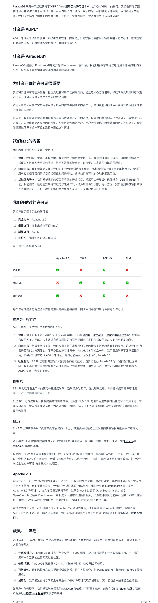

就在刚刚，ElasticSearch 官方博客发表了一篇新的公告《ElasticSearch 开源了，又一次》。宣布 ES 和 Kibana 重新使用一个新的 AGPLv3 协议，而不是 EL / SSPL 了。其实原因也很简单，ES 要是再不改许可证，生态位就会被 Tantivy 换皮和 Grafana 彻底占领了。

## Elasticsearch is Open Source, Again

原文地址：<https://www.elastic.co/blog/elasticsearch-is-open-source-again>

【谦逊】 为未来建设是如此令人兴奋。Elasticsearch 重新成为开源软件。耶！多么美好的一句话，多么美好的一天。

【基因中的开源】Elasticsearch 和 Kibana 再次成为开源软件，这一消息令我无法抑制内心的喜悦。我们 Elastic 的每个成员都为此跃跃欲试。开源不仅流淌在我的血液中，它也是 Elastic 的灵魂。能够再次将 Elasticsearch 称为开源软件，感觉犹如重获新生。

【热爱】简言之，我们计划在接下来的几周内，将 AGPL 作为新的许可选项，与 ELv2 和 SSPL 并列。尽管我们更改了许可证，但我们从未停止过以开源社区的姿态信仰和行动。采用 AGPL 这一 OSI 认证的许可证，可以消除人们心中的疑虑和不安。

【不同于我们】在 Elastic，我们从未放弃过对开源的信仰。我个人对开源的坚持也已逾二十五载。那么，三年前为何改变呢？我们面对了来自 AWS 及其产品引起的市场混淆问题。在尝试了所有其他可能的选项后，我们选择了更改许可证，这导致 Elasticsearch 分支，并走上了一条不同的发展道路。这是一个漫长的故事。

【就像那样】好消息是，尽管过程充满痛苦，但我们成功了。三年后，亚马逊已全面投入到他们的分支版本中，市场的混乱已基本得到解决，我们与 AWS 的合作也空前牢固。我们甚至被评为 AWS 年度最佳合作伙伴。我一直期盼有朝一日我们可以安全地回归开源项目——现在，这一天终于来临。

【所有的星辰】我们致力于让用户的生活尽可能简单。有些用户偏爱 ELv2（一种受 BSD 启发的许可证），也有人支持 SSPL（通过 MongoDB 的使用）。这正是我们只添加而不移除任何选项的原因。如果您已经在使用并喜欢 Elasticsearch，请继续如常使用，无需改变。而对其他人来说，现在您也可以选择 AGPL。

【忠诚】之所以选择 AGPL 而非其他许可证，是因为我们希望通过与 OSI 的合作，在开源许可证世界中增加更多选择。看起来，另一个 OSI 认可的许可证将与 SSPL 和/或 AGPL 有所类似。也许 AGPL 已足以满足像我们这样的基础设施软件的需求，尤其是在我们不得不更改许可证以来的发展背景下（例如 Grafana 从 Apache2 转为 AGPL）。我们承诺将致力于找出解决方案。

【欣喜】能够再次宣称 Elasticsearch 为开源软件，我感到非常高兴。

【好了】任何变更都可能带来混乱，当然，可能也会有挑衅者（总有挑衅者，对吗？）。让我们尝试回应其中一些疑问……以下是我能想到的一些，但我们会继续添加。

- “更改许可证是错误的，Elastic 现在正在撤回。”三年前我们改变许可证时，解决了很多市场混乱。因为我们当时的行动，很多事情已经发生了变化。现在的环境完全不同。我们不再拘泥于过去。我们希望为用户构建更美好的未来。正是因为我们当时采取了行动，我们现在才有能力再次采取行动。
- “AGPL 不是真正的开源，许可证 X 才是”：AGPL 是一个被 OSI 认证的许可证，也是广泛采用的许可证。例如，MongoDB 曾是 AGPL，Grafana 现在也是。这证明 AGPL 并未影响使用或普及度。我们选择 AGPL，是因为我们相信这是与 OSI 合作，为世界带来更多开源的最佳方式，而不是更少。
- “Elastic 更改许可证是因为他们表现不佳”——我想说的是，我对 Elastic 的未来一如既往地充满期待。我为我们的产品和团队的执行力感到非常自豪。我们推出了无状态 Elasticsearch、ES\|QL 以及大量针对 GenAI 用例的向量数据库/混合搜索改进。我们正在大力发展 OTel 的日志记录和可观测性。我们的 SIEM 产品在安全领域不断增加令人惊叹的功能，已成为市场上增长最快的产品之一。用户的反馈令人感动。股市有其起伏。但我可以向您保证，我们始终以长远的视角考虑，这次变化也是其中的一部分。

如果有更多疑问，我们会继续在这里添加内容，希望减少大家的困惑。

【谦逊】为未来而建设是如此激动人心。Elasticsearch 重回开源的行列。多么美好的一句话，多么美好的一天。

## 老冯评论

我认为现阶段对于商业开源公司来说，最合适的开源许可证是 AGPLv3。**弱于此等级的开源协议基本上是给云厂商和同行白嫖者打白工，高于此等级的协议又失去了 “开源” 这个名份大义，容易被抢占生态位**。

作为例证，使用 Apache 2.0 的 Grafana（Kibana 分支替代）在 8.0 的时候切换到了 AGPLv3 协议，基本上占领了 Kibana 空缺的生态位。而 ES 修改开源协议后，AWS 也分支了 Apache 协议的 OpenSearch 来抢占生态位（同理还有 Redis 和 Mongo，请看《[**Redis 不开源，是“公有云”的耻辱**](/db/redis-oss/)》）

而 ElasticSearch 的本体，正在面临下一代搜索引擎内核 **Tantivy** 的冲击。正如我在《[**谁缝好 DuckDB，谁赢得 OLAP 未来**](/pg/pg-duckdb/)》中讲到的 OLAP 领域 DuckDB 缝合大赛正如火如荼一样，在 全文检索领域，谁包好 Tantivy，谁赢得 FTS 领域的未来。目前来看，ParadeDB 的 pg_search / pg_bm25 插件已经抢占了有利地形。借力 PostgreSQL，对 ElasticSearch 形成了威胁。（广告时间：PG 生态的 DuckDB / Tantivy 缝合插件全部在 [**Pigsty**](/pigsty/v3.0/) 中开箱即用！）

例如，旨在基于 PostgreSQL 提供 ElasticSearch 功能替代扩展的 ParadeDB 经过仔细的思考，最终决定使用 AGPLv3 协议。他们把自己的考量公开了出来（<https://www.paradedb.com/blog/agpl）并发到了> HackerNews 上，收获了大量的响应与共鸣：<https://news.ycombinator.com/item?id=41227172>。

为什么许多开源项目都切换到了 AGPLv3 呢？我认为是开源社区面对云厂商白嫖产生的集体应激反应。在开源诞生的那个时代，社区都假设参与者是体面的好人。然而当搭便车的公有云厂商出现后，这一套逻辑就玩不通了。开源公司/社区当大善人，而云厂商靠提供最后的交付与运维攫取了软件生命周期中的最大价值，却把最大的产研成本丢给社区或开源公司，这种不公平的生产关系注定无法持续。

AGPLv3 协议在这一点上有良好的效果：它本质上是通过光明正大的歧视，将不开源自己管控软件回馈社区的的云厂商开除出了社区，重新划定了共同体边界。我们已经看到越来越多的开源项目使用，或转向这一开源协议。开源世界与云厂商的博弈，最终会走到哪一步，让我们拭目以待。

---

[云计算泥石流](/cloud/debris/)曾几何时，“上云“近乎成为技术圈的政治正确，整整一代应用开发者的视野被云遮蔽。就让我们用实打实的数据分析与亲身经历，讲清楚公有云租赁模式的价值与陷阱 —— 在这个降本增效的时代中，供您借鉴与参考。点一个关注 ⭐️，精彩不迷路搜索 **pigsty-cc**，加入微信讨论群组

---

发布版本：[微信公众号](https://mp.weixin.qq.com/s/NdeeYn10qQ0xBPL-67IXdQ)
