> 原作者：VAGE

2026，1 月 1 日元旦当天，中国银行 APP 故障：

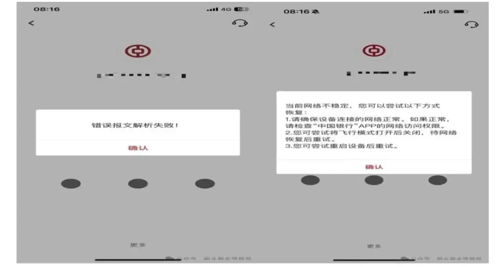

故障原因，先有消息说因为连接池满、无法与数据库建立新的连接导致。

但进一步暴漏的信息，这里的“连接池”是数据库内的线程池 BUG，导致上层应用无法和数据库建立连接，问题直指 GaussDB。

现场曾重启数据库、华为的相关人员也介入解决问题，但故障依久，最终故障持续了超过 1 个小时，才恢复正常。

我对故障具体细节并不关心，去年（2025 年）金融行业 IT 基础设施问题频发，四大行有两家都未能幸免（工行与中行），支付宝更是在 2024 双 11 后，又于 2025 双 12 出问题。细看每一次故障原因各不相同，每一次故障也都有独自的特点。

托尔斯泰在《安娜。卡烈林娜》中有一句流传很广的名言：“幸福的家庭千篇一律，不幸的家庭各有各的不幸”。

对应技术层面：“不宕的系统一直运行，宕机的系统各有宕机的原因”。

分析每家故障的原因，试途寻找“中行 APP 故障原因”、“工行 APP 故障原因“，“支付宝双 11/双 12 故障原因”，就像分析“这个家庭为什么不幸福”、“那个家庭为什么不幸福”一样没有意义，因为“不幸的家庭各有各的不幸”。

不如提高视角，问一个共性的问题：“为什么现在会有这么多故障”？“我们走错了方向吗”？

这个问题太宏大，我还要聚焦焦，只讨论现代商业管理系统吧。我在[你的存款还在吗：深度解析工行 APP 故障到底谁的锅](https://mp.weixin.qq.com/s?__biz=MzkyMjQzOTkyMQ==&mid=2247484999&idx=1&sn=80cf6a7671de7969b955c85c3c1f62a2&scene=21#wechat_redirect)这篇中，用最直白的话解释过了，这么多故障的根因，就是数据库不强。

因为数据库不强，不得不把更多的压力转移到上层（应用层），导致应用层架构复杂，出现问题的概率，大大增加。

而且复杂的架构，导致高可用切换行同虚设，事到临头时，无法确保数据一致的切换，导致每次故障时间都是以“小时”为单位。

从底层硬件、操作系统，到数据库，再到中间件、上层应用系统，这一整套现代商业管理系统，是美帝摸索了几十年探索出来的技术路线。

单说数据库，从上世纪七零年代做为一门独立的软件门类开始，到现在发展已逾 50 多年，美帝在这方面有着深厚的积累，华为又不是上帝，数据库又只是华为的支线业务，比不上美帝本不足为奇。只要我们的技术方向不错，追平美西方就不是问题。

但关键就是，我们的技术方向错了。

这么频繁的故障频率，四大中两家不足三个月内，接连出问题；

中小银行我都懒的说，故障时间都以“天”为单位了；

支付宝在敏感时间点接连出问题，要是还觉得一切 OK，就当我啥也不懂吧。

我们在用开发应用层软件的方法，开发基础软件。先不要急着反驳我，下面我证明给你看，中行与工行的数据库、华为高斯，到底基不基础、强不强。

先说一个问题：“谁最有资格评价一个数据库强与弱”。

不是你也不是我，而是处理器 --- CPU。

数据库也是程序，数据库并不是跑在空气中，而是运行在 CPU 之上。对 CPU 而言，任何程序不过是一段段代码，数据库也是，它并不例外、并不特殊。

CPU 有丰富的手段衡量一段代码的好坏，我们先用一个最简单的例子，牛刀小试一把。我以一条极简单的 SQL 为例，统计它所用的指令数量。

先以 PG 为例，先介绍一下基本环境：目标表 vage2，大小 206MB，共有 4 列，ID 列为主键。当前后台进程为 24636。

<!-- -->

```text
halo0root=# SELECT pg_backend_pid();
 pg_backend_pid
----------------
          24636
(1 row)

halo0root=# \d+
                             List of relations
 Schema | Name  | Type  |  Owner   | Persistence | Access method |  Size  | Description
--------+-------+-------+----------+-------------+---------------+--------+------------
 public | vage2 | table | postgres | permanent   | heap          | 207 MB |
... (3 rows)

halo0root=# \d+ vage2
                                                Table "public.vage2"
 Column |         Type          | Collation | Nullable | Default | Storage  | Compression | Stats target | Description
--------+-----------------------+-----------+----------+---------+----------+-------------+--------------+------------
 id1    | integer               |           |          |         | plain    |             |              |
 c1     | character varying(30) |           |          |         | extended |             |              |
 id2    | integer               |           |          |         | plain    |             |              |
 c2     | character varying(30) |           |          |         | extended |             |              |
Indexes:
    "vage2_id1" btree (id1)
Access method: heap

halo0root=# SELECT pg_backend_pid();
 pg_backend_pid
----------------
          24636
(1 row)
```

上面是显示一些基本信息。

按如下步骤，可以得到执行某 SQL 时所使用的 CPU 指令数：

步 1：使用 perf，打开 CPU ”指令数“计数器，针对进程 24636，统计它执行的指令数：

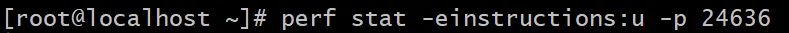

是不是没想到，CPU 内计数器，说起来很玄乎的概念，打开它竟十分的简单，一条 perf 命令就可以了。

"instructions:u"中的“:u”，是只统计用户态执行的指令数。我们排除于内核态的指令，去除一些干扰，统计结果更精准。

步 2：到后台进程 24636 对应的 Session 中，执行目标 SQL：

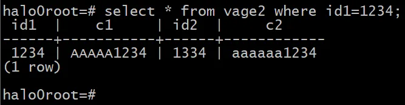

步 3：回到“步 1”的 perf 命令窗口，Ctrl+C，就能看到结果了：

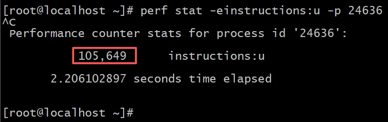

105,649，就是“步 2”的 SQL 所用指令数。一条极简 SQL，使用了 10 万多条 CPU 指令。CPU 只需不足一秒，就能跑出结果。现代处理器，还是很强悍的。

我不是要说高斯基不基础、强不强吗？跑题了吗？

并没有。

单看一个指令数，确实没啥意义，但横向对比多个数据库，就有意思了。

下面看看同样的表、同样的 SQL，在华为高斯数据库中，使用了多少条 CPU 指令。

在高斯中，目标表大小为 196MB：

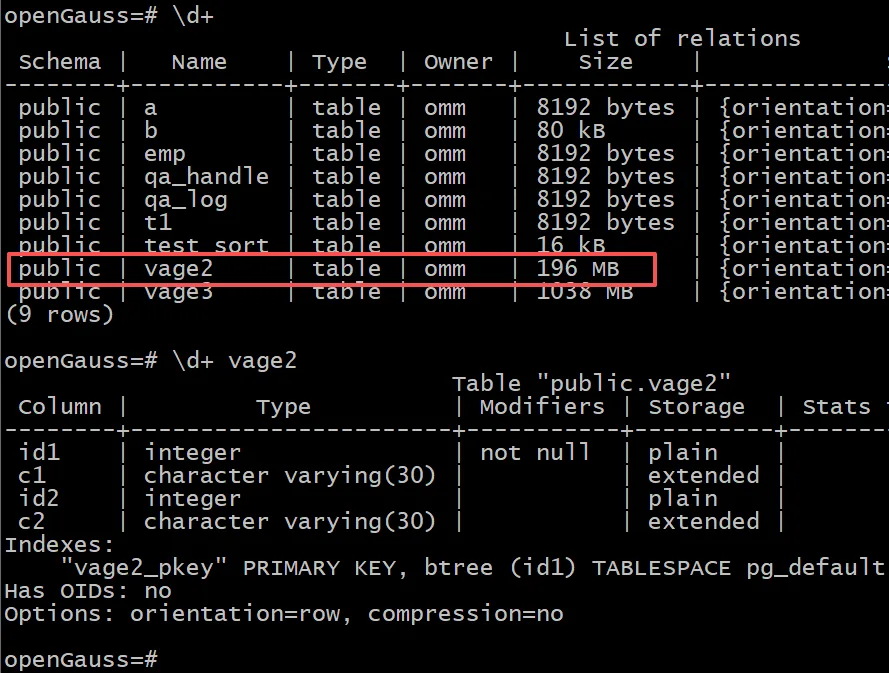

和在 PG 中基本相同（PG 中是 206MB）。

列数量（4 列）、行数（300 万行）完全相同，连插入的数据都完全一样。

高斯是线程模式，先要得到后台线程号，步骤如下：

步 1：得到线程标识：47503107229440

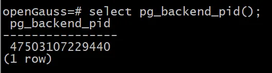

步 2：在 gdb 中调试高斯的进程：

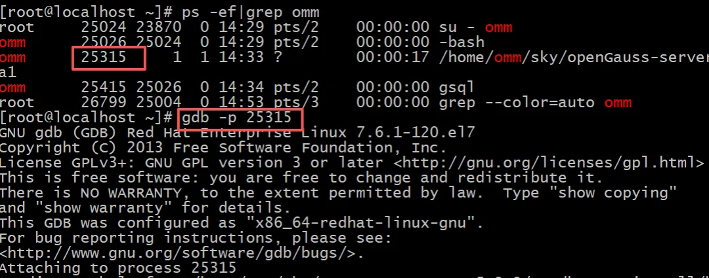

步 3：把线程标识 47503107229440，转为 16 进制：0x2b342dd50700

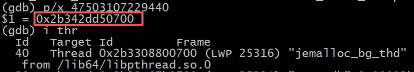

再使用"i thr"，列出所有线程

步 4：搜索 0x2b342dd50700，就能得到线程号：25416

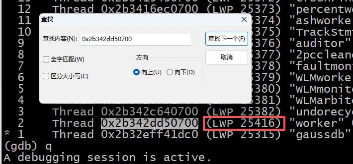

继续步 5。

步 5：使用 perf，打开 CPU ”指令数“计数器，这次针对线程 25416，统计它执行的指令数：

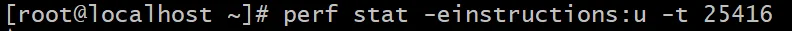

步 6：在线程 25416 对应的 gsql Session 中执行目标 SQL：

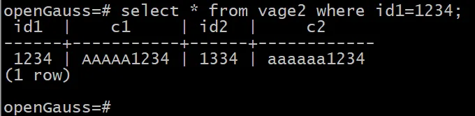

步 7：回到 perf，Ctrl+C：

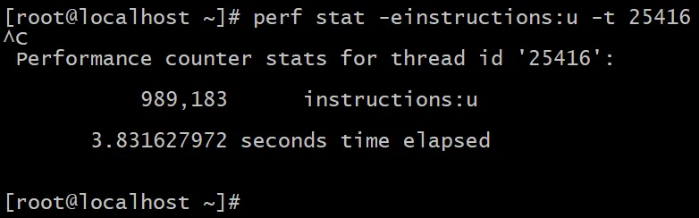

在高斯中，执行和 PG 同样的 SQL，使用了 989,183 条指令。

还记得 PG 使用了多少条指令吗，105,649 条。高斯是 PG 的 9.36 倍。

数据量相同、列相同、连数据都一模一样，执行相同的 SQL，高斯使用的指令数是 PG 的 9 倍多。

这意味着什么，表达同样的意思、说同样的话，PG 使用了 1 万个字，高斯使用 9 万多个字。高斯使用的字数，是 PG 的 9 倍多。

说句不好听的话，我听到我儿子幼儿园同学们的谈话，费话极多、还有大量的重复、逻辑略微混乱，能用一个字说清的，可能用了 9 个字才说清楚。有时候用了 9 个字也没有说清楚。

华为高斯和幼儿园小朋友不同是，高斯用 9 个字，把话说清楚了。

为什么是这样？

我这里使用的技术极简单，仅用一条 perf 命令，只观察了一个计数器的结果：指令数。高斯的表现就已经这样了，还需要从 L1~L3 Cache、TLB、iCache、前端吞吐、译码效率、ROB/RS/LB/SB 使用情况、流水线 STALL 比例、……，等等方面完整分析吗。（上面这些分析我计划后面开一个系列好好讲讲）

CPU 中的计数器可是多达近千个的，可以对程序进行全方面的 profilling。

我想表达的意思是：基础软件开发有自己的知识体系，从处理器层对程序进行 profilling，也仅是其中的一环。从现实的表现看，华为高斯团队并不掌握基础软件开发的知识体系。

但高斯仍是一个典型的工程实现很棒的应用层软件。

我是说，高斯是一个应用软件，工程质量很棒。但高斯并不是一个基础软件。原因是走错了方向，在按应用层软件的思路，开发基础软件。

---

发布版本：[微信公众号转载页](https://mp.weixin.qq.com/s/6TyRKtsg81cTLz5A3q0Njw)
