飞总批评完《[**2023 年，中国对 PostgreSQL 的贡献≈0**](https://mp.weixin.qq.com/s?__biz=MzI5OTM3MjMyNA==&mid=2247497341&idx=1&sn=7df1e74b9bba5af00577c422f8a411c5&scene=21#wechat_redirect "2023年，中国对PostgreSQL的贡献≈0！！！")》后，又对国产数据库开了一炮：《[**2023 年，国产数据库大炼钢**](http://mp.weixin.qq.com/s?__biz=MzI5OTM3MjMyNA==&mid=2247497354&idx=1&sn=c50c7e6b50049e5ab3e2f35c2c3e7433&chksm=ec952cc1dbe2a5d72f7ac65d45e1d8d50a6b0dd84372d5c71fbaec812785bf006d713612d99c&scene=21#wechat_redirect)》。那么国产数据库真的是大炼钢铁吗？

## 大炼数据库

截至 2023 年底，专门做国产数据库排行的墨天轮，收录的国产数据库达到 292 种，并且这一数字还在持续增长。考虑到榜单中的一些国产数据库实际上是**品牌**，其下还有更加细分的具体产品（例如，XXDB for PostgreSQL 和 xx for MySQL），加上没收录的，实际总数应该在**三四百**之间。

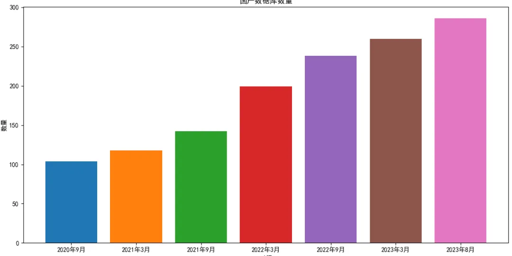

墨天轮收录的国产数据库数量，从 2020 年底的 100 多款，在短短三年时间暴涨三倍到了 300 款。如果我们对比去看全球数据库流行度榜单 DB-Engine，里面也仅仅收录了 **417** 款数据库，单从数量上看，国产数据库能称得上占据了全球品类的半壁江山，听上去那叫一个威武雄壮。

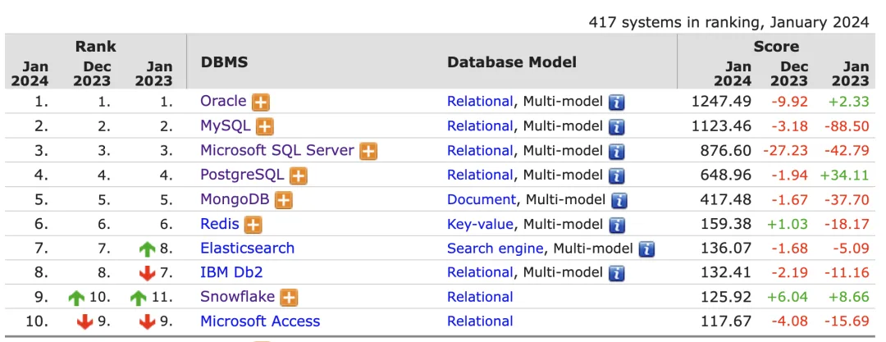

但当我们审视这些数据库的质量时，问题就出现了。

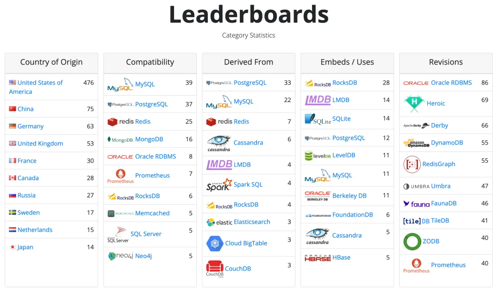

由 CMU 副教授 Andy Pavlo 主办的 **dbdb.io** 数据库统计网站收录了来自全世界的 960 款数据库，但起源自中国的只有 75 款。Andy 对此直言不讳：

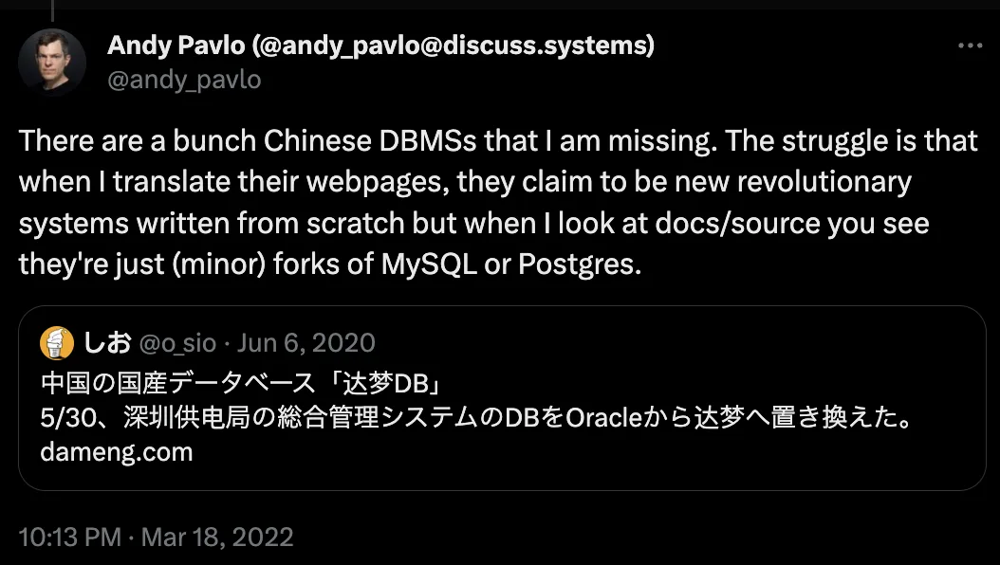

> “*有很多中国的数据库我都没收录，因为当我翻译他们的网页时，这些号称自己从零开始自研的全新的革命性的数据库系统，从文档/源码上看就是 MySQL 和 PostgreSQL 换皮分叉，这让我很纠结*”。

## 国产化乱象

以关系型数据库为例，来自中国信通院的数据指出，有约 2/3 的国产数据库产品是基于 **PostgreSQL** 与 **MySQL** 这样的开源数据库（换皮、套壳、魔改）的。

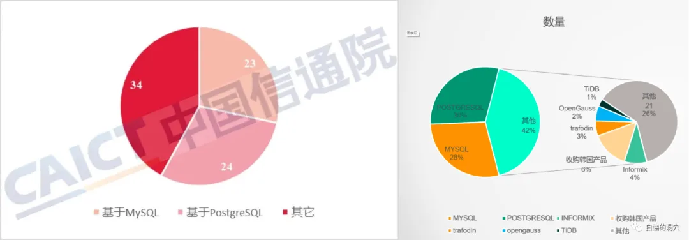

剩下的 1/3，有基于其他开源数据库（换皮、套壳、魔改）的，有买代码的，有造轮子的，当然也有真自研的。白鳝老师也整理了一份国产数据库谱系图，列出了主要一些基于 PostgreSQL 与 MySQL 的国产数据库血缘关系：

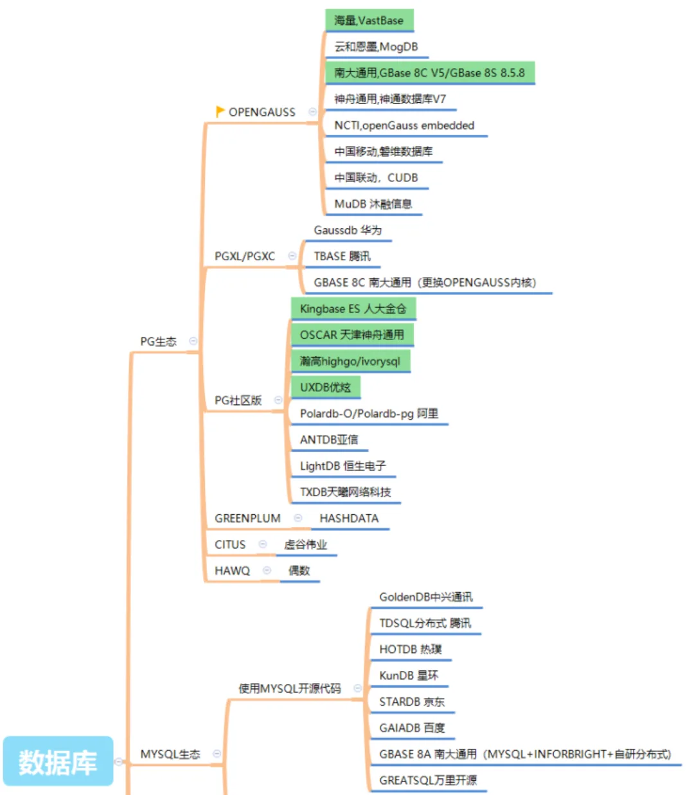

基于成熟流行的开源数据库进行二次开发，包装整合，提供服务 —— 本来是一个很务实的选择。然而问题在于，没有哪个市场能容的下几十上百款底层同质化产品在里面卷翻天的。

让我们以世界上最先进、最流行的开源数据库 PostgreSQL 为例，这也是被套壳最多的内核。在《[中国对 PostgreSQL 的贡献约等于零吗？](/pg/china-pg-contribution/)》中我们已经提到，PG 全球核心开发组中并没有来自中国大陆的**核心组成员**与**主要贡献者。**

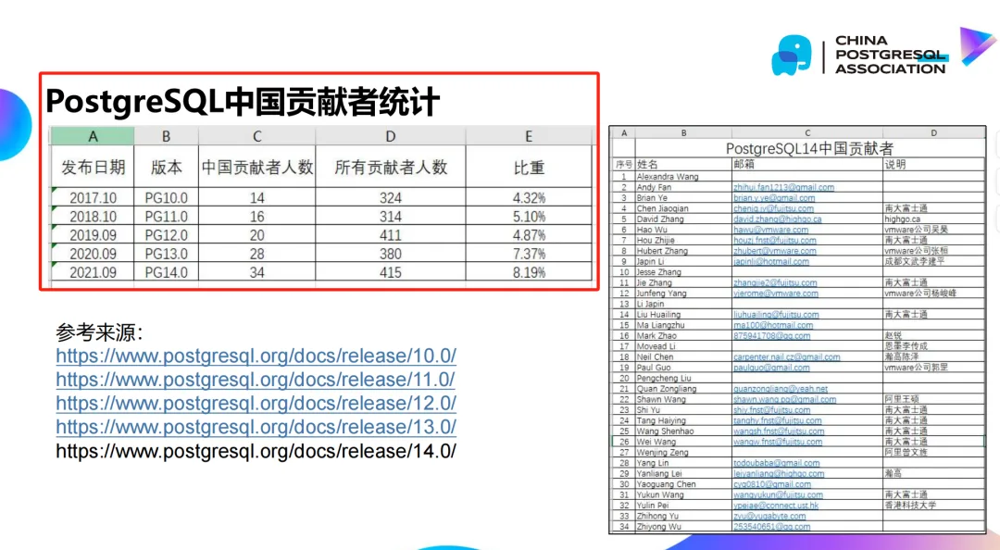

有内核贡献的中国开发者基本集中在几个圈内耳熟能详的公司中：Pivotal 系、阿里云、WWIT、瀚高、南大等等；有能力输出管理最佳实践的基本集中在 PG 大甲方用户公司里：平安、去哪儿、探探；来自中国并有国际认可的 PG 生态开源项目也仅有 4 个：Pigsty，duckdb_fdw，zhparser，pg_roaringbitmap。很难想象，这样的生态与人才储备足以支撑起几十上百款数据库产品的研发工作，能出几个真正能打的就不错了。

如果这些国产数据库公司是[**真的自主可控**](/db/sovereign-dbos/)，[**解决卡脖子问题**](/db/db-choke/)也就算了，但实际上在有着成熟开源数据库内核与发行版的现状下，真正卡用户脖子的反而大多是这些所谓“自己人”。中国基于开源产品 “研发” 了那么多的数据库，把免费的软件套壳卖出高价，而绝大多数却没有对开源社区有任何方式上的回馈。反而经常出现分裂社区，劣币驱逐良币，吃 PG 饭砸 PG 锅的情况。

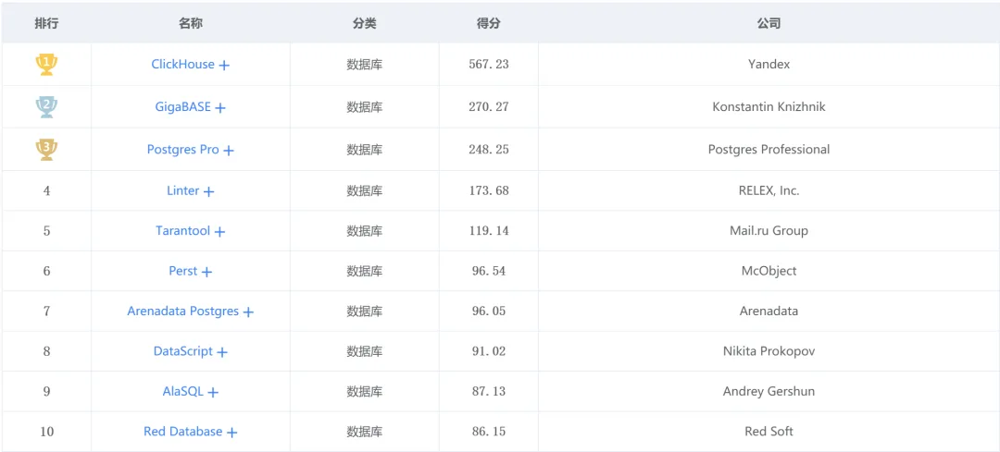

作为对照，真正吃了制裁的俄罗斯就没有这种乱象。墨天轮收录了 32 款来自俄罗斯的数据库，dbdb.io 上收录了 27 款，这个数量比中国数据库少了整整一个数量级。俄罗斯数据库也有国际上拿出来响当当的东西 —— 实时分析数仓 ClickHouse 与 PG 发行版 Postgres Pro。Oracle 制裁俄罗斯，开源的 PostgreSQL 自主替代吃遍天，请问有谁在数据库这项上真的卡了他们的脖子吗？

## 还有能打的

在 CSDN 最近的开发者调研中，在七成受访者对“国产数据库”持负面印象：“**技术落后**”，“**缺乏创新**”，这算是是一种比较温和的说法。用户心底真正的评价恐怕更为直白：虚假宣传，大放卫星，落后生产力。为什么国产数据库的风评如此之差，难道是软件工程师不爱国吗？

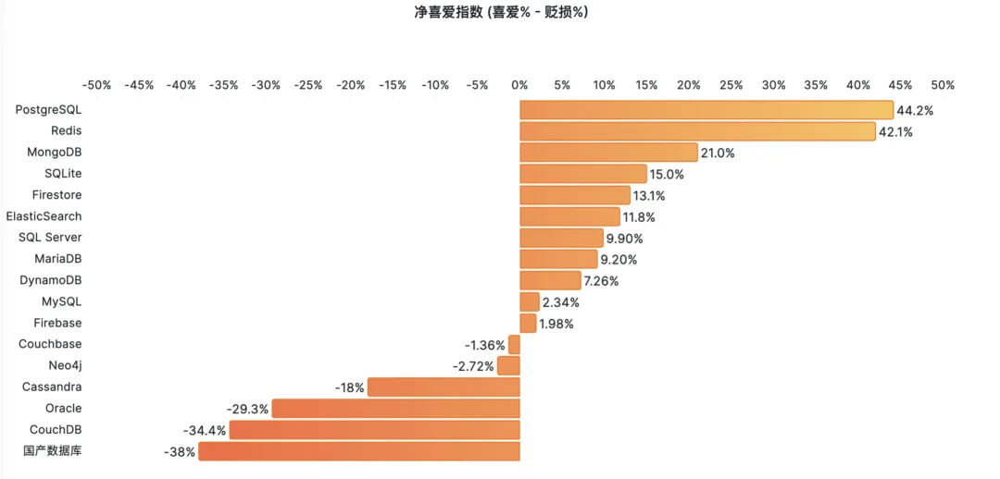

**国产数据库并非没有踏实做事的好公司**，只是“国产”这个标签被大量钻入数据库领域的平庸低劣产品污染。但是在大浪淘沙之下，也有一些金子开始发光。有一些扎根国内的数据库产品已经开始走出国门，获得国际认可。

Gartner 每年发布的数据库魔力象限报告，是全球数据库领域最具权威性参考性的行业报告。在 2023 年的报告中，阿里云的 PolarDB 成为唯一进入领导者象限的中国数据库，或者更大一点 —— 唯一的非美国数据库。

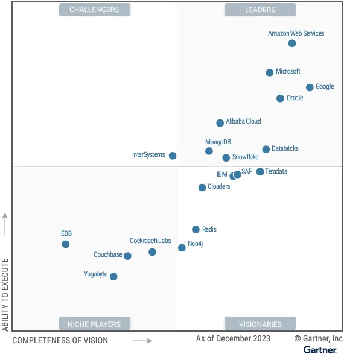

不在四个魔力象限，但被荣誉提及的十家数据库厂商中，也有四家是来自中国的：OceanBase、PingCAP，华为云、腾讯云。在实际战绩 —— 使用率与流行度上，StackOverflow 2023 年的全球开发者调研给出了自己的数据。TiDB 以 0.2% 的使用率首次进入榜单，位列第三十二，虽是最后一名，但却实现了从无到有的重大突破。

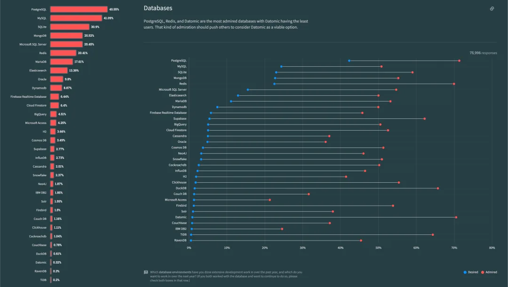

除此之外，也有一些其他来自中国的数据库内核/管控/产品/工具开始进入国际视野中。比如做 PG 数据库发行版的 **Pigsty**，做数据库模式变更的 [**Bytebase**](https://mp.weixin.qq.com/s?__biz=MzkzMjI2MDY5OQ==&mid=2247506909&idx=1&sn=4eca65423029a38f35cac557f7d91fbe&scene=21#wechat_redirect)，用 K8S 跑数据库的 [**Kubeblocks**](https://mp.weixin.qq.com/s?__biz=Mzg3MDk3ODA0Mg==&mid=2247490772&idx=1&sn=01dd35c2ce5b1628746cb6a3fb247309&scene=21#wechat_redirect)，做时序细分领域的 IoTDB / TDEngine，做分析/数仓的更是有好几个不错的产品已经走出国门了。

越是中国的，越是世界的。靠硬实力吃饭的软件不会仅囿于一国：能在全球市场杀出血路，具有全球竞争力和国际影响力，赚到实打实的外汇，卡住全球软件供应链关键生态位的产品，才是最有价值的。

对于“卡脖子”的数据库，国家搞了信创近乎不计成本地投入。但从资源利用率来说，民营企业还是遥遥走在国家队前面了，能得到国际认可的产品都是敢于直面全球市场竞争与挑战的民企，靠的也更多的是那些既有眼光也敢于冒风险的投资者。尽管数据库大炼钢铁存在着巨大的人力财力浪费，但这个行业里还有不少认真做事情的从业者 —— 所以对国产数据库的未来，我还是看好的。

---

发布版本：[微信公众号](https://mp.weixin.qq.com/s/aLXC7f2iYUfATNWsnyotkA)
