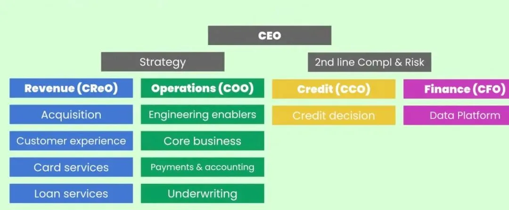
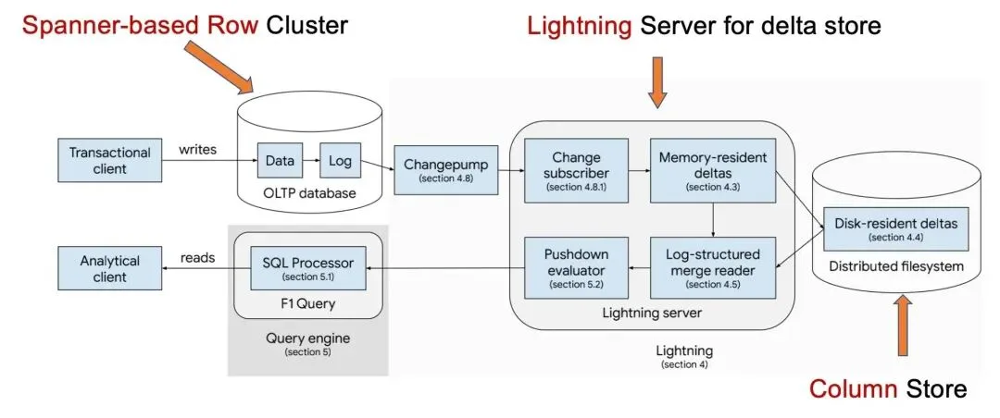
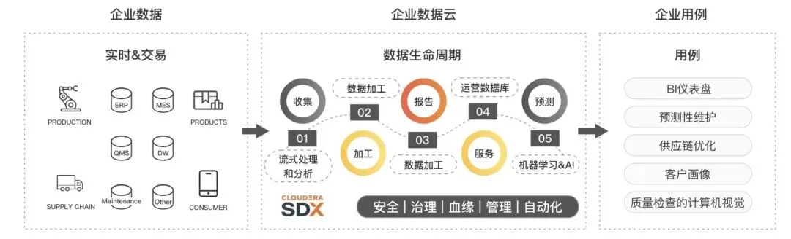
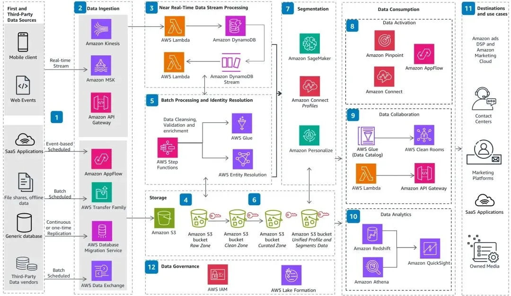
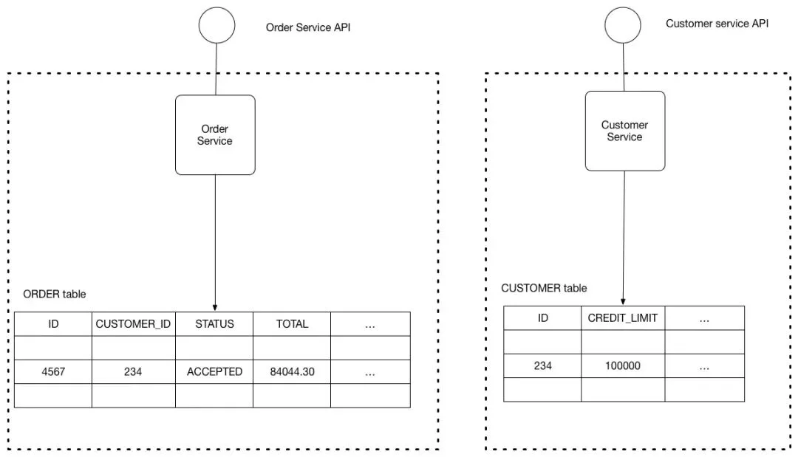
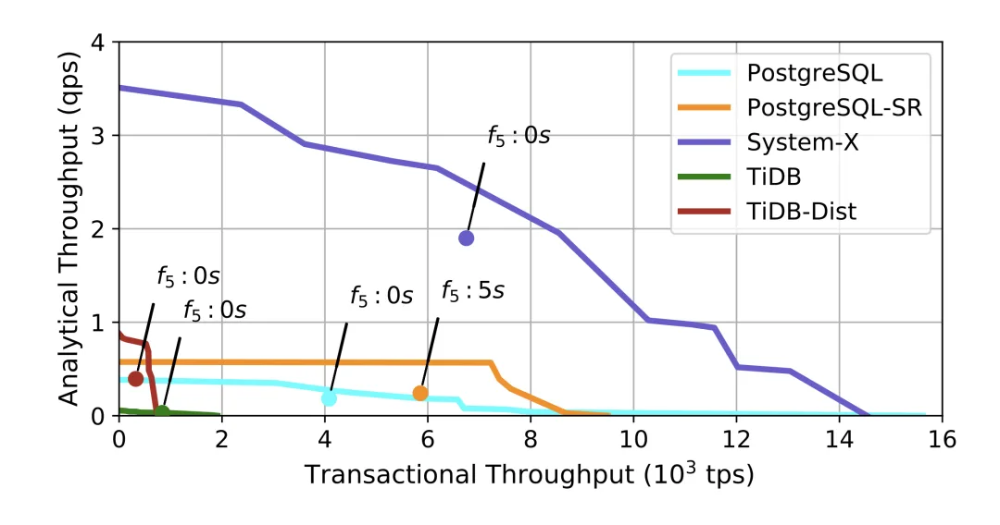
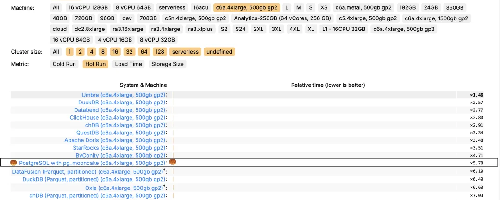

> 原作者：瑞典马工

最近，有很多软件从业者转发阳振坤先生的演讲[《起初，没有人愿意用我们的产品，直到十年前的那次“双十一”｜阳振坤》](https://mp.weixin.qq.com/s?__biz=MzIwNTQxMjY0MQ==&mid=2247601017&idx=1&sn=469963c3108982d02cea306cf96b1af7&scene=21#wechat_redirect)。演讲本身很优秀，我推荐给身边的年轻人。但是作为一个工程师，我对阳振坤先生的一个观点有一些不同意见。

阳先生说：

> （HTAP）这个系统里面既把交易做了，又把分析做了；既降低用户的成本，又能让用户在使用上得到极大的简化。我觉得这个应该就是我们今后的机会。

阳先生又说

> 对使用者来说，这（HTAP）既大幅度地降低了成本，又大幅度地简化了使用方式。我想，这就是 OceanBace 真正要在国际数据库市场上生存下来的秘诀。

这是一种很自然的产品探索，听起来很有道理，**Gartner 十一年前就发布了一个报告[1]**，预测“混合事务/分析处理（HTAP）将促进重大的业务创新机会”。汽车行业早有先例，皮卡融合了载人和载货的功能，确实占据了不小的市场。

但是类比不能替代真正的商业决策，HTAP 的价值主张“降低成本+简化维护”，现实中几乎是不成立的。

不成立第一个原因非常直白：为 OLAP 和 OLTP 付费的客户，是不同的部门。当阳老师说“用户”的时候，把一个集团是做一个单一实体，但实际上，购买 OLAP 的部门和购买 OLTP 的部门，可能隔了八道部门墙。大集团就不必说，我可以给大家看一下一个 200 人 Fintech 的技术组织架构图：

从业者一看可以看出，要整合 CFO Data Platform 用的 OLAP 和其他部门用的交易数据库，是一个要 CEO 亲自推动的工作。一般的 CEO 没有这么无聊。

作为多年老油条，我在大厂见过无数浪费。任何一个入职三个月的实习生，都可以拟一份技术上可行的数据库，服务器，存储，餐厅托盘，笔记本贴纸整合方案，问题是：谁来推动这个工作？推动它的成本能不能覆盖收益？如果数据库厂家对 HTAP 宣扬的价值只有“既把交易做了，又把分析做了”，其说服力还不如实习六个月的优秀应届生。

当然，客户的组织架构也不是不可变的。大多数上云的客户消除了（或者减少了）DBA 的岗位，把 RDS 直接交给研发团队。Gartner 提出围绕 HTAP 的 **real time analytics[2]** 概念，暗含融合业务开发团队和数据分析团队的建议，但是概念只停留在一个名词，并没有具体的内涵，以至于 Splunk 也可以拿这个词去修辞自己的日志产品。

OLAP 和 OLTP 都源自于同一个祖先，是 **Edgar F. Codd[3]** 发明的关系型数据库的直接后裔。但是在过去几十年中，由于需求的不同，自然的演化为两个种类。OLTP 需要高并发、低延迟，通常使用行存储、索引优化、强一致性事务。OLAP 需要大规模数据分析，适合列存储、批处理、高吞吐量的查询。

如果一个系统要同时兼顾这两种需求，实际上需要同时承担 OLTP 和 OLAP 的基础设施成本，而不是减少成本。

除非硬件有重大变化，很难想象某个厂家单纯依靠软件工程能力可以把这两个演化树的分叉又给融合了。弄个分布式系统，就能解决列式存储和行式存储的冲突，听起来更像一个技术童话，而不是严肃的技术探讨。

从 Google 的**F1 Lighting HTAP 架构[4]**，我们能看出明显的技术挑战。基本上，Google 就是把一个 OLTP，一个 pipeline，一个 OLAP 揉在一起，称为 HTAP 产品。这种做法类似有客户抱怨西餐一把刀一把叉子太麻烦，然后一个 LeetCode 盖章过智商的聪明侍者就跑出来，在刀和叉边上画个框，说：“先生，这不是一把叉加一把刀，这是我们最新的 Knork 产品。” 这是一个很无聊的文字游戏。

退一步，即使厂家利用云计算或者其他硬件解决了 OLAP 和 OLTP 的架构冲突，还面临一个更严重的问题：OLAP 和 OLTP 并没有太多的共享数据。

在 IBM 垄断计算机市场的古代，企业数据很少，存储方式也很单一，基本就是 ERP 那几个数据库。**阿里云 CDP 架构图[5]**就基于这种认知：

但是现代企业，数据来源复杂太多了。参考 **Guidance for Customer Data Platform on AWS[6]** 可以看出，来自 OLTP 只是 OLAP 众多数据来源之一。从笔者个人体验看，OLTP 甚至不是 CDP 的主要数据来源。

如果 OLAP 依赖于大量的 App 上报数据，Web Events，SFTP 文件转化，SaaS 数据集成，第三方数据库，和 OLTP 数据，那么把 OLTP 单独抽出来和 OLAP 融合，有什么价值？

让事情更糟糕的是，即使 OLTP 也无法和 OLAP 融合。在今天，微服务是主流的软件开发组织方式。微服务两个良好模式：

1. **Service per team [7]**

2. 每个服务由一个团队拥有，该团队对其更改负全部责任。理想情况下，每个团队仅负责一个服务：

3. **Database per service[8]**

4. 每个微服务的持久化数据应保持私有，仅能通过其 API 访问。一个服务的事务应仅涉及其自己的数据库。

    

在用微服务架构的团队中，融合 OLAP 和 OLTP 并非是做 1+1 的题目，而是融合 N + 1 的关系。CTO 需要重新剥夺各个业务团队的技术自主权，把 DB 抽出来交给一个 HTAP DBA 专门团队管理。这简直就是在 1919 年之后再去让学童去念三字经，逆历史潮流而行。也许只有一些始于 1990 年代的软件团队还能这样做。

有认真的工程师问瑞典马工：“你的论证很有道理，但是毕竟只是你的推理，只要有一个基本假设错了，你的论证就全盘错了呢。”这部分严谨的读者，欢迎跟我一起看下**Oceanbase HTAP 的客户成功案例[9]**。

## 跨越速运

**跨越速运对 Oceanbase 有很高的评价[10]**，但是他们使用 Oceanbase 的方式如下：

> 我们利用 Flink JDBC Connector 直接将上游运单多表数据写入 OceanBase，在 OceanBase 中完成运单宽表的多字段实时合并。

可以看出，Oceanbase 在这里根本就是被当 OLAP 使用，并没有任何 OLTP 功能。

## 作业帮

**作业帮架构[11]**如下：

同样可以看出，OLTP 用的是 MySQL，然后把数据通过 OMS 加载到 Oceanbase，这也是典型的 OLAP 用途。

作业帮甚至很坦率的分享：

> OMS 同步数据一个并发可以支撑 1000 左右，具体还需要结合单条记录大小，如果单条记录包含 lob 类字段，那么该值较小。另外一个并发一般设置 1G 内存，当并发数太多而内存太小时 RPS 会降低很多（Full GC）。一般一条同步链路的资源需求是 4C/8G，如果一个机器的内存资源超过 80%，同步链路则会创建失败，建议调大内存机器

也就是说，作为 Oceanbase 推荐的 HTAP 用户，作业帮其实还在花费不少精力维护一个专门的 ETL pipeline。

架构图的《业务中台》是一个非常费解的组件。根据作者提供的架构图，如果业务中台修改了数据，更新的数据是无法同步到 MySQL 的，那就会造成极为严重的数据混乱。我猜想这个业务中台，其实只是一个只读的报表系统，并非我们通常理解的中台。

## Classin

**Classin 这位客户[12]**非常坦率

> 其次，翼鸥教育会重点关注 OceanBase 4.0 版本，并尝试新功能。
>
> - OLAP 能力。由于翼鸥教育后台的查询会严重拖累线上的输出性能，因此后续我们会将后台查询尝试迁移至 OceanBase 中。

换句话说，Classin 根本就没用 OLAP 能力，根本就谈不上是个 HTAP 客户。

综上所述，我们可以很有信心地说，其实 Oceanbase 没有发布过一个真正的 HTAP 客户。他们市场部被逼得只能拿出一个明确说自己没用过 OLAP 功能的客户充数。

中国数据库行业经过十几年的发展，已经有不少公司站住脚了。也有很好的竞争力了，阳先生说：

> 因此，我们不只是做了一个交易的数据库去跟其他数据库竞争，我们要在数据库赛道里走出来一条新的路，把自己变成新一代的大数据平台。对使用者来说，这既大幅度地降低了成本，又大幅度地简化了使用方式。我想，这就是 OceanBace 真正要在国际数据库市场上生存下来的秘诀。

这是一个很积极的目标，笔者本人也很相信中国基础软件公司在海外市场的竞争力。但是坦率的说，HTAP 撑不起这么宏大的目标。国际软件市场比中国软件市场更残酷，以 Oceanbase 目前对 HTAP 的价值主张之单薄，恐怕目标客户的办公室门都敲不开，更不用说生存下来了。

### 参考资料

[1]

Gartner 十一年前就发布了一个报告： *<https://www.gartner.com/en/documents/2657815>*

[2]

real time analytics: *<https://www.gartner.com/en/information-technology/glossary/htap-enabling-memory-computing-technologies>*

[3]

Edgar F. Codd: *<https://en.wikipedia.org/wiki/Edgar_F.\_Codd>*

[4]

F1 Lighting HTAP 架构： *<https://storage.googleapis.com/gweb-research2023-media/pubtools/6775.pdf>*

[5]

阿里云 CDP 架构图： *<https://help.aliyun.com/zh/cdp/product-overview/what-is-cdp>*

[6]

Guidance for Customer Data Platform on AWS: *<https://aws.amazon.com/solutions/guidance/customer-data-platform-on-aws/>*

[7]

Service per team : *<https://microservices.io/patterns/decomposition/service-per-team.html>*

[8]

Database per service: *<https://microservices.io/patterns/data/database-per-service.html>*

[9]

Oceanbase HTAP 的客户成功案例： *<https://www.oceanbase.com/solution/htap>*

[10]

跨越速运对 Oceanbase 有很高的评价： *<https://open.oceanbase.com/blog/27200135>*

[11]

作业帮架构： *<https://open.oceanbase.com/blog/8811965232>*

[12]

Classin 这位客户： *<https://open.oceanbase.com/blog/27200134>*

老冯评论

回到 2015 年 HTAP 这个概念刚刚被提出的时候，我当时在阿里友盟做过一个项目：用 PostgreSQL FDW 把存实时数据的 MongoDB 和历史离线数据库 HBase 包装成统一的 SQL 表接口，对外提供聚合查询。我的老板将它包装为 HTAP 系统去 DTCC 上宣传。

实际上我觉得是挺滑稽的，因为底下的 TP 和 AP 两套系统其实无论是数据来源，处理逻辑，承载的工具都相差甚远。做一个统一接口有没有价值？有点价值，查询起来方便点而已，但也仅此而已。十年过去了，大部分所谓 HTAP 系统其实也基本就是我那种缝合怪模式。

在 《[分布式数据库是伪需求吗？](/db/distributive-bullshit/)》 中我也深入的提到过，国内的所谓 HTAP，其实是以 OB 和 TiDB 这种分布式 OLTP 数据库厂家的自救尝试 —— 因为硬件以摩尔定律的速度在 ScaleUp，原本分布式在 OLTP 要解决的问题已经基本不存在了，唯一还能勉强用上分布式的地方就是大数据分析。所以通过发明一个融合 OLTP / OLAP 的 HTAP 概念，让大家感觉这套分布式的路线还是有前景，有价值的。

但这并不是说 HTAP 就是个没用的概念，真正的 HTAP 应该是什么样子呢？在《How good is my HTAP system》 SIGMOD 22 这篇论文中，选取了 System-X (疑似 HANA)，PostgreSQL，TiDB 作为 HTAP 系统的研究对象。

首先我认为，HTAP 不应该是什么 “分布式单机一体化”，或者包装两套缝合系统的 Proxy。其次，SAP HANA 那种昂贵的纯内存 HTAP 商业软件看上去也很难成为主流。那么，最有希望实现真·HTAP 的就是 PostgreSQL 了。

早在七八年前，苹果在富士康工厂使用的就是这种架构：一套机房，两套 PG，整个工厂的工业互联网数据，一套 PostgreSQL 做 OLTP，逻辑复制到另一套做 OLAP，通过触发器与存储过程灌入 AP 模式中，运行着非常复杂的分析，一切都丝滑无比。

当然时至今日，PostgreSQL 也早已远非昔日能比，特别是最近如火如荼的 [DuckDB 扩展缝合大赛](/pg/pg-duckdb/)，已经出现了在 ClickBench 分析榜干进前十的 T0 玩家，这才是真正朴实无华的 HTAP。只不过 PG 社区早就对这些特性习以为常，不会专门高声嚷嚷喊叫自己是一个 HTAP 数据库罢了。

---

发布版本：[微信公众号转载页](https://mp.weixin.qq.com/s/wxOSAjObi0oiiRPRahWjJQ)
