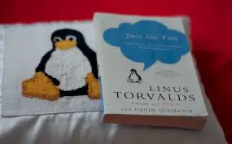
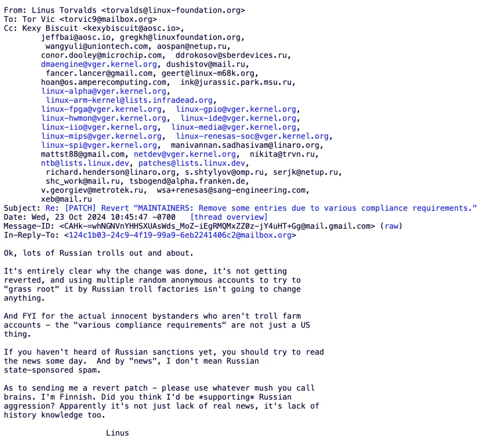

最近 Linus 在项目中[**踢出了几位俄罗斯籍开发者**](https://lore.kernel.org/all/CAHk-=whNGNVnYHHSXUAsWds_MoZ-iEgRMQMxZZ0z-jY4uHT+Gg@mail.gmail.com/)，引发开源世界中的一片哀嚎声。但其实很多人都忘记了，Linux 是 Linus 的个人项目，三十年前是，现在也依然是。Linus 本人始终亲自掌握着开源项目的最高权力 —— Linux 的发布权。Linux 社区本质是帝制的 —— 而 Linus 本人就是最早且最成功的技术独裁者。

> Ok, lots of Russian trolls out and about.
>
> It's entirely clear why the change was done, it's not getting reverted, and using multiple random anonymous accounts to try to "grass root" it by Russian troll factories isn't going to change anything. And FYI for the actual innocent bystanders who aren't troll farm accounts - the "various compliance requirements" are not just a US thing.
>
> If you haven't heard of Russian sanctions yet, you should try to read the news some day.  And by "news", I don't mean Russian state-sponsored spam.
>
> As to sending me a revert patch - please use whatever mush you call brains. I'm Finnish. Did you think I'd be *supporting* Russian aggression? Apparently it's not just lack of real news, it's lack of history knowledge too.
>
> Linus

在开源/自由软件社区，有 **BDFL**（"Benevolent Dictator for Life"，译为“仁慈的终身独裁者”）的说法。例如 Python 之父 Guido van Rossum，与 Linux 之父 Linus Torvalds。当然在很多人眼中，Linus 算不上 “仁君”，而是一个“暴君”，比如，Linus 经常使用直白粗俗的语言，公开斥责羞辱批评其他技术，参与者，厂商。

但这个 “暴君” 几十年如一日地在挖土，并且把自己的劳动毫无保留的贡献给别人，无数操作系统公司籍此赚的钵满盆翻。而正所谓 “升米恩，斗米仇” —— 时间一长，大家习惯了他的慷慨，却忘记了这个项目从头到尾，都是 Linus 本人的 “**兴趣**”。在 Linus 自传的书名《Just for Fun》中，这一点体现的淋漓尽致 —— **Linus 项目只是 Linux 本人的 Hobby**。

能够约束 Linus 本人的，也就只有 Linux 项目使用的 GPL 协议 —— 他既没有成立公司搞商业化，也没有阻止其他人复制它。开源社区就是这样，太平洋也没加盖，代码都放在那里，你行你就上，搞个 fork 分叉呗？我一点儿也不怀疑，如果 Linus 本人哪天薨了，Linux 项目很快就会散作满天星，分叉满天飞了。

按照开源社区的习惯法，如果有人对此感到不满，完全可以自己做个 Fork 和上游比拼生产力，发起一场斯巴达克斯式的造反运动。例如 GCC 之前由于理念不同也分裂过，后来支线干的比主线好，更受开发者欢迎，这个支线（EGCS）就成新主线了。正所谓：“Talk is cheap，show me the code”, "You can you up，no can no BB" —— 而不是逼逼叨跟怨妇似的高呼：“ Linus 大王你变了” 或者 “Linus 大傻逼”，并指望天降正义。

当然，在我看来，Linus 这次做法并不好，但不是因为他把老毛子开发者给踢了。而是因为他没有用光明正大，堂堂正正的方式踢掉老毛子。而是由二号位采取比较遮掩，含糊的形式做了这件事，然后 Linus 合并，[**并在事后用胡扯蛋式的回复**](/misc/linus-russia-maintainers/)来回应，留下了一些破坏开源社区习惯法的污点瑕疵。

他要是光明正大的说：“我收到米帝的制裁禁令，要干老毛子”。或者干脆就两手一摊 “老子爱咋样咋样，你们管不着” —— Which is fact —— 说不定就没这么多事了。

---

## **老冯评论**

全球化的时代过去了，逆全球化的风雨已经吹进了开源社区中。上古竞于道德的时代过去了，而当今争于气力。在从全球化走向区域化的大趋势中，一定会发生的事情就是 “共同体（社区）边界的重新划定”，或者干脆就是老的全球性大社区分裂成几个新的小社区。

而在这个划界过程中，必然会出现“他者”与“敌人”。有实质内容的理想，必然会制造出敌人 —— **没有敌人，说明你的社区理念没有实质内容，也就不会有真正的支持者**。理想是权力欲望的最高形态，而邪恶是权力的内在本质，理想和邪恶不可分离，犹如爱情和嫉妒不可分离一样。

Linus 很明显已经划出了一道新的边界，将老毛子划出了社区边界之外 —— 一场 “清洗整风” 运动，尽管被许多人认为这是“邪恶”的，然而这正是其权力意志与“主权”的体现，嘴炮与谴责在实力面前太过廉价，改变不了什么。

而被划除在社区边界之外的老毛子，以及有较大概率步其后尘的老中，确实应该好好思考一下以后的道路该怎么走了。

## **参考阅读**

[**数据库真被卡脖子了吗？**](/db/db-choke/)

[**Linus 关于踢出毛子维护者的解释**](/misc/linus-russia-maintainers/)

[**WordPress 社区内战：论共同体划界问题**](/cloud/wordpress-drama/)

[**第二批数据库国测名单：国产化来了怎么办？**](/db/db-national-test-2/)

[**国产数据库到底能不能打？**](/db/db-china/)

[**国产数据库是大炼钢铁吗？**](/db/great-leap-db/)

[**中国对 PostgreSQL 的贡献约等于零吗？**](/pg/china-pg-contribution/)

[**机场出租车恶性循环与国产数据库怪圈**](/db/airport-taxi-db/)

[**EL 系操作系统发行版哪家强？**](/db/rhel-compatibility/)

[**基础软件到底需要什么样的自主可控？**](/db/sovereign-dbos/)

[**分布式数据库是伪需求吗？**](/db/distributive-bullshit/)

---

发布版本：[微信公众号](https://mp.weixin.qq.com/s/IcmXCMyflqGlAPA8vFzyyA)
