这两天墨天轮社区找我写个 《10 月中国数据库排行榜》解读。老实说，老冯已经好一阵子没关注过国产数据库了，但我觉得这是个挺有趣的问题，可以丢给 OpenAI ChatGPT 和 Claude Opus 4.1 去研究，看看哪个 AI 水平更高。

老冯每个月在 OpenAI Pro 订阅上花 200 美金，在 Claude Max 20x 订阅上花 250 美金。反正闲着也是浪费，就让他们来 PK 一下，搞点儿研究也不错。

我的 Prompt 很简单：按照老冯的视角，写一份批判性的国产数据库行业分析报告与锐评，尽可能详细，从盈利，但是不要被这些国产数据库的 PR 营销给忽悠了，然后就各显神通吧。

半个小时后，两个 AI 都完成了研究，以下是两个顶级 AI 的研究结果，与大家分享。当然都比较长，懒得看可以直接跳到结论。

## Claude Opus 4.1 的结果

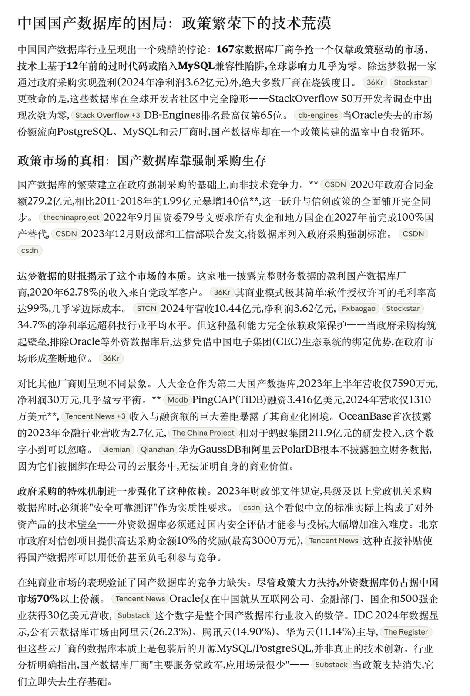

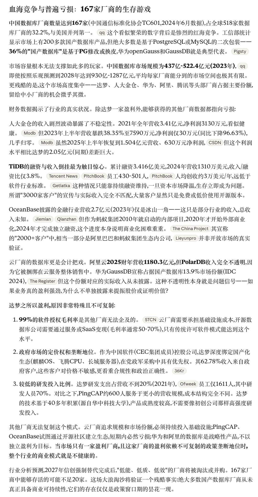

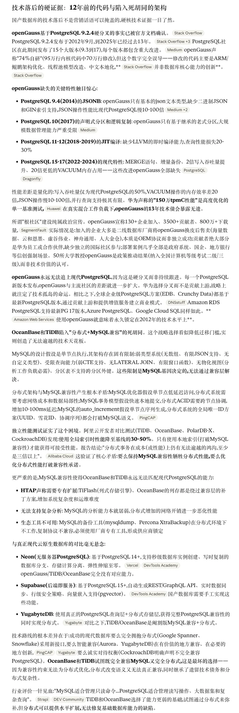

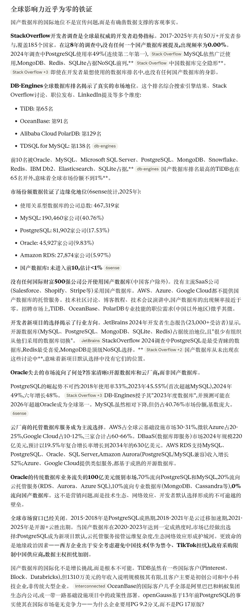

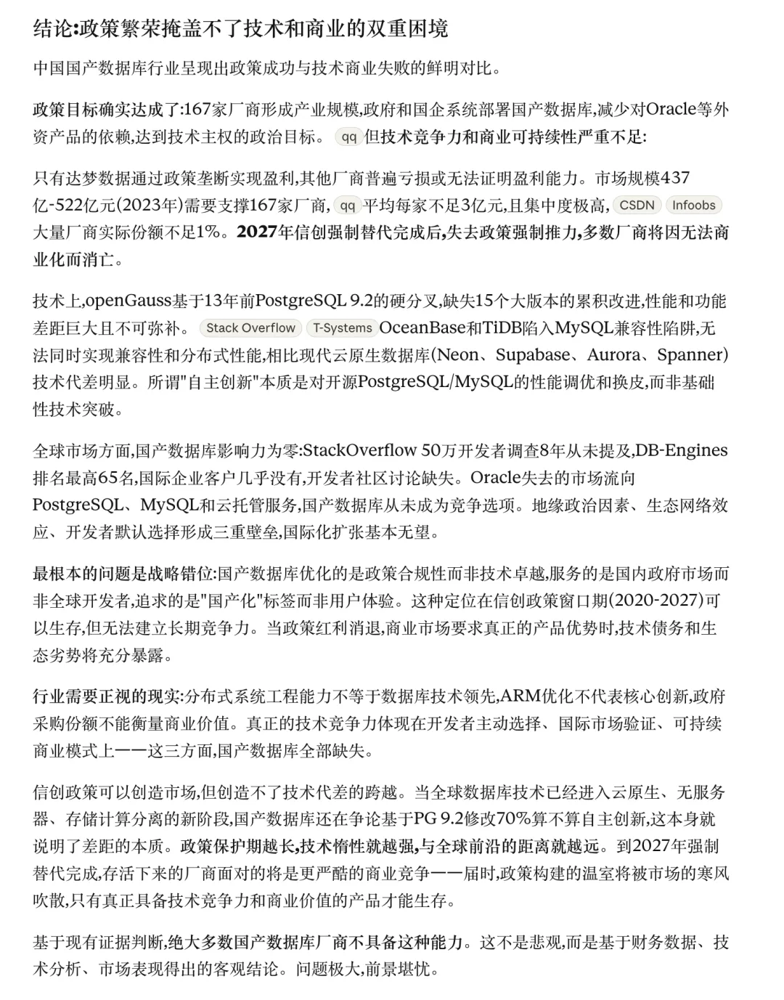

## OpenAI GPT5 Pro

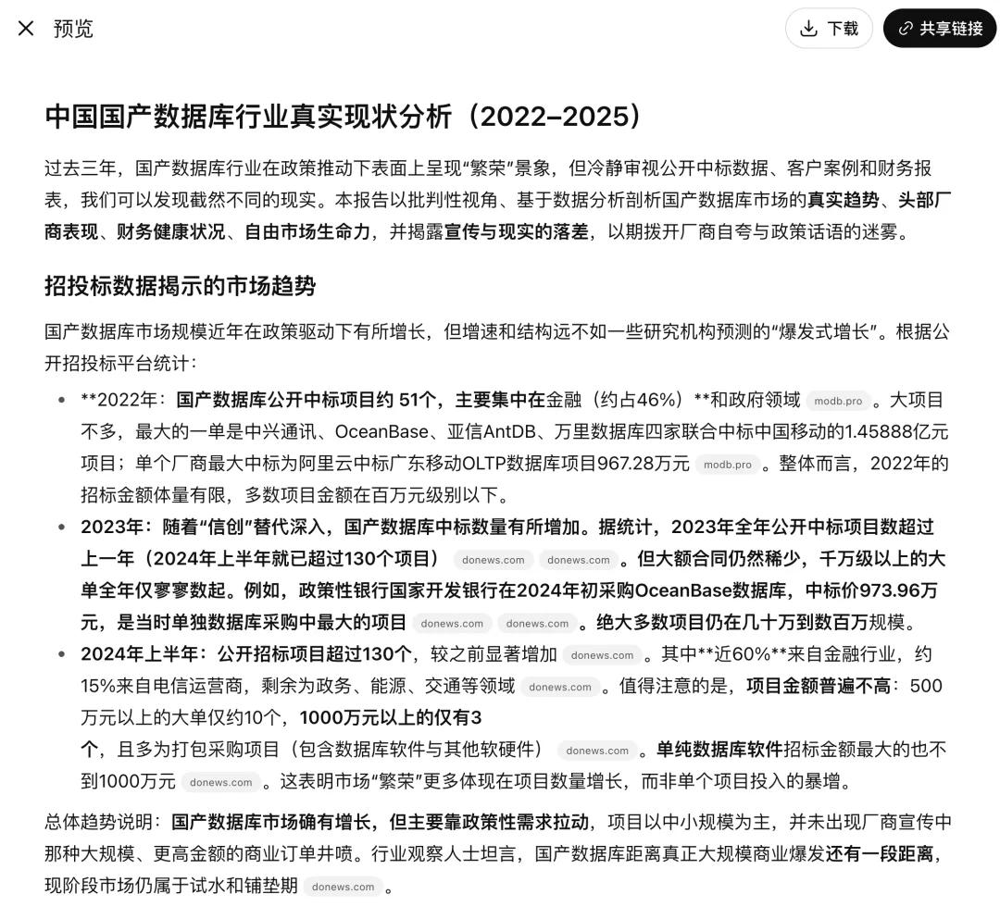

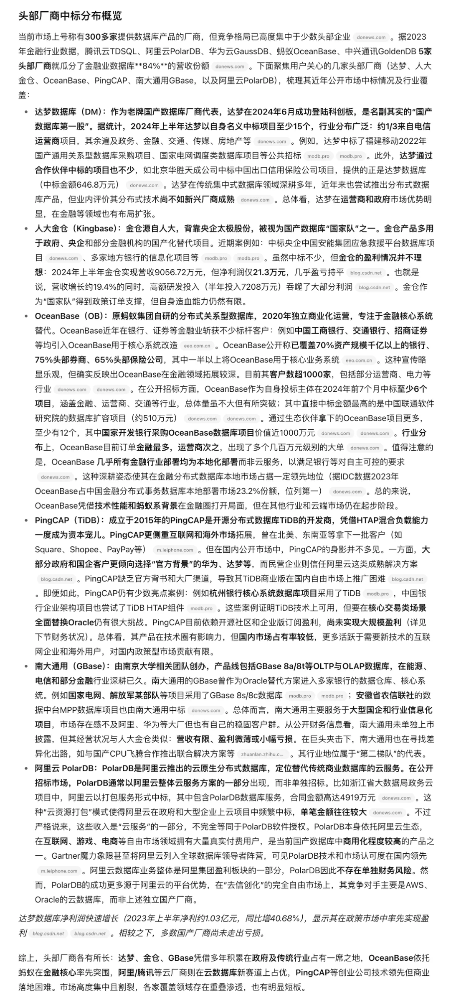

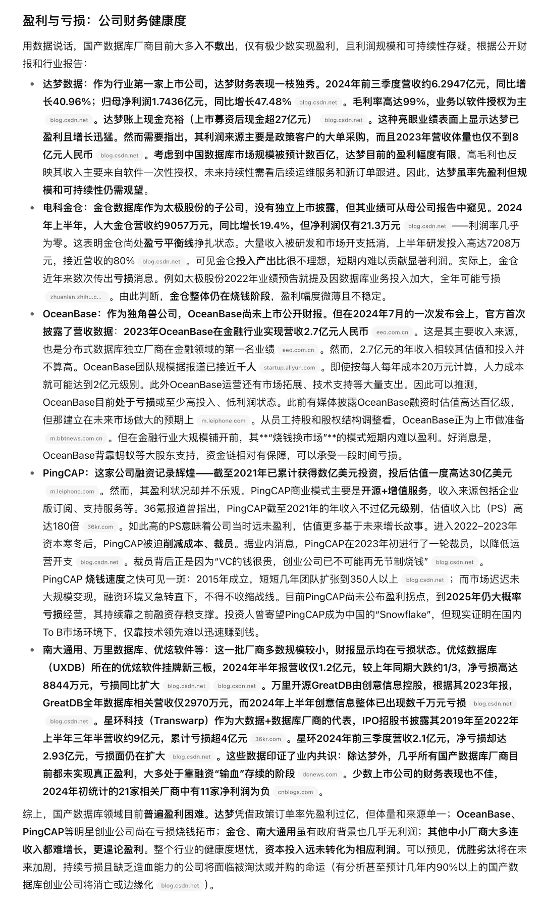

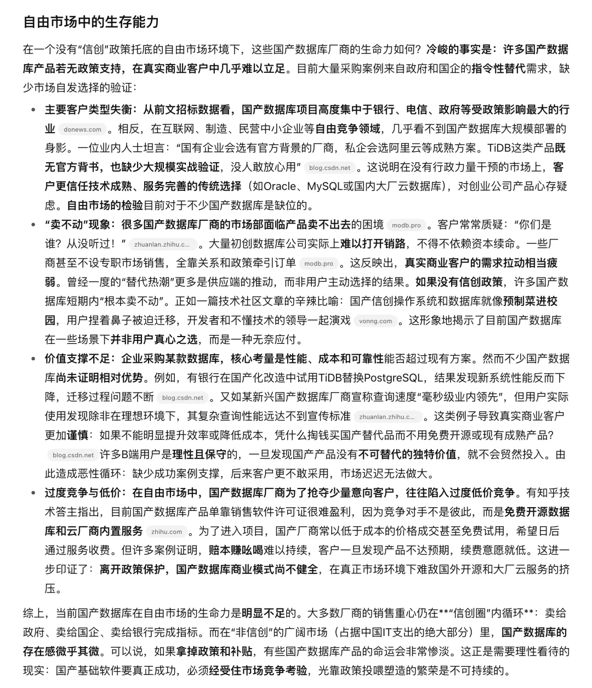

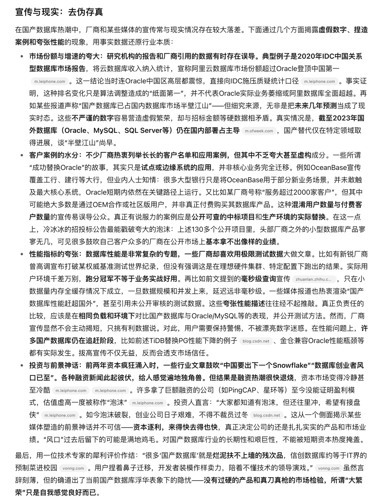

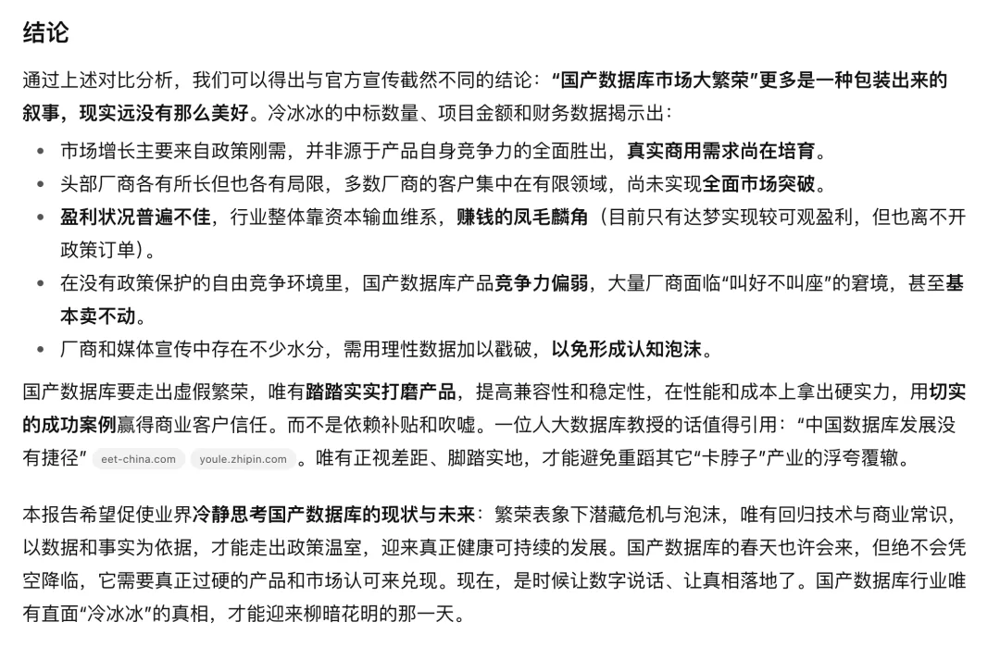

## 老冯评论

老冯觉得呢，Claude 的表现还是很不错的，当然，这里有个别事实瑕疵老冯一眼能看出来，比如其实 TiDB 是上过一次 2024 年的 StackOverflow 数据库流行榜最后一名的 0.2% 使用率，不是完全没上过。但整体，大面儿上，我觉得说的是没啥问题的。也可以作为一个参考，哈哈。

OpenAI GPT 5 pro 用起来感觉更 “天真” 一些，很容易受到厂商营销宣传的影响，老冯自己的感觉是写的没 Claude 好。

至于国产数据库本身，老冯已经聊过不少了 —— 老实说我对这种过家家的游戏兴趣并不大，如果你对老冯关于国产数据库行业的评论感兴趣，下面这些相关文章供您进一步参考阅读。

[国产数据库到底能不能打？](/db/db-china/)

[‍国产数据库是大炼钢铁吗？](/db/db-china/)

[数据库真被卡脖子了吗？](/db/db-choke/)

[分布式数据库是伪需求吗？](/db/distributive-bullshit/)

[中国对 PostgreSQL 的贡献约等于零吗？](/pg/china-pg-contribution/)

[机场出租车恶性循环与国产数据库怪圈](/db/airport-taxi-db/)

[EL 系操作系统发行版哪家强？](/db/rhel-compatibility/)

[基础软件到底需要什么样的自主可控？](/db/sovereign-dbos/)

[这么吹国产数据库，听的尴尬癌都要犯了](/db/domestic-db-hype/)

[20 刀好兄弟 PolarDB：论数据库该卖什么价？](/db/cheap-polar/)

[第二批数据库国测名单：国产化来了怎么办？](/db/db-national-test-2/)

### 微信搜 pigsty-cc 小助手

---

发布版本：[微信公众号](https://mp.weixin.qq.com/s/N_O5HS4o2bSXISQLzAVq7g)
