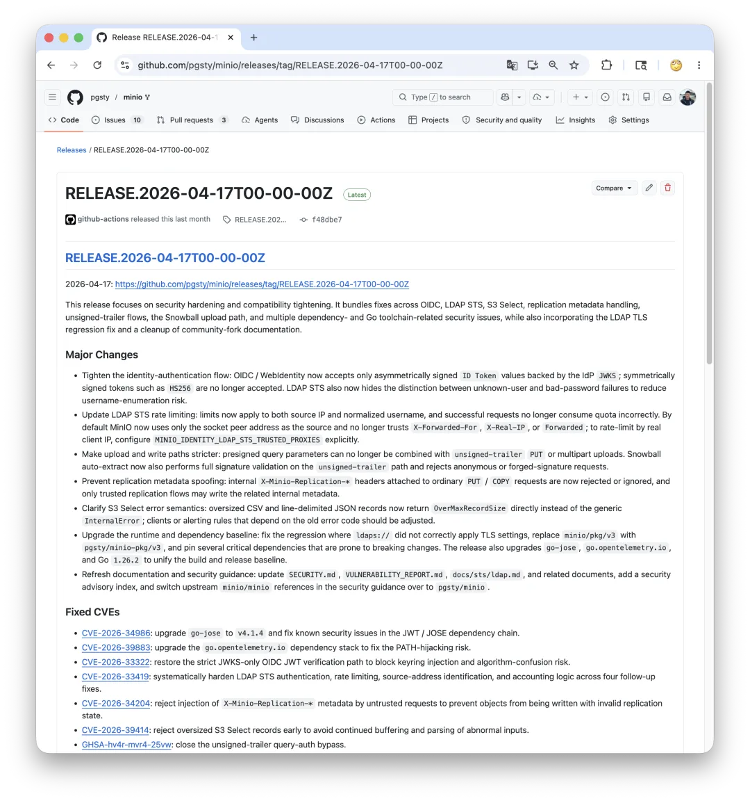
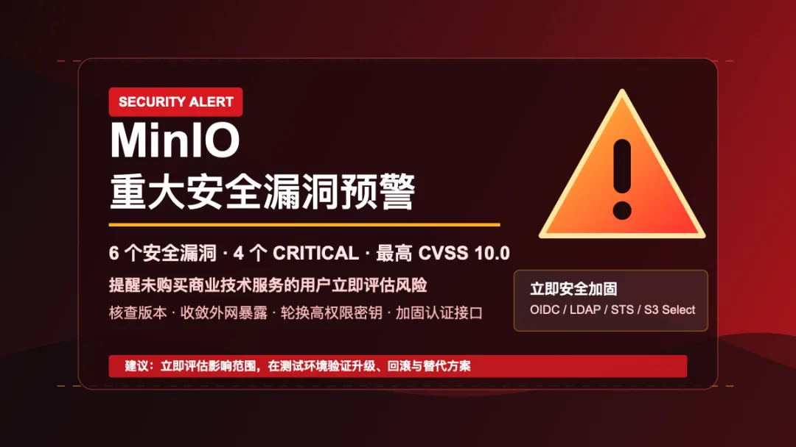

> 原作者：白小安

老冯：这是 RustFS 朋友写的文章，提醒大家 MinIO CVE 风险。最近 RustFS 刚刚 Beta1 了，据说七月份准备 GA，老冯也挺期待看看正式版本能不能 Drop-In Replace MinIO。如果您准备继续使用 MinIO，除了换成 RustFS，购买 MinIO AI Stor 商业支持，也可以试试老冯维护的分支 pgsty/minio，[用 Codex 修复了这几个 CVE](https://mp.weixin.qq.com/s?__biz=MzU5ODAyNTM5Ng==&mid=2247491924&idx=1&sn=feb20550cb3f459decb4ff8ee6783af4&scene=21#wechat_redirect)，目前已有 1.5K Star 与十万+ Docker Pull，一些知名开源项目比如 Grafana Loki 也已经迁移到了该分支上。

> ❝
>
> RustFS 官方提醒：如果你的生产环境正在使用 MinIO，**但尚未购买 MinIO 商业技术服务**或缺少持续安全响应机制，请尽快完成版本核查、访问收敛、身份认证加固与应急预案梳理。同时，建议在测试环境中验证 RustFS，提前为对象存储架构留出更稳妥的演进路径。

过去一段时间，MinIO 再次爆发多个安全漏洞，并且出现了 10.0 级别的高危漏洞。对仍在使用 MinIO 社区版本、且没有商业技术服务保障的团队来说，现在需要重点关注的不是某一个单点漏洞，而是三个更现实的问题：

1. 是否能够第一时间判断当前版本是否受影响；
2. 是否具备经过验证的升级、回滚和补丁流程；
3. 是否有对象存储替代方案的测试与迁移预案。

> ❝
>
> ⚠️ **高危预警：** 本次公告涉及 6 个安全漏洞，其中**4 个评级为 CRITICAL（严重）**，最高 CVSS 评分达**10.0**。建议所有使用 MinIO 或相关组件的用户立即评估影响并采取缓解措施。

| CVE 编号 | 涉及组件 | 漏洞类型 | CVSS 评分 | 严重程度 |
|----|----|----|----|----|
| CVE-2026-30240 | Budibase / MinIO | 路径遍历 / 文件读取 | 9.6 | 🔴 CRITICAL |
| CVE-2026-33322 | MinIO OIDC | JWT 算法混淆 / 身份伪造 | 9.2 | 🔴 CRITICAL |
| CVE-2026-33419 | MinIO AIStor STS / LDAP | 凭据暴力破解 / 用户枚举 | 9.1 | 🔴 CRITICAL |
| CVE-2026-34204 | MinIO PutObject | 加密元数据注入 | 7.1 | 🟠 HIGH |
| CVE-2026-34976 | Dgraph / MinIO S3 | 缺失授权 / SSRF / 数据库覆写 | 10.0 | 🔴 CRITICAL |
| CVE-2026-39414 | MinIO S3 Select | 内存耗尽 / DoS | 7.1 | 🟠 HIGH |

从风险类型看，这些问题覆盖身份伪造、凭据暴力破解、路径遍历、服务端请求伪造、数据库覆写、元数据注入和拒绝服务等场景。对于没有持续安全响应机制的团队，建议不要只做单点版本判断，而要同时检查外网暴露、身份源配置、访问密钥、Bucket 策略和备份恢复流程。

## 为什么要现在处理

对象存储的风险通常不会只停留在存储服务本身。它与 IAM、OIDC、LDAP、KMS、网关、备份系统、数据分析组件和应用 SDK 深度绑定。当对象存储对公网暴露、控制台弱保护、身份源配置不严、访问密钥长期不轮换时，攻击者获得的可能不只是一个 Bucket 的读写权限，而是进入整个平台数据面的入口。

如果企业没有购买商业技术服务，也没有内部专职团队持续跟踪安全公告，就更容易遇到以下情况：

- 漏洞公告已经发布，但生产环境版本仍长期停留在旧版本；
- 修复版本可用，但缺少灰度、兼容性测试和回滚方案；
- 安全组、控制台端口、管理 API、STS、LDAP/OIDC 接口暴露范围过大；
- 访问密钥多年不轮换，权限策略过宽，审计日志不完整；
- 备份恢复流程没有演练，真正故障时无法确认数据一致性。

这些问题在平时看起来只是“运维债务”，在漏洞窗口期就会变成直接风险。

## 建议立即完成的安全自查

请优先从以下几个方向进行检查和加固。

### 1. 核查版本与公告

确认当前 MinIO 服务端版本、部署方式、镜像来源、启动参数与依赖组件版本。对照官方安全公告、CVE 信息和内部资产清单，判断是否处于受影响范围。

对于生产环境，不建议在没有测试的情况下直接升级核心存储组件。更合理的做法是先在测试环境复现现有配置，再验证升级路径、客户端兼容性、权限策略、生命周期规则、复制任务、加密配置和备份恢复流程。

### 2. 收敛网络暴露面

检查对象存储 API 端口、控制台端口和相关管理接口是否对公网开放。非必要场景下，应通过安全组、防火墙、ACL、反向代理或 VPN 将访问范围限制在受信任网络内。

重点关注以下对象：

- 对象存储 API 端口；
- Web Console 或管理控制台；
- OIDC、LDAP、STS、KMS 等身份与密钥相关接口；
- 备份、同步、数据分析组件使用的对象存储凭据。

### 3. 加固身份认证与访问密钥

对象存储的长期访问密钥应被视为高敏感凭据。建议立即梳理所有 AccessKey、SecretKey、服务账号、临时凭据与外部身份源配置。

建议动作包括：

- 清理不再使用的访问密钥和服务账号；
- 按业务最小权限原则重写策略；
- 对高权限账号执行密钥轮换；
- 检查是否存在共享 root 凭据、脚本明文凭据或长期未轮换凭据；
- 为认证接口增加限速、告警和异常登录检测。

### 4. 检查 Bucket 策略与数据暴露

请重点检查公开读写策略、匿名访问、跨账号访问、预签名 URL 使用方式，以及业务系统中是否存在过宽的 `s3:*` 权限。

许多数据泄露并不是来自复杂攻击，而是来自“临时开了公开读，后来忘了关”“测试账号沿用到生产”“应用服务拿了管理员权限”这类长期存在的配置问题。

### 5. 建立补丁、回滚和应急流程

对象存储升级应有明确的变更流程，包括测试验证、数据备份、灰度发布、监控观察、回滚策略和责任人。对于没有商业技术服务保障的团队，尤其需要提前把流程跑通，而不是在漏洞公开后临时决策。

## 同步建议：在测试环境验证 RustFS

RustFS 是面向云原生与企业级场景设计的高性能分布式对象存储。对于正在评估对象存储长期架构的团队，我们建议不要等到生产环境出现风险时才开始寻找替代方案，而是尽早在测试环境中完成验证。

你可以从以下场景开始：

- 使用现有 S3 SDK 或应用接入 RustFS，验证基础读写、分片上传、预签名 URL；
- 迁移一组非核心 Bucket，测试对象元数据、目录约定和业务兼容性；
- 验证 IAM 策略、访问密钥管理、Bucket Policy 与审计日志；
- 测试备份恢复、节点故障、扩容和重启场景；
- 对比关键业务负载下的吞吐、延迟和资源占用；
- 将 RustFS 纳入现有监控、告警、日志和变更流程。

测试的目标不是“一步替换生产”，而是让团队在安全、成本、性能和可控性之间有更多选择。当真正需要调整架构时，已经有数据、有流程、有验证结论。

## 给运维与安全团队的一份短清单

如果你今天只能做几件事，建议按以下顺序处理：

1. 盘点所有 MinIO 实例、版本、部署位置和公网暴露情况；
2. 关闭非必要公网访问，尤其是控制台和管理接口；
3. 核查是否使用 OIDC、LDAP、STS、KMS 等高风险集成；
4. 轮换高权限访问密钥，清理长期不用的账号；
5. 检查 Bucket Policy，移除不必要的公开访问；
6. 建立升级测试环境，验证补丁、回滚和备份恢复；
7. 在测试环境部署 RustFS，完成 S3 兼容性和业务链路验证。

## 结语

对象存储是企业数据基础设施的重要一环。安全加固不应只在漏洞公告发布后才被动进行，也不应完全依赖某一个产品版本或某一次升级。

RustFS 建议所有仍在使用 MinIO 且缺少商业技术服务保障的团队，尽快完成安全自查和访问收敛，建立可验证的升级与应急流程，并在测试环境中评估 RustFS。越早验证，越能在关键时刻保持主动。

如需开展 RustFS 测试验证，可准备以下信息：当前对象存储规模、Bucket 数量、对象数量、典型对象大小、客户端 SDK、认证方式、部署环境、性能指标和备份恢复要求。基于这些信息，团队可以更快形成可执行的测试方案。

---

本文为 RustFS 官方安全提醒文章，旨在帮助对象存储用户提升风险意识并开展安全加固。具体生产变更请结合自身环境、官方公告和内部变更流程审慎执行。

请尽快开始测试 RustFS，为安全升级预留出可靠的时间。

---

发布版本：[微信公众号转载页](https://mp.weixin.qq.com/s/Q5tE-eUk2BJqxfSPHYC74A)
