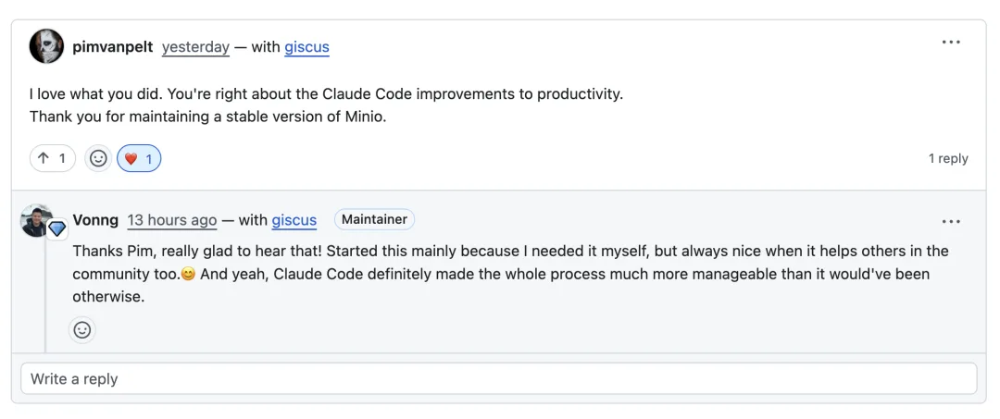
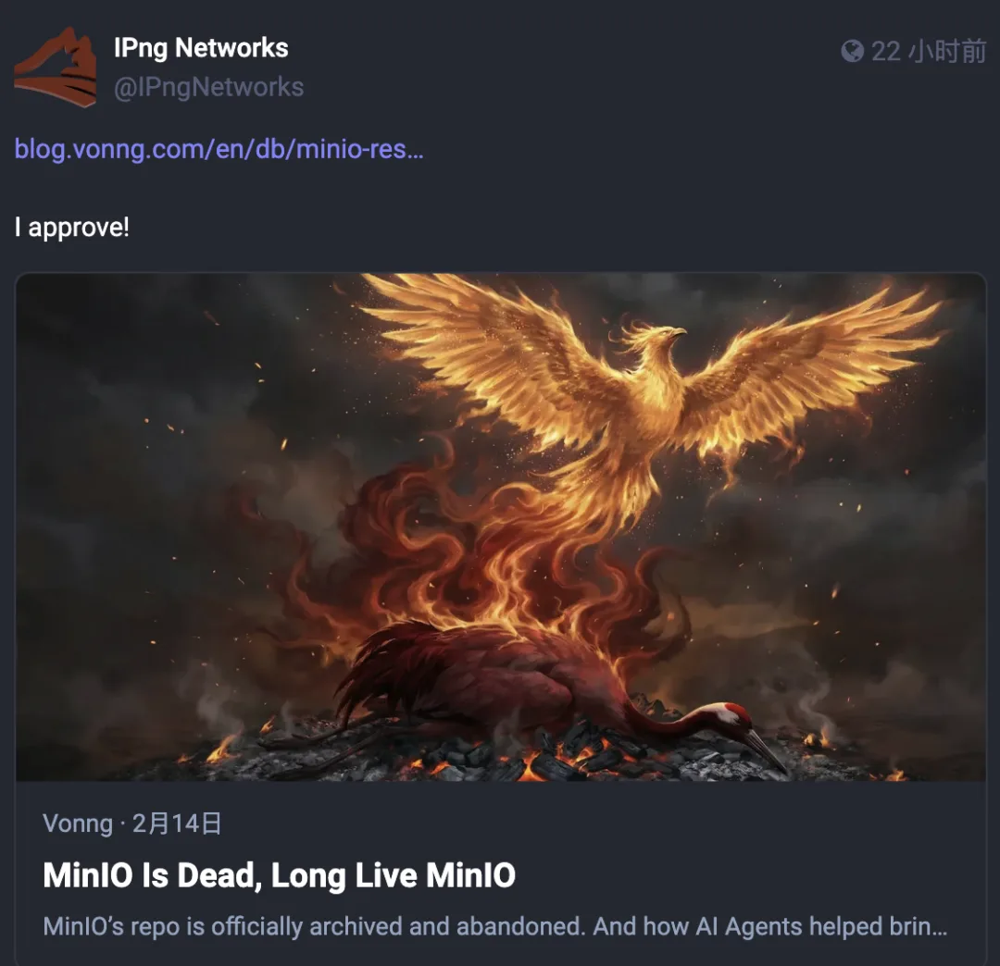
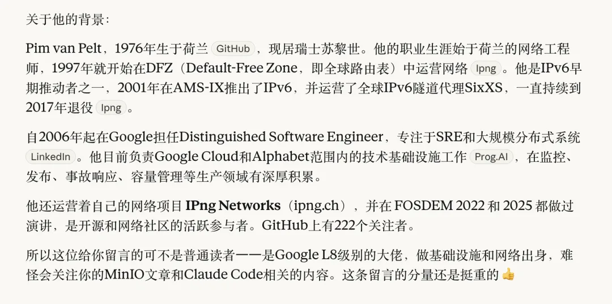
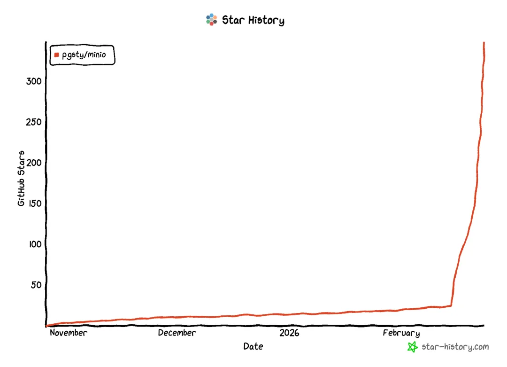
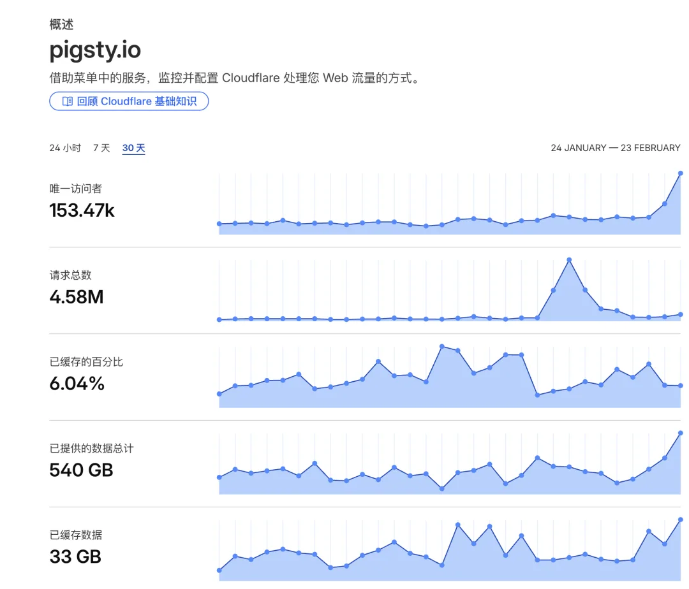
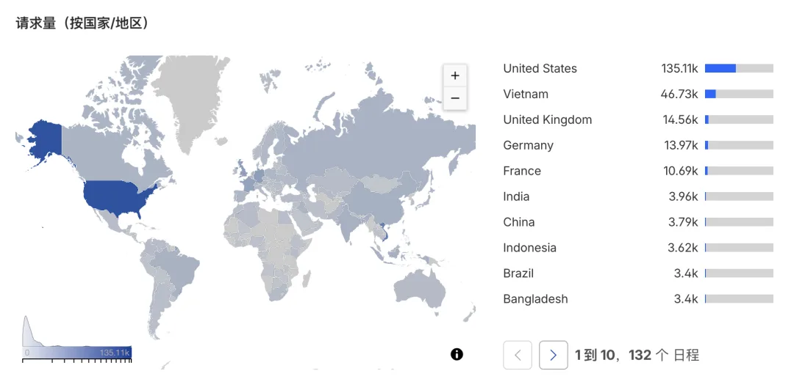

今天早上照例打开 GitHub，看到之前写 MinIO 那篇博客下面多了一条英文留言：

> "I love what you did. You're right about the Claude Code improvements to productivity. Thank you for maintaining a stable version of Minio."

看完挺高兴的。发现他还拿自己公司的官号去转发，来了句“I Approve！”

有人用，有人认可，做开源最朴素的快乐莫过于此。

这哥们还在 LinkedIn 上加了我，点进去一看 —— 好家伙，还是个大佬。Google Distinguished Software Engineer，从 2006 年开始在苏黎世做基础设施，负责 Google Cloud 和 Alphabet 的技术基础设施。顺手 Claude 了一下

---

起因很简单。

MinIO 开源版去年底进入维护模式，今年二月正式归档。六万 Stars 的项目，说没就没了。我维护的 Pigsty 里 MinIO 是一个模块，用户拿它做 PostgreSQL 备份。MinIO 噶了，我的用户也得跟着遭殃。

等了几周没人接盘，[我就自己 fork 了一份](https://mp.weixin.qq.com/s?__biz=MzU5ODAyNTM5Ng==&mid=2247491187&idx=1&sn=005af2d12f6f4d258040efbe4faf08bb&scene=21#wechat_redirect)：恢复被砍掉的管理控制台，重建构建流水线，打出 RPM/DEB 安装包，修复安全漏洞。目前来看，`pgsty/minio` 应该是唯一还在维护并提供系统包的 MinIO 分支。

然后我写了篇英文文章讲这件事：MinIO Is Dead，Long Live MinIO[1]。Pim 的留言就是在这篇文章下面。

---

打开 Github，发现一眨眼就三百多 star 了。

每天的网站统计，发现访问量哗哗地往上涨。

做开源有时候真的像往大海里扔瓶子。你写了一段代码，打了一个包，发了一篇文章，然后就继续干活去了。你不知道这个瓶子会漂到哪里，被谁捡到。大多数时候没有回音。然后某天早上你打开页面，发现有个其他领域的大佬跑过来跟你说了一句：I love what you did. 后面还跟着哗哗涌进来的访客。

这种事不常有。但有一次，就够开心好一阵子。

---

说实话，这件事本身没花我多少工夫。

我让 Claude Code 用官方的流程进行打包构建，前后大概也就用了两个小时左右，同时还干着其他的活。

主要是因为我已经有一套完整的 CI/CD pipeline 和基础设施，平时就维护着几十个 Go 项目的包。加上我对 MinIO 本来就很熟——之前就打包构建过——所以再加一个 MinIO 进来，不过就是"加双筷子"的事。

真正的变化在于 Claude Code 把原本繁琐的苦力活——读不熟悉的代码、调构建脚本 CI/CD —— 这些执行层的摩擦，降到了接近于零。我弄完丢进 Pigsty 里测试了几个常见用例，确认没问题就完事了。

但我确实很高兴它能帮到别人。有时候做开源的快乐就是这么简单——你随手做的一件小事，可能恰好解决了不少人的真实问题。这也是 AI 实实在在能够帮助开源社区的一个例子。

春节假期就要结束了，这个 MinIO 只是假期里我用 AI 干的许许多多事情中的一件。明天会发一篇，盘点过去十天里用 AI 完成的所有工作。

---

发布版本：[微信公众号](https://mp.weixin.qq.com/s/V2jTr4kTE3cf5kAFfvZUtg)
