> [WeChat](https://mp.weixin.qq.com/s/eRa3tnzV9WBuGEBgtbCDVQ)

Omarchy has been all over my X timeline lately. It is a desktop Linux distribution by DHH, and over the past couple of days the story has flooded the Chinese internet too.

I previously translated DHH's entire [move off the cloud](https://mp.weixin.qq.com/s?__biz=MzU5ODAyNTM5Ng==&mid=2247485760&idx=1&sn=97096da1077a4fbb4c43452a3c4983c7&scene=21#wechat_redirect), and I follow his blog regularly, so I watched Omarchy take shape. Still, I did not expect the 4.0 release to make this much noise.

I happened to have an old laptop lying around—a 2018 Intel MacBook Pro—so I installed Omarchy and used it for a few days.

Here is the bottom line: **it is a tasteful, genuinely good operating system, but I ultimately replaced it with Ubuntu 26. It cannot match macOS as a desktop, and it cannot match Ubuntu's convenience on a server. That leaves it awkwardly stranded in the middle.**

**That said, I wholeheartedly welcome another serious player—and another real choice—in the ecosystem.**

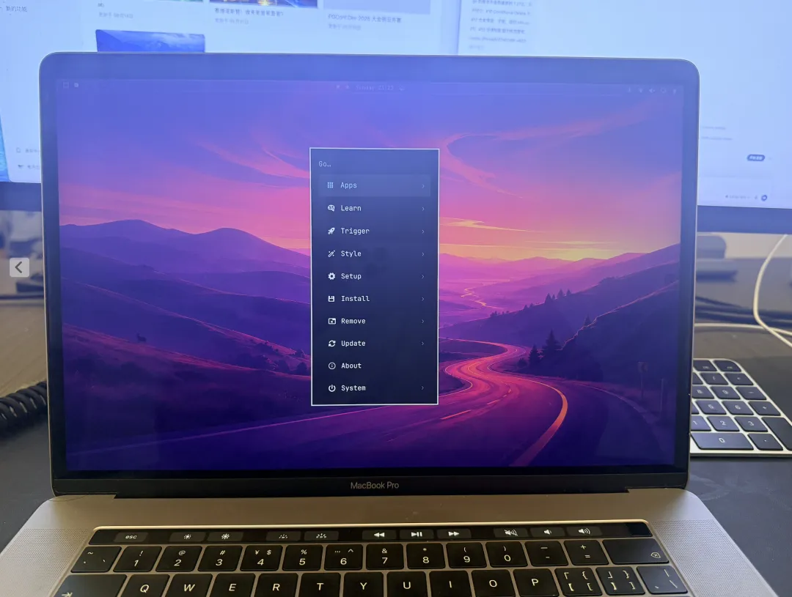

This article is **10% AI**.

## What Omarchy Gets Right

One thing Omarchy gets especially right is that **it runs on old Intel MacBooks**. Installation is remarkably smooth, without the keyboard failures, broken USB Wi-Fi drivers, and nonfunctional USB network adapters I used to encounter with T2 Linux.

That brings a huge installed base of aging Macs back to life. These Intel models have fallen out of macOS support, so the choice is stark: stay on an old release that more and more new software refuses to support, or leave perfectly good hardware gathering dust.

T2 Linux already made it possible to run Debian or Ubuntu on an Intel Mac. Those systems worked, even reasonably well, but the desktop still felt far short of macOS. Omarchy does not match macOS either, but it is at least much better than Ubuntu's desktop.

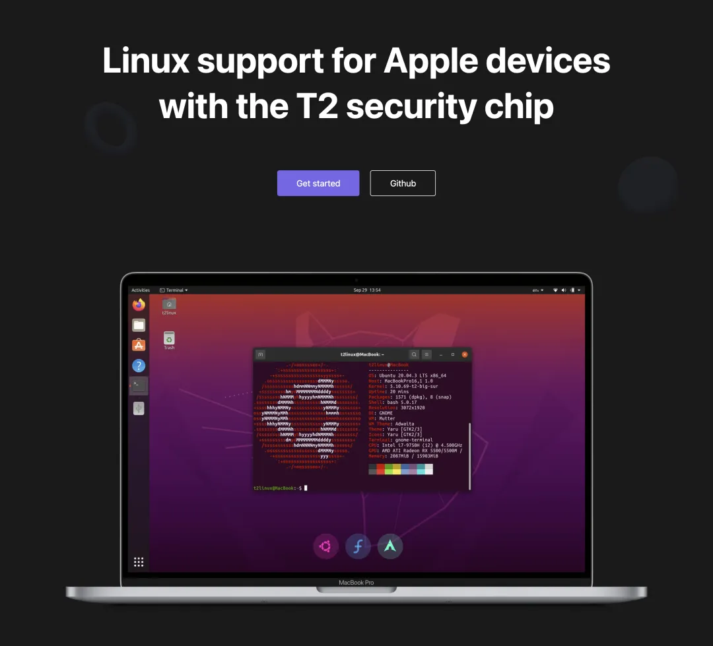

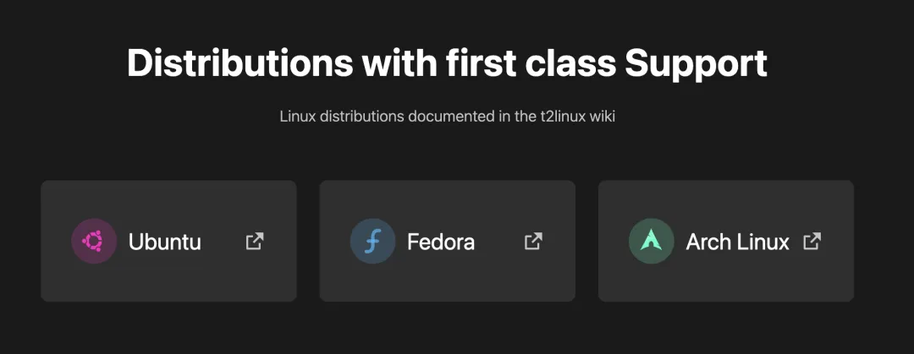

Some people sneer that Omarchy is just “DHH's giant bundle of dotfiles.” That is too dismissive; plenty of careful customization went into it.

At the other extreme, some fans market it as an “agent-native operating system built for AI.” That is absurd. Bundling Codex, Claude Code, and OpenCode—and they are not even preinstalled—is something [I did before Lunar New Year](https://mp.weixin.qq.com/s?__biz=MzU5ODAyNTM5Ng==&mid=2247490846&idx=1&sn=1083f1f55a22ac88e3aab24e0907b102&scene=21#wechat_redirect). Putting a few packages in an installer and calling yourself an AI-first operating system is bullshit.

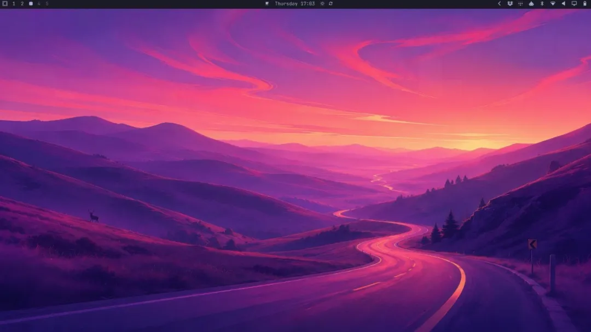

Set that noise aside: Omarchy's desktop still falls well short of macOS, but its taste and ambition may already set the high-water mark for Linux distributions. It is, at least from what I have seen, **the only project in the Linux ecosystem with the drive to chase macOS-level polish**. That takes real nerve. DHH happily unloads on Linux hypocrites, and I admire him for it.

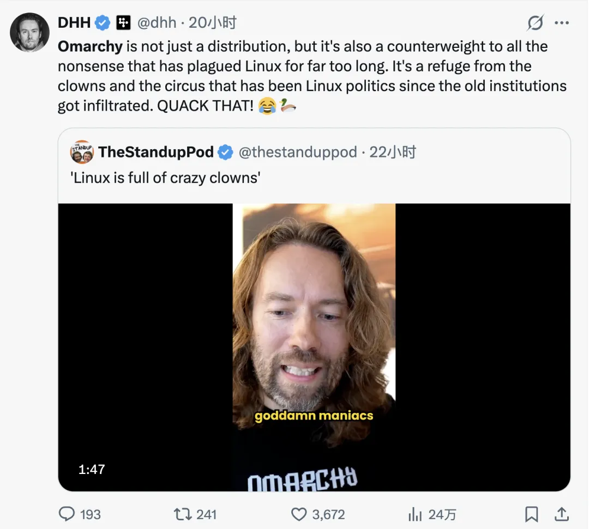

As Confucius put it, understanding is no match for loving, and loving no match for delighting. Only someone like DHH—a middle-aged computer nerd who is already financially independent and truly loves computers—can pull off something like this. To make desktop Linux good, you need someone with taste, technical skill, resources, influence, and a **genuine love for it**.

## On Linux Distributions

As the author of a PostgreSQL distribution, I know Linux distributions inside out.

I build and distribute PostgreSQL and more than 400 extensions across 16 Linux distributions, maintaining close to 100,000 packages. Pigsty may be a PostgreSQL distribution, but in practice that makes me half a Linux distribution author too.

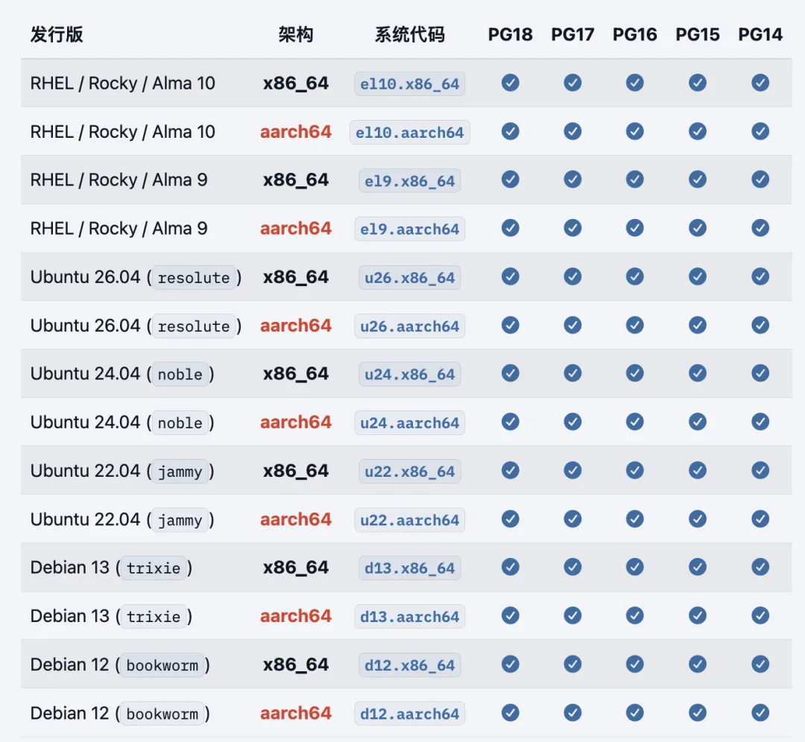

I have tried almost every kind of distribution: the Red Hat family (CentOS, Rocky Linux, AlmaLinux, and Oracle Linux), Debian, the entire Ubuntu family, Fedora, Arch Linux, NixOS, Mint, Kali, and Chinese distributions such as Kylin, UOS, and openEuler.

After experimenting with all those operating systems, I have come full circle. These days I mostly use Debian and Ubuntu, with the occasional Enterprise Linux system.

Simple, reliable, and usable—that is what matters. On a server, that is enough; for the desktop, a serviceable UI will do. However much you tune a Linux desktop, it still will not beat macOS, at least not in the next few years. Omarchy does offer some hope. But if you ask me what to use, look at the world's most widely used Linux distribution: Ubuntu. Why make life harder?

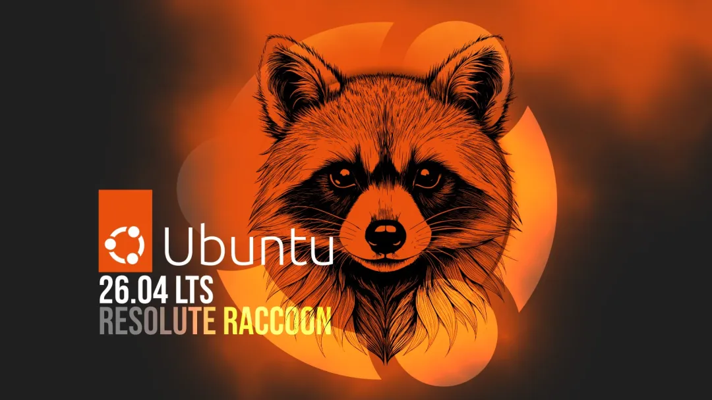

## On Ubuntu

Outside China, Ubuntu is overwhelmingly dominant. Chinese developers may not feel it as strongly, but one look at the Stack Overflow Developer Survey makes its lead obvious.

Ubuntu is derived from Debian. I also like Debian because, like PostgreSQL, it is a pure, uncompromising open-source project. Debian is a good fit for running Proxmox virtual machines. But if you are doing AI work and need NVIDIA drivers, Ubuntu may be the only practical choice.

Enterprise Linux is also common in China because the CentOS family has been used so heavily, so I encounter it often. For my own systems, however, I still prefer Ubuntu—**it may be the only operating system that does a respectable job on both the desktop and the server**, and it is widely used.

Ubuntu never beat Windows on the desktop, but it won decisively on servers and in the cloud. A large share of Linux instances on AWS and Azure run it, and it is the default distribution for WSL.

## On Debian

The other operating system I particularly like is Debian, Ubuntu's upstream. The two have a great deal in common.

It is not as ready out of the box as Ubuntu, but it is pure. If you distribute software or run an open-source project, Debian will probably be your first choice for a base image.

It is a rock-solid, utterly dependable operating system.

## So What Should You Use?

The new school year is about to start, and many people are buying computers. Take my advice: **stop fiddling with desktop Linux. Just use macOS and be done with it.** It gives you a BSD-style terminal environment, most of the tooling overlaps with Linux, and it combines a first-rate desktop with a very good command-line experience.

If you want the best AI-native desktop experience, macOS is the safe choice. Most of the developers behind these tools use macOS themselves and target it first. If you want to tinker, get a Linux server—a cloud VM or a mini PC—and do whatever you like with it. But treating the desktop itself as a hobby? Honestly, I am past that age.

Muscle memory is hard to migrate. Here is a concrete example. On macOS, I use a key-remapping utility that turns Caps Lock into a very powerful Hyper key. With it, my fingers never need to leave the keyboard: I can emulate the mouse, scroll, swipe, switch windows, and launch applications. It makes me easily ten times as efficient.

I am sure Linux has similar remapping tools, but I cannot be bothered to set them up. The moment I switch to Linux, my typing and navigation speed plummets. I do not want to remember two shortcut systems; the existing one is already wired into my muscles. All that tinkering produces nothing.

The same logic applies to work. I build Pigsty, which runs a full stack of databases and observability tools. On Ubuntu, I can at least ship the whole thing as `.deb` packages. If I moved to Arch Linux, would I need to build a separate set of `pacman` packages? I truly cannot be bothered.

## It Reminds Me of the Early Ubuntu

DHH's Omarchy resembles the early Ubuntu in some ways. Ubuntu, too, began as an excellent open-source community operating system backed by a wealthy South African: Mark Shuttleworth.

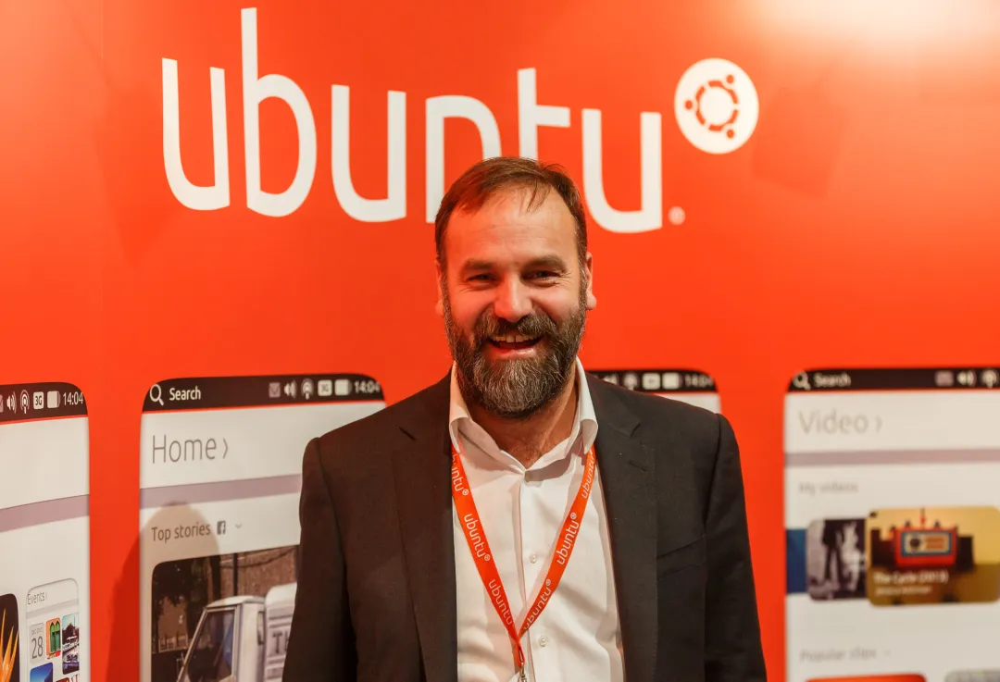

He saw Debian as technically solid but unfriendly to ordinary users: installation was hard, the release schedule was unpredictable, and sometimes years passed between versions. His idea was simple: use Debian as the foundation, polish it into a desktop system that worked immediately after installation, **release every six months on a fixed schedule, and keep it free forever**.

He even mailed installation CDs for free. The program was called **ShipIt**. Shipping was free worldwide; apply, and he would send you a disc. That was how many people first encountered Linux. It was quite a story.

Today Ubuntu is backed by Canonical, a commercial company, and users have started to grumble about decisions such as its aggressive promotion of the Snap package manager. It no longer feels quite as pure. If Omarchy gets good enough, that will be great news; I am all for it. But if you ask whether I would switch today, I would still choose Ubuntu.

Then again, if Omarchy one day delivers a Linux experience and ecosystem that truly match macOS, I will switch without a second thought.

## Appendix: Stack Overflow Developer Survey

Yesterday I asked Codex to scrape more than a decade of Stack Overflow Developer Survey data, mainly to analyze how database usage has changed. I also had it produce a report on the evolution of operating system usage. The charts are below for anyone interested.

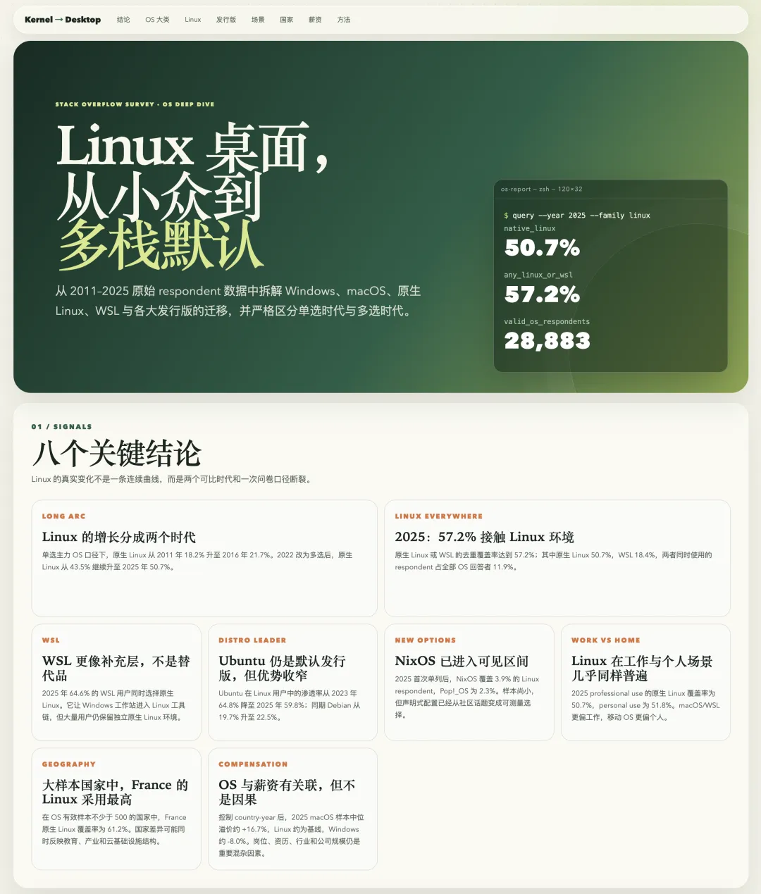

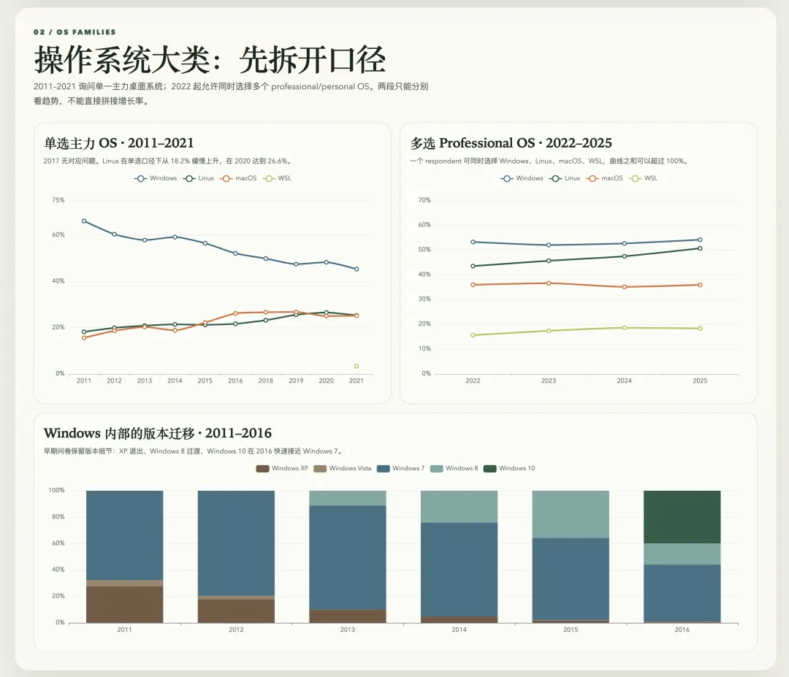

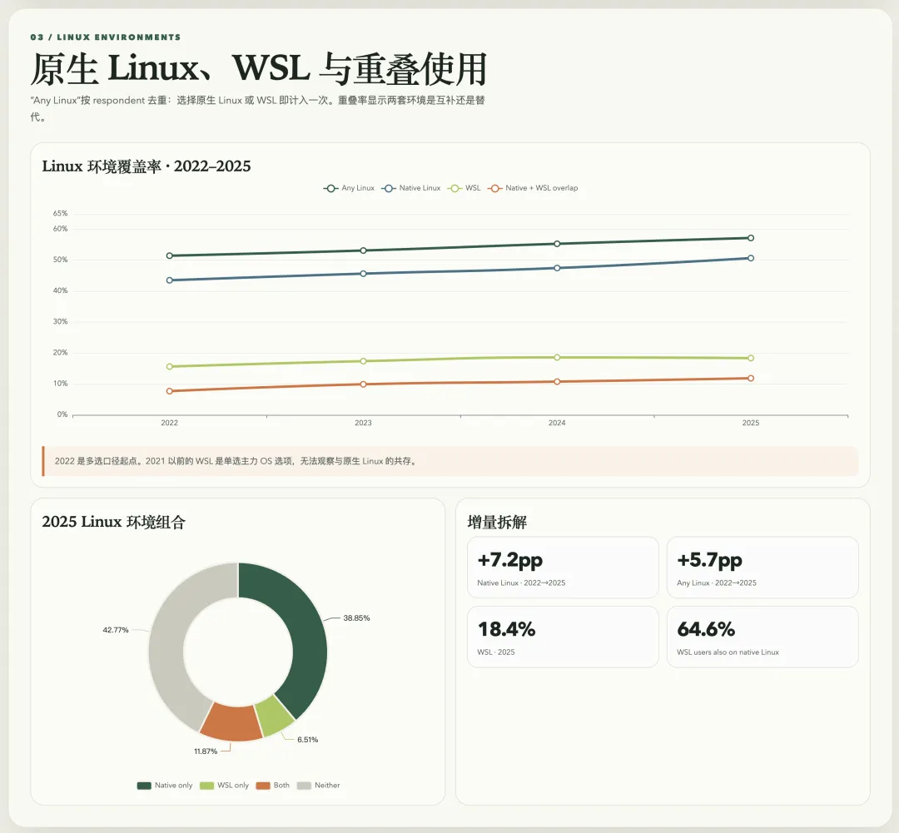

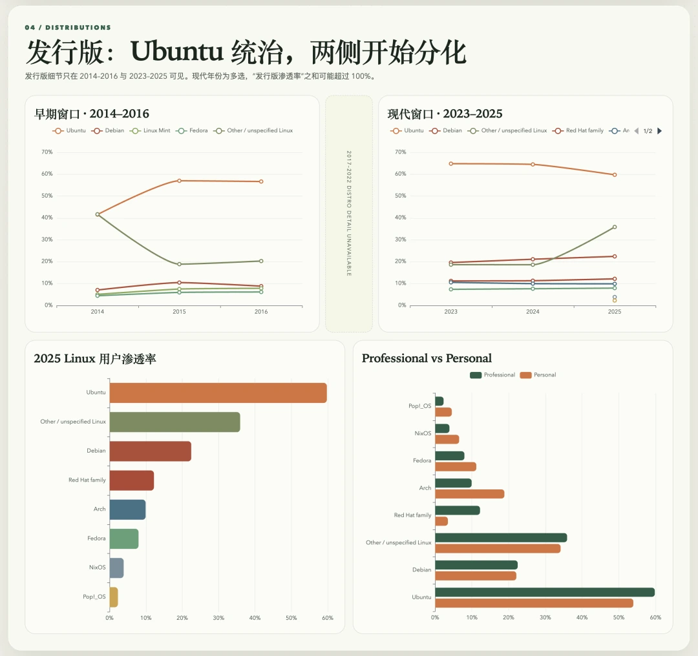

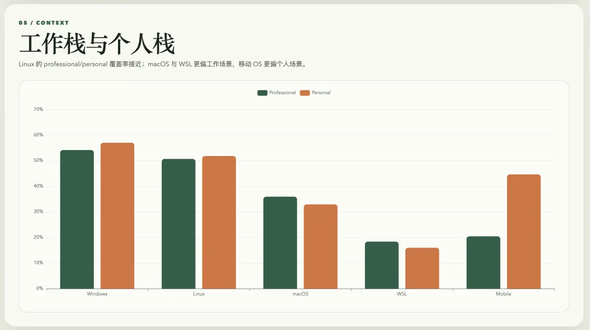

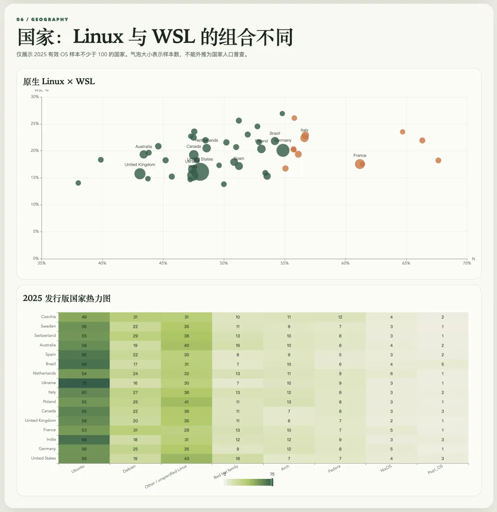

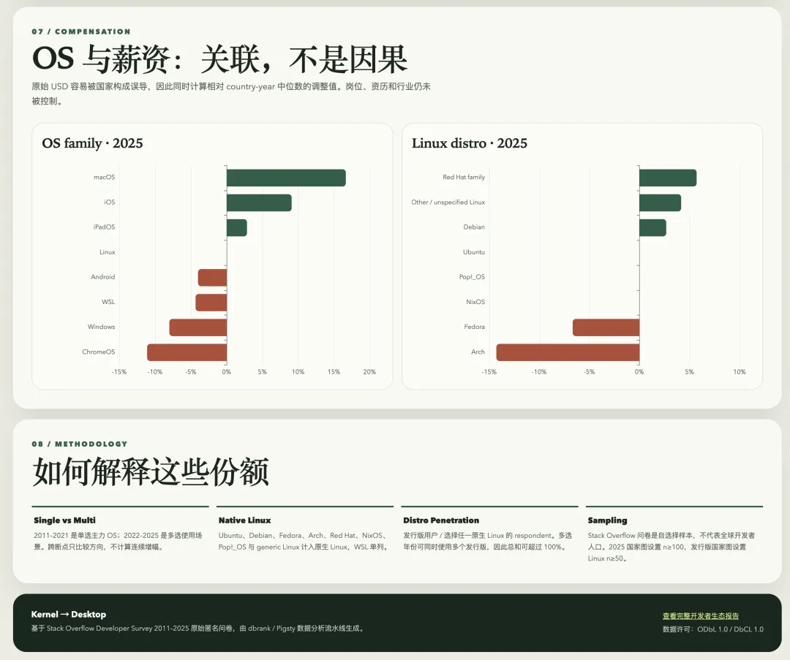
