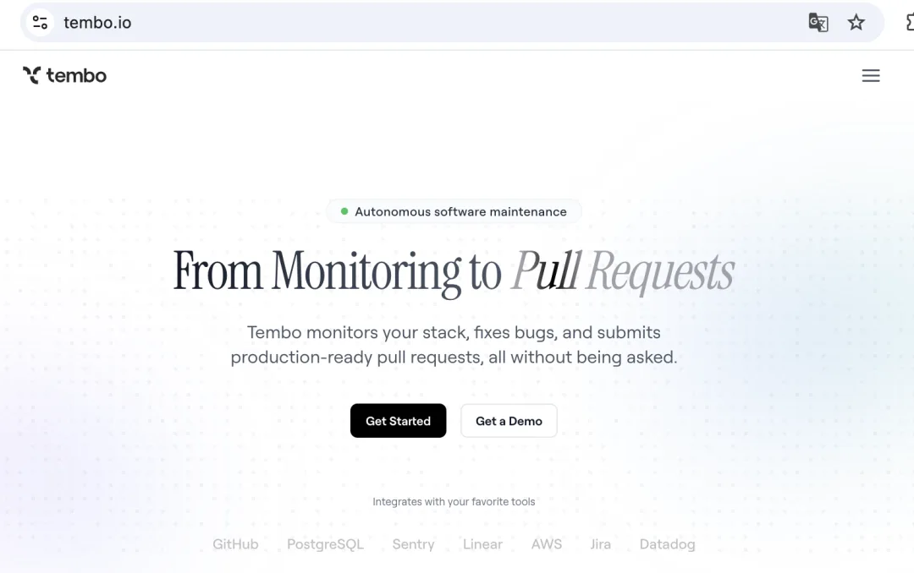
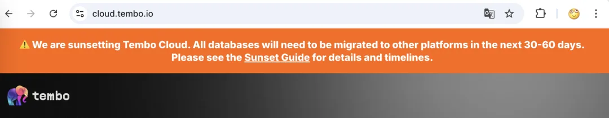
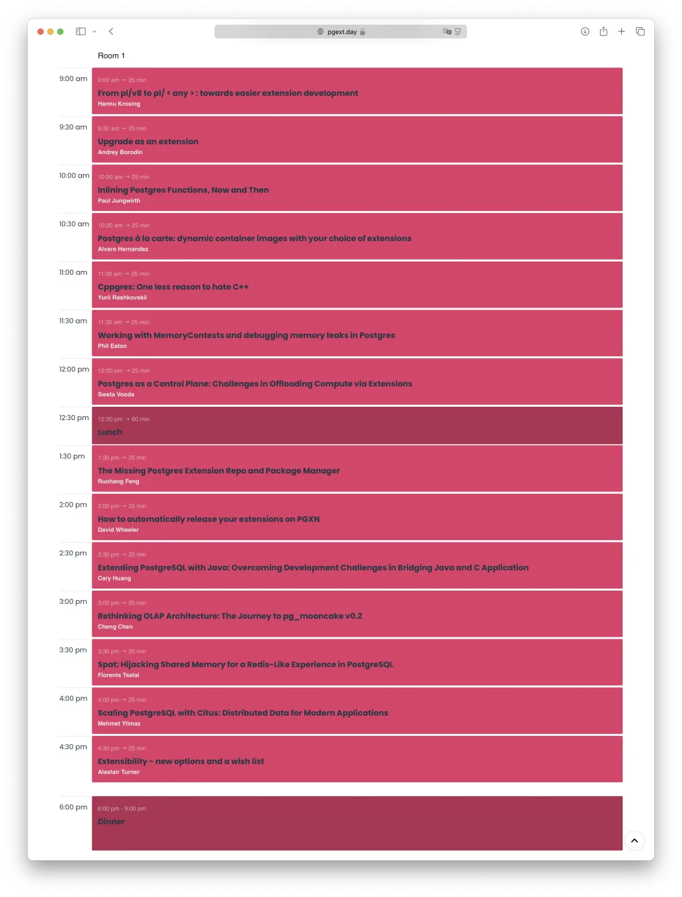
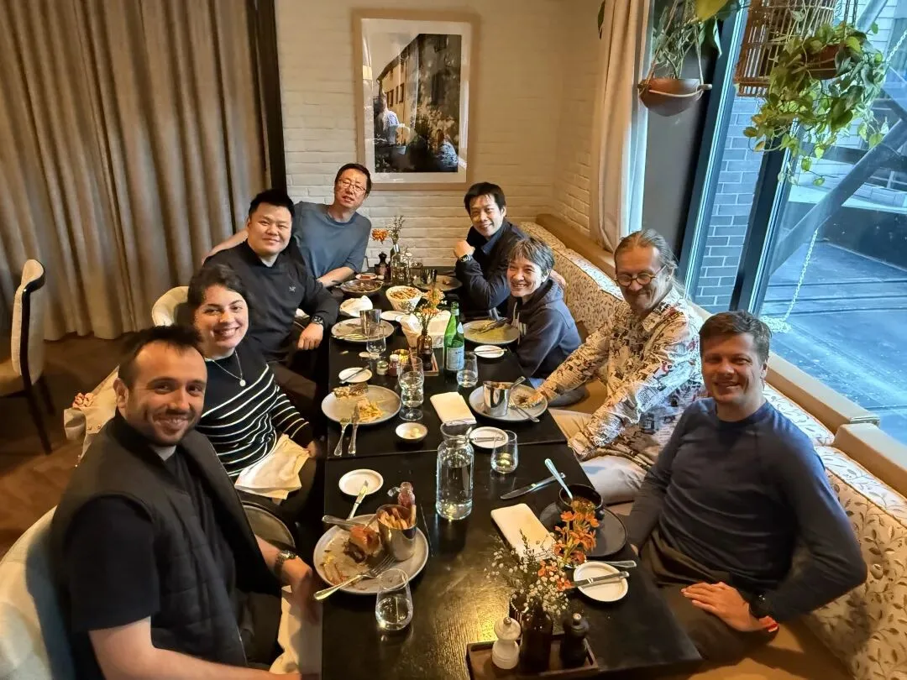

老冯今天在蒙特利尔见到几位朋友，分享八卦与行业传言是各种大会最有趣的部分。有一些不算敏感机密的信息，老冯可以与各位读者朋友分享一下。

## OpenAI 收购 Supabase？

正如过去文章中介绍的，老冯一直以来都很看好 Neon 和 Supabase，[最近 Databricks 拟以十亿美金估值收购 Neon 的消息已经众所周知了](/pg/pg-capital-market/)。目前 Supabase 刚刚融资 200M \$ 估值 2B \$，估值正好是 Neon 的一倍，既然 Neon 都被收了，干的比 Neon 还出彩的 Supabase 又会花落谁家呢？一个正在数据库圈流传的小道消息是 OpenAI 准备收购 Supabase。

这两件收购案目前都还处在 “传言/风声” 阶段，但已经在圈内传开了并且有鼻子有眼。作为 Postgres Serverless DBaaS 姐妹花，两场极为成功的收购，再加上 Databricks 在今年下半年大概率会 IPO，2025 年很有可能会重新点燃数据库赛道。重现 2021 年的盛景，当然这次故事的主角很显然都是 PostgreSQL 相关的投资标的，跟其他数据库就没多大关系了。

## 搞 DB 的狂蹭 AI

另一个正在流传的消息是，巨头与独角兽们手上拿着钱准备买一些 AI 相关的公司，这种机会大概还会持续一年。所以吸引了不少公司疯狂 Pivoting 到 AI 去。

在 《[AI 时代，软件从数据库开始](/ai/ai-agent-era/)》纳德拉说过了 AI 时代的软件就是 Agent + Database。所以数据库本身也算是与 AI 领域高度相关的方向，重新被 AI 点燃也不算什么稀奇的事情。

Neon 和 Supabase 都算是蹭 AI 蹭的比较好，或者说蹭的最前沿的 DB 公司。早在 ChatGPT 带火向量数据库之前就发现了 pgvector 可以用来做 Embedding 与模糊检索 RAG。[当然老冯搞 Pigsty 整合 pgvector 并提入 PGDG 仓库也就比它俩晚一个月左右](/pg/llm-and-pgvector/)。跟 AWS RDS 支持算是前后脚。但是在融资这一点上，兄弟真开上路虎了，老冯是真羡慕美国友商啊。

没出息的 Tembo

其他一些做数据库相关的公司，也都开始尝试向 AI 上蹭。比如做 PG 扩展分发的 Tembo 似乎就放弃了他们的 Postgres 托管服务，跑去凑 AI Monitoring / PR 处理的热闹去了。老冯前天还纳闷呢 Github 上的 pg_vectorize 扩展的 Owner 本来是 tembo，怎么现在变成一个个人了，现在看来原来是抛弃正业了。

老冯很鄙视这种到处凑热点追逐炒作潮流的花蝴蝶，说直白难听点儿就是技术投机分子。烧了这么多投资人钱的玩意说扔也就扔了，给客户两个月下云滚蛋，用他家云数据库的客户全成了大冤种，实在是不负责任。

同时老冯也要偷乐一下，Tembo 吹出来的牛逼  —— PG 扩展分发与包管理器 trunk，饼画的很大，两年没干啥实事，一直就那两百个扩展，现在干脆跑路了。在 PG 扩展分发领域唯一一个可能成为 Pigsty 潜在对手的玩家主动自杀了，怎么能不让老冯笑晕在厕所？

所以啊，有时候还是那些真正靠热爱与兴趣的做事的人，才能不忘初心的坚持下去。在这一点上，我跟 几位友人 惺惺相惜，达成了高度共识。

## 政治紧张传导至商业/技术

当然，也有许多不好的消息，比如美国市场对于中国数据库产品的态度。有朋友其实把我的 Pigsty 数据库发行版推荐给他们的（美国）客户，但不幸的是，这些美国客户现在对于中国公司，以及中国国籍创始人，乃至于中国开发者的软件产品/服务非常敏感 —— 典型的态度是，为了避免监管找他们麻烦，直接就不考虑了。

单纯作为开源软件，客户自己 DIY 来使用的话倒是没什么问题，但如果俺想卖商业服务，商业版本产品的话，估计就只能找本地服务商贴牌了。当然，中国市场其实也是差不多的样子 —— 央国政企单位要搞信创，跟美国沾边的东西就不想碰。美国的 EDB 也不也跑国内来做的贴牌生意了么。

老冯的目前提供 PostgreSQL 专业咨询支持/ Pigsty 订阅服务，绝大多数客户都是中国公司，也有一些东南亚企业，都在亚洲。虽然美国公司很有钱，我也很想挣美国佬的钱。但作为一个数据库个体户，其实一个中国市场也够够的了。

简单直接的选择可能是直接放弃美国市场，然后作为一个纯粹的开源软件扮演搅屎棍大王，云数据库本地开源免费替代者的角色，零元倾销，掀翻 RDS 的饭桌，给他们来一些软件共产主义铁拳震撼。

## 明天的演讲

老冯明天会在 PGEXT DAY 扩展峰会上进行题为 《[PG 生态缺失的包管理器与扩展仓库](/pg/pgext-day/)》的主题分享。Yurii 带了全套直播设备，会在 Youtubu 上进行直播。我演讲的时间是蒙特利尔时间下午 1:30，下午第一场，蒙特利尔跟国内时差正好 12 个小时，也就是国内凌晨 1:30。好在演讲应该有录像。

除了老冯自己的演讲，这次直播还有不少主题让我自己都很感兴趣。比如，来自 Google 数据库组的 Nannu Krosing 将分享从 PL/v8 到用任何语言开发 PG 扩展，Alvaro 分享如何在容器环境中解决扩展分发问题。Yurii 搞了个 C++ 写扩展的框架想与 Rust 的 pgrx 竞争也值得一看，Carry Huang 如何与 Java 互操作，Florents 的在 PG 里实现一个 Redis，Chen 的 pg_mooncake DuckDB 缝合分享。

顺带一提明天的几位嘉宾今天已经碰上了，我非常期待明天各位嘉宾的精彩分享。也欢迎各位朋友通过直播平台收看，或者在 Youtube 上看回放。老冯也会在扩展峰会结束后的第一时间与各位分享当天的精彩内容。

---

发布版本：[微信公众号](https://mp.weixin.qq.com/s/RmU7RXl9ewwnpabjI4lw4Q)
