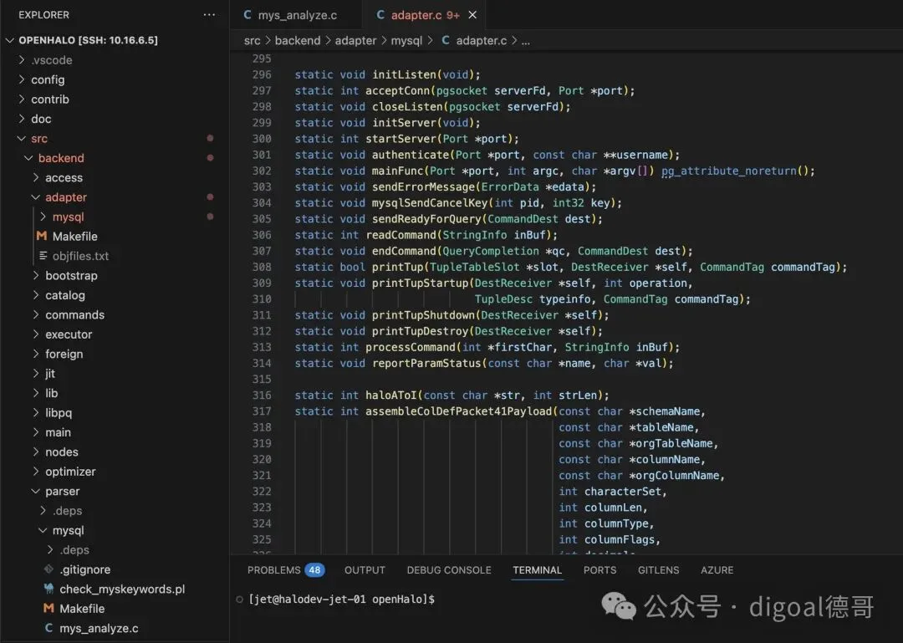
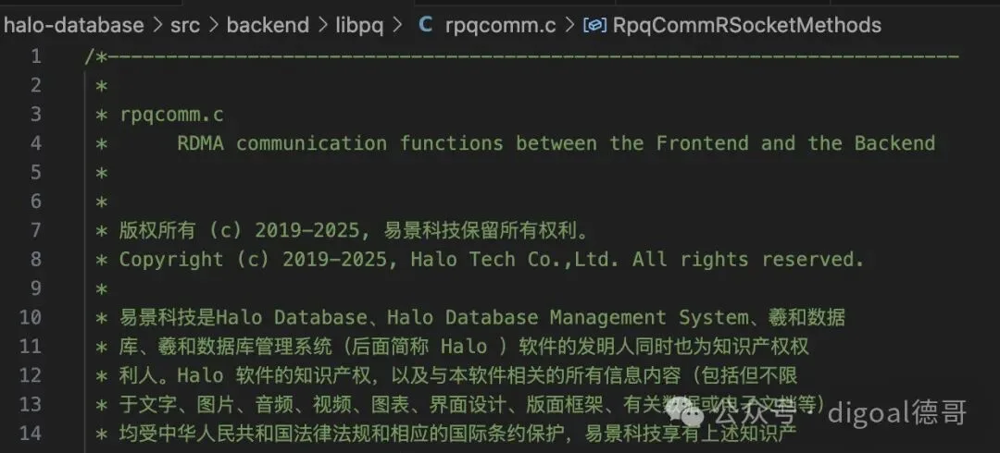
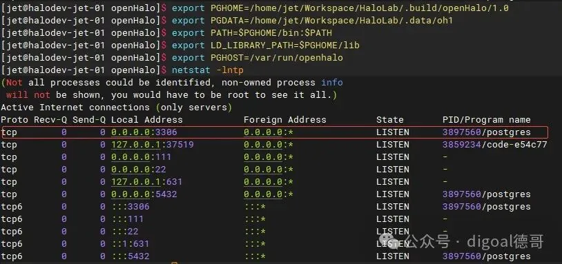
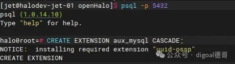
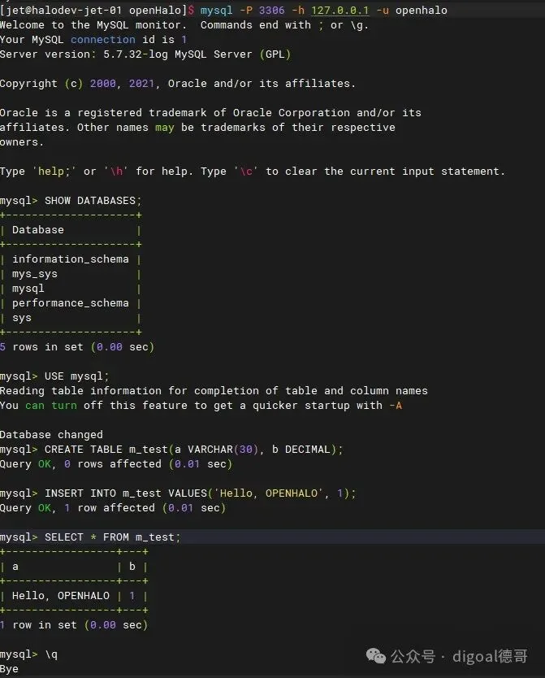
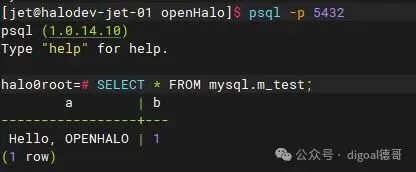

> 原作者：digoal

大家都知道 Oracle 的对手很多，大多数都是奔着平替 Oracle 数据库去的，这类产品的特点是尽量保证 Oracle SQL 语法兼容性、存储过程兼容性，从而减少原有应用的开发成本，如果不能做到 100% 兼容，还要给出评估报告和修改语句，同时需要有数据验证能力、双写能力和回迁能力，两套系统并行运行一段时间后验证两套数据库的数据一致性，确保迁移后的系统运行稳定、数据正确、逻辑正确。说实话平替 Oracle 是非常大的工程。但是大家可能忽略了一点，除了平替 Oracle，还有一种是涉及改应用的替换方法，替换到什么数据库去呢？大多数情况下业主为防止二次被厂商绑定，会选择替换到兼容开源数据库的商业产品，这样的话业主可以随时切换到开源产品中。所以迁移目标通常就发生在兼容 MySQL 语法或 PostgreSQL 的产品上。为什么会有 MySQL 呢？MySQL 也是 Oracle 的产品啊。因为有个矛盾无法解决：国内 MySQL 的开发者多，语法也简单，所以还是很多业主会选择兼容 MySQL 语法的产品。这就导致替换 Oracle 变成了更加复杂的多目标选择，而不是统一的迁移到兼容 PostgreSQL 的产品上。这把数据库厂商搞懵了，好像替 O 还变成站队了，你站了 MySQL 就和 PG 派的开发商搞不好关系，站了 PG 就和熟悉 MySQL 的开发商搞不好关系。真难为情！就不能同时一个产品兼容 Oracle、PostgreSQL、MySQL 吗？成年人不做选择题，统统都要。还真有这么个产品：HaloDB  <http://www.halodbtech.com/>

这么牛的产品，就在杭州，果然《[强者，只用数据说话！战胜杭州的只有杭州](https://mp.weixin.qq.com/s?__biz=MzA5MTM4MzY1Mw==&mid=2247492928&idx=1&sn=a9ebe3a4e0655713d1880bee901c4965&scene=21#wechat_redirect)》。CTO 是老朋友章总，熟悉 Oracle 的一定知道他。他在创办 HaloDB 之前曾在保险行业成功替换核心系统 Oracle，肯定经历过各种迁移问题，例如前面提到的选型站队问题。所以创办 HaloDB 时，选择了让一个产品同时兼容 Oracle、PostgreSQL、MySQL。HaloDB 核心基于 PostgreSQL 代码，在协议层采用了类似 Babelfish（兼容 SQL Server 的 PG 协议层插件）的做法，增加 Oracle、MySQL 的语法解析，并与 PG 的优化器、执行器连接，开发者可按需选择语法。这才是 Oracle 的真正劲敌！市面上的替 O 产品不具备在一个数据库实例中，让同一份数据同时兼容 Oracle、MySQL、PostgreSQL 的能力。HaloDB 做到了，Oracle 瑟瑟发抖。

就在上个礼拜，老章说要在 4 月 1 号开源 HaloDB，我擦，愚人节，老章这货莫不是实际不开源，要搞个愚人节营销？

那咱们就 4 月 1 号杀到老章公司，看看他到底是不是真开源？我怎么也想不明白，HaloDB 居然真的宣布开源了！擦，你们以为我穿越了吗？今天是 3 月 31 日啊。

开源项目地址：<https://www.openhalo.org/>

下面展示一些代码片段：

为了见证这一伟大的历史时刻，我决定明天休假一天，替好奇粉丝宝们直接杀到 HaloDB 总部，可能以直播形式分享这一精彩时刻。一起问问老章：第一版开源了哪些 feature？和商业版有什么差别？后面的 roadmap 如何？如何选择开源协议？开源后的社区建设计划？有什么开发者培养计划？有没有生态合作计划？开源版接收外部贡献吗？如何保证代码质量？和商业版如何保持代码一致性？会不会保持持续开源？如何证明开源的价值？开源如何促进商业发展？因为我之前写过一篇骇人听闻的“[又一开源数据库项目停更！企业开源不能持久的原因是什么？](https://mp.weixin.qq.com/s?__biz=MzA5MTM4MzY1Mw==&mid=2247493430&idx=1&sn=dabf7793b04999137d3fcc4901d35750&scene=21#wechat_redirect)”

相信宝子们还有很多疑问，可以在留言区留言。待后续文章中逐一揭开，还没有关注我的公众号和视频号的宝宝们可以关注一下：公众号:

---

## 视频号:

---

发布版本：[微信公众号转载页](https://mp.weixin.qq.com/s/UHfaGt-_NbAdm9D4jsqsug)
