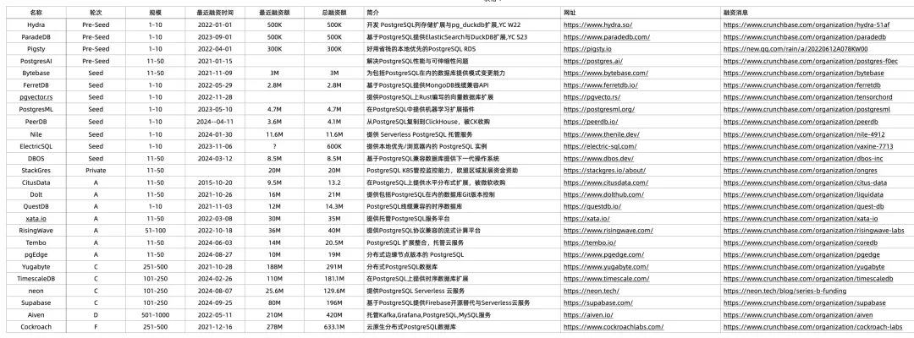
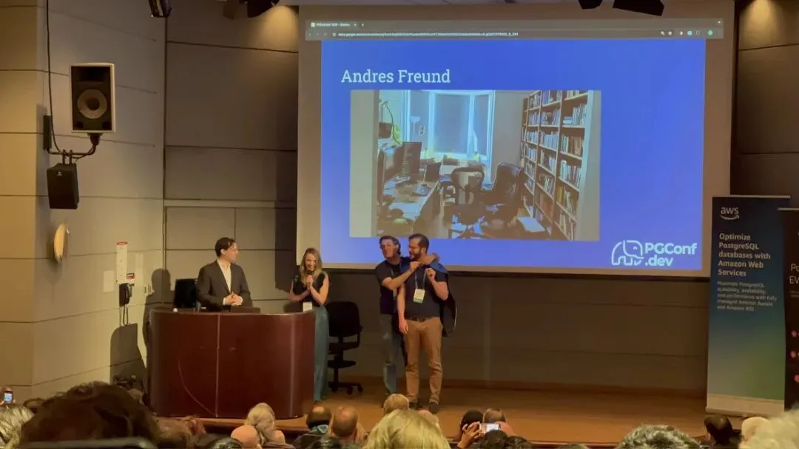

## Andy Pavlo 发表于 2025 年 1 月 1 日，译评：薛永杰

## 就像突然有人一记“脑瓜冲天炮”般直击（这里有视频佐证[1]），我又来了！为大家奉上我每年的数据库大乱斗总结。没错，以前我是在 OtterTune[2] 的博客上写这些东西，然而公司已经 Game Over（愿它安息）。现在我就跑回自己的教授个人博客来搞事。

过去这一年里发生了不少事，从 10 位数的收购案、厂商到处撒野乱改许可证、再到某位超级有钱的数据库界八旬老汉为了追求新女神、砸钱拉拢大学橄榄球明星等传奇故事，好不热闹。

我答应过我第一任老婆，今年要写得更专业点。而且听说有些大学把我每年的总结当作数据库课的必读材料。所以今年我得好好斟酌。但话说回来，想想我之前两年的文风，也就那样吧。反正咱先试试，看能不能稳住。

往年文章传送门：

- 2023 年数据库回顾[3]
- 2022 年数据库回顾[4]
- 2021 年数据库回顾[5]

---

## 这是我的数据库，想怎么改许可证就怎么改！

我们身处数据库的黄金时代。各种优秀的（关系型[6]）数据库数不胜数，适用于各种应用场景。很多软件都开源了，而背后则是拿了风投的公司在运营。

可风投老爷们可不做慈善，他们要回本，还要装满自己的“**钱袋子**”。于是这些数据库公司纷纷推出云上托管服务。但云的存在让开放源码数据库的商业模式变得相当棘手：系统一旦火了，类似 Amazon 这种云大厂就会把你的软件打包成他们自家的云服务，赚得比你这家真正开发软件的公司还多。为了防止这种事儿发生，**很多数据库公司开始换更严格的许可证**，目的就是防止云厂商抄作业。MongoDB 在 2018 年[7]就已经带了个头，改用了 SSPL(Server Side Public License)[8]。

过去这一年，许可证的变动就像海上的风暴，翻滚得厉害。而其中最受关注的两大事件，非 Redis™ 和 Elasticsearch 莫属。

### Redis

Redis Ltd.（公司）正在高速冲刺 IPO。最初他们在 2011 年以 Redis Labs 为名成立，后来在 2021 年改名为 RedisLtd.[9]，同时他们还从创始人 Salvatore Sanfilippo[10]（他之前拿到了 Redis Labs 的投资）那里买下了 Redis 商标。过去几年里，Redis Ltd. 一直试图统一 Redis 生态，也一直努力摆脱 “Redis 就是内存缓存” 的刻板印象，因此他们引入了向量等各种数据模型功能。

2024 年 3 月，Redis Ltd. 宣布从非常宽松的 BSD-3 协议改为双许可证[11]，分别是专有的 Redis Source AvailableLicense[12] 和 MongoDB 的 SSPL。就在他们宣布这个改动的同一天，他们还宣布收购了 Speedb[13]（这是 RocksDB 的开源分支[14]）。

这次 Redis 改许可证引发了迅速的反弹[15]。同一周就冒出了两个基于 BSD-3 旧代码的分支[16]：Valkey[17] 和 Redict[18]。Valkey 出自 Amazon，但 Google 和 Oracle 的工程师随后也加入了进来。Valkey 项目仅用一周就被 Linux 基金会[19]纳入麾下，一大波大厂转而支持它。与此同时，Redis Ltd. 又在商标上玩花活儿，还把某些开源 Redis 拓展项目的控制权收走[20]，弄得大家都觉得公司黑乎乎的。

更有意思的是，到了 2024 年 12 月，Redis 创始人发文[21]表示他又在和 Redis Ltd. 的管理层接触，准备“重出江湖”把整个 Redis 社区重新团结起来。这场景多少有点像 Bushwick Bill（RIP）、Scarface 和 Willie D 在 2015 年重组[22]，老三样再聚首。

> 老冯评论：《[**Redis 不开源是开源之耻，更是公有云之耻**](/db/redis-oss/)》，虽然 Redis LTD 这家公司本身整的烂活也不怎么样，但更应该批判的是过时的 OSI 理念与贪婪白嫖开源的公有云厂商。

### Elasticsearch

Elastic N.V. 是商业公司，背后支持的是大名鼎鼎的文本搜索数据库 Elasticsearch。2021 年他们宣布转向双重许可证[23]：Elastic License[24] 加上 MongoDB 的 SSPL。原因同样是 Amazon 上的 Elasticsearch 托管服务越卖越好，虽然人家从 2015 年[25]就上线了。Amazon 一听这事儿不乐意了，直接搞了个 OpenSearch[26] 分支进行对抗。

到了 2024 年 8 月，Elastic N.V. 又宣布反悔[27]，不再用双许可证，转而采用 AGPL[28]。他们写博客宣布这个操作时，还引用了 Kendrick Lamar 的歌（比如 Not Like Us[29]）。Amazon 估计不爽被称为“数据库圈的 Drake[30]”，随后在下个月就放了个大招，把 OpenSearch 项目捐给了 Linux 基金会[31]。

> 老冯评论：《[**ElasticSearch 又重新开源了？**](/db/elasticsearch-reopen/)》其实原因也很简单，ES 要是再不改许可证，生态位就会被 Tantivy 换皮和 Grafana 彻底占领了。

### Andy 的看法：

看起来只是个许可证的变动，但背后是数据库圈的巨额利益纠纷，而且上面还只是两个系统的故事！我都还没提到 Greenplum，他们 默默关停[32] 自己维护了 9 年的开源仓库，转为闭源，但没人注意到，因为估计也没几个人现在还真用 Greenplum。另一家在开源转闭源上翻车的，还有 Altibase[33]，那是在 2023 年干的事。

说实话，我不怎么喜欢 Redis。它跑得不够快，所谓事务[34]也比是个冒牌货，查询语法像个怪胎。我们在 CMU 做的实验发现 Dragonfly[35] 的性能数据更优秀（即使只用单核 CPU）。我在数据库课程里常拿 Redis 的查询语言来做负面典型教学（“该怎么写才不会这么难看”[36]）。不过，我也理解 Redis Ltd. 被 Amazon“骑脸”的尴尬。**但我觉得 Redis Ltd. 高估了“重写一个 Redis”这件事的难度——Redis 是个简单的系统，要做替代品没啥难度**（不像实现完整功能的 Postgres 那样离谱），所以他们这个姿态会不会让社区觉得受不了？

Elasticsearch 的情况大同小异：公司宣布改许可证，外面就冒出一个开源分支，公司又只好灰溜溜改回开源，但当时的热闹劲儿也已经过去。

奇怪的是，Redis 和 Elasticsearch 改证引发的反弹似乎比其他改证的数据库大多了。像 MongoDB、Neo4j[37]、Kafka[38]、CockroachDB[39] 等等，它们改证时，社区好像没有马上都要分支“闹独立”。就算 CockroachDB 2024 年又改了一次[40]要大企业付钱，也没见大规模分叉。那为啥 Redis 跟 Elasticsearch 就炸了锅？装机量大肯定是一方面，可当初 MongoDB 和 Kafka 的用户基数也不小啊。我猜 Redis 的问题是：大家觉得 Redis Ltd. 这种 **“拿别人东西来赚钱”** 的感觉很不爽，因为创始人早就离开了，而公司这一连串操作，让大家觉得他们对社区的贡献并不匹配他们获得的收益。另外，从 Redis 代码库提交记录[41]看，互联网大厂（比如腾讯、阿里）也有不少贡献，所以现在公司突然一刀切，也难怪大家炸毛。这跟 2023 年 HashiCorp[42] 改 Terraform 许可证被疯狂吐槽一样，都是 “占了社群红利，却要反过来控盘”的嫌疑。

归根到底，云时代，开源数据库公司（ISV）能不能活得下去确实很难。云厂商有钱又有资源，只要他们想，把你的开源数据库拿去当个插件就行，比如 AWS 把 InfluxDB v2 协议[43]给移植到他们自己的 Timestream 上，分分钟抢用户。再者，他们还可以像 Bushwick Bill 前女友一样，对着你的眼睛就是一枪[44]，像 AWS 现在直接推出兼容 Valkey 的服务，而且号称比兼容 Redis 的服务便宜 30%[45]，这波釜底抽薪简直太狠。

> 老冯评论：在《[**云计算泥石流**](/cloud/exit/)》专栏中，我已多次聊过这件事了：公有云 PaaS 云软件白嫖开源软件（数据库）的行径是[**行业毒瘤**](/cloud/profit/)，必将招致反噬 —— 而这将成为这个时代的行业核心议题。比如：[云遣返运动](/cloud/odyssey/)

---

## Databricks vs. Snowflake 的街头帮派混战还在继续

Databricks 和 Snowflake 之间的互怼依然火力全开。这俩大厂的恩怨情仇，绝对是一场“经典数据库之战”，已经从性能打到了生态、从台面斗到了台下。

2024 年 3 月，Databricks 先开了一枪，宣布花了 1000 万美元训练了一个自家开源大模型 DBRX[46]，拥有 1320 亿参数。开发团队就是他们在 2023 年花 13 亿美元收购的 Mosaic[47] 团队。结果一个月后，Snowflake 也搞了个 Arctic 开源大模型[48]，有 4800 亿参数，号称只花了 200 万美元就把它训练得能吊打 DBRX，尤其在“企业场景”诸如自动生成 SQL 方面更强。你能看出 Snowflake 故意把自己跟 DBRX 对比，一副“我就是要怼你 Databricks”的气势；他们甚至承认有其他模型（比如 Llama3）跑得比自己还猛，但就是硬要对比 DBRX。某位 AI 研究员说为什么 Snowflake 天天盯着 DBRX 不放[49]，而不跟别的大模型比？他大概不知道这俩数据库厂都流了多少血了。

就在公众都盯着大模型大战时，Databricks 和 Snowflake 又在“元数据目录”这个领域暗自角力。从 2010 年代起，Hive 的 HCatalog[50] 一直是数据湖上的默认目录服务。后来 Iceberg[51]（Netflix 出品）和 Hudi[52]（Uber 出品）崛起，这俩都成了 Apache 顶级项目，有不少风投支持的公司在运营。它们主要是做对象存储（如 S3）的元数据服务，实现事务式的数据插入。Databricks 有自家专有的 Unity[53] 目录，与 DeltaLake[54] 配合。Snowflake 则在 2022 年宣布首次支持 Iceberg[55]，随后几年进一步扩展对 Iceberg 的兼容[56]。再后来他们打算收购 Tabular[57]，也就是 Iceberg 背后最大的公司，以此在目录这一块跟 Databricks 抗衡。据说 Snowflake 差不多谈好了 6 亿美元收购 Tabular[58]，结果 Databricks 半路杀入，直接豪掷 20 亿美元[59]把 Tabular 给抢了过来，而且就挑在 Snowflake CEO 主题演讲那天宣布……可怜的 Snowflake 当场尴尬；他们那天才刚宣布一个 Polaris 开源目录服务[60]，结果 Databricks 隔天更是雪上加霜，放话要开源自家的 Unity 目录[61]。这下算是给 Snowflake 一记 Murdergram[62]。

### Andy 的看法：Databricks 与 Snowflake

这场数据库大战已经不只是比谁跑得快那么简单。它不像 90 年代 Oracle 和 Informix 的对轰，那会儿拼的就是 SQL 查询速度。确实，Informix 当年除了做基准测试还搞了官司[63]告 Oracle，说 Oracle 挖他们高管，结果最后自己撤诉了[64]。更惨的是 Informix CEO 后来还被爆出做财务造假，虚报营收指标来显得比 Oracle 牛，最后 被判刑[65]坐了两个月牢。

然而 Snowflake 和 Databricks 这一仗，已经扩展到数据库周边生态：从怎么把数据灌进数据库，到接下来怎么处理数据，再到大模型和 AI 路线。这年头，列式引擎跑分析已经算是大路货[66]了，Databricks 和一众 OLAP 厂商都在追着 Snowflake 的 2013 年设计思路走——当时就是基于 Snowflake 创始人之一的 博士论文[67]。**如今更重要的是用户体验（难以量化和收费）、与其他工具的兼容，以及 AI / LLM 的点睛之笔**。

不过这种竞争对用户来说是好事。狼多肉少，才能逼着技术进步、价格往下走。就像 Snowflake 现在把 Polaris 也捐给了 Apache[68]，这不就是多一分开源、多一些平价选择嘛。可别整成过去 Oracle 和 SalesForce 那种“两个土豪 CEO 互相喷口水”，大把烧钱然后用户也没啥实际好处。

---

## DuckDB 缝合大赛开始！

**就像做在线业务时，首选数据库是** **PostgreSQL** **一样，如今做分析时的 “默认之王” 就是 DuckDB**。以前大家可能还会说用 Pandas，但现在几乎一开口就是“DuckDB 走起”。这货特别轻便，所以很多人想把它塞进那些本身对 OLAP 支持不是特别好的数据库。今年，我们就看到四款把 DuckDB 集成到 Postgres 的扩展相继亮相。

第一枪是 2024 年 5 月，Crunchy Data[69] 宣布做了个专有扩展[70]，把 Postgres 重定向到 DuckDB 来处理 OLAP 查询。随后他们又搞了个更厉害的版本，利用 DuckDB 的空间扩展[71] 来加速 PostGIS 查询[72]。

2024 年 6 月，ParadeDB 发布[73]了一个开源扩展（pg_analytics[74]），用 Postgres 的 FDW API 去调用 DuckDB。在此之前，他们用的是 DataFusion（pg_lakehouse[75]），后来改用 DuckDB。

> **老冯评论：**我帮助 ParadeDB 打好了所有 Linux 上的二进制包，他们的创始人 Noel 曾经问我 PostgreSQL 分析引擎应该怎么做，我说：赶紧去缝 DuckDB 吧。他们是仅次于 duckdb_fdw 后第二个入阵的玩家。

8 月，官方版的 DuckDB-for-Postgres 出炉了（pg_duckdb[76]），托管在 DuckDB Labs[77] 的 GitHub 下，算是名正言顺的 DuckDB 官方插件。原本宣传说这是 MotherDuck[78]、Hydra[79]、Microsoft 和 Neon[80] 联合开发，结果后来据说 Microsoft 和 Neon 因为开发管理问题被“踢出去”了，就跟 阿拉伯王子[81] 离开 NWA 一样。现在只剩 MotherDuck 和 Hydra 继续干。

11 月又来一个 pg_mooncake[82] 插件（博文[83]），这次是 Mooncake Labs 出品。它跟前面三个不太一样，是可以通过 Postgres 把数据写进 Iceberg 表里，还支持事务。

> **老冯评论：**国内开发者李红艳还有一个 DuckDB FDW 是另一个 Andy Pavlo 没有提到的 DuckDB 缝合玩家。起了个大早，占领了一个相当独特的生态位。(同样在 Pigsty 中可用，可惜与 pg_duckdb 不能同时安装)

### Andy 的看法：DuckDB 与 PostgreSQL

大多数分析查询其实访问的数据并不多。Fivetran 分析过 Snowflake 和 Redshift 的使用情况，发现中位数查询只扫描 100 MB[84]数据。区区 100 MB，一台 DuckDB 完全够用了。

DuckDB 的便携和轻量，让它在 Postgres 社区倍受欢迎。虽说 ClickHouse[85] 从 2016 年就有了，但以前想部署 ClickHouse 并没 DuckDB 那么简单（参考他们官方回顾部署难度的文章[86]）。而且通过把 DuckDB 嵌到 Postgres 里，还能同时接驳 Iceberg、S3 等等，不用额外装其他插件。这让很多组织轻松获得高性能分析能力，而不用上昂贵的数据仓库。

至于 Postgres 的扩展机制，那真是强大。“可扩展”一直是 80 年代 Postgres 设计目标[87]之一，人家就是要支持新存储引擎、新数据类型等等。2006 年以后又引入了各种“钩子”API。我们在 CMU 的研究[88] 里发现，Postgres 拥有数据库里最繁荣、最百花齐放的扩展生态。当然，也有副作用：扩展之间可能互相冲突，导致奇奇怪怪的错误[89]。

之前那些给 Postgres 加列式存储的方案（比如 Citus、Timescale），只是解决了“存储格式”这一部分问题。可如果引擎本身还坚持行式处理[90]，那终究还是不够。DuckDB 把列式存储和向量化执行流程都带到了用户面前。

话说回来，本来我想做个 “turducken（火鸡、鸭子、鸡三合一）”的梗，再配合 Postgres 的象征“大象”，可想想我还得保住饭碗，免得学校 找我麻烦[91]，还是算了。

> **老冯评论：**
>
> PG 生态的 DuckDB 缝合大赛，算是一件干脆就是我放火点燃的赛事。年初的一篇《[**PostgreSQL 正在吞噬数据库世界**](/pg/pg-eat-db-world/)》 传遍整个 PG 社区，成功的将 OLAP DuckDB 缝合推动成为了一场如火如荼的竞争。关于 DuckDB 缝合大赛的评论，请看拙作：《[谁整合好 DuckDB，谁赢得 OLAP 数据库世界](/pg/pg-duckdb/)》。
>
> 我认为 PG OLAP 扩展生态很快会出现类似 PGVECTOR 的爆款扩展，就在以上几个选手中诞生。（目前我比较看好 pg_duckdb 与 pg_analytics）不管怎么样，这些扩展目前 **全部** 都在我的 [**Pigsty 扩展仓库**](/pg/pig/) 中收录。

## 零零散散的大小事件

2024 年里，还有不少数据库领域的“奇闻异事”可能你没留意。我在这儿给大家快速打个包：

### 版本发布：

**Amazon Aurora DSQL** 目前公开信息不多，只知道它是个 “Spanner-like” 数据库，AWS 自己的 Mark Brooker[92] 也只说了点架构八卦：用分布式日志服务（据说是基于已经下线的 QLDB），加上 Time Sync[93] 实现类似“时间戳排序”。感觉 AWS 也知道 “Aurora” 这牌子非常响，所以给这全新数据库也挂了 Aurora 的名号，其实跟原先的 Aurora Postgres 似乎没啥关系。

> **老冯评论：**Amazon Aurora DSQL 号称自己 PostgreSQL 兼容，但是从他们文档中不支持的 PostgreSQL 特性列表来看，我认为他们应该使用更务实的说法 —— PostgreSQL 线缆协议（WireProtocol）兼容。
>
> 总的来说这也从另一个角度反映出 MySQL 确实过气了，因为很久以前 AWS 这种新品都是 MySQL 先上，这次连影子都没有了。

### Andy 的看法：数据库杂闻

**CedarDB Umbra**[94] 绝对是目前最前沿的数据库系统之一，而且据说背后那位大神正是“世界上最牛的数据库研究员”[95]Thomas Neumann[96]。但人家 Thomas 似乎只想安安心心待在大学，把 Umbra 堆到 Clickbench[97] 榜首，不想给任何“烦人顾客”打工。所以他的一些博士生就把 Umbra fork 出来商业化，给它取名 CedarDB。

Google Bigtable 最有意思的是，这货在 2024 年支持了 SQL……想当年 NoSQL 运动的先锋，如今又加回 SQL 了，也是略有讽刺。

Limbo Turso 一直在搞 libSQL[98]（SQLite 的分支），结果 2024 年他们又宣布用 Rust 重写 SQLite，名为 Limbo。他们也承认 SQLite 最牛的不只是代码，还有逆天的测试工程[99]。为此，Limbo 还请来了前 FoundationDB 团队创立的测试创业公司[100]帮忙做确定性测试[101]。

**Microsoft Garnet** 这是 MS 出的键值库，号称是 FASTER[102] 的继任者，兼容 Redis，支持多线程并行、支持大于内存的数据集，还有真·事务。Redis 在 2024 年还真别当啥首选了。

**MySQL v9** 距离 MySQL v8 GA 已经过了六年，终于出了 v9。结果大家发现当数据表超过 8000 张[103]就会崩……我对这个新版功能列表（官方链接[104]）真的提不起劲。Oracle 自家把更多资源放到闭源的 MySQL Heatwave[105] 服务上。MySQL 的使用量依然很大，但讨论热情明显不如从前，大家基本都转投 PostgreSQL 的怀抱了。

> 老冯评论：关于 MySQL 的糊弄，躺平摆烂，缺陷与过气，我已经说过不少了，合订本请看这里。老实说，我已经懒得再写这些已经算是 “共识” 的东西了：
>
> [PZ：MySQL 还有机会赶上 PostgreSQL 的势头吗？](/db/can-mysql-catchup/)
>
> [MySQL 新版恶性 Bug，表太多就崩给你看！](/db/mysql-is-dead/)
>
> [MySQL 安魂九霄，PostgreSQL 驶向云外](/db/mysql-is-dead/)
>
> [用 PG 的开发者，年薪比 MySQL 多赚四成？](/pg/pg-dev-salary/)
>
> [Oracle 最终还是杀死了 MySQL！](/db/oracle-kill-mysql/)
>
> [MySQL 性能越来越差，Sakila 将何去何从？](/db/sakila-where-are-you-going/)
>
> [MySQL 的正确性为何如此拉垮？](/db/bad-mysql/)

**Prometheus** v3 距离上个大版本已经七年。这期间出现了一大堆兼容 Prometheus 的替代品（参考这里[106]），所以也不一定非得用原版 Prometheus。

> 老冯评论：VictoriaMetrics 现在已经占领了高性能 Promethues 的生态位，成为高性能 APM 时序数据库的事实标准。

### 收购案：

- **Alteryx → 私募股权** 我没见过任何人在用 Alteryx，也没啥评价。
- **MariaDB → 私募股权** 祝 PE 公司能把 MariaDB 这烂摊子收拾好。我去年有过专门的 吐槽[107]。
- **OrioleDB → Supabase** Supabase 是当下 Postgres 生态里的一大玩家。Postgres 前端是棒棒的，可后端存储层有点老旧[108]。OrioleDB 这套改造，对他们正好有用。
- **PeerDB → ClickHouse** 帮助把 Postgres 数据 ETL 到 ClickHouse。ClickHouse 公司这个收购挺机智。

> 老冯评论：[**ClickHouse 收购 PeerDB：这浓眉大眼的也要来搞 PG 了？**](/pg/clickhouse-peerdb/)

- **PopSQL → Timescale** 他们买了个高颜值的 SQL 编辑器 UI，算是改善用户体验吧。
- **Speedb → Redis Ltd.** 在前面 Redis 改证[109] 那段提过。估计是想让 Redis 支持磁盘数据。Speedb 的开发者并没公开他们在 RocksDB 上的改动到底有啥（至少我没找到），可以看 Mark Callaghan 的对比测试[110]。
- **Rockset → OpenAI** 对 Rockset 而言是大事件，但他们在 2024 年 9 月就关停了 DBaaS 服务。Rockset 工程团队很牛，很多都是 Facebook 顶尖工程师。可我一直不喜欢它的数据储存方式——三份冗余索引。
- **Tabular → Databricks** 同上文提到[111]。Iceberg 基本就是大势所趋（对不起 Hudi），连 Amazon S3 都原生支持了[112]。后面就看 Snowflake 的 Polaris 怎么搞，以及他们能否长期保持互通性了。
- **Verta.ai → Cloudera** 没想到 Cloudera 还活着？
- **Warpstream → Confluent** Warpstream 用 Go 重写了 Kafka，还能把数据落到 S3。我替 Warpstream 的团队开心，但 Confluent 其实自己也能干呀。

### 融资：

- **Databricks** - J 轮 100 亿美元[113]
- **LanceDB** - 800 万美元种子轮[114]
- **SDF** - 900 万美元种子轮[115]
- **SpiceDB** - 1200 万美元 A 轮[116]
- **TigerBeetle** - 2400 万美元 A 轮[117]

> 老冯评论：还有 [PG 系创业公司 Supabase：\$80M C 轮融资](/pg/supabase-series-c/)，以及我整理了近两年的融资纪录：
>
> 

另外还有 CedarDB[118]、SpiralDB[119] 等的融资，数额还没公开。

### 倒闭：

- **Amazon QLDB** 连 Amazon 都搞不下去一个区块链数据库（好吧它其实也不算真正的去中心化区块链），那就说明这个方向真不行了。
- **OtterTune** 这个是我、Dana[120] 和 Bohan[121] 花了快十年精力搞的科研和创业项目。结果现在还得说再见。对某家在最后阶段“对我们不厚道”的公司，我只想说：你们永远被禁止从 CMU-DB 招人。你们知道自己干了啥。

特别要给 Andres Freund[122] 点赞，他在 2024 年发现了 xz backdoor[123] 这个安全漏洞。这个后门是潜伏了两年[124]的蓄意攻击，目标是一个广泛使用的压缩库（xz），主要想搞 SSH，但是却被 PostgreSQL 提交者发现了 —— 这提醒我们——数据库工程师真的是身怀绝技的顶级工程师。

### Andy 的看法：融资与倒闭

Databricks 今年再一次把数据库圈的融资总额甩在身后，狂砸 100 亿美元 J 轮[125]，之前 2023 年的 5 亿美元 I 轮[126] 和 2021 年的 16 亿美元 H 轮[127]都已经够惊人了。这次不太一样的是，据说这轮钱是拿来给老员工变现的（“二级市场收员工的股”[128]）。好几位 CMU-DB 校友都在 Databricks，包括我曾经的头号博士生[129]，他们中的很多人正等着 Databricks 上市好套现，看下一步人生去哪儿。

明年很可能是很多数据库初创公司力量的试金石。没人想沦为下一个 MariaDB Corporation[130]……所以很多公司都想等 Databricks 上市时带动整个数据库板块的热度再 IPO。若明年利率真的下降[131]，可能又会释放一波资金，砸向那些两三年前就融过大钱但一直没上市的公司（如 CockroachDB、Starburst、Imply、DataStax、SingleStore、Firebolt 等）。其中一个例外是 dbtLabs，传闻他们现在依然挺爽的。

更多 2024 年新出的数据库可见 Database of Databases[132]。

---

## 无法停歇，Ellison 不服老

你可知道谁在今年迎来 80 大寿？正是我们传奇的 Larry Ellison！是的，这位拒绝认命、拒绝给自己设限的狠角色，又在这一年创下了一系列壮举。今年他富到自己都快挤进 世界富豪榜前三[133]。2024 年 3 月，Oracle 股价疯涨，他一天就赚了 150 亿美元[134]。拿到钱后，7 月他又花 60 亿[135]把派拉蒙影业买给他儿子（第三任老婆所生）。接着他又以 2.77 亿美元[136]在棕榈滩买了个度假村，只当小玩意儿收着。别忘了，这些都只是他 2024 年的花钱小插曲，背后都是靠数据库发家致富啊。

但真正的重头戏，还属 2024 年 11 月发生的一件事——Larry 资助了密歇根大学橄榄球队招揽一个超级牛的大学四分卫[137]。这名球员原先在路易斯安那州立大学，后来转学去了密歇根。那份校方的官方声明还特别感谢了“一位名叫 Larry 和他妻子 Jolin 的捐助人”。结果媒体挖出[138]这个 Larry 就是甲骨文老板 Larry Ellison！他豪捐了 1200 万美元给校友会，用于请到最牛的四分卫来密歇根打球。

之后大家都好奇的是这位 “Jolin” 到底是谁。有人翻出过去 Larry 在网球场观战时跟一个戴密歇根帽子的女士[139]合影的照片。两周后，某家大媒体凌晨 5:30 放出猛料（把我从梦里吵醒），证实[140]那位女士叫 Jolin (Keren) Zhu，而且她就是 Larry 的新任老婆。

### Andy 的看法：Larry Ellison

我对 Larry 的最新成就真是打心底里佩服。他本身连大学都没毕业，跟密歇根大学本来一点关系都没有，却因为他现任太太十年前在密歇根读过书，就愿意掏上千万美金去帮忙挖来橄榄球明星，也就占他净资产的 0.0055%……我跟他说，这事对我来说也很意义非凡，因为我以前的头号博士生[141]现在是密歇根大学计算机系的教授，而且那儿的数据库小组[142]也很牛。

更让人激动的是，Larry 再一次在爱情里找到了感觉！现如今，约会软件五花八门，却也都难找到真爱。很多人线下活动也尴尬，甚至有人想在操场守株待兔结果被当做“怪蜀黍”。就算好不容易遇上对方，可能又因一些小毛病（比如不爱洗袜子，或者喜欢往麦片里加辣酱）而崩盘。所以当初人人都说 Larry 第四任婚姻（2010 年离[143]）之后不会再结婚；然后他在 2020 年跟第五任[144]也分了，大家更坚定他不会再进婚姻殿堂。可谁知道，他还是找到了真爱，这次是第六任——Keren Zhu！

---

## 结语

原本我想开篇吹嘘一下，说这是我三年来第一次跨年没生病。结果我亲闺女把 COVID 传给了我，我只好抱着处方药躺平。好在之前 9 月打过加强针，医生又给开了 Paxlovid，应该不会有大碍。

OtterTune 的死让我很唏嘘，但也是一段珍贵经历。我很荣幸曾跟很多聪明人一起共事，也很感谢 Intel Capital[145] 和 Race Capital[146] 一直支持我们到最后。我接下来可能会再搞个新创业项目（提示：还是跟数据库有关）。

目前我又回到卡内基梅隆大学全职当教授了，和 Jignesh Patel[147] 有几个“大杀器”研究项目准备出炉。这个学期我还要开一门查询优化[148]的新课，希望能打造出高质量的“数据教程”。得想办法提升我的学术影响力，因为 2024 年 9 月维基百科那帮人还把我条目给删了[149]，说我引用数不够……真有点郁闷。

最后提醒各位，我们还在支持 DJ Mooshoo[150] 兄弟，他现在在库克郡蹲着呢，希望 2025 年能把他捞出来。

PS：还想给 ByteBase 点个赞，他们写了篇《2024 年数据库工具回顾》[151]。往年他们都会先发邮件问我，能不能把我那篇年度回顾翻译成中文放在他们博客。今年他们等不及了，直接用了同样的标题和套路自己先写了一篇，不过也挺有意思哈哈。

（全文完）

### References

- `[1]` 这里有视频佐证： <https://youtu.be/pMoBAk-HFIg>
- `[2]` OtterTune: <https://ottertune.com/>
- `[3]` 2023 年数据库回顾： <https://www.cs.cmu.edu/~pavlo/blog/2024/01/2023-databases-retrospective.html>
- `[4]` 2022 年数据库回顾： <https://www.cs.cmu.edu/~pavlo/blog/2022/12/2022-databases-retrospective.html>
- `[5]` 2021 年数据库回顾： <https://www.cs.cmu.edu/~pavlo/blog/2021/12/2021-databases-retrospective.html>
- `[6]` 关系型： <https://youtu.be/8Woy5I511L8>
- `[7]` 2018 年： <https://techcrunch.com/2018/10/16/mongodb-switches-up-its-open-source-license/>
- `[8]` SSPL(Server Side Public License): <https://en.wikipedia.org/wiki/Server_Side_Public_License>
- `[9]` 2021 年改名为 RedisLtd.: <https://redis.io/blog/becoming-one-redis/>
- `[10]` Salvatore Sanfilippo: <https://github.com/antirez>
- `[11]` 从非常宽松的 BSD-3 协议改为双许可证： <https://redis.io/blog/redis-adopts-dual-source-available-licensing/>
- `[12]` Redis Source AvailableLicense: <https://redis.com/legal/rsalv2-agreement/>
- `[13]` Speedb: <https://github.com/speedb-io/speedb>
- `[14]` RocksDB 的开源分支： <https://github.com/speedb-io/speedb>
- `[15]` 迅速的反弹： <https://lwn.net/Articles/966631/>
- `[16]` 两个基于 BSD-3 旧代码的分支： <https://www.thestack.technology/battle-of-the-redis-forks-begins/>
- `[17]` Valkey: <https://valkey.io/>
- `[18]` Redict: <https://redict.io/>
- `[19]` Linux 基金会： <https://www.linuxfoundation.org/press/linux-foundation-launches-open-source-valkey-community>
- `[20]` 还把某些开源 Redis 拓展项目的控制权收走： <https://twitter.com/TomHacohen/status/1861137484249252093>
- `[21]` 发文： <https://antirez.com/news/144>
- `[22]` Bushwick Bill（RIP）、Scarface 和 Willie D 在 2015 年重组： <https://youtu.be/9xqvqybGMHk>
- `[23]` 转向双重许可证： <https://www.elastic.co/blog/elastic-license-update>
- `[24]` Elastic License: <https://www.elastic.co/blog/elastic-license-v2>
- `[25]` 2015 年： <https://aws.amazon.com/blogs/aws/new-amazon-elasticsearch-service/>
- `[26]` OpenSearch: <https://opensearch.org/>
- `[27]` 宣布反悔： <https://www.elastic.co/blog/elasticsearch-is-open-source-again>
- `[28]` AGPL: <https://en.wikipedia.org/wiki/GNU_Affero_General_Public_License>
- `[29]` Not Like Us: <https://www.youtube.com/watch?v=H58vbez_m4E>
- `[30]` Drake: <https://www.bbc.com/news/articles/c0rgl497k59o>
- `[31]` OpenSearch 项目捐给了 Linux 基金会： <https://www.linuxfoundation.org/press/linux-foundation-announces-opensearch-software-foundation-to-foster-open-collaboration-in-search-and-analytics>
- `[32]` 默默关停： <https://news.ycombinator.com/item?id=40507691>
- `[33]` Altibase: <https://github.com/ALTIBASE/altibase/blob/main/README.md>
- `[34]` 事务： <https://redis.io/docs/latest/develop/interact/transactions/>
- `[35]` Dragonfly: <https://www.dragonflydb.io/>
- `[36]` “该怎么写才不会这么难看”: <https://youtu.be/fZbwD1gzjLk?t=2018>
- `[37]` Neo4j: <https://neo4j.com/open-core-and-neo4j/>
- `[38]` Kafka: <https://www.infoq.com/news/2018/12/confluent-license-changes/>
- `[39]` CockroachDB: <https://web.archive.org/web/20240703021228/https://www.cockroachlabs.com/blog/oss-relicensing-cockroachdb/>
- `[40]` CockroachDB 2024 年又改了一次： <https://techcrunch.com/2024/08/15/cockroach-labs-shakes-up-its-licensing-to-force-bigger-companies-to-pay/>
- `[41]` Redis 代码库提交记录： <https://lwn.net/Articles/966631/>
- `[42]` HashiCorp: <https://techcrunch.com/2023/09/20/terraform-fork-gets-a-new-name-opentofu-and-joins-linux-foundation/>
- `[43]` InfluxDB v2 协议： <https://aws.amazon.com/about-aws/whats-new/2024/03/amazon-timestream-influxdb-available/>
- `[44]` 对着你的眼睛就是一枪： <https://www.youtube.com/watch?v=i3M41aqHyfQ>
- `[45]` 比兼容 Redis 的服务便宜 30%: <https://www.lastweekinaws.com/blog/aws-valkey-play-when-a-fork-becomes-a-price-cut/>
- `[46]` 自家开源大模型 DBRX： <https://www.databricks.com/blog/introducing-dbrx-new-state-art-open-llm>
- `[47]` Mosaic: <https://www.databricks.com/research/mosaic>
- `[48]` Arctic 开源大模型： <https://www.snowflake.com/en/blog/arctic-open-efficient-foundation-language-models-snowflake/>
- `[49]` 为什么 Snowflake 天天盯着 DBRX 不放： <https://medium.com/@mario.defelipe/my-deception-with-databricks-dbrx-and-snowflake-arctic-enterprise-llms-b4fd4faf752a#c0e4>
- `[50]` HCatalog: <https://cwiki.apache.org/confluence/display/hive/hcatalog+usinghcat>
- `[51]` Iceberg: <https://iceberg.apache.org/>
- `[52]` Hudi: <https://hudi.apache.org/>
- `[53]` Unity: <https://www.databricks.com/product/unity-catalog>
- `[54]` DeltaLake: <https://delta.io/>
- `[55]` 首次支持 Iceberg： <https://www.snowflake.com/blog/expanding-the-data-cloud-with-apache-iceberg/>
- `[56]` 扩展对 Iceberg 的兼容： <https://medium.com/snowflake/an-overview-of-snowflake-apache-iceberg-tables-d5e85864ac99>
- `[57]` Tabular: <https://www.tabular.io/>
- `[58]` 6 亿美元收购 Tabular： <https://web.archive.org/web/2/https://financialpost.com/pmn/business-pmn/inside-the-snowflake-databricks-rivalry-and-why-both-fear-microsoft>
- `[59]` 豪掷 20 亿美元： <https://techcrunch.com/2024/08/14/databricks-reportedly-paid-2-billion-in-tabular-acquisition/>
- `[60]` Polaris 开源目录服务： <https://venturebeat.com/data-infrastructure/snowflake-unveils-polaris-a-vendor-neutral-open-catalog-implementation-of-apache-iceberg/>
- `[61]` 开源自家的 Unity 目录： <https://twitter.com/databricks/status/1801293028612837877>
- `[62]` Murdergram: <https://www.youtube.com/watch?v=50Tl8E0Vvms>
- `[63]` 搞了官司： <https://archive.is/JvvhM>
- `[64]` 撤诉了： <https://www.cnet.com/tech/services-and-software/informix-withdraws-oracle-suit/>
- `[65]` 被判刑： <https://www.eweek.com/database/ex-informix-ceo-gets-jail/>
- `[66]` 大路货： <https://db.cs.cmu.edu/seminar2024/>
- `[67]` 博士论文： <https://www.youtube.com/watch?v=moQY_eiHCTs>
- `[68]` Apache: <https://polaris.apache.org/>
- `[69]` Crunchy Data: <https://www.crunchydata.com/>
- `[70]` 专有扩展： <https://www.crunchydata.com/blog/how-we-fused-duckdb-into-postgres-with-crunchy-bridge-for-analytics>
- `[71]` 空间扩展： <https://duckdb.org/docs/current/core_extensions/spatial/overview>
- `[72]` 加速 PostGIS 查询： <https://www.crunchydata.com/blog/postgis-meets-duckdb-crunchy-bridge-for-analytics-goes-spatial>
- `[73]` 发布： <https://www.linkedin.com/posts/philippemnoel_im-incredibly-excited-to-announce-duckdb-activity-7212107481123020800-UUg6/>
- `[74]` pg_analytics: <https://github.com/paradedb/pg_analytics>
- `[75]` pg_lakehouse: <https://github.com/paradedb/pg_analytics>
- `[76]` pg_duckdb: <https://github.com/duckdb/pg_duckdb>
- `[77]` DuckDB Labs: <https://duckdblabs.com/>
- `[78]` MotherDuck: <https://motherduck.com/>
- `[79]` Hydra: <https://github.com/hydradatabase/hydra>
- `[80]` Neon: <https://neon.tech/>
- `[81]` 阿拉伯王子： <https://youtu.be/ECAfnZIN1-A>
- `[82]` pg_mooncake: <https://github.com/Mooncake-Labs/pg_mooncake>
- `[83]` 博文： <https://mooncake.dev/blog/how-we-built-pgmooncake>
- `[84]` 中位数查询只扫描 100 MB： <https://www.fivetran.com/blog/how-do-people-use-snowflake-and-redshift>
- `[85]` ClickHouse: <https://clickhouse.com/>
- `[86]` 回顾部署难度的文章： <https://clickhouse.com/blog/clickhouse-over-the-years-with-benchmarks>
- `[87]` Postgres 设计目标： <https://dsf.berkeley.edu/papers/ERL-M85-95.pdf>
- `[88]` CMU 的研究： <http://reports-archive.adm.cs.cmu.edu/anon/2023/abstracts/23-144.html>
- `[89]` 奇奇怪怪的错误： <https://www.youtube.com/watch?v=U7v0fubktoY>
- `[90]` 行式处理： <https://www.youtube.com/watch?v=tsbbwiWw9VE&list=PLSE8ODhjZXjYa_zX-KeMJui7pcN1rIaIJ&index=5>
- `[91]` 找我麻烦： <https://www.cmu.edu/policies/faculty/appointment-and-tenure-policy.html#dismissal>
- `[92]` Mark Brooker: <https://brooker.co.za/blog/2024/12/03/aurora-dsql>
- `[93]` Time Sync: <https://aws.amazon.com/blogs/compute/its-about-time-microsecond-accurate-clocks-on-amazon-ec2-instances/>
- `[94]` Umbra: <https://umbra-db.com/>
- `[95]` “世界上最牛的数据库研究员”: <https://twitter.com/andy_pavlo/status/1221464821717258242>
- `[96]` Thomas Neumann: <https://en.wikipedia.org/wiki/Thomas_Neumann>
- `[97]` Clickbench: <https://benchmark.clickhouse.com/>
- `[98]` libSQL: <https://libsql.org/>
- `[99]` 逆天的测试工程： <https://sqlite.org/th3.html>
- `[100]` 前 FoundationDB 团队创立的测试创业公司： <https://antithesis.com/>
- `[101]` 确定性测试： <https://www.youtube.com/watch?v=OJb8A6h9jQQ&list=PLSE8ODhjZXjagqlf1NxuBQwaMkrHXi-iz&index=22>
- `[102]` FASTER: <https://microsoft.github.io/FASTER/>
- `[103]` 8000 张： <https://perconadev.atlassian.net/browse/PS-9306>
- `[104]` 官方链接： <https://dev.mysql.com/doc/refman/9.0/en/mysql-nutshell.html>
- `[105]` MySQL Heatwave: <https://www.oracle.com/mysql/>
- `[106]` 参考这里： <https://dbdb.io/browse?compatible=prometheus>
- `[107]` 吐槽： <https://www.cs.cmu.edu/~pavlo/blog/2024/01/2023-databases-retrospective.html#mariadb>
- `[108]` 有点老旧： <https://www.cs.cmu.edu/~pavlo/blog/2023/04/the-part-of-postgresql-we-hate-the-most.html>
- `[109]` Redis 改证： <https://www.cs.cmu.edu/~pavlo/blog/2025/01/2024-databases-retrospective.html#licenses-redis>
- `[110]` Mark Callaghan 的对比测试： <http://smalldatum.blogspot.com/2024/12/speedb-vs-rocksdb-on-large-server.html>
- `[111]` 提到： <https://www.cs.cmu.edu/~pavlo/blog/2025/01/2024-databases-retrospective.html#gangwar>
- `[112]` Amazon S3 都原生支持了： <https://aws.amazon.com/about-aws/whats-new/2024/12/amazon-s3-tables-apache-iceberg-tables-analytics-workloads/>
- `[113]` J 轮 100 亿美元： <https://www.databricks.com/company/newsroom/press-releases/databricks-raising-10b-series-j-investment-62b-valuation>
- `[114]` 800 万美元种子轮： <https://siliconangle.com/2024/05/15/lancedb-raises-8m-speed-ai-models-open-source-vector-database/>
- `[115]` 900 万美元种子轮： <https://www.geekwire.com/2024/data-warehousing-startup-sdf-led-by-microsoft-and-meta-vets-comes-out-of-stealth-mode/>
- `[116]` 1200 万美元 A 轮： <https://authzed.com/blog/series-a-funding>
- `[117]` 2400 万美元 A 轮： <https://tigerbeetle.com/blog/2024-07-23-rediscovering-transaction-processing-from-history-and-first-principles>
- `[118]` CedarDB: <https://cedardb.com/>
- `[119]` SpiralDB: <https://spiraldb.com/>
- `[120]` Dana: <https://www.linkedin.com/in/dana-van-aken/>
- `[121]` Bohan: <https://www.linkedin.com/in/bohan-zhang-52b17714b>
- `[122]` Andres Freund: <https://www.linkedin.com/in/andres-freund>
- `[123]` xz backdoor: <https://arstechnica.com/security/2024/04/what-we-know-about-the-xz-utils-backdoor-that-almost-infected-the-world/>
- `[124]` 潜伏了两年： <https://twitter.com/thegrugq/status/1774392858101039419>
- `[125]` 100 亿美元 J 轮： <https://www.prnewswire.com/news-releases/databricks-is-raising-10b-series-j-investment-at-62b-valuation-302333822.html>
- `[126]` 5 亿美元 I 轮： <https://www.databricks.com/company/newsroom/press-releases/databricks-raises-series-i-investment-43b-valuation>
- `[127]` 16 亿美元 H 轮： <https://techcrunch.com/2021/08/31/databricks-raises-1-6b-at-38b-valuation-as-it-blasts-past-600m-arr/>
- `[128]` “二级市场收员工的股”: <https://sherwood.news/business/databricks-employees-are-cashing-in-on-its-series-j/>
- `[129]` 头号博士生： <https://www.linkedin.com/in/prasmenon/>
- `[130]` MariaDB Corporation（原图链接已失效）
- `[131]` 真的下降： <https://www.forbes.com/sites/donbutler/2024/10/09/interest-rates-and-the-search-for-liquidity-in-venture-capital/>
- `[132]` Database of Databases: <https://dbdb.io/browse?start-year=2024>
- `[133]` 世界富豪榜前三： <https://www.forbes.com/sites/dereksaul/2024/09/10/larry-ellison-becomes-richer-than-zuckerberg-arnault-as-oracle-stock-rallies-to-record-high/>
- `[134]` 一天就赚了 150 亿美元： <https://www.cnbc.com/2024/03/12/larry-ellison-makes-15-billion-from-oracle-best-day-since-2021.html>
- `[135]` 花 60 亿： <https://www.hollywoodreporter.com/business/business-news/paramount-larry-ellison-david-ellison-1236006769/>
- `[136]` 以 2.77 亿美元： <https://www.palmbeachdailynews.com/story/business/real-estate/2024/08/08/billionaire-ellison-buys-eau-palm-beach-resort-spa-near-palm-beach/74723944007/>
- `[137]` 招揽一个超级牛的大学四分卫： <http://archive.today/2024.11.24-013436/https://frontofficesports.com/larry-ellison-michigan-nil-bryce-underwood/>
- `[138]` 挖出： <https://www.marketwatch.com/story/billionaire-larry-ellison-helped-give-a-high-school-student-10-million-to-play-football-for-michigan-and-gave-us-a-glimpse-behind-the-nil-curtain-6bf5d87f>
- `[139]` 戴密歇根帽子的女士： <https://mgoblog.com/mgoboard/tennis-fans-who's-woman-michigan-hat-next-larry-ellison>
- `[140]` 证实： <http://archive.today/2024.12.07-023939/https://www.wsj.com/sports/football/michigan-recruiting-larry-ellison-bryce-underwood-842d2c9a>
- `[141]` 以前的头号博士生： <http://web.eecs.umich.edu/~linmacse/>
- `[142]` 数据库小组： <https://dbgroup.eecs.umich.edu/>
- `[143]` 2010 年离： <https://web.archive.org/web/20101102010955/http://tech.fortune.cnn.com/tag/melanie-craft/>
- `[144]` 2020 年跟第五任： <https://marketrealist.com/p/larry-ellison-girlfriend/>
- `[145]` Intel Capital: <https://www.intelcapital.com/>
- `[146]` Race Capital: <https://race.capital/>
- `[147]` Jignesh Patel: <https://jigneshpatel.org/>
- `[148]` 查询优化： <https://15799.courses.cs.cmu.edu/spring2025/>
- `[149]` 删了： <https://en.wikipedia.org/wiki/Wikipedia:Articles_for_deletion/Andy_Pavlo>
- `[150]` DJ Mooshoo: <https://youtu.be/APqWIjtzNGE?t=4941>
- `[151]` 《2024 年数据库工具回顾》: <https://www.bytebase.com/blog/database-tool-review-2024/>

---

发布版本：[微信公众号](https://mp.weixin.qq.com/s/jgYDHdCqWDRDfoFkfs7W8Q)
