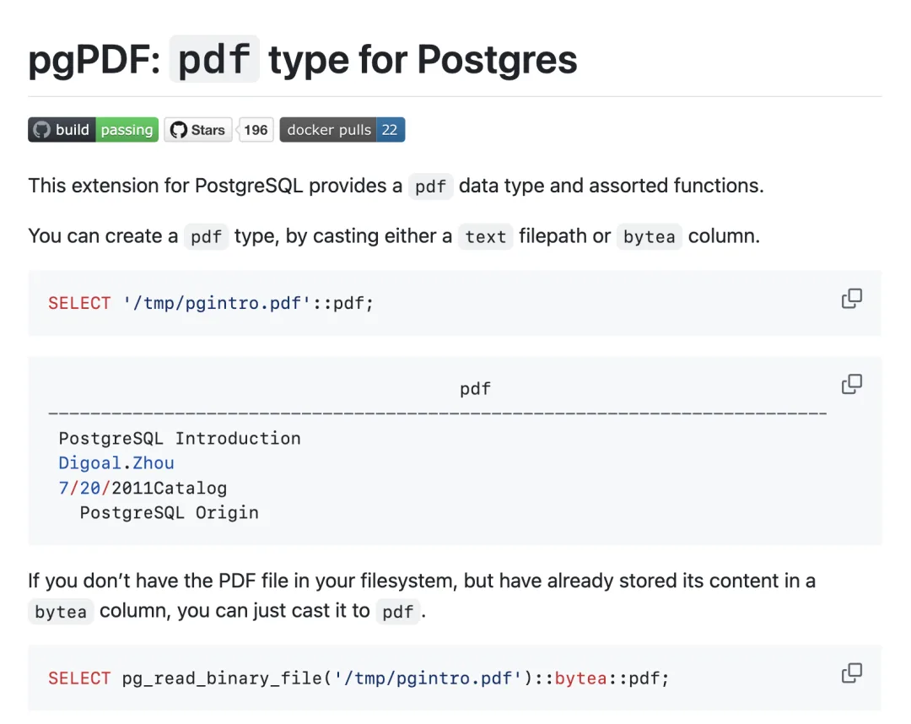
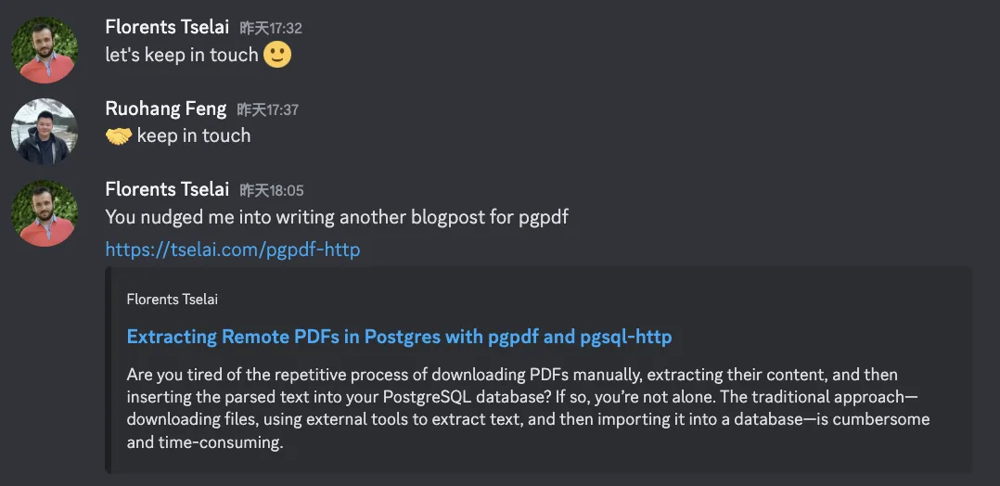
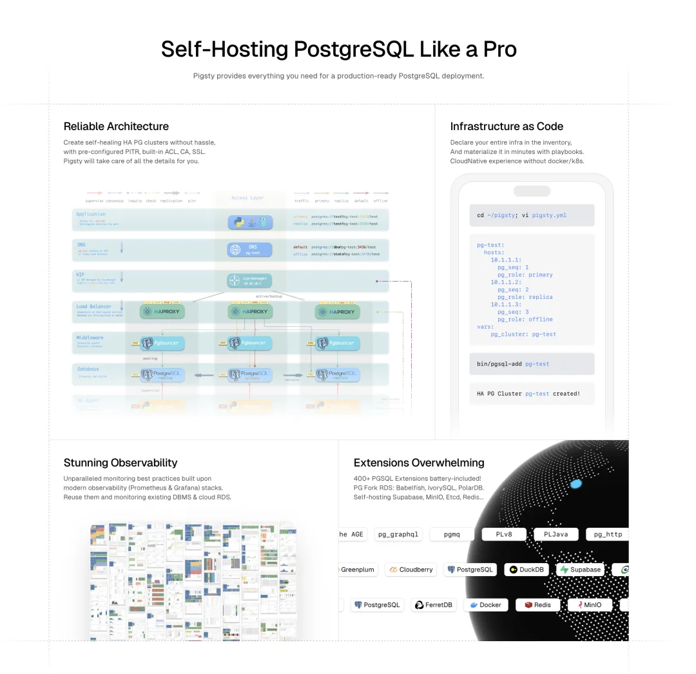
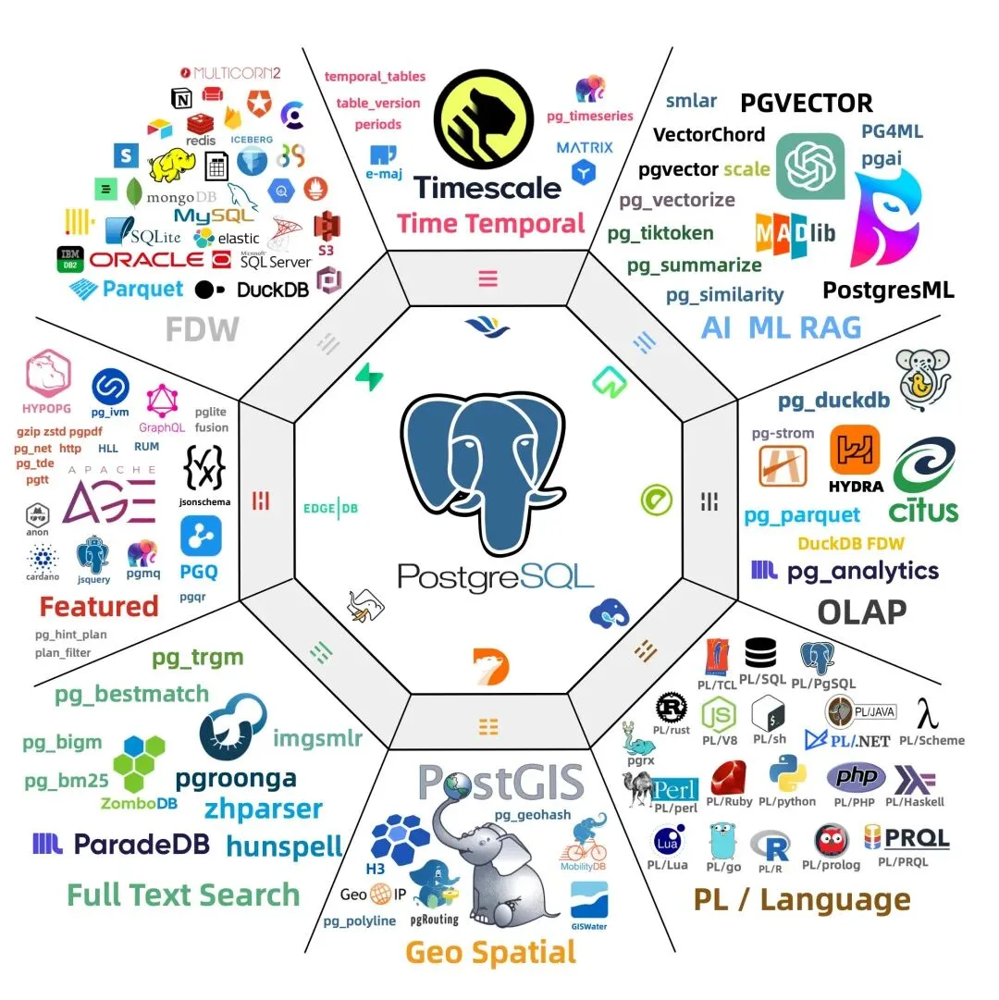

知识库依然是目前 AI 在企业落地的首要场景。而要做好知识库，少不了处理各种文档 —— 最重要最常见的文档类型就是 PDF。

不过，检索 PDF 算是个麻烦事儿。而得益于 PostgreSQL 强大的可扩展性，pgpdf 扩展可以帮你做到这一点：它提供了一种新的 PDF 数据类型，并允许用户在数据库中直接使用 SQL 读取 PDF，解析内容并提取文本。

当然，PGPGDF 不仅可以访问本地文件，你还可以将此扩展与 pg_net / pg_http / pg_curl 使用，从各种地方在线读取 PDF，然后将其解析为文本。

然后，你还可以进一步使用 vchord_bm25，pgroonga，zhparser 进行分词，或者直接将其丢入大模型进行 embedding 为向量，使用 pgvector 进行存储与检索。

这意味着，**你可以只用一个数据库就实现包含外部 PDF 文档在内的企业知识库特性！**

## 关于 PGPDF

PGPDF 的作者是 Florents Tselai，一位富有热情与洞察的希腊 PG Hacker，他开发了许多 PostgreSQL 与 SQLite 上的扩展插件。除了这里解析 PDF 的扩展之外，他还写了在 PG 中使用 `jq` 处理 JSON 的 pgjq 扩展，统计聚合扩展 vasco 与 xicor，以及 jsonb_apply 与 pgllm 等。

昨天我和 Florents 视频聊了一个小时，他分享了许多关于扩展的想法。我特别感兴趣 PGPDF 会不会在未来加上图片 OCR 功能，他笑着表示如果有任何一个客户对此有需求，他会有兴趣把这个功能加上的。

受到聊天的推动，Flo 写了一篇[博客](https://tselai.com/pgpdf-http)，演示了如何组合使用 PGPDF 和 PGSQL-HTTP 扩展在 Postgres 中远程提取 PDF，以下是博客翻译：

## 使用 pgpdf 和 pgsql-http 在 Postgres 中提取远程 PDF

2025 年 2 月 10 日

您是否厌倦了手动下载 PDF 文件、提取其内容并将解析后的文本插入到 PostgreSQL 数据库中的重复过程？如果是这样，您并不孤单。传统的方法——下载文件、使用外部工具提取文本，然后将其导入数据库——既繁琐又耗时。

幸运的是，PostgreSQL 是一个强大的数据库，通过适当的扩展，能够无缝地自动化这一工作流。通过将我的 pgpdf[1]扩展与 Paul Ramsey 的优秀 pgsql-http[2]扩展结合，您可以直接在 PostgreSQL 内部获取并解析 PDF。这实现了一个完全自动化、SQL 驱动的处理 PDF 的管道，使文档存储、搜索和分析变得轻松自如。

### pgpdf + pgsql-http 的强大功能

只需一个简单的 SQL 查询，您就可以：

- 从网络获取 PDF。
- 直接在 PostgreSQL 内读取其二进制内容。
- 解析并提取文本。
- 使提取的文本可供查询。

这一切都发生在 PostgreSQL 内部——无需外部脚本、手动下载或第三方应用程序。

### 快速入门

为了利用这个简化的工作流，首先安装所需的扩展：

    CREATE EXTENSION pgpdf;
    CREATE EXTENSION http;

安装完成后，您可以轻松获取、解析并存储 PDF。以下是一个简单的 SQL 查询，完成所有操作：

    SELECT pdf_read_bytes(text_to_bytea(content))
    FROM http_get('https://wiki.postgresql.org/images/e/e3/Hooks_in_postgresql.pdf');

### 发生了什么？

- `http_get(url)` – 这个函数由 pgsql-http 提供，发送一个 HTTP GET 请求，从给定的 URL 获取 PDF。结果包括状态、content_type 和 content 等字段（content 包含原始响应体）。
- `text_to_bytea(content)` – 由于`http_get`返回的响应体是文本格式，我们需要将其转换为`bytea`，以正确处理 PDF 的二进制格式。
- `pdf_read_bytes(bytea)` – 这个函数由 pgpdf 提供，接收原始的 PDF 字节，解析文档并提取其文本内容。

### 实际应用场景

通过利用这一工作流，您可以：

- **自动化 PDF 导入** – 无需手动下载文件，只需存储 URL，让 PostgreSQL 负责获取和解析。
- **启用 PDF 全文搜索** – 将解析后的文本存储在`tsvector`列中，并使用 GIN 索引进行极速搜索。
- **归档和分析文档** – 将结构化的元数据与提取的文本一起存储，以便更好地组织和分析。

### 更进一步

### 将提取的内容存储到表中

为了跟踪解析过的文档，您可以创建一个表并插入提取的文本：

    CREATE TABLE documents (
        id      SERIAL PRIMARY KEY,
        url     TEXT NOT NULL,
        content TEXT
    );

    INSERT INTO documents (url, content)
    SELECT 'https://wiki.postgresql.org/images/e/e3/Hooks_in_postgresql.pdf',
           pdf_read_bytes(text_to_bytea(content))
    FROM http_get('https://wiki.postgresql.org/images/e/e3/Hooks_in_postgresql.pdf');

### ‍搜索提取的内容

要进行全文搜索，可以使用`tsvector`和 GIN 索引：

    ALTER TABLE documents ADD COLUMN tsv_content tsvector;
    UPDATE documents SET tsv_content = to_tsvector('english', content);
    CREATE INDEX idx_documents_tsv ON documents USING GIN(tsv_content);

现在，您可以高效地搜索所有存储的 PDF 中的关键字：

    SELECT url, content
    FROM documents
    WHERE tsv_content @@ to_tsquery('PostgreSQL');

### 结论

通过结合使用 pgpdf 和 pgsql-http，您可以解锁一个强大、SQL 原生的 PDF 处理工作流。再也不用手动下载、外部解析脚本或繁琐的导入过程——只需要简单优雅的 SQL 查询，所有工作就能轻松完成。

如果您经常处理 PDF 并希望找到一种无缝、自动化的方式来在 PostgreSQL 中存储和查询它们，这种方法将是一个颠覆性的改变。试试这个方法，彻底改变您在数据库驱动的应用程序中处理 PDF 的方式！

---

## 如何获取这些扩展？

PGPDF 和 PGSQL-HTTP 这两个扩展目前都在 Pigsty 扩展仓库中可用。如果您使用 [Pigsty](https://pigsty.cc/)，只需要在配置文件中声明这两个扩展名即可。

如果您想在自己的 PostgreSQL 部署中使用，可以直接使用 YUM / APT 从 Pigsty 扩展仓库中安装，或者更简单的办法是：使用 Pig 包管理器：

    curl -fsSL https://repo.pigsty.io/pig | bash # 安装 PIG
    pig repo add pigsty pgdg -u  # 添加仓库
    pig ext install pg17         # 安装 PostgreSQL 17
    pig ext install pgpdf http   # 安装 pgpdf 与 http 扩展

Pigsty 扩展仓库提供了 PostgreSQL 生态中无可比拟的 400 个扩展插件，并在十个主流 Linux 发行版大版本上提供开箱即用 DEB/RPM 包。我会专门开一个全新专栏，详细介绍这些扩展插件。

### References

- `[1]` pgpdf: <https://github.com/Florents-Tselai/pgpdf>
- `[2]` pgsql-http: <https://github.com/pramsey/pgsql-http>

---

发布版本：[微信公众号](https://mp.weixin.qq.com/s/ELgsSi29ZyzPtXgdrwt42A)
