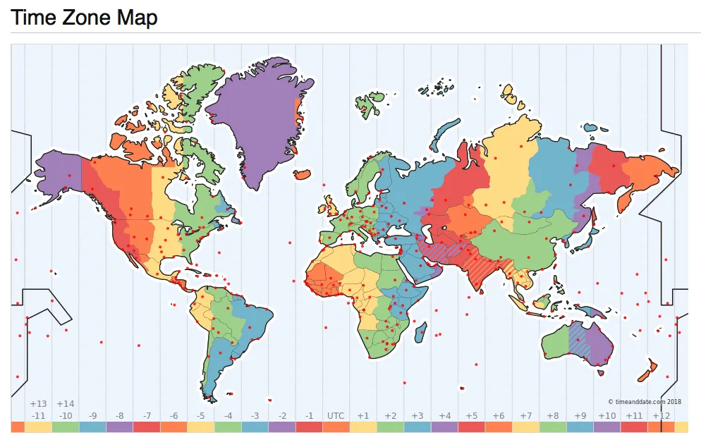

前几天出现了四年一遇的闰年 2 月 29 号，每到这一天，总会有一些土鳖软件出现大翻车。这种问题如果运气不好，可能要等上四年才会暴露出来。比如今天新鲜出炉的：禾赛科技激光雷达和新西兰加油站都因为闰年 Bug 无法使用。

今天确实是个很应景的日子，所以重发这篇[六年前写的老文](http://mp.weixin.qq.com/s?__biz=MzU5ODAyNTM5Ng==&mid=2247483868&idx=1&sn=a55fb84ca6b0520d2b1adfbe83e4cca9&chksm=fe4b3407c93cbd11b837ff3f8735f6632894f27773f7fddbbd489ea4d16889dd6d0a0968ec5f&scene=21#wechat_redirect)。聊一聊闰年，闰秒，时间与时区的原理，以及在数据库与编程语言中的注意事项。

---

## 0x01 秒与计时

时间的单位是秒，但秒的定义并不是一成不变的。它有一个天文学定义，也有一个物理学定义。

### 世界时（UT1）

在最开始，**秒的定义来源于日**。秒被定义为平均太阳日的 1/86400。而太阳日，则是由天文学现象定义的：两次连续**正午**时分的**间隔**被定义为一个**太阳日**；一天有 86400 秒，一秒等于 86400 分之一天，Perfect！以这一标准形成的时间标准，就称为**世界时（Univeral Time，UT1）**，或不严谨的说，**格林威治标准时（Greenwich Mean Time，GMT）**，下面就用 GMT 来指代它了。

这个定义很直观，但有一个问题：它是基于天文学现象的，即地球与太阳的周期性运动。不论是用地球的公转还是自转来定义秒，都有一个很尴尬的地方：虽然地球自转与公转的变化速度很慢，但并不是恒常的，譬如：地球的自转越来越慢，而地月位置也导致了每天的时长其实都不完全相同。这意味着作为物理基本单位的秒，其时长竟然是变化的。在衡量**时间段**的长短上就比较尴尬，几十年的一秒可能和今天的一秒长度已经不是一回事了。

---

#### 原子时（TAI）

为了解决这个问题，在 1967 年之后，秒的定义变成了：**铯 133 原子基态的两个超精细能级间跃迁对应辐射的 9,192,631,770 个周期的持续时间**。秒的定义从天文学定义升级成为了物理学定义，其描述由相对易变的天文现象升级到了更稳定的宇宙中的基本物理事实。现在我们有了真正**精准**的秒啦：一亿年的偏差也不超过一秒。

当然，这么精确的秒除了用来衡量时间间隔，也可以用来计时。从`1958-01-01 00:00:00`开始作为公共时间原点，**国际原子钟**开始了计数，每计数 9,192,631,770 这么多个原子能级跃迁周期就+1s，这个钟走的非常准，每一秒都很均匀。使用这定义的时间称为**国际原子时（International Atomic Time，TAI）**，下文简称 TAI。

---

#### 冲突

在最开始，这两种秒是等价的：一天是 86400 天文秒，也等于 86400 物理秒，毕竟物理学这个定义就是特意去凑天文学的定义嘛。所以相应的，**GMT**也与国际原子时**TAI**也保持着同步。然而正如前面所说，天文学现象影响因素太多了，并不是真正的“天行有常”。随着地球自转公转速度变化，天文定义的秒要比物理定义的秒稍微长了那么一点点，这也就意味着 GMT 要比 TAI 稍微落后一点点。

那么哪种定义说了算，世界时还是原子时？如果理论与生活实践经验相违背，绝大多数人都不会选择反直觉的方案：假设一种极端场景，两个钟之间的差异日积月累，到最后出现了几分钟甚至几小时的差值：明明日当午，按 GMT 应当是`12:00:00`，但 GMT 走慢了，TAI 显示的时间已经是晚上六点了，这就违背了直觉。在**表示时刻**这一点上，还是由天文定义说了算，即以 GMT 为准。

当然，就算是天文定义说了算，也要尊重物理规律，毕竟原子钟走的这么准不是？实际上世界时与原子时之间的差值也就在几秒的量级。那么我们会自然而然地想到，使用国际原子时 TAI 作为基准，但加上一些**闰秒（leap second）**修正到 GMT 不就行了？既有高精度，又符合常识。于是就有了新的**协调世界时（Coordinated Universal Time，UTC）**。

---

#### 协调世界时（UTC）

#### UTC 是调和 GMT 与 TAI 的产物：

UTC 使用精确的国际原子时 TAI 作为计时基础

UTC 使用国际时 GMT 作为修正目标

UTC 使用闰秒作为修正手段，

我们通常所说的时间，通常就是指**世界协调时间 UTC**，它与世界时 GMT 的差值在 0.9 秒内，在要求不严格的实践中，可以近似认为 UTC 时间与 GMT 时间是相同的，很多人也把它与 GMT 混为一谈。

但问题紧接着就来了，按照传统，一天 24 小时，一小时 60 分钟，一分钟 60 秒，日和秒之间有 86400 的换算关系。以前用日来定义秒，现在秒成了基本单位，就要用秒去定义日。但现在一天不等于 86400 秒了。无论用哪头定义哪头，都会顾此失彼。唯一的办法，就是打破这种传统：一分钟不一定只有 60 秒了，它在需要的时候可以有 61 秒！

这就是**闰秒**机制，UTC 以 TAI 为基准，因此走的也比 GMT 快。假设 UTC 和 GMT 的差异不断变大，在即将超过一秒时，让 UTC 中的某一分钟变为 61 秒，续的这一秒就像 UTC 在等 GMT 一样，然后误差就追回来了。每次续一秒时，UTC 时间都会落后 TAI 多一秒，截止至今，UTC 已经落后 TAI 三十多秒了。最近的一次闰秒调整是在 2016 年跨年：

> 国际标准时间 UTC 将在格林尼治时间 2016 年 12 月 31 日 23 时 59 分 59 秒（北京时间 2017 年 1 月 1 日 7 时 59 分 59 秒）之后，在原子时钟实施一个正闰秒，即增加 1 秒，然后才会跨入新的一年。

所以说，GMT 和 UTC 还是有区别的，UTC 里你能看到`2016-12-31 23:59:60`的时间，但 GMT 里就不会。

---

### 0x02 本地时间与时区

刚才讨论的时间都默认了一个前提：位于本初子午线（0 度经线）上的时间。我们还需要考虑地球上的其他地方：毕竟美帝艳阳高照时，中国还在午夜呢。

本地时间，顾名思义就是以当地的太阳来计算的时间：正午就是 12:00。太阳东升西落，东经 120 度上的本地时间比起本初子午线上就早了`120° / (360°/24) = 8`个小时。这意味着在北京当地时间 12 点整时，UTC 时间其实是`12-8=4`，早晨 4:00。

大家统一用 UTC 时间好不好呢？可以当然可以，毕竟中国横跨三个时区，也只用了一个北京时间。只要大家习惯就行。但大家都已经习惯了本地正午算 12 点了，强迫全世界人民用统一的时间其实违背了历史习惯。时区的设置使得长途旅行者能够简单地知道当地人的作息时间：反正差不多都是朝九晚五上班。这就降低了沟通成本。于是就有了时区的概念。当然像新疆这种硬要用北京时间的结果就是，游客乍一看当地人 11 点 12 点才上班可能会有些懵。

但在大一统的国家内部，使用统一的时间也有助于降低沟通成本。假如一个新疆人和一个黑龙江人打电话，一个用的乌鲁木齐时间，一个用的北京时间，那就会鸡同鸭讲。都约着 12 点，结果实际差了两个小时。时区的选用并不完全是按照地理经度而来的，也有很多的其他因素考量（例如行政区划）。

这就引出了时区的概念：**时区是地球上使用同一个本地时间定义的区域**。**时区实际上可以视作从地理区域到时间偏移量的单射**。

但其实有没有那个地理区域都不重要，关键在于**时间偏移量**的概念。UTC/GMT 时间本身的偏移量为 0，时区的偏移量都是相对于 UTC 时间而言的。这里，本地时间，UTC 时间与时区的关系是：

> 本地时间 = UTC 时间 + 本地时区偏移量。

比如 UTC、GMT 的时区都是`+0`，意味着没有偏移量。中国所处的东八区偏移量就是`+8`。意味着计算当地时间时，要在 UTC 时间的基础上增加 8 个小时。

**夏令时（Daylight Saving Time，DST）**，可以视为一种特殊的时区偏移修正。指的是在夏天天亮的较早的时候把时间调快一个小时（实际上不一定是一个小时），从而节省能源（灯火）。我国在 86 年到 92 年之间曾短暂使用过夏令时。欧盟从 1996 年开始使用夏令时，不过欧盟最近的民调显示，84% 的民众希望取消夏令时。对程序员而言，夏令时也是一个额外的麻烦事，希望它能尽快被扫入历史的垃圾桶。

---

### 0x03 时间的表示

那么，时间又如何表示呢？使用 TAI 的秒数来表示时间当然不会有歧义，但使用不便。习惯上我们将时间分为三个部分：日期，时间，时区，而每个部分都有多种表示方法。对于时间的表示，世界诸国人民各有各的习惯，例如，2006 年 1 月 2 日，美国人就可能喜欢使用诸如`January 2, 1999`，`1/2/1999`这样的日期表示形式，而中国人也许会用诸如“2006 年 1 月 2 日”，“2006/01/02”这样的表示形式。发送邮件时，首部中的时间则采用 RFC2822 中规定的`Sat, 24 Nov 2035 11:45:15 −0500`格式。此外，还有一系列的 RFC 与标准，用于指定日期与时间的表示格式。

    ANSIC       = "Mon Jan _2 15:04:05 2006"
    UnixDate    = "Mon Jan _2 15:04:05 MST 2006"
    RubyDate    = "Mon Jan 02 15:04:05 -0700 2006"
    RFC822      = "02 Jan 06 15:04 MST"
    RFC822Z     = "02 Jan 06 15:04 -0700" // RFC822 with numeric zone
    RFC850      = "Monday, 02-Jan-06 15:04:05 MST"
    RFC1123     = "Mon, 02 Jan 2006 15:04:05 MST"
    RFC1123Z    = "Mon, 02 Jan 2006 15:04:05 -0700" // RFC1123 with numeric zone
    RFC3339     = "2006-01-02T15:04:05Z07:00"
    RFC3339Nano = "2006-01-02T15:04:05.999999999Z07:00"

不过在这里，我们只关注计算机中的日期表示形式与存储方式。而计算机中，时间最经典的表示形式，就是 Unix 时间戳。

---

#### Unix 时间戳

比起 UTC/GMT，对于程序员来说，更为熟悉的可能是另一种时间：Unix 时间戳。UNIX 时间戳是从 1970 年 1 月 1 日（UTC/GMT 的午夜，在 1972 年之前没有闰秒）开始所经过的秒数，注意这里的秒其实是 GMT 中的秒，也就是**不计闰秒**，毕竟一天等于 86400 秒已经写死到无数程序的逻辑里去了，想改是不可能改的。

使用 GMT 秒数的好处是，计算日期的时候根本不用考虑闰秒的问题。毕竟闰年已经很讨厌了，再来一个没有规律的闰秒，绝对会让程序员抓狂。当然这不代表就不需要考虑闰秒的问题了，诸如 ntp 等时间服务还是需要考虑闰秒的问题的，应用程序有可能会受到影响：比如遇到‘时光倒流’拿到两次`59`秒，或者获取到秒数为`60`的时间值，一些实现简陋的程序可能就直接崩了。当然，也有一种将闰秒均摊到某一天全天的顺滑手段。

Unix 时间戳背后的思想很简单，建立一条时间轴，以某一个**纪元点（Epoch）**作为原点，将时间表示为距离原点的**秒数**。Unix 时间戳的纪元为 GMT 时间的`1970-01-01 00:00:00`，32 位系统上的时间戳实际上是一个有符号四字节整型，以秒为单位。这意味它能表示的时间范围为：`2^32 / 86400 / 365 = 68`年，差不多从 1901 年到 2038 年。

当然，时间戳并不是只有这一种表示方法，但通常这是最为传统稳妥可靠的做法。毕竟不是所有的程序员都能处理好许多和时区、闰秒相关的微妙错误。使用 Unix 时间戳的好处就是时区已经固定死了是 GMT 了，存储空间与某些计算处理（比如排序）也相对容易。

在\*nix 命令行中使用`date +%s`可以获取 Unix 时间戳。而`date -r @1500000000`则可以反向将 Unix 时间戳转换为其他时间格式，例如转换为`2017-07-14 10:40:00`可以使用：

<!-- -->

    date -d @1500000000 '+%Y-%m-%d %H:%M:%S'    # Linuxdate -r 1500000000 '+%Y-%m-%d %H:%M:%S'        # MacOS, BSD

在很久以前，当主板上的电池没电之后，系统的时钟就会自动重置成 0；还有很多软件的 Bug 也会导致导致时间戳为 0，也就是`1970-01-01`；以至于这个纪元时间很多非程序员都知道了。

当然，4 字节 Unix 时间戳的上限 2038 年离今天 （2024） 年已经不是遥不可及了，还没及时改成 8 字节时间戳的软件到时候就要面临比闰天加油站罢工严峻得多的千年虫问题 —— 直接罢工了，比如直到今天还没有改过来的二傻子 MySQL。

---

### PostgreSQL 中的时间存储

通常情况下，Unix 时间戳是**传递/存储**时间的最佳方式，它通常在计算机内部以整型的形式存在，内容为距离某个特定纪元的秒数。它极为简单，无歧义，存储占用更紧实，便于比较大小，且在程序员之间存在广泛共识。不过，Epoch+整数偏移量的方式适合在机器上进行存储与交换，但它并不是一种人类可读的格式（也许有些程序员可读）。

PostgreSQL 提供了丰富的日期时间数据类型与相关函数，它能以高度灵活的方式自动适配各种格式的时间输入输出，并在内部以高效的整型表示进行存储与计算。在 PostgreSQL 中，变量`CURRENT_TIMESTAMP`或函数`now()`会返回当前事务开始时的本地时间戳，返回的类型是`TIMESTAMP WITH TIME ZONE`，这是一个 PostgreSQL 扩展，会在时间戳上带有额外的时区信息。SQL 标准所规定的类型为`TIMESTAMP`，在 PostgreSQL 中使用 8 字节的长整型实现。可以使用 SQL 语法`AT TIME ZONE zone`或内置函数`timezone(zone,ts)`将带有时区的`TIMESTAMP`转换为不带时区的标准版本。

通常最佳实践是，只要应用稍具规模或涉及到任何国际化的功能，要么按照 PostgreSQL Wiki 中推荐的最佳实践[1] 使用 PostgreSQL 自己提供的 `TimestampTZ` 扩展类型，要么使用 `TIMESTAMP` 类型并固定存储 GMT / UTC 时间。

PostgreSQL 的时间戳实现用的是 8 字节，表示的时间范围从公元前 4713 年到 29 万年后，精度为 1 微秒，完全不用担心 2038 千年虫问题。

---

    -- 获取本地事务开始时的时间戳
    vonng=# SELECT now(), CURRENT_TIMESTAMP;
    now              |       current_timestamp
    -------------------------------+-------------------------------
     2018-12-11 21:50:15.317141+08 | 2018-12-11 21:50:15.317141+08

    -- now()/CURRENT_TIMESTAMP 返回的是带有时区信息的时间戳
     vonng=# SELECT pg_typeof(now()),pg_typeof(CURRENT_TIMESTAMP);
    pg_typeof         |        pg_typeof
    --------------------------+--------------------------
     timestamp with time zone | timestamp with time zone

    -- 将本地时区+8 时间转换为 UTC 时间，转化得到的是 TIMESTAMP
    -- 注意不要使用从 TIMESTAMPTZ 到 TIMESTAMP 的强制类型转换，会直接截断时区信息。
     vonng=# SELECT now() AT TIME ZONE 'UTC';

    timezone

     2018-12-11 13:50:25.790108

    -- 再将 UTC 时间转换为太平洋时间
    vonng=# SELECT (now() AT TIME ZONE 'UTC') AT TIME ZONE 'PST';

    timezone

     2018-12-12 05:50:37.770066+08

     -- 查看 PG 自带的时区数据表
     vonng=# TABLE pg_timezone_names LIMIT 4;
    name       | abbrev | utc_offset | is_dst
    ------------------+--------+------------+--------
     Indian/Mauritius | +04    | 04:00:00   | f
     Indian/Chagos    | +06    | 06:00:00   | f
     Indian/Mayotte   | EAT    | 03:00:00   | f
     Indian/Christmas | +07    | 07:00:00   | f
    ...

    -- 查看 PG 自带的时区缩写
    vonng=# TABLE pg_timezone_abbrevs  LIMIT 4;
    abbrev | utc_offset | is_dst
    --------+------------+--------
     ACDT   | 10:30:00   | t
     ACSST  | 10:30:00   | t
     ACST   | 09:30:00   | f
     ACT    | -05:00:00  | f
    ...

### 常见困惑：闰天

关于闰天，PostgreSQL 处理的很好，但是需要特别注意的是对于闰年加减时间范围的运算规律。

例如，如果你在 '2024-02-**29**' 号往前减“一年”，结果是 “2023-02-**28**”，但如果你减去 365 天，则是“2023-**03-01**”。

反过来，如果你都加一年，12 个月或者加 365 天，结果都是明年的 2 月 28 号。这样处理肯定是比那些直接用年份+1 来计算的二傻子软件靠谱多了。

    postgres=# SELECT '2023-02-29'::DATE;  -- 2023 年不是闰年
    ERROR:  date/time field value out of range: "2023-02-29"
    LINE 1: SELECT '2023-02-29'::DATE;
    ^
    postgres=# SELECT '2024-02-29'::DATE;

## today

     2024-02-29

    postgres=# SELECT '2024-02-29'::DATE + '1year'::INTERVAL;

## next_year

     2025-02-28 00:00:00

    postgres=# SELECT '2024-02-29'::DATE + '365day'::INTERVAL;

## next_365d

     2025-02-28 00:00:00

    postgres=# SELECT '2024-02-29'::DATE - '1year'::INTERVAL;

## prev_year

     2023-02-28 00:00:00

    postgres=# SELECT '2024-02-29'::DATE - '365day'::INTERVAL;

## prev_365d

     2023-03-01 00:00:00

### 常见困惑：时间戳互转

PostgreSQL 中一个经常让人困惑的问题就是`TIMESTAMP`与`TIMESTAMPTZ`之间的相互转化问题。下面是一个附带说明的具体例子：

    -- 使用 `::TIMESTAMP` 将 `TIMESTAMPTZ` 强制转换为 `TIMESTAMP`，会直接截断时区部分内容
    -- 时间的其余"内容"保持不变
    vonng=# SELECT now(), now()::TIMESTAMP;
    now               |           now
    -------------------------------+--------------------------
    2018-12-12 05:50:37.770066+08 |  2018-12-12 05:50:37.770066+08

    -- 对有时区版 TIMESTAMPTZ 使用 AT TIME ZONE 语法
    -- 会将其转换为无时区版的 TIMESTAMP，返回给定时区下的时间
    vonng=# SELECT now(), now() AT TIME ZONE 'UTC';
    now              |          timezone
    -------------------------------+----------------------------
    2019-05-23 16:58:47.071135+08 | 2019-05-23 08:58:47.071135

    -- 对无时区版 TIMESTAMP 使用 AT TIME ZONE 语法
    -- 会将其转换为带时区版的 TIMESTAMPTZ，即在给定时区下解释该无时区时间戳。
    vonng=# SELECT now()::TIMESTAMP, now()::TIMESTAMP AT TIME ZONE 'UTC';
    now             |           timezone
    ----------------------------+-------------------------------
    2019-05-23 17:03:00.872533 | 2019-05-24 01:03:00.872533+08

    -- 这里的意思是，UTC 时间的 2019-05-23 17:03:00

---

#### 常见困惑：时区偏移量

当然 PostgreSQL 中的时间戳也有一个与时区相关的设计比较违反直觉，就是在使用 `AT TIME ZONE` 的时候，应该尽可能避免使用 `+8`, `-6` 这样的数字时区，而应该使用时区名。

这是因为当你在时区部分使用数值时，PostgreSQL 会将其视作 Interval 类型进行处理，被解释为 “Fixed” Offsets from UTC，不常用，**文档也不推荐使用**。

举个例子，今天东八区中午 （SELECT '2024-01-15 **12**:00:00+**08**'::TIMESTAMPTZ） 转换为 UTC 时间戳，为 '2024-01-15**04**:00:00' （东八区的 12 点 = UTC 零时区的 4 点）这没有问题：

    > SELECT '2024-01-15 12:00:00+08'::TIMESTAMPTZ AT TIME ZONE '+0';
    2024-01-15 04:00:00

现在，我们使用 '**+1**' 作为 time zone 参数，直观的想法应该是，**+1** 代表**东一区**当前的时间，应该是 “2024-01-15**05**:00:00**+1**” 但结果让人惊讶：反而是提前了一个小时

    > SELECT '2024-01-15 12:00:00+08'::TIMESTAMPTZ AT TIME ZONE '+1';
    2024-01-15 03:00:00

而如果我们反过来如果想当然的使用 `-1` 作为**西一区**的时区名，结果也是错误的（预期应该是凌晨 3 点，结果返回了 5 点）：

    > SELECT '2024-01-15 04:00:00+00'::TIMESTAMPTZ AT TIME ZONE '-1';

    timezone

    2024-01-15 05:00:00

这里面的原因是，使用 Interval 而非时区名，处理逻辑是不一样的：首先东八区 TIMESTAMPTZ '2024-01-15 **12**:00:00+**08**' 被转换为 UTC 时间的 TIMESTAMPTZ '2024-01-15**04**:00:00+**00**'。然后 UTC 时间的  TIMESTAMPTZ '2024-01-15**04**:00:00+**00**' 被截断时区部分，成为 '2024-01-15**04**:00:00' 并拼接新时区参数 '**+1**' 成为一个新的 TIMESTAMPTZ '2024-01-15**04**:00:00**+1**'，最后，这个新的时间戳被重新转换为不带时间戳的 UTC 时间 '2024-01-15**03**:00:00'

---

发布版本：[微信公众号](https://mp.weixin.qq.com/s/U5vj6KpmdedNEhvVdM679Q)
