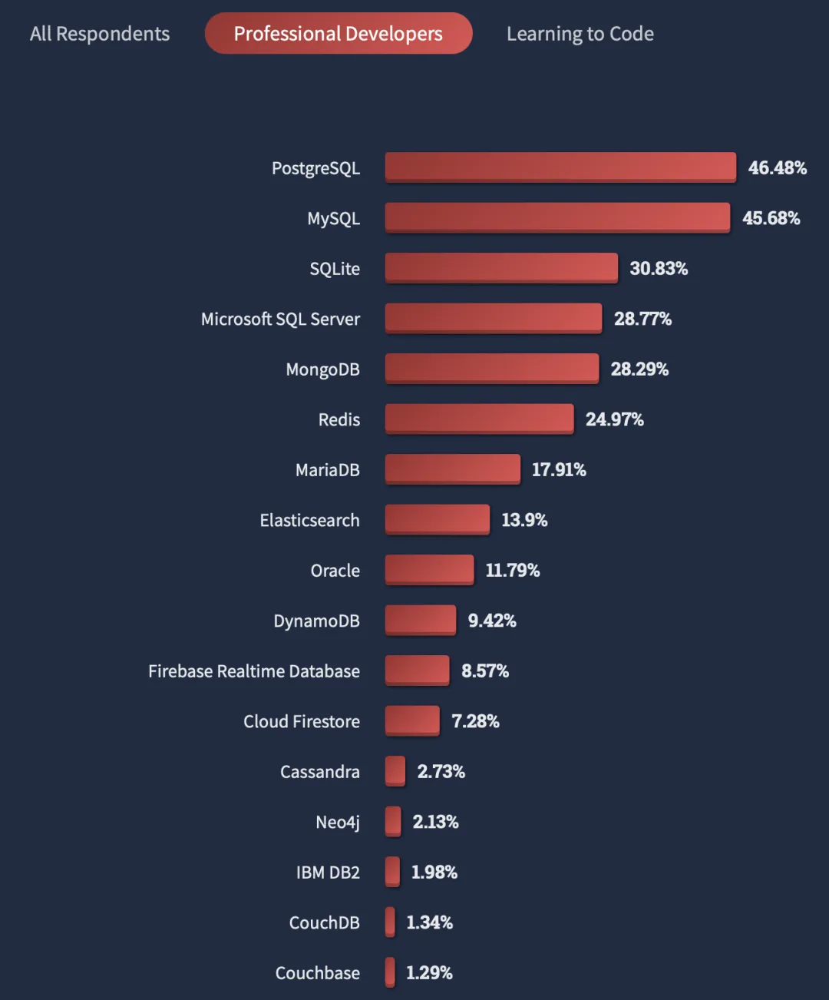
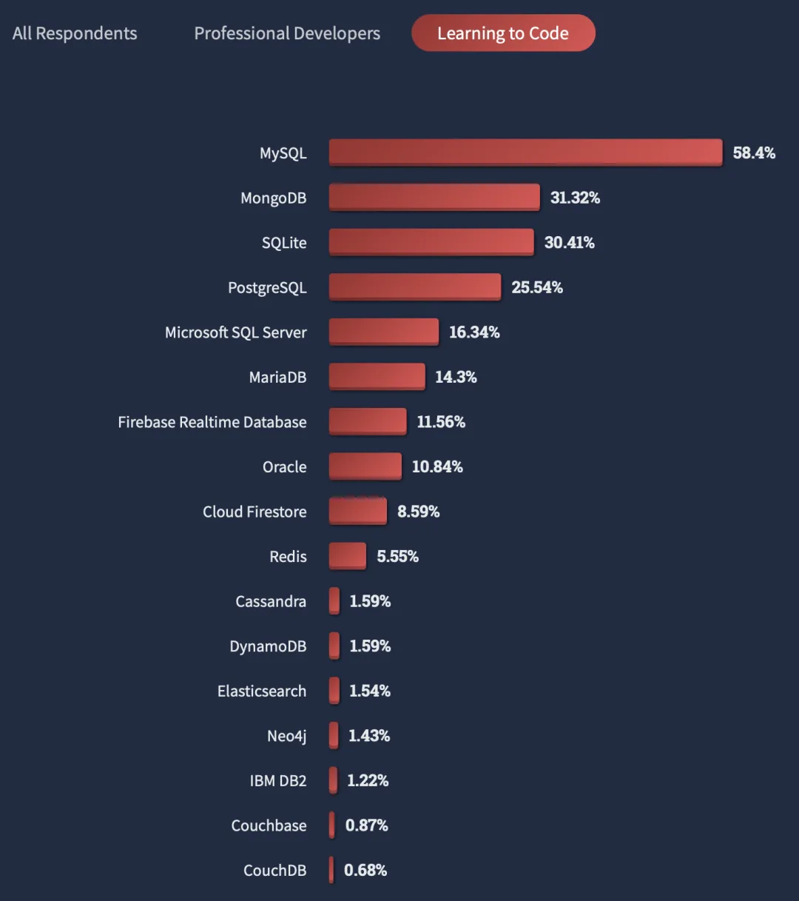
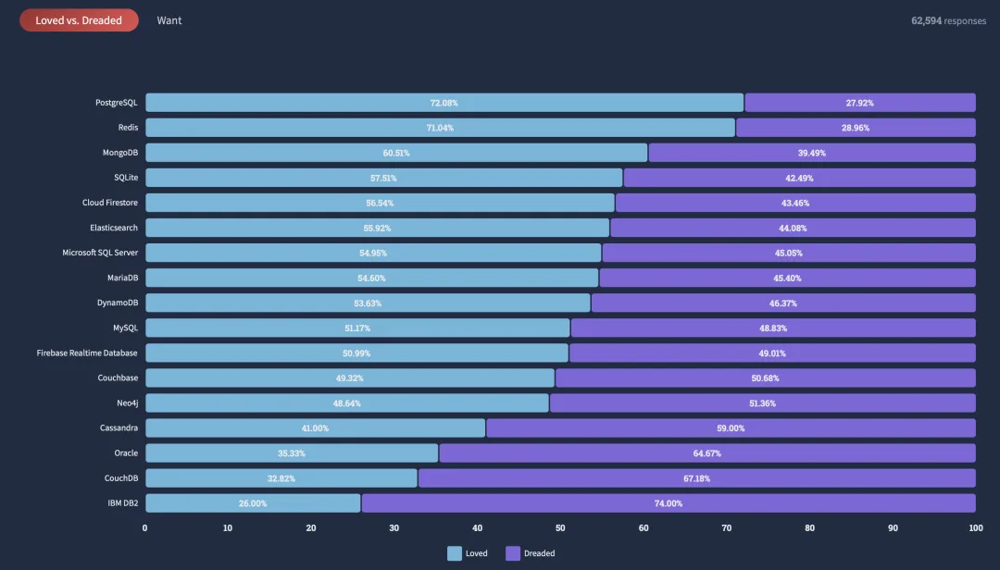

什么，PostgreSQL 已经成为最流行，最先进，开发者最想学习使用的数据库了？

最近，StackOverflow 公布了在 5 月份进行的一次开发者调研报告。其中 PostgreSQL 获得了三连冠：

**PostgreSQL 成为专业开发者中最流行的数据库！超越 MySQL 攀升至第一！**

**PostgreSQL 成为开发者最喜爱，且最想学习的数据库，超越 Redis 攀升至第一！**

**PostgreSQL 成为现有其他数据库用户最感兴趣的数据库！**

StackOverflow 是享誉全球的开发者社区，其用户调研覆盖 7 万名开发者（77% 为职业开发者），具有非常强的代表性，代表了先进技术的发展方向，对于技术选型极具参考价值。

## 最流行的数据库

<https://survey.stackoverflow.co/2022/#section-most-popular-technologies-databases>

在总共 63,327 份样本中，48,788 (77%) 位 职业开发者使用的数据库如下图所示。

PostgreSQL 与 MySQL 的流行度与其他数据库显著拉开距离：其中，PostgreSQL 以 46.5% 的使用率位居第一；MySQL 以 45.7% 的使用率位居第二。SQLite，SQL Server，MongoDB，Redis 次之（25%～30%）。

**在专业开发者中，PostgreSQL 以 0.8% 的优势，第一次超过 MySQL，成为最流行的数据库！**

在初级程序员（占总样本数的 8%，自我认知为“学习编程中”）中，MySQL 目前仍然使用率最多的数据库，显著超过其他数据库。

从整体上看（所有开发者），MySQL 在流行度上以微量优势（3.25%）领先 PostgreSQL。

做一个有品味的开发者，请选择**PostgreSQ**L

## 最喜爱的数据库

最流行的数据库反映了当前的现状，而**开发者的喜爱则代表未来**。在此项中，PostgreSQL 第一次击败 Redis，成为最受开发者喜爱的数据库！（在所有数据库中！）

PostgreSQL 与 Redis 一骑绝尘，以 70%+ 的喜爱率高居榜首。MongoDB 与 SQLite 表现不俗，以 60% 左右的喜爱率位居第三第四。只有 50% 左右的人喜欢与 MySQL 和 SQL Server 打交道，而 Oracle，CouchDB，IBM DB2 的喜爱率则排名倒数，只有 35% 的开发者喜欢 Oracle。

反过来说，高达一半开发者讨厌反感 MySQL，高达三分之二的开发者反感 Oracle，而高达四分之三的用户讨厌 IBM DB2。

另一个问题是开发者**最想要**（Most Wanted）的数据库，PostgreSQL 是所有开发者最想使用的数据库(19%)。PGSQL，MongoDB，Redis 位列开发者最想要数据库的前三甲，并与其他产品显著拉开了距离，特别是 MySQL (8%) 与 Oracle（2%）。

## 现在用什么以及想用什么？

根据用户过去一年在用的数据库类型与下一年准备用的数据库，Stackoverflow 绘制了数据库流向和弦图。**它反映了某个数据库的用户群体，对什么样的数据库感兴趣。**

在职业开发者中（77%），PostgreSQL 占据了最大的流入通量，大量使用其他数据库的开发者对使用 PostgreSQL 感兴趣。其中以来自 MySQL 开发者居多。

一部分 PostgreSQL 用户对使用 Redis (7000)，MongoDB ( 6033 )、SQLite（5275） 感兴趣，但基本没有对 MySQL 感兴趣的 PG 用户。

相反，MySQL 的用户对 PostgreSQL 最感兴趣（11,185），其次是 MongoDB(9520) 与 Redis (8124)。

除此之外，高达一万六千名正在使用 PostgreSQL 数据库的用户计划明年继续用，在所有数据库的自我流向数中稳居榜首：不难看出，PostgreSQL 已经成为专业开发者的青睐之选，让用户爱不释手，牢牢守住了自己的基本盘。

在使用 MySQL 的开发者中，28% 的用户准备继续用 MySQL，23% 的用户准备去使用 PostgreSQL（首要流出），18% 的用户准备去使用 MongoDB（第二位流出）。在初学者中，约有 27% 的 MySQL 用户准备使用 PostgreSQL，而基本上没有 PostgreSQL 用户准备去用 MySQL。倒是有一些 MongoDB 的用户准备去使用 MySQL，给 MySQL 带来了一些流入。

## DBEngine

另一个可以作为数据库流行度相对参考的权威数据源是 DB-Engins Trending，里面提供了基于多种数据来源计算得到的相对流行度：网页，岗位，Google Trending，StackOverflow，Twitter，LinkdeIn 等等。在最近一年，PostgreSQL 的流行度上升了 52.32，同比上升 9.2%，MySQL 的流行度下降了 38.65，同比下降 3%。

<https://db-engines.com/en/ranking_trend>

今天下三分，然 Oracle ｜ MySQL ｜ SQL Server 疲敝，日薄西山。PostgreSQL 紧随其后，如日中天。前四的数据库中，前三者都在走下坡路，唯有 PG 增长势头不减，此消彼长，前途无量。

从 DBEngin-Trending 上看，基本上到 2028 - 2029 年，PostgreSQL 就可以成为所有数据库中的流行度王者！拳打 Oracle，脚踢 MySQL 指日可待。

为什么 PostgreSQL 如此牛逼？请参考 《[为什么说 PostgreSQL 前途无量？](/pg/pg-is-great/)》

---

发布版本：[微信公众号](https://mp.weixin.qq.com/s/xcORYy2suzOw50SOaOCodw)
