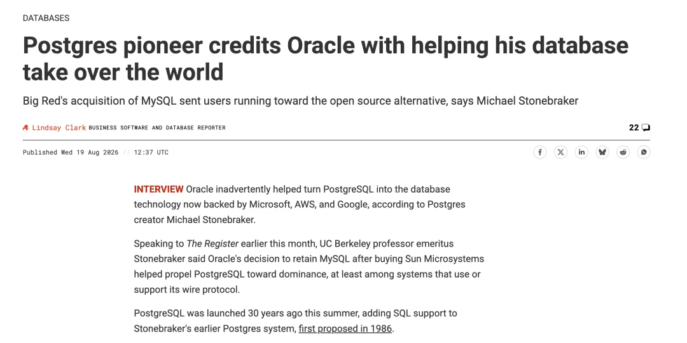
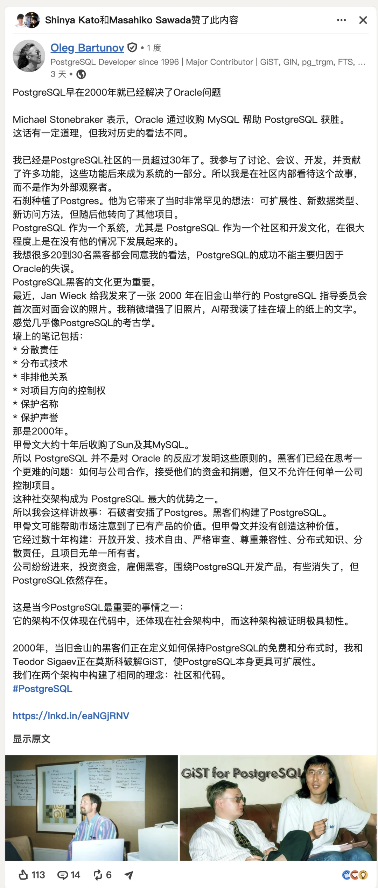
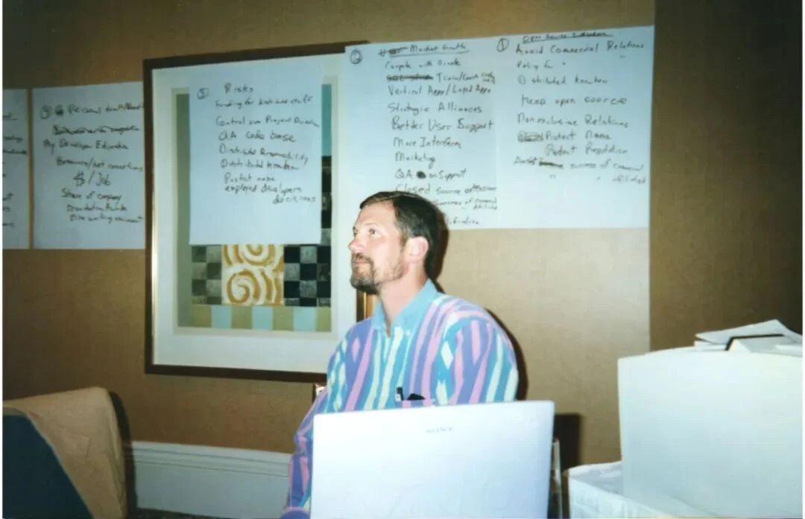
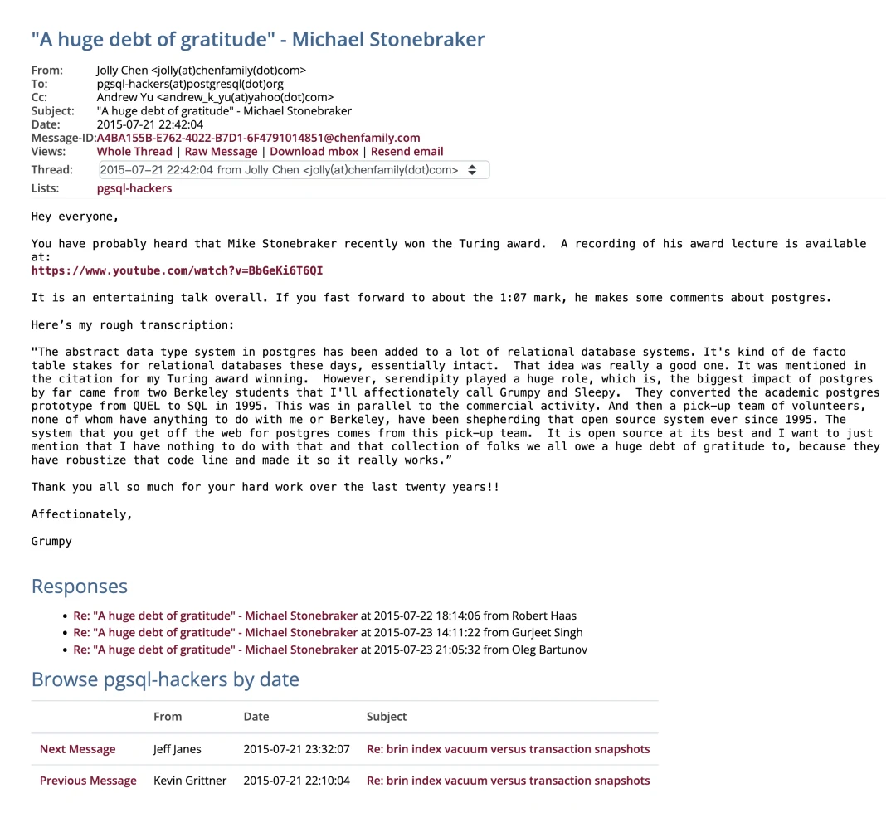
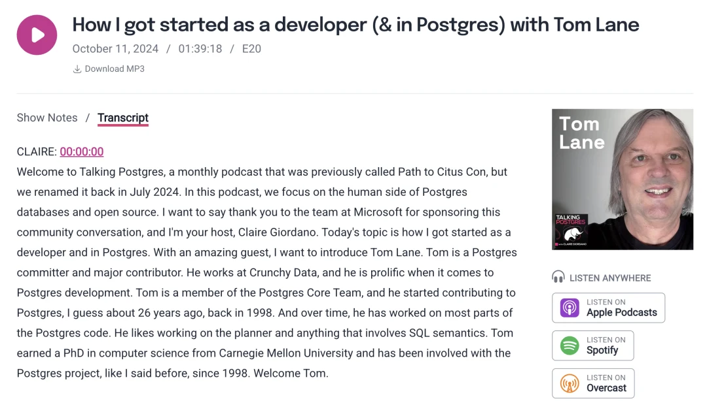
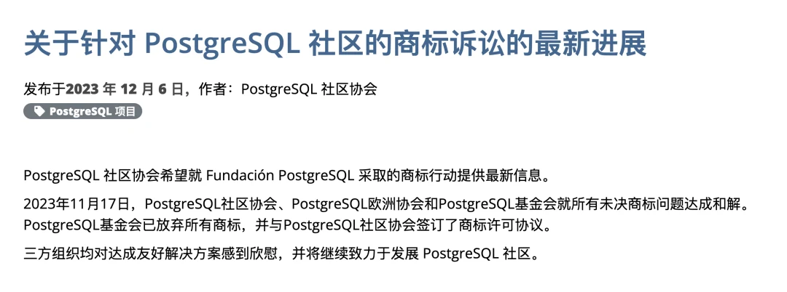
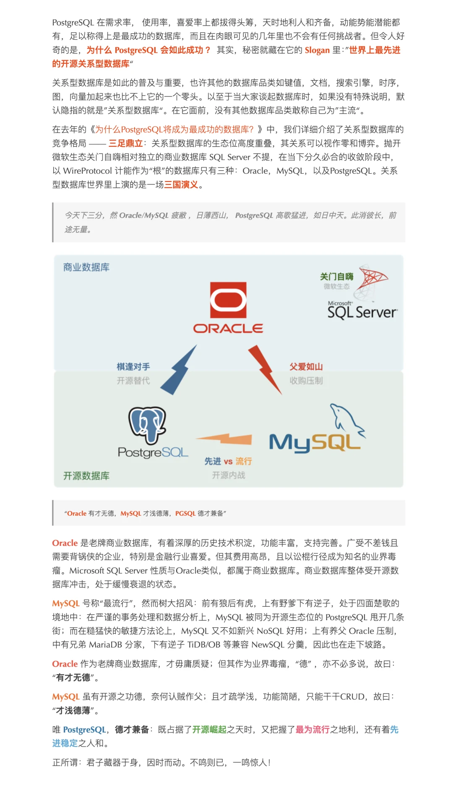
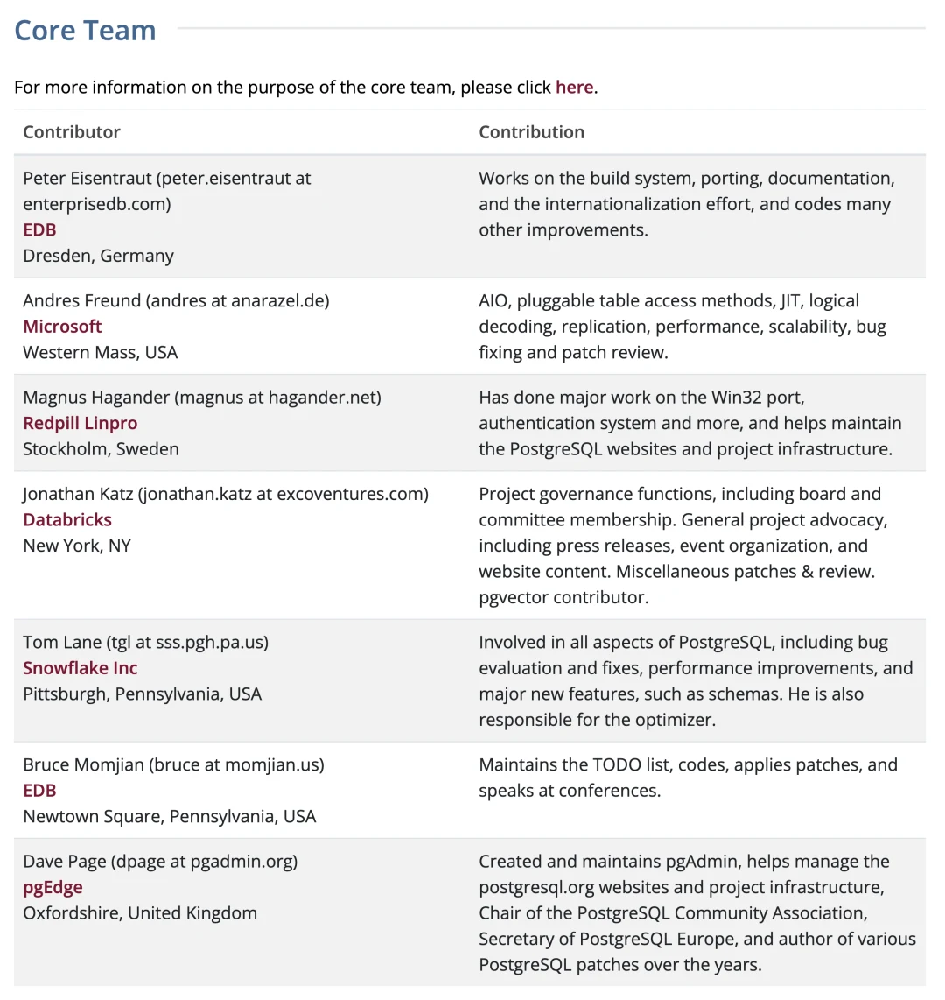
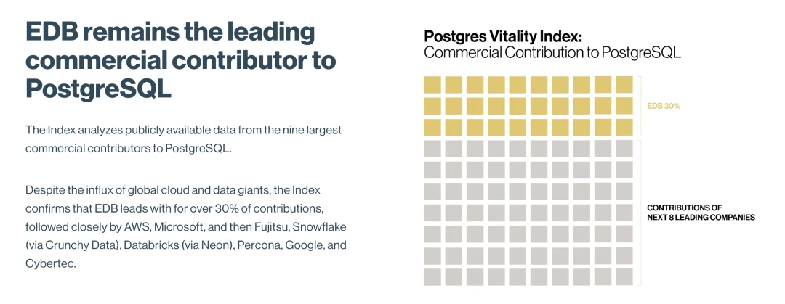
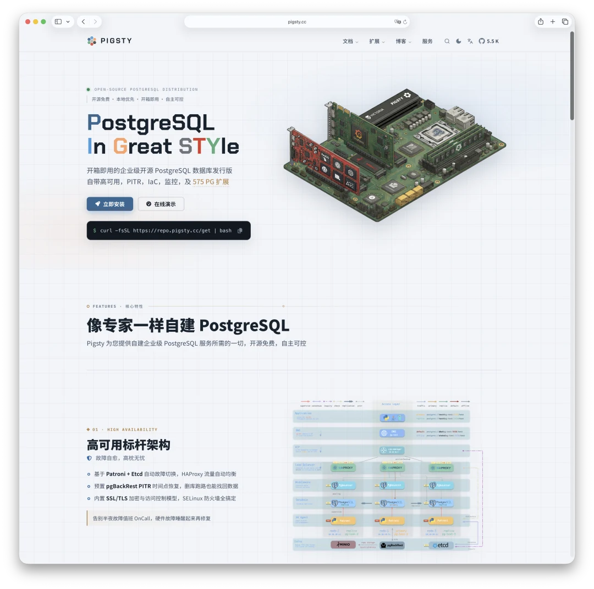

> [微信公众号原文](https://mp.weixin.qq.com/s/-xbCSmcYT-fIGXgQuQQUow)

2026 年 8 月 19 日，The Register 刊出了一篇对 Michael Stonebraker 的采访。这位图灵奖得主、伯克利 Postgres 项目的发起者、八十多岁还在创业的老先生，被问到 PostgreSQL 为什么会赢，给了一个听上去有点意外的答案：

> 我们得感谢 Oracle。

我们得感谢 Oracle。因为他们买下 MySQL 之后，所有人都开始担心 MySQL 的去向会被 Oracle 主导，而那正是 PostgreSQL 崛起的开端。

他在同一段话里还说，PostgreSQL 不受任何厂商控制，掌控它的是一伙二三十人的顶尖程序员，他相信这个项目会无限期地留在任何单一厂商的控制之外——这是开源最好的样子。

而就在今天，Oleg Bartunov 在 LinkedIn 上发了一篇反驳，标题相当不客气：《PostgreSQL 早在 2000 年就已经解决了「Oracle 问题」》。

Oleg 是 Postgres Pro 的老板，他在这个社区里待了三十多年，是 JSON 和全文检索体系背后的核心。

Bartunov 文章的证据是一张老照片。Jan Wieck 最近把照片发给了他：2000 年 3 月，PostgreSQL 核心组在旧金山举行第一次面对面会议。Bartunov 修复照片后，辨认出了墙上纸页里的六条原则：

- 分散的责任
- 分散的技术知识
- 非排他的合作关系
- 对项目方向的掌控权
- 保护名称
- 保护声誉

**这是 2000 年。Oracle 收购 Sun、并因此拿到 MySQL，还要再等十年。**

**早在大型商业公司进入社区之前，PostgreSQL 的核心开发者就已经把厂商控制、知识集中、品牌归属和项目独立性当成了需要主动解决的问题。**

表面上，这是一场「功劳归谁」的争执。它真正问的是另一个更值得写的问题：

**一个开源项目的成功，究竟应该归因于对手的失误、创始人的架构远见、志愿者的长期劳动，还是一套从来没有写进查询执行器里的制度？**

---

## 一、归因是怎么一步步漂移的

Stonebraker 关于这段历史的说法，十年之间悄悄换了重心。

2015 年他拿到图灵奖，在演讲里提到 Postgres。Jolly Chen 把那段话转录到了 pgsql-hackers 邮件列表上。他形容接手代码的那群人是 “a pick-up team of volunteers”——一支临时凑起来的志愿者队伍，跟他和伯克利都没有关系，从 1995 年起一直守护着这套系统。

他特意强调：这事跟我无关，我们所有人都欠这群人一份巨大的人情，是他们把这条代码线做扎实、真正跑了起来。那一版叙事的主语，完完全全是社区。

2023 年底接受 The Register 采访时，出现了新的措辞。他说 MySQL 被 Oracle 买走后，开发者成群结队地起疑并倒向 PostgreSQL——“It was another happy accident”，又一次幸运的意外。商业上的成功很美妙，但很大程度上是机缘巧合。

2026 年 6 月在波士顿 PGDay 的演讲里，他仍然给了社区最高的评价：Postgres 是开源软件的典范，因为它不属于任何人。到了 2026 年 8 月，句子的主语变成了 Oracle。

这不能算自相矛盾。他在同一次采访里仍然承认社区独立和厂商中立。真正发生变化的是因果叙事的焦点：

- 2015 年，他解释是谁把代码做成了；
- 2023 年，他解释市场机会从哪里出现；
- 2026 年 6 月，他解释 PostgreSQL 的治理为何特殊；
- 2026 年 8 月，他用一句适合新闻标题的话，把增长转折压缩成了「感谢 Oracle」。

还有一层背景值得补上。2021 年，PostgreSQL 的 committer Peter Geoghegan 在邮件列表上被问到 Stonebraker 在社区里的分量，回答得相当直接：除了在几次 EDB 主办的活动上露过面，**大学时期的 POSTGRES 之后，他与项目几乎没有交集，也从未在任何邮件列表上公开发言过**——而 Geoghegan 自己已经全职做 Postgres 十年。

也就是说，讲述这段历史的人，正是这段历史的缺席者。Bartunov 那句「我是从社区内部看这个故事的，不是旁观者」，潜台词就在这里。

## 二、那面墙不是孤证

Bartunov 的证据是一张照片。照片本身是弱证据——纸上的字可以是任何一次头脑风暴的产物，二十六年后拿出来，很难排除后见之明的美化。

但巧的是，同一段历史还有另一位当事人独立讲过，讲的是同一件事。

Tom Lane 在播客 Talking Postgres 里回忆过 1999 到 2000 年之间发生的事：一家叫 Great Bridge 的公司找上门来，想知道怎样才能「以一种得体的方式」参与进这个项目。

当时 core team 只有四个人。他们的第一反应不是谈条件，而是先扩容——大意是「我们最好多拉几个人进来，这样跟他们谈的时候能代表更广的社区」。于是 Tom Lane 和 Jan Wieck 被加了进来，core 变成六人，然后才去谈。

请注意这个顺序：**公司的钱还没到，组织形态先改了。**

这正是墙上那两行字在现实中的样子——「非排他的合作关系」「对项目方向的掌控权」。它不是一句愿景，是一次具体的、针对具体一家公司的组织设计。

后来的事更能说明问题。Great Bridge 2000 年 7 月成立，雇了 Tom Lane、Bruce Momjian、Jan Wieck。据当年的社区记录，正是这家公司让 Tom Lane 第一次可以全职做 PostgreSQL，而不是把它当业余爱好；也让 Bruce Momjian 可以到处演讲布道。然后它在互联网泡沫破裂中倒闭了。

人留下了，项目留下了，公司没了。

Bartunov 文章结尾那句「公司来了，投钱，雇 hacker，有些公司消失了，但 PostgreSQL 留了下来」，第一个例子就是 Great Bridge——而且就发生在同一年，2000 年。

## 三、真正的护城河，写在每个源文件的头部

Bartunov 的文章里有一句话，他自己一带而过了：项目没有单一的所有者。

这句话在 PostgreSQL 这里不是价值观表述，是法律事实。

PostgreSQL 从来不要求贡献者签署版权转让协议。三十年、成百上千名贡献者，版权分散在所有人手里，没有一个中央法人持有整份代码的权利。这意味着一件很朴素的事：**没有任何人有资格把 PostgreSQL 卖掉。**不是「不愿意卖」，是根本不存在能签字的那个主体。

对照组就在故事的另一半里。MySQL AB 走的是版权集中路线：贡献者转让版权，公司持有全部权利，因此可以双许可、可以卖。于是它在 2008 年被 Sun 买走，2010 年随 Sun 一起落入 Oracle 之手。社区唯一的自救手段是 fork——这就是 MariaDB 的由来。

所以 Stonebraker 说「我认为它会无限期地留在任何单一厂商的控制之外」，这个判断是对的，但原因并不是那二三十个程序员有多聪明。**是因为结构上不存在那笔交易。**

这才是「2000 年就解决了 Oracle 问题」这句话真正成立的地方。只是它不在墙上，它在每一个源码文件的头部。

唯一的例外是名字。商标必须由某个法人持有，否则会被别人抢注，所以这部分交给了非营利的 PostgreSQL Community Association（加拿大），2003 年完成注册。墙上「保护名称」那一行，对应的正是这件事。

## 四、这套制度被真刀真枪检验过

2020 年，一家名为 Fundación PostgreSQL 的西班牙非营利组织，在欧盟和美国申请注册 “PostgreSQL” 与 “PostgreSQL Community” 商标，此前已在西班牙完成注册。核心组和 PGCA 发了律师函、在 EUIPO 提出正式异议、2021 年在马德里法院提起诉讼，同年对方又追加申请了 “Postgres”。这场官司一直打到 2023 年 11 月 17 日才达成和解，对方交还全部商标，转为向社区取得授权使用。

三年，为了一个名字。

*顺便一提，在中国也有人注册了这个商标。*

对不熟悉开源治理的人来说，这像是小题大做。但如果 2000 年墙上那行「保护名称」只是一句漂亮话，2020 年就不会有人愿意打这场仗。**制度的效力不体现在它被写下来的时候，体现在它被执行的时候。**

同样值得一提的是 core team 持续的自我削权。据 Tom Lane 2024 年在 pgconf.dev 上梳理的核心组历史：安全响应在 2007 年下放，基础设施在 2011 年下放，committer 遴选在 2015 年的开发者会议上决定下放。他解释早期核心成员为什么是那几个人时，用了一句极朴素的话——“Because they were the ones doing the work”，因为活是他们干的。

一个把「谁干活谁说话」当作原则的组织，天然会不断把权力交出去，因为干活的人只会越来越多。这就是 Bartunov 说的「分散的责任、分散的知识」。它的反面很容易想象：一个所有决策都汇聚到少数几个人、或者一家公司手里的项目，在被收购的那一刻会一次性崩塌。

## 五、但 Stonebraker 也没说错——他种下的那颗种子

两个人其实在解释不同的东西。**Stonebraker 讲的是需求侧**：什么时候、因为什么，大量用户开始寻找替代品。**Bartunov 讲的是供给侧**：为什么当门被推开时，门后站着一个买不走也搞不砸的项目。这是两个问题，两个答案都成立，而且互为条件。

需求侧的冲击是真实的，而且还在继续。Percona 对 MySQL 仓库的统计显示，年度 commit 数从 2010 年的两万两千多降到 2024 年的四千七百多，十四年降到不足四分之一；活跃贡献者在 2025 年三季度只剩约 75 人——比 2010 年 Oracle 完成收购时的 82 人还少。2025 年 9 月，Oracle 裁掉了约 70 名 MySQL 核心工程师，MySQL 之父 Monty Widenius 说自己「心碎」，Percona 创始人 Peter Zaitsev 说这可能是慢慢杀死社区版的又一步。

[PZ：MySQL 还有机会赶上 PostgreSQL 吗？](/db/can-mysql-catchup/)

[Oracle 最终还是杀死了 MySQL！](/db/oracle-kill-mysql/)

但更重要的是另一件事：**治理是护城河，不是发动机。**

好的治理结构从来不能自动生产市场份额。被治理良好却最终无人问津的开源项目多得是。PostgreSQL 在 2015 年之前长期不温不火；如果社区文化是充分条件，它没有理由等上二十年才爆发。

那台发动机是什么？我认为答案很明确：**可扩展性。而这颗种子是 Stonebraker 在 1986 年亲手种下的。**

[PostgreSQL 正在吞噬数据库世界](/pg/pg-eat-db-world/)

**Oracle 先进，MySQL 开源，PostgreSQL 先进又开源。开源体现在它的社区治理结构上，而先进体现在它极致的可扩展性上。**[PostgreSQL：世界上最成功的数据库](/pg/pg-is-no1/)

1986 年的 POSTGRES 设计论文里，最反直觉的一条不是任何一个具体特性，而是这个决定：不要把功能都做进内核，要把「往内核里加功能」这件事本身做成一等公民。用户可以定义自己的数据类型、自己的操作符、自己的函数，甚至自己的索引访问方法，然后像插模块一样插进去。

那个年代所有人都在往数据库里加特性，Stonebraker 加的是**加特性的能力**。这是一个元层面的决策，代价是内核复杂度直接上一个台阶，收益要等三十年才兑现。

三十年后兑现的样子是这样的：

- **PostGIS** 用一个扩展，让 PostgreSQL 成了地理信息领域事实上的标准，把一整个商业 GIS 数据库品类挤到了墙角；
- **TimescaleDB / Citus** 用扩展分别解决了时序和分布式，都没有 fork 内核；
- **pgvector** 几千行 C 代码，把 PG 变成了一个能打的向量数据库，顺手把一批向量数据库创业公司的估值逻辑打了个对折；
- **pg_duckdb、Apache AGE、pg_cron、各类 FDW**……到今天，光是老冯自己维护的扩展目录里就收了一千六百多个扩展。

GiST、GIN、SP-GiST 这些可扩展索引框架，恰恰是 Bartunov 和 Teodor Sigaev 这批人做的。也就是说，**Stonebraker 设计了插槽，Bartunov 们造了插进去的东西**。这场争论里两个人的功劳，在这里其实是同一件事的两面。

可扩展性还带来了第二重后果，而且这一重可能更关键：**wire protocol 意外地成了行业标准。**用 Stonebraker 自己的话说，几头「大象」都押上了身家；连 CockroachDB、YugabyteDB 这些跟 PG 内核毫无血缘关系的新系统，也选择兼容它的协议。一个协议成为标准，往往不是因为它设计得多好，而是因为周围的生态大到不兼容的代价没人付得起。

Stonebraker 自己怎么评价这件事？他在波士顿 PGDay 上说，抽象数据类型（ADT）扎下了根，如今几乎所有关系数据库都支持这种可扩展性，「我们基本上做对了」，他认为这也是自己拿图灵奖的主要原因；而当年一起规划的规则引擎和崩溃恢复，都没做成。

所以如果要给他记一功，最该记的不是「Oracle 帮了忙」，而是四十年前那个架构决策——那恰恰是 Bartunov 也承认的那句「他种下了 Postgres」。

而且这颗种子长出来的东西，正好接上了下半篇的问题：一个价值分散在几千个扩展、几十家公司、无数个独立作者手里的生态，你没法通过收购某一家来控制它。**PostgreSQL 之所以难以被单点绞杀，一半靠治理，一半靠这套架构。**

## 六、真正的考验不来自 Oracle，来自云

2000 年那面墙上的问题是：如何与公司合作、接受它们的资金和贡献，同时不让任何一家公司控制这个项目。

当时的假想敌很具体：**一家想买下你的公司。**

今天的问题换了形状。打开 postgresql.org 的贡献者名单，看看核心组这七个人的雇主：

七个人里，五个直接在超级巨头的工资单上。而且要注意 Tom Lane 那一行是怎么变成 Snowflake 的——不是他跳槽去了数据仓库公司，是 Crunchy Data 被 Snowflake 收购了。Jonathan Katz 则是从 AWS 到了 Databricks。**人没动，头顶上的招牌换了。**

再往下看 Major Contributor 那一栏，画面更清楚。按官网自己列出的雇主口径数一遍：AWS 十位、微软十位（含 Freund）、Snowflake 三位（含 Tom Lane）、Databricks 加上它收购的 Neon 四位，另有一位在苹果、一位在 Yandex Cloud。核心组加上主要贡献者一共六十来人，其中接近一半在这几家公司发工资。剩下的大头是 EDB 的八位——而 EDB 背后站着的是私募资本。

再对一下 EDB 2026 年 3 月发布的那份「Postgres 活力指数」：EDB 把自己排在商业贡献者第一位，称占超过 30% 的贡献，其后依次是 AWS、微软、Fujitsu、Snowflake（通过收购 Crunchy Data）、Databricks（通过收购 Neon）、Percona、谷歌、Cybertec。这份指数只覆盖它认定的九家最大商业贡献者。

请把这份榜单和 Stonebraker 那句「不受任何厂商控制」并排放。

两者都不假。没有哪一家公司能控制这个项目——版权分散、商标在非营利组织手里、决策权持续下放。**但危险恰恰藏在「没有哪一家」这五个字里。**

当年的敌人是一家想弄死你的公司，它得做错事，你才有反击的理由和对象。今天不需要任何人做错事。每一位工程师都在认真地写代码、修 bug、审补丁，每一家公司都在真金白银地投入——同时每一个人都自然而然地优先解决自己雇主关心的问题。

于是优先级会漂。云上急需的东西——I/O 性能、逻辑复制、备份效率、存储分层——自然有人抢着做；而私有部署用户最需要的那些东西，比如开箱即用的高可用、内置连接池，社区至今没有官方答案。Bruce Momjian 在波士顿 PGDay 上列过一份「还缺什么」的清单，里面就有这几项。不是有人使坏，是**没有人在为这类需求发工资**。

更要命的是价值分配。Aurora、AlloyDB，以及微软 2026 年 5 月推到公开预览的 Azure HorizonDB，卖的都是「PostgreSQL 兼容」——内核受益于社区，收入不流向社区。社区拿到的是几十份工资，云厂商拿到的是几十亿美金的营收。这个生态里绝大部分的商业价值，正在沉淀到一层社区看不见也管不着的「兼容层」里。

那个让 PostgreSQL 卖不掉的结构，同时也让 PostgreSQL 打不了反击战。

这些年被云厂商逼急了的开源项目，反击手段出奇地一致：MongoDB 2018 年改 SSPL，Elastic 2021 年跟进，HashiCorp 2023 年改 BUSL，Redis 2024 年改协议。它们之所以能在一夜之间把协议换掉，恰恰是因为它们持有全部版权——贡献者签过 CLA，公司说了算。**它们是在用「版权集中」这把刀砍云厂商。**

PostgreSQL 举不起这把刀。三十年、几千名贡献者、版权散落在所有人手上，没有任何一个主体有资格宣布「从明天起不许云厂商提供托管服务」。没有人能把 PostgreSQL 卖掉，也没有人能替 PostgreSQL 关上那扇门。**护城河和软肋，是同一样东西。**

这不是设计缺陷，是选择的代价。而且我认为这个代价值得付：那几个举了刀的项目，换来的是 OpenTofu、Valkey、OpenSearch 这些 fork，和一次性透支掉的社区信任。PostgreSQL 三十年没分裂过，靠的正是这套没人能单方面改规则的结构。

那么，堵不住上游，还能做什么？

**只能在下游想办法。**

云厂商真正卖的从来不是 PostgreSQL 内核——内核是白送的，谁都能下载。它们卖的是内核外面那一层：高可用、备份恢复、监控告警、连接池、参数调优、扩展分发、故障自愈。这层东西社区一直没有官方答案，于是每一家云厂商都自己攒了一份闭源的，然后按小时收费。

这层东西，是可以开源的。

老冯做 Pigsty，做的就是这件事：把 RDS 那一层——高可用、备份、监控、扩展仓库、对象存储——完整地做成一个开源发行版，让任何一个人在自己的机器上把它跑起来。这不是要跟云厂商抢生意，一个人也抢不动；是要让「不用云厂商」重新成为一个**可选项**。

因为有退出权才有议价权。没有自建能力，所谓「多云」「混合云」都是幻觉——你唯一能做的选择是选哪家来锁定你。开源治理层面的问题解决不了，但可以对冲：只要自建这条路一直通着，云厂商的兼容层就只能是一种选择，而不是唯一的出路。

## 结语：新时代的敌人

二十五年前，开源的头号敌人是微软。1998 年的万圣节文件，2001 年 Ballmer 说 Linux 是癌症，「拥抱、扩展、消灭」的三段论。那时候的敌人清清楚楚：它想弄死你。

今天呢？今天 PostgreSQL 核心组里坐着一位微软员工，微软的工资单上有十来位 PostgreSQL 主要贡献者，微软是这个项目最大的贡献者之一。你很难再说它是敌人。

**这才是新时代真正的问题：今天的对手不想弄死你，它想养着你。**

它用你，也真金白银地喂你；它写代码、修 bug、办大会、发工资，样样都算得上模范公民；同时它拿走了这个生态里绝大部分的商业价值。这段关系里没有恶人，没有可以起诉的对象，也没有可以打赢的官司——2020 年那场商标官司好歹还有个被告，这一次没有。

如何协调开源社区和云厂商的关系，我认为是开源治理这个学科的新型挑战。2000 年那六行字解决的是「如何不被一家巨头公司买走」，那是个法律问题，可以靠不签 CLA、靠一个非营利组织持有商标来解决。二十六年后的问题是「如何不被十家寡头公司养熟」——这是个政治问题，它没有条款可写，只能靠持续的、集体的警觉。

不过我倒也不悲观。

任何人想垄断 PostgreSQL 生态，都是很困难的。因为这个生态的形状本身就是反垄断的：版权分散在几千个人手里，商标在非营利组织手里，扩展生态在无数独立作者手里，协议是完全公开的。你可以把所有的 PG 创业公司一家一家买下来，但你买不下这个形状。

而且总还会有些头铁的人。就算这些 PG 公司最后都被云巨头收编，也还会有像老冯这样的独立个体，一边用着云厂商的机器，一边跟云厂商的商业模式硬刚，把 RDS 那点看家本领一样一样地开源出来。只要还有人在干，「自建」就始终是一条通着的路，PostgreSQL 世界的自由就还有一个下限。

Bartunov 那句话依然是对这段历史最漂亮的概括——

> Stonebraker planted Postgres. The hackers built PostgreSQL.

hacker 们建的不止是 PostgreSQL，还有一套让 PostgreSQL 卖不掉的东西。代码可以 fork，架构可以抄，但抄不走的，是二十六年如一日地执行它。

---

### 参考资料

1. Lindsay Clark, [**Postgres pioneer credits Oracle with helping his database take over the world**](https://www.theregister.com/databases/2026/08/19/postgres-pioneer-credits-oracle-with-helping-his-database-take-over-the-world/5289087), The Register, 2026-08-19.
2. Joab Jackson， [**The database that refused to die：How Postgres survived its own creators**](https://www.theregister.com/databases/2026/06/22/the-database-that-refused-to-die-how-postgres-survived-its-own-creators/5259716), The Register，2026-06-22（PGDay Boston 演讲报道，含 ADT 自评与 Momjian 的缺失特性清单）。
3. [**Postgres pioneer Michael Stonebraker promises to upend the database once more**](https://www.theregister.com/2023/12/26/michael_stonebraker_feature/), The Register，2023-12-26（“happy accident” 的出处）。
4. Jolly Chen， [***“A huge debt of gratitude” — Michael Stonebraker***](https://www.postgresql.org/message-id/A4BA155B-E762-4022-B7D1-6F4791014851@chenfamily.com), pgsql-hackers，2015-07-21（图灵奖演讲转录）。
5. Tom Lane, [**Postgres Core Team History and Functions**](https://wiki.postgresql.org/images/c/c1/CoreTeam_Update_pgconfdev_2024.pdf), pgconf.dev 2024.
6. [**How I got started as a developer (& in Postgres) with Tom Lane**](https://talkingpostgres.com/episodes/how-i-got-started-as-a-developer-in-postgres-with-tom-lane/transcript), Talking Postgres 播客文字稿（Great Bridge 与 core 扩容的回忆）。
7. [**Trademark Actions Against the PostgreSQL Community**](https://www.postgresql.org/about/news/trademark-actions-against-the-postgresql-community-2302), postgresql.org，2021-09-13；以及 [**Updates on trademark actions**](https://www.postgresql.org/about/news/updates-on-trademark-actions-against-the-postgresql-community-2762/), 2023-12-06（和解公告）。
8. [**PostgreSQL Contributor Profiles**](https://www.postgresql.org/community/contributors/), postgresql.org（核心组与主要贡献者的雇主名单，本文统计口径，访问于 2026-08-23）。
9. [**Analyzing the Heartbeat of the MySQL Server: A Look at Repository Statistics**](https://www.percona.com/blog/analyzing-the-heartbeat-of-the-mysql-server-a-look-at-repository-statistics/), Percona, 2026-03.
10. [**Separating FUD and Reality：Has MySQL Really Been Abandoned?**](https://www.percona.com/blog/separating-fud-and-reality-has-mysql-really-been-abandoned/), Percona，2026-03（反方意见）。
11. [**Monty Widenius 'heartbroken' over Oracle's MySQL job cuts**](https://www.theregister.com/software/2025/09/11/monty-widenius_heartbroken_over_oracles_mysql_job_cuts/1169295), The Register, 2025-09-11.
12. [**What's new with Postgres at Microsoft，2026 edition**](https://techcommunity.microsoft.com/blog/adforpostgresql/whats-new-with-postgres-at-microsoft-2026-edition/4526963), Microsoft Community Hub（Azure HorizonDB 公开预览）。
13. [**The Postgres Vitality Index**](https://www.enterprisedb.com/company/postgres-vitality-index), EDB, 2026-03-12.
14. Oleg Bartunov, **PostgreSQL Had Already Solved the Oracle Problem in 2000**, LinkedIn, 2026-08-23.
