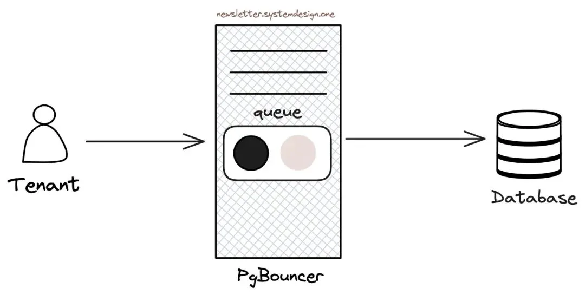
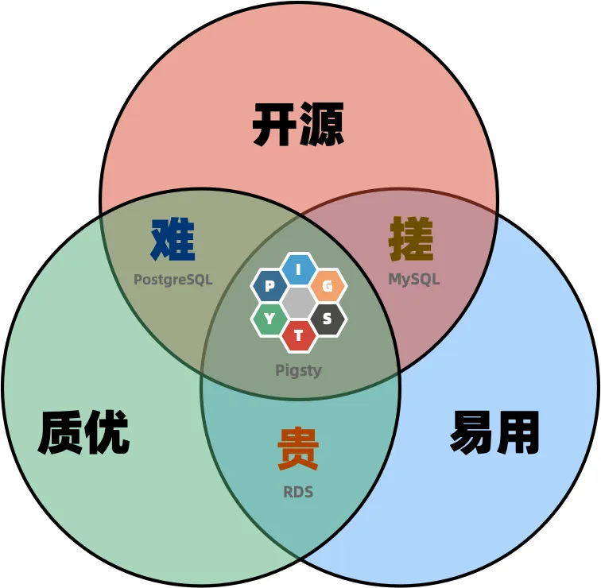
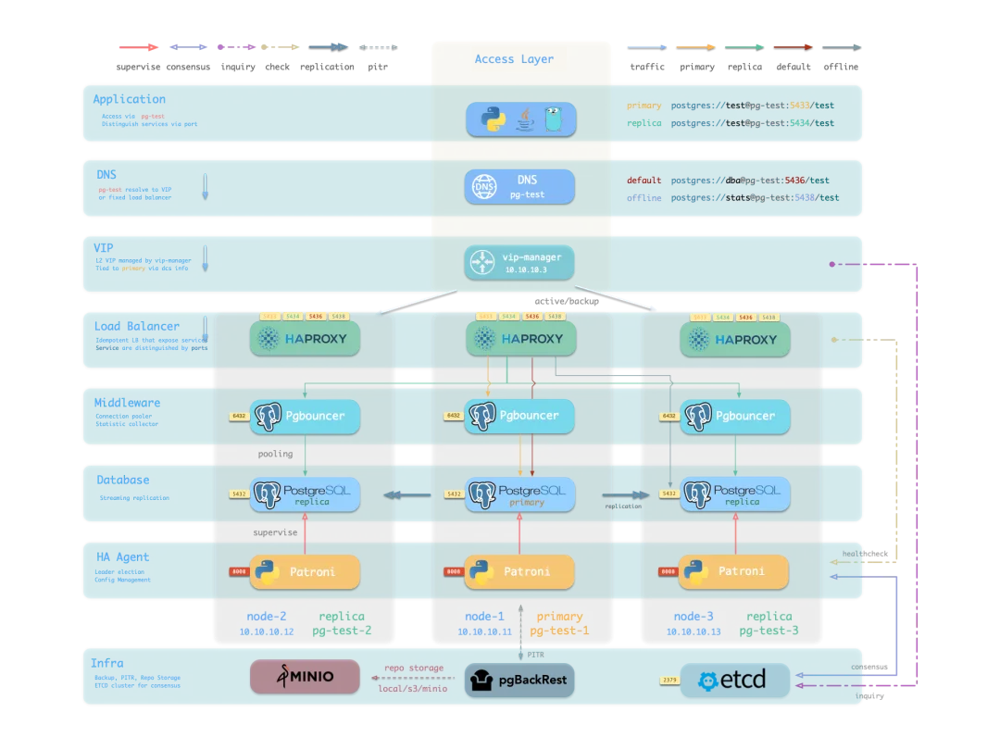

昨天遇到一个客户的案例。使用客户端直连 PostgreSQL，单个主库上有小几千条数据库连接。应用侧扩容之后连接数又大了很多，4000 多条连接，1500 条活跃状态的连接，直接撞上了软件瓶颈，写性能退化严重。后来换成连接池访问之后问题解决了。今天就来简单聊一下这个问题，**连接池**。

## 高并发连接数

在这个案例中，应用使用了 **1500** 条活跃的客户端连接访问单个主库。因为 PostgreSQL 使用多进程架构，这意味着对应着 1500 个后端进程，大部分的客户端请求只是单纯的向某张巨无霸表中插入单条数据，TPS 两万左右。然后就出现性能劣化的场景了，一条 INSERT 可能要上百 ms 才能返回，而不是常规的上百 µs。

INSERT TPS 2 万，不算很大的量。但怎么就卡死了呢？关键就在这个高并发连接数上。在这个系统中，硬件没有瓶颈，磁盘是 NVMe 的，CPU 使用率百分之十几。但是一千五百条连接争相抢着写入 WAL，在这个系统中有大概 1000+ 的 LWLock 存在，大家都把时间花在毫无意义的内耗上了！

怎么解决，直接上 pgBouncer，上了 pgBouncer 之后，最后活跃的数据库服务端连接数从 1500 变成了 **2**。**是的，其实这两万 TPS，两条连接就可以解决问题**了。并不需要上千条连接。使用连接池之后，所有的 INSERT 请求都排队使用这两条连接，系统中的 LWLock 等待全都消失了，一切恢复平静。

其实这跟我们之前使用 pgbouncer 的经验相符，之前我们有一套主库上挂着大概 3～4 万的 TPS，对应着 pgBouncer 中，只使用 3 ～ 4 条活跃连接就解决问题了，两万条客户端连接有序排队，其实只要 4 条连接就能解决问题。[**Cloudlfare 的一篇博客，也讲过这个问题。**](/pg/pg-scalability/)

## 关于 PG 多进程模型

有很多人批评 PostgreSQL 的多进程模型，说这种模型性能不好，blahblah，他们说的对吗？对也不对。多进程有多进程的好处和便利，也有他的问题与短处。当然多进程最大的问题就是上面提到的，高并发支持。

PG 的多进程意味着一条数据库连接对应着一个真实的后端进程，连接进入，进程创建，连接关闭，进程销毁。而这些进程操作确实是非常重的操作系统调用。[**PG 的性能其实非常好**](/pg/pg-scalability/)，但它对高连接数并不友好，而这恰好是所谓 “互联网” 场景的典型特性。

比如从 PHP 一路传过来的习惯是，来一个 HTTPS 请求我就起一个数据库连接。MySQL 的线程模型针对这种场景会有更好的表现，PostgreSQL 本身的性能瓶颈要比 MySQL 高不少，但因为原生内核在这种高并发场景下会因为高连接数带来的内耗而表现不佳。所以有些人就喜欢抓住这一点来做文章：多进程？垃圾。

**但实际上，只需要一个连接池就可以解决这个问题**。说到底，PG 多进程模型带来的高并发支持不佳，**是一个在运维 / 架构侧已经得到充分解决的问题**。因此在 PG 开发者对于在内核中添加连接池，再解决一遍的热情并不高。

然而，对于完全不了解这一点的新人用户来说，你让他把内核跑起来已经费老鼻子劲儿了，你让他在装个连接池配置好？想啥呢。然后，这些新人用户按照 MySQL 的使用惯性，先来他几千条连接直接干上去，发现性能劣化之后得出结论 —— 垃圾 PG，这确实是让人无奈。

## PG 应该内置一个连接池吗？

那么，PG 应不应该内置一个连接池呢？或者，像 MySQL 那样直接使用线程以支持高并发连接数？关于这一点，社区其实有过讨论于探索。按我的看法，我是不赞成的 —— Unix 哲学，一个程序做好一件事。连接池放在外面，有更高的灵活性，它可以处理负载均衡，可以处理故障切换，可以处理读写分离，可以处理各种各样的问题。

这里其实引出了一个问题，就是**PostgreSQL 生态的逻辑，是像 Unix 生态一样，给你一堆散装零件，让用户自己去搭积木来使用的**。如果说整个数据库服务就像一辆汽车，那么 PostgreSQL 内核本身就是发动起引擎，而 pgBouncer 连接池就类似于变速箱，pgBackRest 备份是保险带和安全气囊，监控系统是仪表盘，访问控制是车钥匙，高可用是自动驾驶系统，诸如此类。

对于不会攒车的新手来说，很可能干出直接把发动机不加变速箱直接套到车轮上的事情，一块木板放上发动机接两个轮子就开着走了，然后抱怨说这车动力不足，容易翻车。说到底，像连接池这样的东西，不一定要做进发动机，但在车里需要有，并且应当是必选配置。那么怎么解决这个问题呢？

那么解决办法是什么，那就是不要直接开 “发动机”（数据库内核），而是要开组装好的整车。你去找 DBA 老司机给你建设数据库体系，实际就是在攒这么一辆车。传统企业级的数据库服务，其实就是这种模式，把连接池，备份，高可用，监控整个给你打包好，做成一辆整车（数据库发行版）卖给你，云厂商的云数据库，就再额外配个司机租给你。

当然，因为 PG 是开源的，所以这个发动机和其他零件不要钱，不像 Oracle 那样卖天价零件。但是攒车整合和四儿子店维保这个事是要收钱的，而且还不便宜（[**市面公允价格一般是 1～2 万人民币/vCPU·年**](/db/cheap-polar/)）。所以经常会出现用户图便宜拿着土法手搓数据库上路的事儿，然后在某个时刻突然散架翻车。

## 就没有便宜好用的选择吗？

不过，现在其实你有一种全新的选择，那就是开源的攒车方案。广告时间，广告时间，广告时间：**我们的开源数据库发行版 Pigsty** 已经替你处理好包括连接池在内的所有细节。你可以用五行 YAML 拉起一个自带监控与高可用的多节点 PG 集群。使用任意节点的 5433 端口，就已经在通过连接池访问主库了，使用 5434 端口，是通过连接池访问从库。

当你使用剧本创建数据库与用户时，Pigsty 同时会为你维护好连接池中的用户与数据库，始终与 PostgreSQL 保持同步，并已经考虑好了访问控制，突发流量，监控等各种问题。因此用户可能根本都没意识到自己已经使用了连接池，就已经享受到高性能数据库的便利了。

---

发布版本：[微信公众号](https://mp.weixin.qq.com/s/3uD9sxCg-lI1MlOg3NacvQ)
