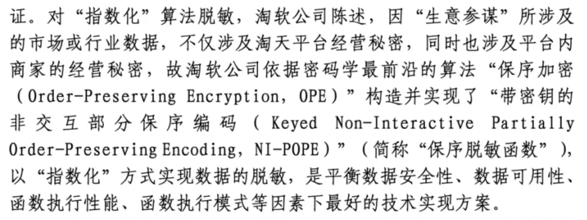
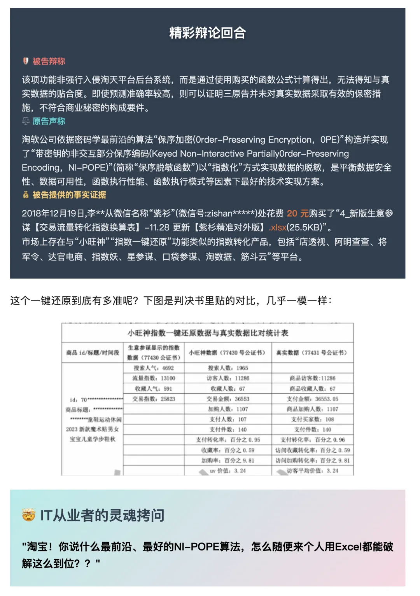
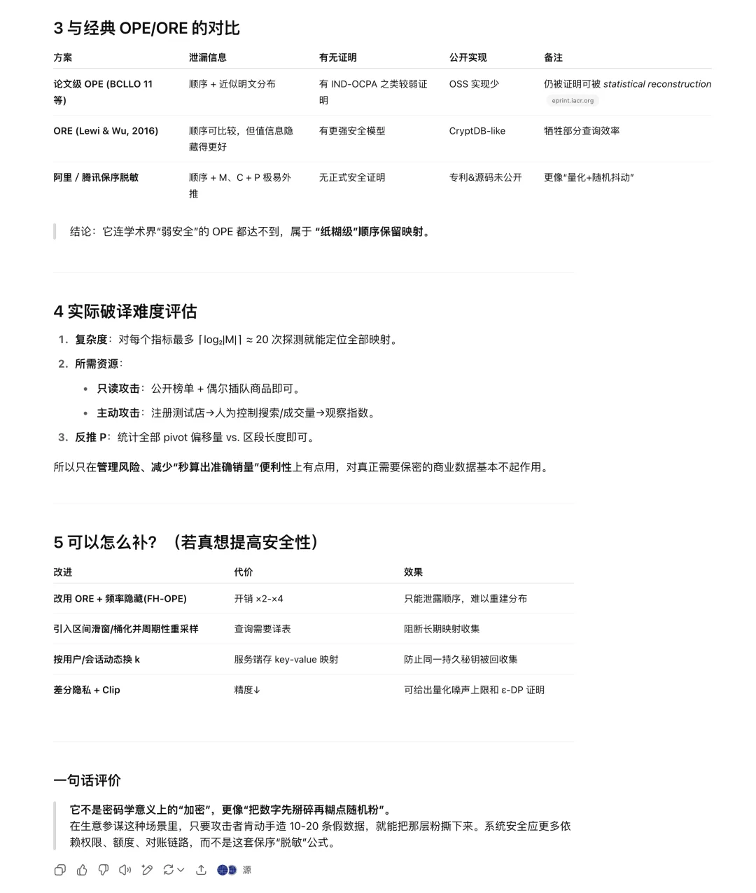
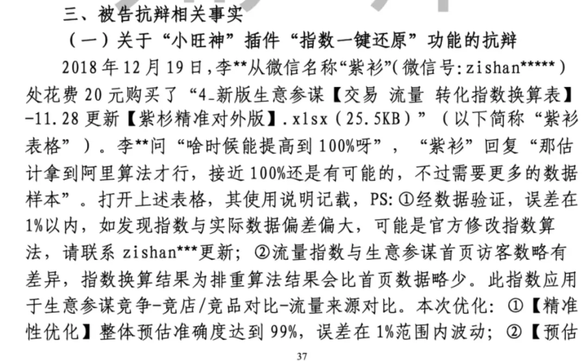
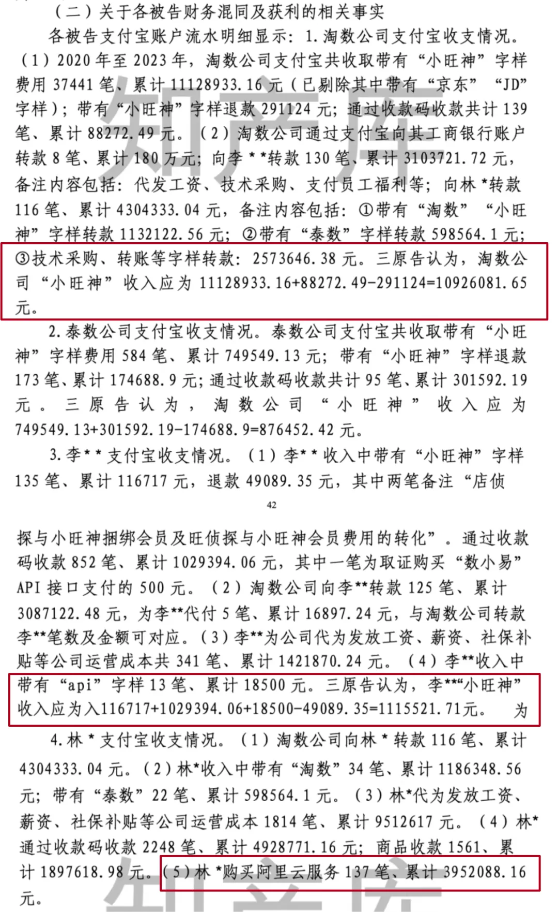
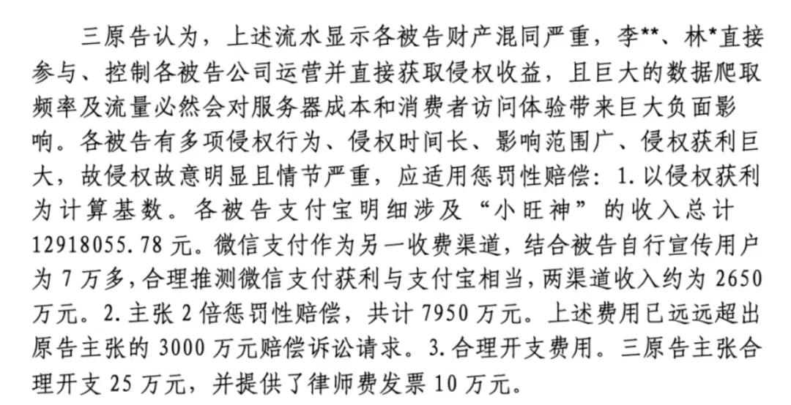
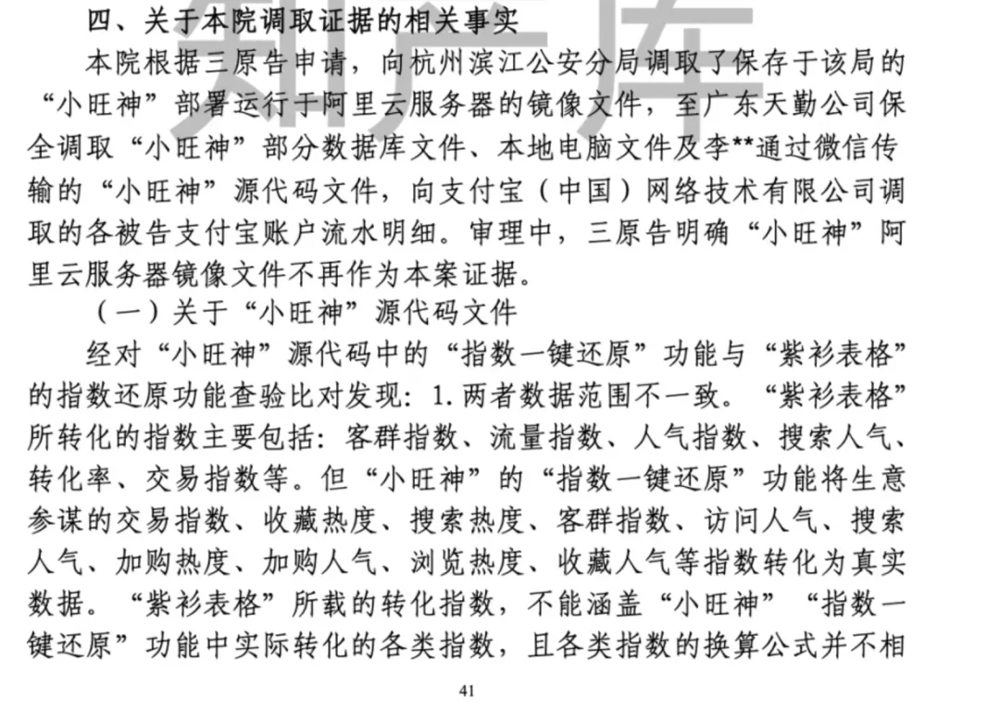
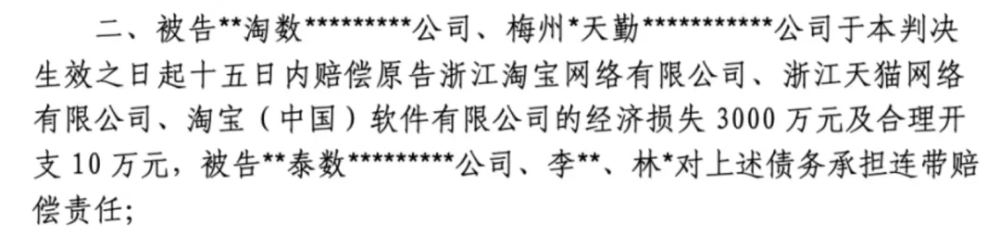

昨天在群里看到了一篇有趣的文章《[案例解读 \| 淘宝"生意参谋"数据案判赔 3000 万](https://mp.weixin.qq.com/s?__biz=MzU2NDk5Njg2OA==&mid=2247506406&idx=1&sn=fa2f5764f4dc8ba7c362b7aaae95ff10&scene=21#wechat_redirect)》。大体内容就是阿里和一个叫“小旺神”的公司对簿公堂，让人家赔三千万。我还有个朋友饶老板写了篇读后评论《[价值 3000 万还是 20 块？解读淘宝“生意参谋”算法](https://mp.weixin.qq.com/s?__biz=Mzk0MzQzOTQ2OA==&mid=2247484047&idx=1&sn=b35c770f80baaf9127c34091aa967c5a&scene=21#wechat_redirect)》。

老冯对狗血八卦没什么兴趣，但研究这个案例确实能发现不少有趣的东西，作为数据行业从业者，看看别人用三千万买的教训，说不定哪天就用上了呢？

这个案子有几个有趣的点，阿里生意参谋所谓的 “密码学最前沿加密算法” 其实等效一个价值 20 块钱的 Excel 表格。而这个薅阿里的公司竟然还敢跑在阿里云上。挣了一千万给阿里云上贡 400 万，最后还被狠狠搞了一把，个人连带承担三千万赔偿，闹不好就家破人亡了。

## 密码学最前沿加密算法，仅售 20 元

生意参谋就是给淘宝卖家看数据的。当然很多敏感数据阿里不想让卖家看到（比如搜索，访客，收藏，支付人数，转化率，收藏率，之类的），就用了一个 “密码学最前沿” 加密算法 “加密” 了，你能拿来比个大小作为模糊参考，但是原本的精确数字就不会泄漏了，—— 吗？

关于这个问题，饶老板的《[价值 3000 万还是 20 块？解读淘宝“生意参谋”算法](https://mp.weixin.qq.com/s?__biz=Mzk0MzQzOTQ2OA==&mid=2247484047&idx=1&sn=b35c770f80baaf9127c34091aa967c5a&scene=21#wechat_redirect)》已经点评过了。

当然绕老板比较含蓄，我让 GPT o3 用大白话再次翻译一下，就是这个算法纯粹就是纸糊的玩意，CN114065272B 专利是公开的，GPT 表示，只要有十几条数据作为样本，就可以轻松推断出这个 “加密算法” 的参数，实现 99.99% 准确率的还原。

被告小旺神就是这么个东西。从判决书里看，他花二十块钱从 “紫衫” 买了个 Excel 表格，这个表格可以把生意参谋上模糊处理的数据以 99%+ 的精度还原为真实数字。然后他们把这玩意做成了一个浏览器插件，在用生意参谋的时候就可以看到各种真数据了。这玩意还是用来免费引流的，看来这个被告还是挺良心的。

老冯对这种操作并不陌生。当年有一个两千多万的项目发到学校，一层一层转包压到还是本科生的小冯身上。局域网文件加密，小冯灵机一动把文件开头元数据两个字节交换一下顺序，被包装为 “超高性能的 XX 加密算法” 去忽悠人了，小冯喜提 1000 元报酬。最后这个项目好像还拿了 XXX 省科技进步一等奖。经过这次事件，老冯对高校彻底祛魅，再也没有了一点儿读研究生的想法。

### 给阿里云上贡 400 万，惹得一身骚

但这个案例里更劲爆的是，被告用的竟然还是阿里云。老实说我是真佩服这个骚操作，主业是薅阿里搞阿里竟然还敢把服务器放到阿里的云上去，这可真是老寿星蹦极嫌命长。

这个被告看上去搞这些东西挣了一千万出头，工资发了三百万。然后另一个滑稽的转给自己 400 万，用来买阿里云服务了！

老冯看了感觉就是 —— 离谱，做个生意，给阿里云上贡的钱比自己挣的还多，这竟然还被阿里搞了？跟滑稽的是，这个林某似乎是 —— 公司打给他 430 万，然后他用个人支付宝给阿里云付了 395 万，然后这个被当作 个人/公司财务混同的事实，判了个个人连带责任。

也就是这三千万的赔偿是没法通过公司破产解决掉，可能穿透到个人身上。这简直是离谱他妈给离谱开门，离谱到家了。

此外，在中国，有很多公司不上云是有原因的，因为巨头的业务范围实在太广泛了，把自己的数据/代码/放在竞争对手的服务器（所谓“云”）实在是一件愚蠢至极的事情。老冯知道一些不宜宣扬的非公开的炸裂案例，但这次嘛…… 毫无疑问提供了一个鲜活的公开案例。

如果你的业务和这些 “本土云巨头” 有冲突，那么决定上云之前，不妨仔细看一下这个案例。

## 老冯评论

老冯花了半个小时，把这个南京中院的民事判决书给读完了。看完的感觉就是，原告和被告都是草台班子。阿里草台不是一天两天了，这个请看《[云计算泥石流](/cloud/exit/)》系列，里面已经写过不少了，这次又多了一条战绩 —— 20 块钱的土鳖专利加密算法。

这个小旺神也是个草台班子，干着搞阿里的事儿竟然还敢用阿里云，然后自己当法人，看上去也没搞股权架构，收款用个人支付宝，而且竟然公转私后再给阿里云掏了四百万，还被人抓住了把柄，判了个人承担责任，这一发下去个人承担责任估计是家破人亡了。

老冯跟本案原被告双方不认识也没有任何利益关系，纯粹作为一个具有健全尝试的业内人士看这个事，3000 万的判罚显然是太重了。奔着把人搞死去的，所以我比较同情被告。

主要是他们弄的免费数据还原功能（20 块钱），还有一个用 RPA 实现的竞品监控功能总的来说都算是挺有用的东西，也没有坑蒙拐骗。作为一个创业者，这几年赚个三百来万，还给阿里云贡献了四百万营收，怎么看都不应该落得这么个下场。

阿里这种奔着搞死别人去的做法也不是什么聪明的举动。第一观感太差：一出垄断平台痛殴创业者的戏码，人家在阿里的生态里做事，还是阿里云的客户，赚的钱 1/3 都给阿里云上贡了，然后被阿里往死里打，这么玩生态人都会看在眼里。第二是阿里的法务确实牛逼，给人家打爆了，但也实锤了所谓 “密码学最前沿” 加密算法不过是值 20 块钱的地摊货，技术草包暴露的淋漓尽致。柿子捡软的捏，没庙的野和尚可就不会吃法务铁拳这一套了。

作为吃瓜路人，真正重要的是，你能从从这个案件中吸取什么教训？如果你是被告当事人，能采取什么措施来规避这些风险？欢迎各位朋友在评论区留言讨论。

最后再提醒一下各位，上个月《[大故障：阿里云核心域名被拖走了](/cloud/aliyun-domain-seized/)》和《[阿里云故障，CDN 挂了，记得申请 SLA 赔付](/cloud/aliyun-cdn-sla/)》两次大故障，按照阿里云 SLA 已经可以开始赔付了（7 月开始开始申请 6 月服务 SLA 不达标赔偿） —— 记得小窗你的客服，主张你的合法权益。毕竟都在云上花了这么多钱，不能当个冤大头不是？

---

发布版本：[微信公众号](https://mp.weixin.qq.com/s/O4LvUspOgrVBWHzmBvfmUA)
