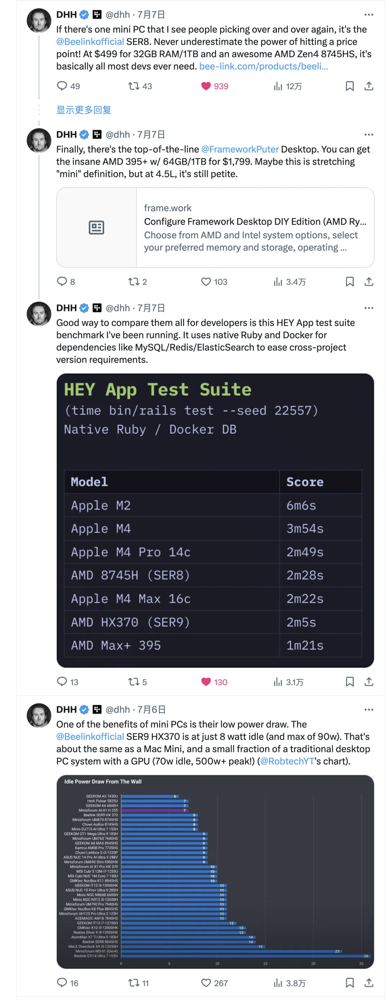
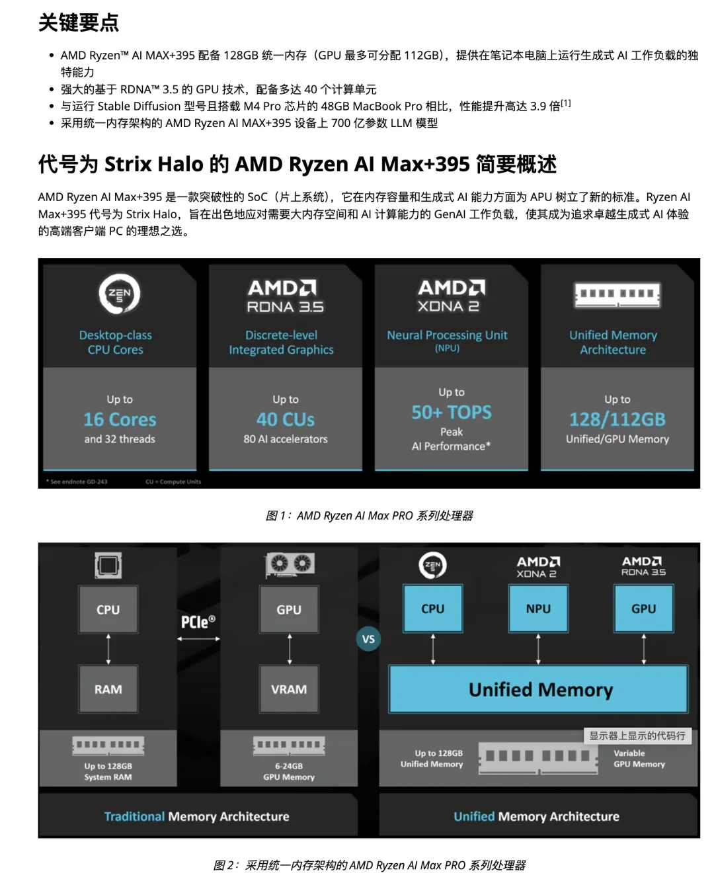
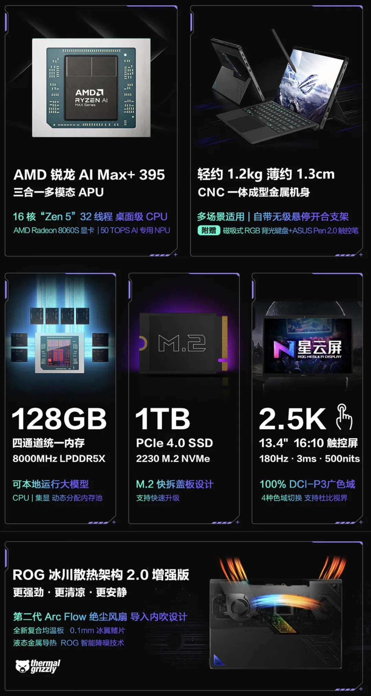
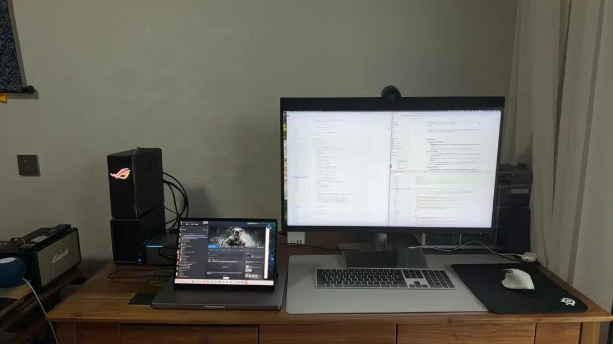
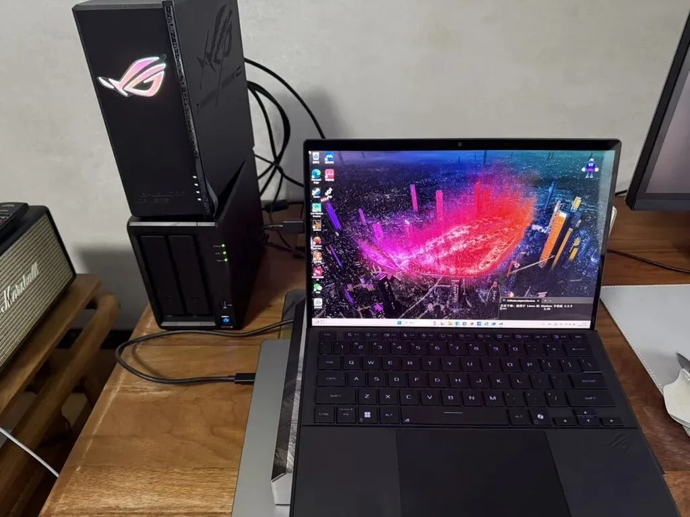
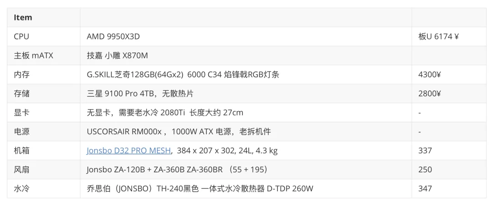
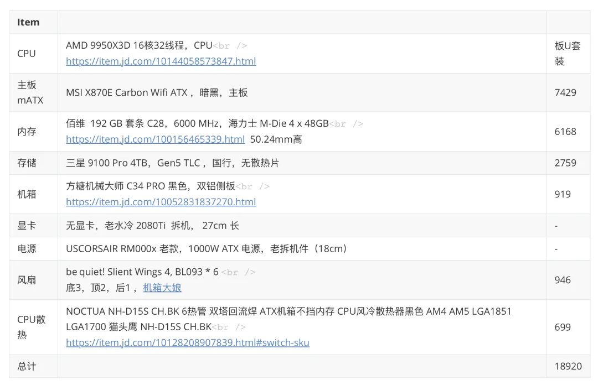
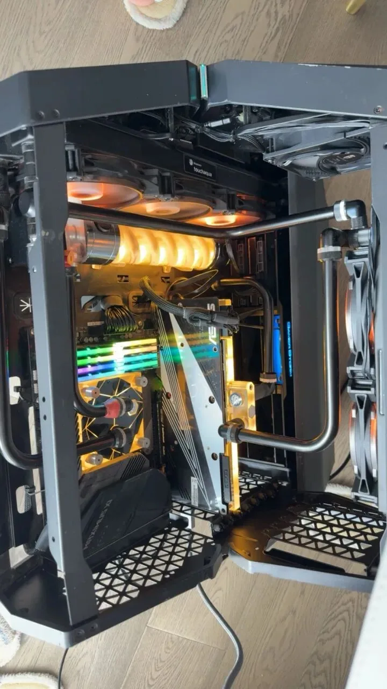
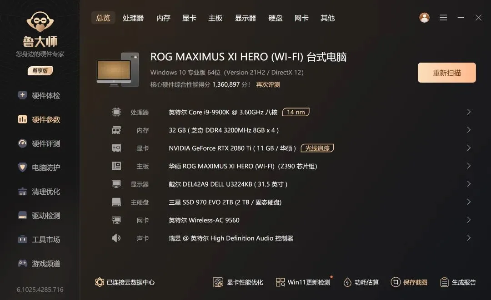
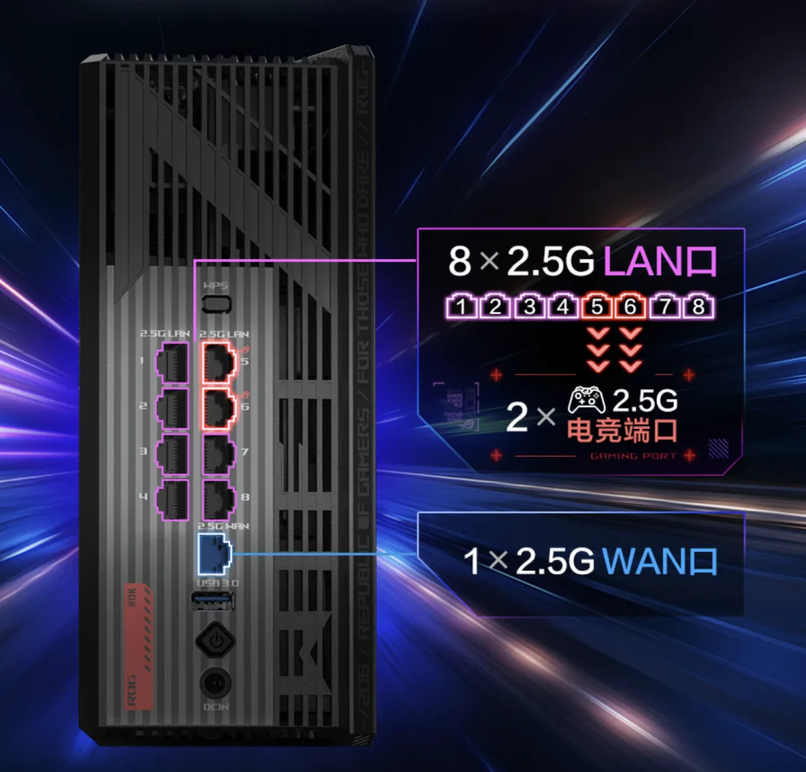

老冯最近在公众号消失了一周，有些朋友问我是不是[说了什么不该说的被禁言了？](https://mp.weixin.qq.com/s?__biz=MzU5ODAyNTM5Ng==&mid=2247490102&idx=1&sn=2c4cfbd0b53834fcadb75dcee7347610&scene=21#wechat_redirect)非也，只是俺在折腾一些事情，比如配一台新的 AMD 电脑。

老冯从入行开始就一直在用苹果 Macbook，分别是 15，18，22 年入手了顶配的 15/16 寸 Macbook，基本保持着三～四年的迭代频率。按照正常的节奏，应该在今年换 macbook M5。不过有意思的是准备换新之前，[这台老 M1 在高铁上被老太太泼了酱油](/misc/laptop-soy-sauce/)，走保险换新了，估计再打个四年也不成问题。

虽然是新服务器，但性能已经开始过时了 —— 我的意思是，大部份的时候它很够用了，但是编译前端 Next 糊出来的东西时，我确实感觉不够用了 —— 当然这可能不是电脑的问题，是 Next 的问题。

于是乎，我就准备开始物色一台新电脑 —— 鉴于我已经有一台全新的 ARM 笔记本了（M1 MAX 10 核，64GB，4TB Gen3 全闪），这次我准备弄一台 AMD x86_64 电脑，这样方便我在维护 Pigsty 的时候拉起一些 x86 虚拟机进行测试。我希望电脑最好能小巧便携一些，要么是迷你主机，要么是笔记本。

当然，最开始我看的是 AMD Mini PC，主要是被 DHH 种草了，他推荐的是零氪的 SER8，这个是一个挺不错的 AMD PC，价格挺便宜。性能可不赖。

但老冯看着看着就发现，既然都有这么好的 CPU，可以用来跑 Linux 虚拟机了，为啥不能用来打游戏呢？我挺想要一个小巧的 mini PC，不仅可以跑 Linux 虚拟化 / 数据库，还可以打游戏！

然后老冯就开始了调研，在 2025 年 7 月的当下，如果我想要找一台 AMD x86 电脑，可以跑个十几台虚拟机，最好能扩展个显卡跑点本地 AI 小应用。于是果断锁定了 AMD 刚发布的 AI MAX 395+ 芯片，这个芯片有 16 核 32 线程。

锁定了 CPU 之后，我想着要是跑很多虚拟机，跑点 AI 小模型的话，内存肯定不能少，那就拉到满 128GB。我本来想要再加个 PCI-e Gen 5 插槽的要求，插 NVMe SSD，不过很快发现 AI MAX 这个芯片都是 GEN4 通道，不提供 Gen5 槽。这可是让我有点儿难受 —— 我真的很想试试 Gen5 SSD 跑数据库！

锁定了 CPU 内存之后，可选的范围就小了很多。我第一眼看上的是极磨客 EVO-X2，这是一台 AMD Mini PC。不过这个价格 15000，感觉溢价高了 —— 要是这个价格，我干嘛不买一个同 CPU / 内存配置的 ROG 幻 X 2025？1.2 Kg，平板形态，带一块触摸屏，可拆卸键盘保护套。

这个

然后老冯就下单了，收到机器之后折腾了两天，老实说，我已经好几年没有碰过 Windows 了，但 Windows 11 看上去还是不错的，虽然我感觉软件整体体验上还是比苹果差很多。

不过，我很快开始后悔起来 —— 因为它竟然在我使用的一天中死机了三次，蓝屏了一次，这实在是让我难以接受。我搜了一下，发现其实有类似的问题 —— 进入睡眠状态之后，竟然就无法唤醒了。社区的解决方案是把睡眠改成休眠……WTF。我重装完了各种驱动，修改为休眠之后，又遇到了一次，最后击穿了我的心理底线 —— 还是把它退掉吧。

当然，退掉之前，我还是要顺便测试一下这玩意跑游戏，Linux 虚拟化，以及吹嘘的 AI 性能。我试了一下 Windows 的 WSL 2，这个做的还挺好的。然后打游戏的话，号称性能等效 4060 ～ 4070，我试了下游戏，跑的还可以，但还是没有我的 2080Ti 好，而且风扇呼呼相当吵。

另外，我一开始对这个 AMD AI MAX 的 CPU 跑大模型（小模型）的效果还是有点期待的，但 LM Studio 跑 QWen 32B 的速度只有 14 token/s，而我三年前的 M1 MAX 还能跑出 24 Token/s 的速度，吊打这个 AI MAX。后来我想了一下，AI PC 这个赛道，果然还是果子遥遥领先。毕竟统一内存的优势太大了。

退货之后，我开始琢磨着既然 AI MAX 笔记本不行，要不还是弄个 9950x3D 的 ITX 机器吧，然后我就开始调研各种配件，出了一个 ITX 的配置单。然而在和店家/朋友沟通交流的时候，老板坦诚的说你这个配置 ITX 压不住，换个 MATX 机箱吧。

于是老冯就开始琢磨 MATX 装机方案，又出了一款 MATX 装机单。在这个阶段，我开始研究各家的主板，PCI-E 通道分配，最后锁定了 MSI 的战斧导弹 B850 和技嘉的小雕。内存开始研究频率与时序，最后锁定了 4x48G 的 6000 MHz / C28 套条。

然后折腾着折腾着发现，MATX 方案还不如 ATX 一步到位，主板准备直接上暗黑主板，跟旗舰的 GodLike 差不多。于是又开始看 ATX 紧凑机箱，选了很多，最后挑了个紧凑的方糖机械大师。在这个阶段还纠结了很多电源，风扇，水冷/风冷方案，准备弄个纯静音的方案，看了很多猫头鹰和 Be Quiet！的静音方案。

又花了大半天，研究了各种组件之后，配出了一套方案。正好跟华硕笔记本幻 X 2025 价格差不多，但性能要碾压吊打。就在俺决定，就是它，准备开始下单了，机箱和主板 CPU 都下单买了之后，又出现了两个变化：结果最后还是给退掉了。

主要是我准备把老的趴窝游戏台式机拆掉，把显卡和电源拆下来，装进新机箱里复用。结果发现好久开不了机的主机原来是内存松了，硅脂干了，稍微弄了下就重新好使了，起来用鲁大师跑个分，还有 130 万分呢。

仔细想了一下，我已经有一台 2018 年的顶配游戏主机了，其实跑跑顶级 3A 也挺丝滑的，那我折腾个什么劲儿呢？为了多一点游戏性能，或者是跑虚拟机多 8 个核，真的有必要吗？又不是不能用。

另一个让我动摇的原因是，7 月 18 号 AMD 又发布了新款 ThreadRipper 的发布，Zen6 CPU 曝光出来提升巨大，这又让我动摇起来，要不要等到今年下半年的 M5 Mac 或者明年上半年的 M5 Ultra Studio，还有明年下半年的 Zen6 CPU，要不到时候一步到位战未来多好。

我仔细想了一下，我最开始的需求其实就是装一台 x86 Linux 迷你主机，用来跑跑多 Linux 虚拟机测试，那我完全可以废物利用一下，把我 2018 年的 Intel Macbook 给装成 Linux 啊。

然后，计划改变了，我买了个 NVMe SSD 硬盘盒，准备用一条 WD Black SN8100X 4TB 填进去，装个 Linux 系统，然后让我的 18 年 Intel 老 Macbook 直接在这块盘上启动。顺便，我又调研了 NVMe SSD 硬盘盒产品，选中了这款阿卡西斯 TBU405PROMAX 雷电双盘位 M.2 固态硬盘盒…… 可以插两条，40GBps，还可以组 RAID，插在老 Macbook 上，正好当个外置启动盘。

于是，问题完美的解决了，老冯成功退烧了撺一台 AMD 主机的执念与狂热，避免了新购了一台数码垃圾。在这个过程中，GPT 还有许多博主给了我莫大的帮助，带着我重新认识了一遍 2025 年的最佳硬件。现在我基本上对 PC 上每个硬件的各种参数与选型都了如指掌了 —— 总的来说还是大好事，毕竟多了解一些硬件知识对搞数据库也没坏处。

当然，没把钱花出去，老冯也是憋着在想买点儿其他什么。我忍住了新购一台 二手 Dell R7625 服务器的冲动，买了点硅脂，螺丝刀，硬盘盒，ROG 路由器，DJI Mic Mini / OSMO Mobile 7p，Anker 的充电头，充电宝，充电线之类的东西…… 可能对赛博体验的帮助更大一些。

目前老冯最满意的采购是这个华硕 ROG 魔盒 Wifi 7 路由器，9 个 2.5G 网口，加上稳定 1ms 的无线延迟，体验倍儿棒。

当然还有一个中兴的 U60P 5G-A 随身 Wifi 7，准备出门的时候提供 Wifi 用。

然后我还逛了逛大疆，影石的店，种草了 DJI Mavic 4 Pro 创作者套装，不过最后还是觉得这种设备还是出门用的时候租更合适，自己买了一个 DJI OSMO Mobile 7，然后果断把自己的 OSMO MOBILE 4 和 OSMO MOBILE 6 挂咸鱼了。

其他的几个新鲜玩意等到货了老冯再跟大家分享一下体验。有时候我觉得男人折腾数码产品的样子，就跟女人看衣服首饰一样，哈哈。但搞起来确实乐趣无穷。

什么？你问我主业怎么办？Pigsty 3.6 预计月内就要发布啦！

---

发布版本：[微信公众号](https://mp.weixin.qq.com/s/f0oNJQhX6D6iFwjlS6PRUg)
