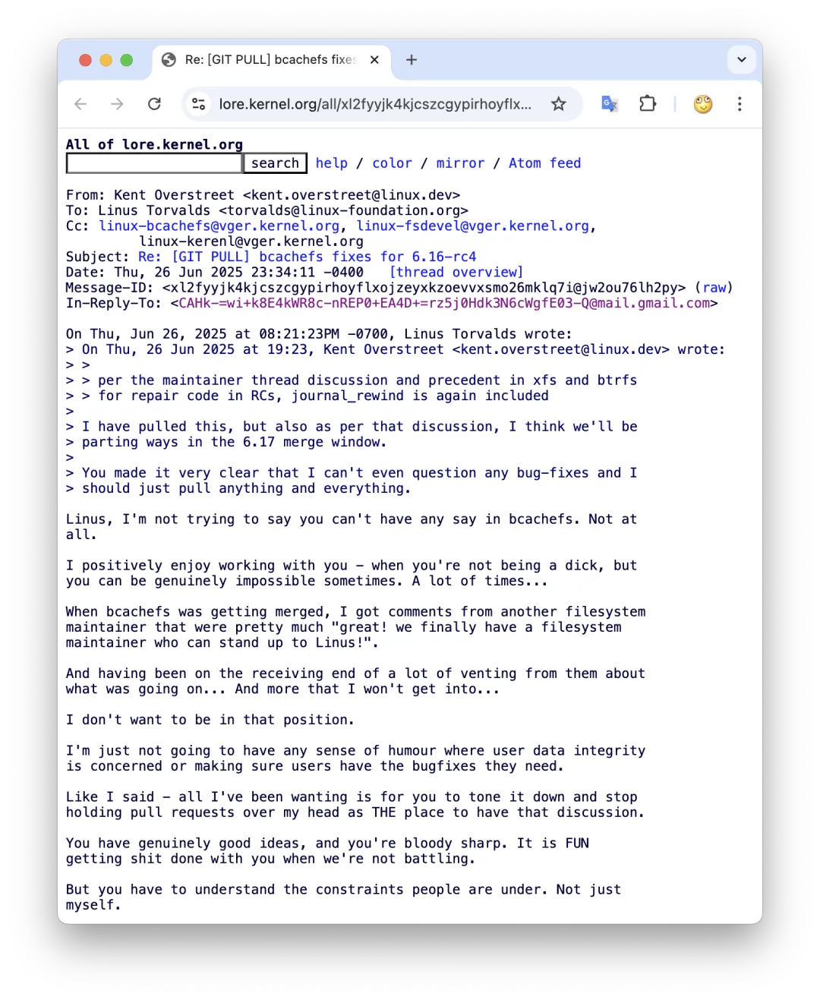
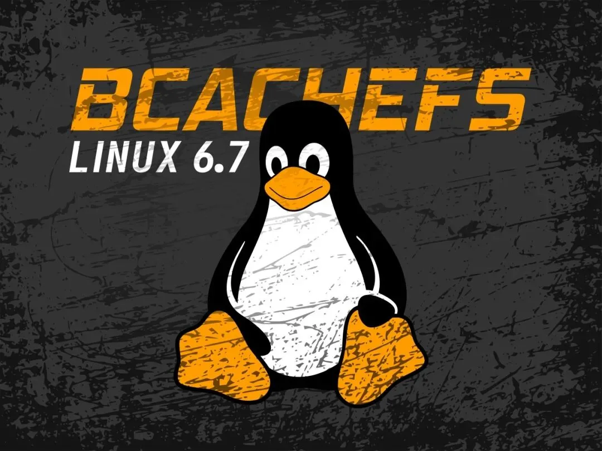
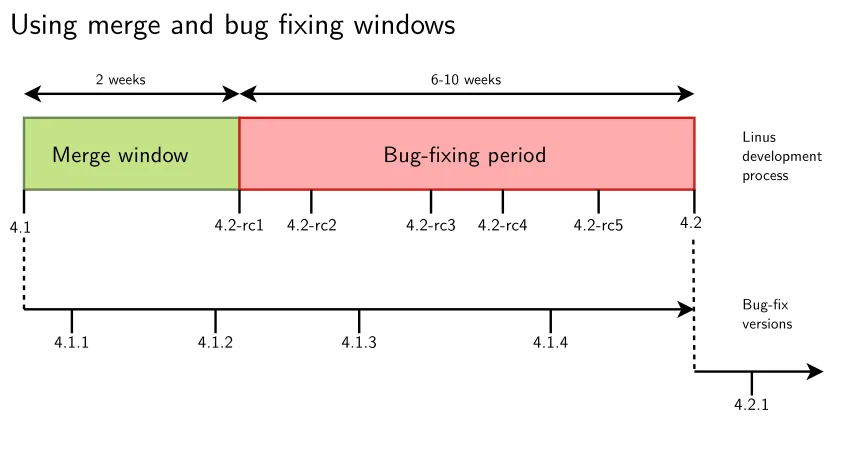
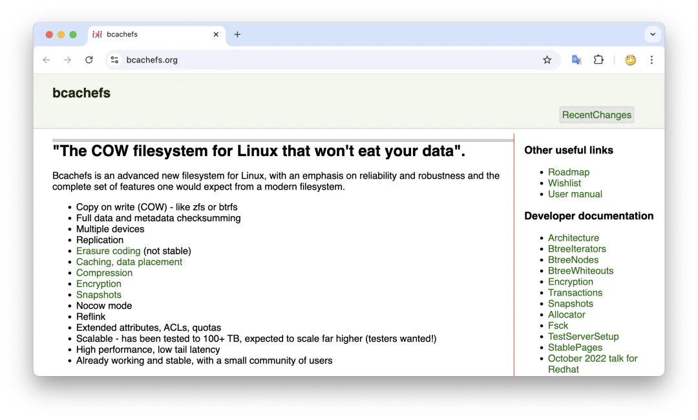

Linux 内核之父 Linus Torvalds 最近在邮件列表里对新晋文件系统 **Bcachefs** 怒发冲冠，直言在即将到来的 6.17 合并窗口里要 “**分道扬镳**” —— 好不容易并入内核主线的 Bcachefs 难道要被踢出去？Bcachefs 作者则直接对 Linus 爆粗：“别 JB 发疯了”

## 背景故事

Bcachefs 是 Linux 下的一个新型**写时复制**（COW）文件系统，由 Kent Overstreet 主导开发。Kent 此前的代表作是已经并入内核多年的块缓存层工具 Bcache，可以看作 Bcachefs 的“前身原型”。实际上，早期的 Bcachefs 直接复用了约 80% 的 Bcache 代码。

2015 年 Kent 宣布开始研发 Bcachefs；经过近十年打磨，Bcachefs 在 2024 年初的 Linux 6.7 版本中被并入内核主线。Bcachefs 声称要融合 ZFS、Btrfs 那样的现代特性与 ext4、XFS 等传统文件系统的性能。然而理想很丰满，现实很骨感，Bcachefs 自打进入主线以来问题不断。

Kent 作为开发者在社区内口碑并不算好，甚至可以说是争议不断。在此次事件之前，他就因为在邮件列表上对其他开发者出言不逊、态度生硬挨过批。例如 2024 年底他因一次争执直接被 Linus 禁止参与当时的 6.13 内核开发。很多内核老炮儿对 Kent 的评价是**“技术不错，就是太难合作”**——他往往我行我素，不太愿意妥协配合他人的规则。这种性格埋下了此次矛盾的伏笔。

## 正面硬刚

事情的导火索发生在 Linux 6.16-rc 阶段。按惯例，内核合并窗口（merge window）一过，后续的 rc 版本周期**只接受错误修复，不加入新功能**。但 Kent 在 6.16-rc3 发布后不久提交通知，请求合入一个名为“journal-rewind”的新功能补丁。据称这是为改进 Bcachefs 文件系统修复工具而设计，可以解决用户报告的一项数据损坏隐患。然而这个补丁牵涉范围较大，改动超过一千行代码，而且严格来说属于新特性 ——明显有违 rc 阶段“只修 Bug 不添新功能”的规则。

Linus 对此十分不满，当即在邮件中表示：“看起来你又把合并窗口的本意给忘了。不能因为你发现了别的 Bug，就趁机开始往里加新特性”。简而言之，Linus 觉得 Kent **不守规矩**，挑战了内核开发的流程共识。

面对 Linus 的训斥，Kent 不但没有认错收手，反而据理力争，坚持这个“journal-rewind”并非普通新功能，而是修复致命问题所需，认为规则不该不近人情。更劲爆的是，两人在邮件中你来我往，话越说越冲。Linus 虽然一贯以暴脾气闻名，这回却是 Kent 先爆了粗口。据社区整理的邮件记录，Kent 在回复 Linus 时开篇就略带火药味地写道：

> **Kent**：**“Linus，我不是想说你对 Bcachefs 就不能发表意见，没这意思，老实讲我挺乐意和你合作 —— **前提是你别这么几把难搞。不过你有时候真是疯了，而且经常这样**……”**

Kent 直接暗怼 Linus “某些时候像个混蛋（Dick 直译做鸡吧）一样难缠”。Kent 接着埋怨 Linus 对待自己过于挑剔苛刻，并举了个例子佐证：当初 Bcachefs 要合入内核时，有别的文件系统维护者私下对 Kent 打气道“太好了，我们终于来了个敢正面刚 Linus 的文件系统维护员了！” Kent 紧接着表态：“我可不想弄到最后自己也陷入那种境地。我对用户数据完整性和必要的补丁修复是绝不会含糊的，这方面我没什么幽默感（开不得玩笑）。”他这意思很明确：**俺就是要优先保证用户的数据不丢、Bug 必需得修，该破例就得破例，哪管什么流程规定**。

Kent 直言自己并非无视 Linus 的建议，而是希望 Linus **“能消停点”**，别老是把每次提 Pull Request 都变成兴师问罪、上纲上线的大戏：“**就像我说的——我一直以来只希望你别老揪着 Pull Request 阶段不放，非要把所有争论都压到合并请求里来摊牌。**”他甚至劝起了 Linus：“你提的点子确实都很好，人也确实够敏锐聪明。我们不掐架的时候，一起解决问题干正事其实挺他妈痛快的——这一点我非常享受。但是你也得理解别人肩膀上扛着的那些压力，不要只顾自己那一套。” 一方面毫不客气地怼了回去，甚至直接用了“消停点”“几把难搞”之类的粗话；但另一方面也承认 Linus 本人技术一流，“跟你一起干活很爽”，话里话外希望双方能降低冲突、继续合作下去。

只可惜，Linus 的态度已经被彻底触怒。在和 Kent Battle 期间，Linus **勉强接受** 了那份包含争议功能的 Pull Request（也就是暂时合入了“journal-rewind”补丁），但随即放出狠话：“补丁我拉了，但照我们讨论的情况来看，6.17 合并窗口的时候，我们恐怕就要分道扬镳了。你已经明确表示我今后对你的补丁连问都不该问，反正你递过来的东西我就得全盘照收。说真的，在那种情况下，我完全不觉得参与其中还有任何意义。我们俩最后似乎唯一达成的共识就是—— “到此为止”（“we're done”）—— Linus 已经决定不再掺和 Bcachefs 的维护，言下之意就是要把它踢出内核主线。

毕竟 Linus 身为掌舵人，如果对某个子系统（尤其是一个新进主线的试验性文件系统）失去信心，他大可以在下一版本的合并窗口**拒绝**任何来自该维护者的代码。事实上一旦 Linus 撂了挑子，其他高级维护者也不会贸然去动，一个新人驱动的文件系统很可能就此被“雪藏”。

值得一提的是，在这场冲突中不止 Linus 一人发难。著名的 ext4 文件系统维护者 Theodore Ts'o 也站出来敲打了 Kent 的做法，表示在 rc 阶段引入如此重大的更改极易引入问题，尤其是对于文件系统这种涉及磁盘数据安全的模块更要谨慎。他说内核社区长期以来对合并窗口的规则已有共识，而 Linus 的职责就是执行这些规则。换句话说，**没人能搞特殊化**。面对多方压力，Kent 依然强调 Bcachefs 情况特殊、用户急需修复，希望大家“通融”。只不过这回 Linus 并未让步。随着 6.16-rc 系列进入尾声，Linus 话里话外都透露出一个信号：**“Bcachefs 就别留在我这儿添乱了”**。

## 网友观点

Linus 放话“分道扬镳”的消息一出，立刻引发社区热议。在 Reddit 的相关讨论帖中，网友们发表了各种看法，不乏辣评和神吐槽：

- 有人认为**规则就是规则，Bcachefs 并不是什么特殊的存在**，Kent 不该指望 Linus 为他破例。“其他文件系统的维护者开发新特性时都老老实实遵守规矩，没听说谁跟他似的搞这一出”。这类观点支持 Linus 的立场：流程不能因为你个人厉害/自以为特别就无视，否则后患无穷。
- 也有网友细数了邮件线程的经过后直言：Kent **总是拒绝接受别人说的“不”字**，永远在为自己开脱。“整个讨论里，Linus 要的无非就是一个‘只包含修复的 Pull Request’，可 Kent 就是不肯，好像觉得自己真的特殊到规矩不适用。这人技术是有的，但就是无法和别人合作”。这番评论最后建议：既然 Kent 个性如此，也许他该找个协同维护者帮他打理提交，让他自己专心写代码算了。
- 一些网友质疑 **Bcachefs 是否真的成熟可以进主线**。有评论认为从这次事件看，Bcachefs 恐怕还不具备融入内核生态的准备，不如继续在主线外打磨。毕竟如果开发者连基本流程都磨合不来，谈何长期维护？在他们看来，现在把 Bcachefs 踢出主线未尝不是好事—— 等将来代码和维护都更加成熟稳健了，再回头也不迟。
- **更多人则直接用脚投票**，表达了对 Bcachefs 开发现状的不信任。一位网友调侃道：“行吧，我还是继续用 ext4” ——言下之意这一地鸡毛看下来，自己是彻底不敢碰 Bcachefs 了。另外还有人附和：“**我们相信 Ted T（Theodore Ts'o）的就够了**” ——拥护稳如老狗的 ext4，不折腾这些新花样。甚至有网友刻薄地吐槽：“要我说，连基本规则都不遵守的开发者算不上什么‘人才’，再厉害我也不敢用他的软件”。可见此次风波已经让不少观望中的用户对 Bcachefs 心生疑虑。

总的来看，**社区舆论对 Kent 的同情不多，对 Linus 的决定更多表示理解甚至支持**。绝大部分人认同内核开发流程的严肃性：不是不能变通，但绝不能容忍一而再再而三的我行我素。毕竟内核不是某个人的独角戏，而是数千开发者协作的结果。

## 老冯评论

在老冯的职业生涯中，遇到过最惨烈的一次数据库故障现场算是拜 BCACHE 所赐 —— 一位朋友遇到[断电导致 PostgreSQL 数据丢失](/pg/pg-filedump/)。虽然 BCACHE 和 bcachefs 并不是一个东西，但他们都是由同一个作者 —— Kent 维护的，而且 bcachefs 起步直接 fork 了 80% 左右的 bcache 代码。从实际结果上来看，我对 Bcache 这些东西的可靠性是高度存疑的。

这个 Slogan 听上去有点滑稽……

文件系统这样的关键组件需要很大的 “信任”，而这种信任只有通过多年的长期可靠使用才能建立起来。所以跑数据库，老冯还是认准 ext4 或者 xfs —— 它们有这最好的可靠性战绩。而 Bcachefs，还有 Reiser FS，Brtfs 这些东西虽然看上去有一些 “非常不错” 的特性，但老冯确实是不会在任何生产数据库上使用它们的。

老实说，老冯觉得像这样的组件，与其硬塞入 Linux 内核中，倒还真不如独立出来作为一个内核扩展独立演进开发。就像 PostgreSQL 生态中的扩展一样，往内核里塞那么多大部份人用不上的非必须功能，最后就会出现一堆这种 Drama。独立出来 —— 自己爱怎么发布就怎么发布，那非要合进内核里蹭流量和 Credit，可不就得按规则来么？不守规则被人喷也是活该了。

### 提示：本文含 AI 生成内容

参考阅读：[开源“暴君” Linus 清洗整风](/db/linus-ban-ru/)

---

发布版本：[微信公众号](https://mp.weixin.qq.com/s/O94LXhqzi8m9o3ijVOTSsg)
